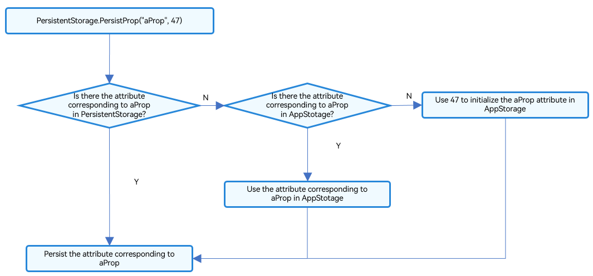

# PersistentStorage: Persisting Application State
<!--Kit: ArkUI-->
<!--Subsystem: ArkUI-->
<!--Owner: @zzq212050299-->
<!--Designer: @s10021109-->
<!--Tester: @TerryTsao-->
<!--Adviser: @zhang_yixin13-->


During application development, you may want selected properties to persist even when the application is closed. In this case, PersistentStorage is required.


PersistentStorage is an optional singleton object within an application. Its purpose is to persist selected AppStorage properties so that their values upon application re-start are the same as those upon application closing.


PersistentStorage provides capability for persisting the state variables. However, the persistence and UI reading capabilities depend on AppStorage. Before reading this topic, you are advised to read [AppStorage](./arkts-appstorage.md) and [PersistentStorage API reference](../../reference/apis-arkui/arkui-ts/ts-state-management.md#persistentstorage).

## Overview

PersistentStorage retains the selected AppStorage properties on the device. The application uses the API to determine which AppStorage properties should be persisted with PersistentStorage. The UI and service logic do not directly access properties in PersistentStorage. All property access is to AppStorage. Changes in AppStorage are automatically synchronized to PersistentStorage.

PersistentStorage creates a two-way synchronization with properties in AppStorage. A frequently used API function is to access AppStorage through PersistentStorage. There are other APIs that can be used to manage persisted properties. Based on the service logic, properties are always obtained or set through AppStorage.

The data storage path of PersistentStorage is at the module level. That is, the data copy is stored in the persistent file of the corresponding module when the module calls PersistentStorage. If multiple modules use the same key, the data is copied from and stored in the module that uses PersistentStorage first.

The storage path of PersistentStorage, determined when the first ability of the application is started, is the module to which the ability belongs. If an ability calls PersistentStorage and can be started by different modules, the number of data copies is the same as the number of startup modes of the ability.

PersistentStorage is coupled with AppStorage in terms of functions, and errors may occur when using data in different modules. Therefore, you are advised to use the **globalConnect** API of PersistenceV2 to replace the **persistProp** API of PersistentStorage. For details about how to migrate data from PersistentStorage to PersistenceV2, see [PersistentStorage->PersistenceV2](arkts-v1-v2-migration-application-and-others.md#persistentstorage-persistencev2). For details about PersistenceV2, see [PersistenceV2: Persisting Application State](arkts-new-persistencev2.md).

## Constraints

PersistentStorage accepts the following types and values:

- Primitive types such as number, string, boolean, and enum.
- Objects that can be serialized by **JSON.stringify()** and deserialized by **JSON.parse()**.<br>Note that object methods cannot be persisted
- Map type since API version 12. The following changes can be observed: (1) complete Map object reassignment; (2) changes caused by calling **set**, **clear**, or **delete**. All changes are automatically persisted. For details, see [Decorating Variables of the Map Type](#decorating-variables-of-the-map-type).
- Set type since API version 12. The following changes can be observed: (1) complete Set object reassignment; (2) changes caused by calling **set**, **clear**, or **delete**. All changes are automatically persisted. For details, see [Decorating Variables of the Set Type](#decorating-variables-of-the-set-type).
- Date type since API version 12. The following changes can be observed: (1) complete **Date** object reassignment; (2) property changes caused by calling **setFullYear**, **setMonth**, **setDate**, **setHours**, **setMinutes**, **setSeconds**, **setMilliseconds**, **setTime**, **setUTCFullYear**, **setUTCMonth**, **setUTCDate**, **setUTCHours**, **setUTCMinutes**, **setUTCSeconds**, or **setUTCMilliseconds**. All changes are automatically persisted. For details, see [Decorating Variables of the Date Type](#decorating-variables-of-the-date-type).
- **undefined** and **null** since API version 12.
- [Union types](#using-union-types) since API version 12.

PersistentStorage does not accept the following types and values:

- Nested objects (object arrays and object properties), because the framework cannot detect the value changes of nested objects (including arrays) in AppStorage.

Data persistence is a time-consuming operation. As such, avoid the following situations whenever possible:

- Persistence of large data sets

- Persistence of variables that change frequently

It is recommended that the persistent variables of PersistentStorage be less than 2 KB. As PersistentStorage flushes data synchronously, a large amount of persistent data may result in simultaneous time-consuming read and write operations in the UI thread, affecting UI rendering performance. If you need to store a large amount of data, consider using the database API.

PersistentStorage is associated with UI instances. Data persistence can succeed only when a UI instance has been initialized (that is, when the callback passed in by [loadContent](../../reference/apis-arkui/arkts-apis-window-WindowStage.md#loadcontent9) is called).

```ts
// EntryAbility.ets
onWindowStageCreate(windowStage: window.WindowStage): void {
  windowStage.loadContent('pages/Index', (err) => {
    if (err.code) {
      return;
    }
    PersistentStorage.persistProp('aProp', 47);
  });
}
```

## Use Scenarios


### Accessing a PersistentStorage-Initialized Property from AppStorage

1. Initialize the PersistentStorage instance.

   ```ts
   PersistentStorage.persistProp('aProp', 47);
   ```

2. Obtain the corresponding property from AppStorage.

   ```ts
   AppStorage.get<number>('aProp'); // returns 47
   ```

   Alternatively, apply local definition within the component:


   ```ts
   @StorageLink('aProp') aProp: number = 48;
   ```

The complete code is as follows:


```ts
PersistentStorage.persistProp('aProp', 47);

@Entry
@Component
struct Index {
  @State message: string = 'Hello World';
  @StorageLink('aProp') aProp: number = 48;

  build() {
    Row() {
      Column() {
        Text(this.message)
        // The current result is saved when the application exits. After the restart, the last saved result is displayed.
        // The value is 47 by default if no modifications are made.
        Text(`${this.aProp}`)
          .onClick(() => {
            this.aProp += 1;
          })
      }
    }
  }
}
```

- First running after fresh application installation:
  1. **persistProp** is called to initialize PersistentStorage. A search for the **aProp** property in PersistentStorage returns no result, because the application has just been installed.
  2. A search for the **aProp** property in AppStorage still returns no result.
  3. Create the **aProp** property of the number type in AppStorge and initialize it with the value **47**.
  4. PersistentStorage writes the **aProp** property and its value **47** to the local device. The value of **aProp** in AppStorage and its subsequent changes are persisted.
  5. In the **\<Index>** component, create the state variable **\@StorageLink('aProp') aProp**, which creates a two-way synchronization with the **aProp** property in AppStorage. During the creation, the search in AppStorage for the **aProp** property is successful, and therefore, the state variable is initialized with the value **47** found in AppStorage.

  **Figure 1** PersistProp initialization process 



- After a click event is triggered:
  1. The state variable **\@StorageLink('aProp') aProp** is updated, triggering the **\<Text>** component to be re-rendered.
  2. The two-way synchronization between the \@StorageLink decorated variable and AppStorage results in the change of the **\@StorageLink('aProp') aProp** being synchronized back to AppStorage.
  3. The change of the **aProp** property in AppStorage triggers any other one-way or two-way bound variables to be updated. (In this example, there are no such other variables.)
  4. Because the property corresponding to **aProp** has been persisted, the change of the **aProp** property in AppStorage triggers PersistentStorage to write the property and its new value to the device.

- Subsequent application running:
  1. **PersistentStorage.persistProp('aProp', 47)** is called. A search for the **aProp** property in PersistentStorage succeeds.
  2. The property is added to AppStorage with the value found in PersistentStorage.
  3. In the **\<Index>** component, the value of the @StorageLink decorated **aProp** property is the value written by PersistentStorage to AppStorage, that is, the value stored when the application was closed last time.


### Accessing a Property in AppStorage Before PersistentStorage

This example is an incorrect use. It is incorrect to use the API to access the properties in AppStorage before calling **PersistentStorage.persistProp** or **persistProps**, because such a call sequence will result in loss of the property values used in the previous application run:


```ts
let aProp = AppStorage.setOrCreate('aProp', 47);
PersistentStorage.persistProp('aProp', 48);
```

**AppStorage.setOrCreate('aProp', 47)**: The **aProp** property of the number type is created in AppStorage, and its value is set to the specified default value **47**. **aProp** is a persisted property. Therefore, it is written back to PersistentStorage, and the value stored in PersistentStorage from the previous run is lost.

PersistentStorage.persistProp('aProp', 48): A property with the name **aProp** and value **47** – set through the API in AppStorage – is found in PersistentStorage.

### Accessing an Attribute in AppStorage After PersistentStorage

If you do not want to overwrite the values saved in PersistentStorage during the previous application run, make sure any access to properties in AppStorage is made after a call to a PersistentStorage API.

```ts
PersistentStorage.persistProp('aProp', 48);
if (AppStorage.get('aProp') > 50) {
    // If the value stored in PersistentStorage exceeds 50, set the value to 47.
    AppStorage.setOrCreate('aProp',47);
}
```

When reading data from PersistentStorage, the application checks whether the value of **aProp** exceeds 50. If the value exceeds 50, it automatically corrects the value to **47** in AppStorage.

### Using Union Types

PersistentStorage supports union types, **undefined**, and **null**. In the following example, the **persistProp** API is used to initialize **"P"** to **undefined**. **@StorageLink("P")** is used to bind variable **p** of the **number | undefined | null** type to the component. After the button is clicked, the value of **P** changes, and the UI is re-rendered. In addition, the value of **P** is persisted.

```ts
PersistentStorage.persistProp("P", undefined);

@Entry
@Component
struct TestCase6 {
  @StorageLink("P") p: number | undefined | null = 10;

  build() {
    Row() {
      Column() {
        Text(this.p + "")
          .fontSize(50)
          .fontWeight(FontWeight.Bold)
        Button("changeToNumber").onClick(() => {
          this.p = 10;
        })
        Button("changeTo undefined").onClick(() => {
          this.p = undefined;
        })
        Button("changeTo null").onClick(() => {
          this.p = null;
        })
      }  
      .width('100%')
    }
    .height('100%')
  }
}
```


### Decorating Variables of the Date Type

In this example, the **persistedDate** variable decorated by @StorageLink is of the Date type. After the button is clicked, the value of **persistedDate** changes, and the UI is re-rendered. In addition, the value of **persistedDate** is persisted.

```ts
PersistentStorage.persistProp("persistedDate", new Date());

@Entry
@Component
struct PersistedDate {
  @StorageLink("persistedDate") persistedDate: Date = new Date();

  updateDate() {
    this.persistedDate = new Date();
  }

  build() {
    List() {
      ListItem() {
        Column() {
          Text(`Persisted Date is ${this.persistedDate.toString()}`)
            .margin(20)

          Text(`Persisted Date year is ${this.persistedDate.getFullYear()}`)
            .margin(20)

          Text(`Persisted Date hours is ${this.persistedDate.getHours()}`)
            .margin(20)

          Text(`Persisted Date minutes is ${this.persistedDate.getMinutes()}`)
            .margin(20)

          Text(`Persisted Date time is ${this.persistedDate.toLocaleTimeString()}`)
            .margin(20)

          Button() {
            Text('Update Date')
              .fontSize(25)
              .fontWeight(FontWeight.Bold)
              .fontColor(Color.White)
          }
          .type(ButtonType.Capsule)
          .margin({
            top: 20
          })
          .backgroundColor('#0D9FFB')
          .width('60%')
          .height('5%')
          .onClick(() => {
            this.updateDate();
          })

        }.width('100%')
      }
    }
  }
}
```

### Decorating Variables of the Map Type

In this example, the **persistedMapString** variable decorated by @StorageLink is of the Map\<number, string\> type. After the button is clicked, the value of **persistedMapString** changes, and the UI is re-rendered. In addition, the value of **persistedMapString** is persisted.

```ts
PersistentStorage.persistProp("persistedMapString", new Map<number, string>([]));

@Entry
@Component
struct PersistedMap {
  @StorageLink("persistedMapString") persistedMapString: Map<number, string> = new Map<number, string>([]);

  persistMapString() {
    this.persistedMapString = new Map<number, string>([[3, "one"], [6, "two"], [9, "three"]]);
  }

  build() {
    List() {
      ListItem() {
        Column() {
          Text(`Persisted Map String is `)
            .margin(20)
          ForEach(Array.from(this.persistedMapString.entries()), (item: [number, string]) => {
            Text(`${item[0]} ${item[1]}`)
          })

          Button() {
            Text('Persist Map String')
              .fontSize(25)
              .fontWeight(FontWeight.Bold)
              .fontColor(Color.White)
          }
          .type(ButtonType.Capsule)
          .margin({
            top: 20
          })
          .backgroundColor('#0D9FFB')
          .width('60%')
          .height('5%')
          .onClick(() => {
            this.persistMapString();
          })

        }.width('100%')
      }
    }
  }
}
```

### Decorating Variables of the Set Type

In this example, the **persistedSet** variable decorated by @StorageLink is of the Set\<number\> type. After the button is clicked, the value of **persistedSet** changes, and the UI is re-rendered. In addition, the value of **persistedSet** is persisted.

```ts
PersistentStorage.persistProp("persistedSet", new Set<number>([]));

@Entry
@Component
struct PersistedSet {
  @StorageLink("persistedSet") persistedSet: Set<number> = new Set<number>([]);

  persistSet() {
    this.persistedSet = new Set<number>([33, 1, 3]);
  }

  clearSet() {
    this.persistedSet.clear();
  }

  build() {
    List() {
      ListItem() {
        Column() {
          Text(`Persisted Set is `)
            .margin(20)
          ForEach(Array.from(this.persistedSet.entries()), (item: [number, number]) => {
            Text(`${item[1]}`)
          })

          Button() {
            Text('Persist Set')
              .fontSize(25)
              .fontWeight(FontWeight.Bold)
              .fontColor(Color.White)
          }
          .type(ButtonType.Capsule)
          .margin({
            top: 20
          })
          .backgroundColor('#0D9FFB')
          .width('60%')
          .height('5%')
          .onClick(() => {
            this.persistSet();
          })

          Button() {
            Text('Persist Clear')
              .fontSize(25)
              .fontWeight(FontWeight.Bold)
              .fontColor(Color.White)
          }
          .type(ButtonType.Capsule)
          .margin({
            top: 20
          })
          .backgroundColor('#0D9FFB')
          .width('60%')
          .height('5%')
          .onClick(() => {
            this.clearSet();
          })

        }
        .width('100%')
      }
    }
  }
}
```
<!--no_check-->