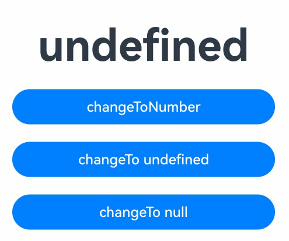
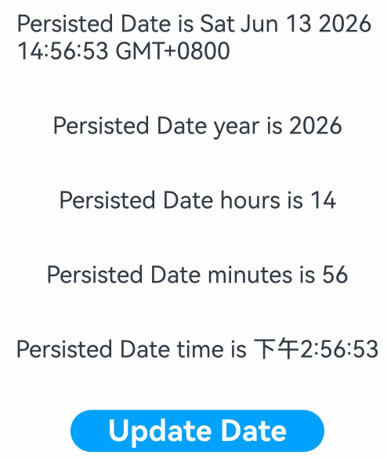
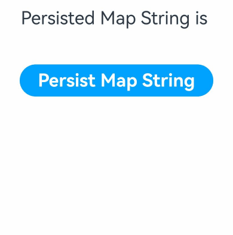
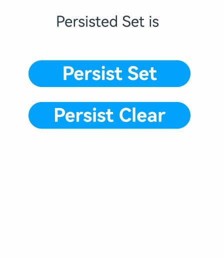

# PersistentStorage: Persisting UI State

<!--Kit: ArkUI-->
<!--Subsystem: ArkUI-->
<!--Owner: @zzq212050299-->
<!--Designer: @s10021109-->
<!--Tester: @TerryTsao-->
<!--Adviser: @zhang_yixin13-->
<!-- md-trans-meta sourceCommit=c6d2a51ae0d4d741fa9801df0b2e84e58290f6c1 translatedAt=2026-07-24T01:23:44.817Z pushedAt=2026-07-24T01:48:48.510Z -->

PersistentStorage is an optional singleton object within an application. Its purpose is to persist selected AppStorage properties so that their values upon application re-start are the same as those upon application closing.

PersistentStorage provides capability for persisting the state variables. However, the persistence and UI reading capabilities depend on AppStorage. Before reading this topic, you are advised to read [AppStorage](./arkts-appstorage.md) and [PersistentStorage API reference](../../reference/apis-arkui/arkui-ts/ts-state-management.md#persistentstorage).

## Overview

PersistentStorage retains the selected AppStorage properties on the device. The application uses the API to determine which properties should be persisted with PersistentStorage. Properties in PersistentStorage and AppStorage are synchronized bidirectionally. The UI and service logic do not directly access properties in PersistentStorage; all property access is performed through AppStorage. Changes in AppStorage are automatically synchronized to PersistentStorage.

The data storage path of PersistentStorage is at the module level. This means the data is stored in the persistent file of the corresponding module when that module calls PersistentStorage. If multiple modules use the same key, the data belongs to the module that first uses PersistentStorage.

The storage path of PersistentStorage, determined when the first ability of the application is started, is the module to which the ability belongs. If an ability calls PersistentStorage and can be started by different modules, the number of data copies is the same as the number of startup modes of the ability.

PersistentStorage is coupled with AppStorage in terms of functions, and errors may occur when using data in different modules. Therefore, you are advised to use the **globalConnect** API of [PersistenceV2](arkts-new-persistencev2.md) instead of the **persistProp** API of PersistentStorage. For details about the migration solution from PersistentStorage to PersistenceV2, see [PersistentStorage->PersistenceV2](arkts-v1-v2-migration-application.md#persistentstorage-persistencev2).

## Constraints

PersistentStorage accepts the following types and values:

- Primitive types such as number, string, boolean, and enum.

- Objects that can be serialized by **JSON.stringify()** and deserialized by **JSON.parse()**. (Note that object methods cannot be persisted.)

- Map type, available since API version 12. The following changes can be observed: (1) complete Map object reassignment; (2) changes caused by calling **set**, **clear**, or **delete**. All changes are automatically persisted. For details, see [Persisting Variables of the Map Type](#persisting-variables-of-the-map-type).

- Set type, available since API version 12. The following changes can be observed: (1) complete Set object reassignment; (2) changes caused by calling **add**, **clear**, or **delete**. All changes are automatically persisted. For details, see [Persisting Variables of the Set Type](#persisting-variables-of-the-set-type).

- Date type, available since API version 12. The following changes can be observed: (1) complete Date object reassignment; (2) property changes caused by calling **setFullYear**, **setMonth**, **setDate**, **setHours**, **setMinutes**, **setSeconds**, **setMilliseconds**, **setTime**, **setUTCFullYear**, **setUTCMonth**, **setUTCDate**, **setUTCHours**, **setUTCMinutes**, **setUTCSeconds**, or **setUTCMilliseconds**. For details, see [Persisting Variables of the Date Type](#persisting-variables-of-the-date-type).

- **undefined** and **null**, available since API version 12.

- Union types, available since API version 12. For details, see [Persisting Union Type Variables](#persisting-union-type-variables).

PersistentStorage does not accept the following types and values:

- Nested objects (object arrays and object properties), because the framework cannot detect the value changes to nested objects (including arrays) in AppStorage. Therefore, they cannot be written back to PersistentStorage.

Data persistence is a time-consuming operation. As such, avoid the following situations whenever possible:

- Persistence of large data sets

- Persistence of variables that change frequently

It is recommended that the data stored in PersistentStorage be less than 2 KB. Avoid persisting large amounts of data, as PersistentStorage synchronously writes data to disk on the UI thread. Large-scale local read/write operations may impact UI rendering performance. For storing substantial data, it is recommended that you use [database APIs](../../reference/apis-arkdata/arkts-apis-data-relationalStore.md).

PersistentStorage is associated with UI instances. Data persistence can succeed only when a UI instance has been initialized (that is, when the callback passed in by [loadContent](../../reference/apis-arkui/arkts-apis-window-WindowStage.md#loadcontent9) is called).

```ts
// EntryAbility.ets
onWindowStageCreate(windowStage: window.WindowStage): void {
  windowStage.loadContent('pages/PageOneMessageStorage', (err) => {
    if (err.code) {
      return;
    }
    PersistentStorage.persistProp('aProp', 47);
  });
}
```

## When to Use

### Accessing a PersistentStorage-Initialized Property from AppStorage

1. Initialize **PersistentStorage**.

   ```ts
   PersistentStorage.persistProp('aProp', 47);
   ```

2. Obtain the corresponding property from AppStorage.

   ```ts
   AppStorage.get<number>('aProp'); // returns 47
   ```

   Alternatively, apply local definition within the component:

   ```ts
   @StorageLink('aProp') aProp: number = 48;
   ```

   The complete code is as follows:

   <!-- @[Persistent_page_one](https://gitcode.com/openharmony/applications_app_samples/blob/master/code/DocsSample/ArkUISample/PersistentStorage/entry/src/main/ets/pages/PageOneMessageStorage.ets) --> 

   ``` TypeScript
   PersistentStorage.persistProp('aProp', 47);
   
   @Entry
   @Component
   struct TestPageOne {
     @State message: string = 'Hello World';
     @StorageLink('aProp') aProp: number = 48;
   
     build() {
       Row() {
         Column() {
           Text(this.message)
             .fontSize(20)
             .margin(10)
           // The current result is saved when the application exits. After the restart, the last saved result is displayed.
           // The value is 47 by default if no modifications are made.
           Text(`${this.aProp}`)
             .fontSize(20)
             .margin(10)
             .onClick(() => {
               this.aProp += 1;
             })
         }
         .width('100%')
       }
       .height('100%')
     }
   }
   ```

   

- First running after fresh application installation:

  1. **persistProp** is called to initialize PersistentStorage. A search for the **aProp** property in PersistentStorage returns no result, because the application has just been installed.

  2. A search for the **aProp** property in AppStorage still returns no result.

  3. Create the **aProp** property of the number type in AppStorage and initialize it with the value **47**.

  4. PersistentStorage writes the **aProp** property and its value **47** to the local device. The value of **aProp** in AppStorage and its subsequent changes are persisted.

  5. In the **TestPageOne** component, create the state variable **\@StorageLink('aProp') aProp**, which creates a two-way synchronization with the **aProp** property in AppStorage. During the creation, the search in AppStorage for the **aProp** property is successful, and therefore, the state variable is initialized with the value **47** found in AppStorage.

  **Figure 1** PersistProp initialization process 

  

- After a click event is triggered:

  1. The state variable **\@StorageLink('aProp') aProp** is updated, triggering the **Text** component to be re-rendered.

  2. The two-way synchronization between the \@StorageLink decorated variable and AppStorage results in the change of the **\@StorageLink('aProp') aProp** being synchronized back to AppStorage.

  3. The change of the **aProp** property in AppStorage triggers any other one-way or two-way bound variables to be updated. (In this example, there are no such other variables.)

  4. Because the property corresponding to **aProp** has been persisted, the change of the **aProp** property in AppStorage triggers PersistentStorage to write the property and its new value to the device.

- Subsequent application running:

  1. **PersistentStorage.persistProp('aProp', 47)** is called. A search for the **aProp** property in PersistentStorage succeeds.

  2. The property is added to AppStorage with the value found in PersistentStorage.

  3. In the **TestPageOne** component, the value of the @StorageLink decorated **aProp** property is the value written by PersistentStorage to AppStorage, that is, the value stored when the application was closed last time.

### Accessing a Property in AppStorage Before PersistentStorage

This example is an incorrect use. It is incorrect to use the API to access the properties in AppStorage before calling **PersistentStorage.persistProp** or **persistProps**, because such a call sequence will result in loss of the property values used in the previous application run:

```ts
let aProp = AppStorage.setOrCreate('aProp', 47);
PersistentStorage.persistProp('aProp', 48);
```

**AppStorage.setOrCreate('aProp', 47)**: The **aProp** property of the number type is created in AppStorage, and its value is set to the specified default value **47**. **aProp** is a persisted property. Therefore, it is written back to PersistentStorage, and the value stored in PersistentStorage from the previous run is lost.

PersistentStorage.persistProp('aProp', 48): A property with the name **aProp** and value **47** – set through the API in AppStorage – is found in PersistentStorage.

### Accessing a Property in AppStorage After PersistentStorage

You can first determine whether to overwrite the value previously saved in PersistentStorage. If overwriting is required,  call the AppStorage API to modify it; if not, avoid calling the AppStorage API.

<!-- @[Persistent_page_first](https://gitcode.com/openharmony/applications_app_samples/blob/master/code/DocsSample/ArkUISample/PersistentStorage/entry/src/main/ets/pages/PageThreeAppStorage.ets) --> 

``` TypeScript
const MAX_NUM: number = 50;
```

<!-- @[Persistent_page_three](https://gitcode.com/openharmony/applications_app_samples/blob/master/code/DocsSample/ArkUISample/PersistentStorage/entry/src/main/ets/pages/PageThreeAppStorage.ets) --> 

``` TypeScript
PersistentStorage.persistProp('aProp', 48);
if ((AppStorage.get<number>('aProp') ?? 0) > MAX_NUM) {
  // If the value stored in PersistentStorage exceeds 50, set the value to 47.
  AppStorage.setOrCreate('aProp', 47);
}
```

When reading data from PersistentStorage, the application checks whether the value of **aProp** exceeds 50. If the value exceeds 50, it corrects the value to **47** in AppStorage.

### Persisting Union Type Variables

PersistentStorage supports union types, **undefined**, and **null**. In the following example, the **persistProp** API initializes **P** to **undefined**. The variable **p** is bound through **@StorageLink('P')** with the type **number | undefined | null**. Clicking the buttons changes the value of **P**, triggering UI re-rendering. In addition, the value of **P** is persisted.

<!-- @[Persistent_page_four](https://gitcode.com/openharmony/applications_app_samples/blob/master/code/DocsSample/ArkUISample/PersistentStorage/entry/src/main/ets/pages/PageFourMessageChange.ets) --> 

``` TypeScript
// Define constants to replace magic numbers with meaningful names.
const DEFAULT_NUMBER: number = 10; // Default numeric value.
const FONT_SIZE_LARGE: number = 50; // Large font size.

// Initialize persistent property with constant key (extractable for multi-use scenarios).
const STORAGE_KEY_P: string = 'P';
PersistentStorage.persistProp(STORAGE_KEY_P, undefined);

@Entry
@Component
struct TestCase6 {
  // Use a constant as the default value with the explicit union type.
  @StorageLink(STORAGE_KEY_P) p: number | undefined | null = DEFAULT_NUMBER;

  build() {
    Row() {
      Column() {
        Text(this.p + '')
          .fontSize(FONT_SIZE_LARGE)
          .fontWeight(FontWeight.Bold)
          .margin(10)
        Button('changeToNumber')
          .width(300)
          .margin(10)
          .onClick(() => {
            this.p = DEFAULT_NUMBER;
          })
        Button('changeTo undefined')
          .width(300)
          .margin(10)
          .onClick(() => {
            this.p = undefined;
          })
        Button('changeTo null')
          .width(300)
          .margin(10)
          .onClick(() => {
            this.p = null;
          })
      }
      .width('100%')
    }
    .height('100%')
  }
}
```



### Persisting Variables of the Date Type

In this example, the **persistedDate** variable decorated with @StorageLink is of the Date type. Clicking the buttons changes the value of **persistedDate**, triggering UI re-rendering. In addition, the value of **persistedDate** is persisted.

<!-- @[Persistent_page_five](https://gitcode.com/openharmony/applications_app_samples/blob/master/code/DocsSample/ArkUISample/PersistentStorage/entry/src/main/ets/pages/PageFivePersistedDate.ets) -->  

``` TypeScript
PersistentStorage.persistProp('persistedDate', new Date());

@Entry
@Component
struct PersistedDate {
  @StorageLink('persistedDate') persistedDate: Date = new Date();

  updateDate() {
    this.persistedDate = new Date();
  }

  build() {
    List() {
      ListItem() {
        Column() {
          Text(`Persisted Date is ${this.persistedDate.toString()}`)
            .fontSize(20)
            .margin(20)

          Text(`Persisted Date year is ${this.persistedDate.getFullYear()}`)
            .fontSize(20)
            .margin(20)

          Text(`Persisted Date hours is ${this.persistedDate.getHours()}`)
            .fontSize(20)
            .margin(20)

          Text(`Persisted Date minutes is ${this.persistedDate.getMinutes()}`)
            .fontSize(20)
            .margin(20)

          Text(`Persisted Date time is ${this.persistedDate.toLocaleTimeString()}`)
            .fontSize(20)
            .margin(20)

          Button() {
            Text('Update Date')
              .fontSize(25)
              .fontWeight(FontWeight.Bold)
              .fontColor(Color.White)
          }
          .type(ButtonType.Capsule)
          .margin({
            top: 20
          })
          .backgroundColor('#0D9FFB')
          .width('60%')
          .height('5%')
          .onClick(() => {
            this.updateDate();
          })

        }
        .width('100%')
    }
  }
}
```



### Persisting Variables of the Map Type

In the following example, the @StorageLink-decorated `persistedMapString` is of type `Map<number, string>`. Clicking the button changes the value of `persistedMapString`, and the view refreshes accordingly. The value of `persistedMapString` is also persisted.

<!-- @[Persistent_page_six](https://gitcode.com/openharmony/applications_app_samples/blob/master/code/DocsSample/ArkUISample/PersistentStorage/entry/src/main/ets/pages/PageSixPersistedMap.ets) -->  

``` TypeScript
PersistentStorage.persistProp('persistedMapString', new Map<number, string>([]));

@Entry
@Component
struct PersistedMap {
  @StorageLink('persistedMapString') persistedMapString: Map<number, string> = new Map<number, string>([]);

  persistMapString() {
    this.persistedMapString = new Map<number, string>([[3, 'one'], [6, 'two'], [9, 'three']]);
  }

  build() {
    List() {
      ListItem() {
        Column() {
          Text(`Persisted Map String is `)
            .fontSize(20)
            .margin(20)
          ForEach(Array.from(this.persistedMapString.entries()), (item: [number, string]) => {
            Text(`${item[0]} ${item[1]}`)
              .fontSize(20)
              .margin(10)
          })

          Button() {
            Text('Persist Map String')
              .fontSize(20)
              .fontWeight(FontWeight.Bold)
              .fontColor(Color.White)
          }
          .type(ButtonType.Capsule)
          .margin({
            top: 20
          })
          .backgroundColor('#0D9FFB')
          .width('60%')
          .height('5%')
          .onClick(() => {
            // Clicking Button changes the value of persistedMapString and refreshes the view.
            this.persistMapString();
          })
        }
        .width('100%')
      }
    }
  }
}
```



### Persisting Variables of the Set Type

In this example, the **persistedSet** variable decorated with @StorageLink is of the Set\<number\> type. Clicking the buttons changes the value of **persistedSet**, triggering UI re-rendering. In addition, the value of **persistedSet** is persisted.

<!-- @[Persistent_page_seven](https://gitcode.com/openharmony/applications_app_samples/blob/master/code/DocsSample/ArkUISample/PersistentStorage/entry/src/main/ets/pages/PageSevenPersistedSet.ets) -->  

``` TypeScript
PersistentStorage.persistProp('persistedSet', new Set<number>([]));

@Entry
@Component
struct PersistedSet {
  @StorageLink('persistedSet') persistedSet: Set<number> = new Set<number>([]);

  persistSet() {
    this.persistedSet = new Set<number>([33, 1, 3]);
  }

  clearSet() {
    this.persistedSet.clear();
  }

  build() {
    List() {
      ListItem() {
        Column() {
          Text(`Persisted Set is `)
            .fontSize(20)
            .margin(20)
          ForEach(Array.from(this.persistedSet.entries()), (item: [number, number]) => {
            Text(`${item[1]}`)
              .fontSize(20)
              .margin(10)
          })

          Button() {
            Text('Persist Set')
              .fontSize(25)
              .fontWeight(FontWeight.Bold)
              .fontColor(Color.White)
          }
          .type(ButtonType.Capsule)
          .margin({
            top: 20
          })
          .backgroundColor('#0D9FFB')
          .width('60%')
          .height('5%')
          .onClick(() => {
            this.persistSet();
          })

          Button() {
            Text('Persist Clear')
              .fontSize(25)
              .fontWeight(FontWeight.Bold)
              .fontColor(Color.White)
          }
          .type(ButtonType.Capsule)
          .margin({
            top: 20
          })
          .backgroundColor('#0D9FFB')
          .width('60%')
          .height('5%')
          .onClick(() => {
            // Clicking the buttons changes the value of persistedSet, triggering UI re-rendering.
            this.clearSet();
          })
        }
        .width('100%')
      }
    }
  }
}
```




