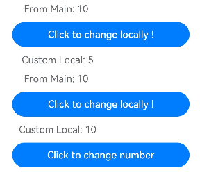
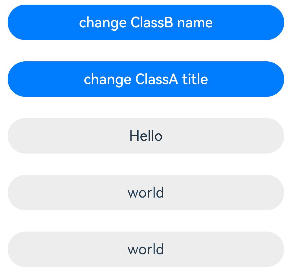

# \@Prop Decorator: Implementing One-Way Synchronization from Parent to Child Components

<!--Kit: ArkUI-->
<!--Subsystem: ArkUI-->
<!--Owner: @jiyujia926-->
<!--Designer: @zhangboren-->
<!--Tester: @TerryTsao-->
<!--Adviser: @zhang_yixin13-->
<!-- md-trans-meta sourceCommit=3efb4ba336409dd0731ba011e1e227786db57fa2 translatedAt=2026-07-22T02:13:16.114Z pushedAt=2026-07-23T11:00:13.229Z -->

A variable decorated by [@Prop](../../reference/apis-arkui/arkui-ts/ts-state-management-prop.md#prop) can establish a one-way synchronization relationship with its parent component.

Before reading the @Prop documentation, you are advised to first understand the basic usage of [@State](./arkts-state.md). For best practices, see [State Management Best Practices](https://developer.huawei.com/consumer/en/doc/best-practices/bpta-status-management). For FAQs, see [State Management FAQs](./arkts-state-management-faq.md).

> **NOTE**
>
> This decorator can be used in ArkTS widgets since API version 9.
>
> This decorator can be used in atomic services since API version 11.

## Overview

Variables decorated with \@Prop have the following features:

- Can be updated within the component, but the changes do not propagate to the parent component.

- Always synchronize with parent data source changes, overwriting any local values.

## Usage Rules

<!--Table: 30%; 70%-->

| \@Prop Decorator| Description                                      |
| ----------- | ---------------------------------------- |
| Parameters      | None.                                       |
| Synchronization type       | One-way synchronization One-way: from the data source provided by the parent component to the \@Prop decorated variable.<br>For details about the scenarios of nested types, see [Observed Changes](#observed-changes).|
| Allowed variable types  |  Object, class, string, number, Boolean, enum, and array of these types.<br>API version 10 and later: [Date type](#decorating-variables-of-the-date-type).<br>API version 11 and later: [Map](#decorating-variables-of-the-map-type), [Set](#decorating-variables-of-the-set-type), undefined, null, union types defined by the ArkUI framework, for example, [Length](../../reference/apis-arkui/arkui-ts/ts-types.md#length), [ResourceStr](../../reference/apis-arkui/arkui-ts/ts-types.md#resourcestr), [ResourceColor](../../reference/apis-arkui/arkui-ts/ts-types.md#resourcecolor), and union types. For details, see [Using Union Types](#using-union-types).<br>For details about the scenarios of supported types, see [Observed Changes](#observed-changes).|
| Disallowed variable types| Function.     |
| Number of nested layers       | In component reuse scenarios, it is recommended that @Prop be nested with no more than five layers of data. If @Prop is nested with too many layers of data, garbage collection and increased memory usage caused by deep copy will arise, resulting in performance issues. To avoid such issues, use [\@ObjectLink](arkts-observed-and-objectlink.md) instead.|
| Initial value for the decorated variable  | Local initialization is allowed. Since API version 11, if this decorator is used together with [\@Require](arkts-require.md), the parent component must pass parameters through its constructor.|

## Variable Transfer/Access Rules

| Rule         | Description                                                        |
| ------------------ | ------------------------------------------------------------ |
| Initialization from the parent component | If there is local initialization, it is optional. The initialization behavior is consistent with [@State](./arkts-state.md#variable-transferaccess-rules). If not, it is mandatory. Supports regular variables in the parent component (assigning a regular variable to @Prop is only value initialization; changes to regular variables do not trigger UI refresh. Only state variables can trigger UI refresh), [@State](arkts-state.md), [@Link](arkts-link.md), @Prop, [@Provide](arkts-provide-and-consume.md), [@Consume](arkts-provide-and-consume.md), [@ObjectLink](arkts-observed-and-objectlink.md), [@StorageLink](arkts-appstorage.md#storagelink), [@StorageProp](arkts-appstorage.md#storageprop), [@LocalStorageLink](arkts-localstorage.md#localstoragelink), and [@LocalStorageProp](arkts-localstorage.md#localstorageprop) to initialize the @Prop decorated variable in the child component. |
|Child component initialization| \@Prop can be used for initialization of a regular variable or \@State, \@Link, \@Prop, or \@Provide decorated variable in the child component.|
| Access from outside the component| Private, accessible only within the component.                |

 The following figure shows the initialization rules.


## Observed Changes and Behavior

### Observed Changes

\@Prop decorated variables support observation of the following change types:

- When the decorated type is supported, value assignments can be observed. For a complete example of simple types, see [Synchronizing Simple Data Types in the Parent Component to @Prop in the Child Component](#synchronizing-simple-data-types-in-the-parent-component-to-prop-in-the-child-component).

  ```ts
  // Primitive type
  @Prop count: number;
  // Value assignment observable
  this.count = 1;
  // Complex type
  @Prop title: Model;
  // Value assignment observable
  this.title = new Model('Hi');
  ```

- When the decorated type is a complex type such as Object or class, both object assignments and top-level property changes can be observed. Top-level properties include all properties returned by **Object.keys(observedObject)**. For a complete example of complex types, see [Synchronizing Simple Data Types in the Parent Component to @Prop in the Child Component](#synchronizing-simple-data-types-in-the-parent-component-to-prop-in-the-child-component).

  <!-- @[prop_seventeen_start](https://gitcode.com/openharmony/applications_app_samples/blob/master/code/DocsSample/ArkUISample/Prop/entry/src/main/ets/pages/PageSeventeen.ets) -->

  ``` TypeScript
  // Define a nested class.
  class Info {
    public value: string;
  
    constructor(value: string) {
      this.value = value;
    }
  }
  
  class Model {
    public value: string;
    public info: Info;
  
    constructor(value: string, info: Info) {
      this.value = value;
      this.info = info;
    }
  }
  ```

  <!-- @[prop_twentyone_start](https://gitcode.com/openharmony/applications_app_samples/blob/master/code/DocsSample/ArkUISample/Prop/entry/src/main/ets/pages/PageSeventeen.ets) -->

  ``` TypeScript
  @Prop title: Model;
  ```

  <!-- @[prop_nineteen_start](https://gitcode.com/openharmony/applications_app_samples/blob/master/code/DocsSample/ArkUISample/Prop/entry/src/main/ets/pages/PageSeventeen.ets) -->

  ``` TypeScript
  // Can observe first-layer changes.
  this.title.value = 'Hi';
  ```

  <!-- @[prop_twenty_start](https://gitcode.com/openharmony/applications_app_samples/blob/master/code/DocsSample/ArkUISample/Prop/entry/src/main/ets/pages/PageSeventeen.ets) -->

  ``` TypeScript
  // Cannot observe second-layer changes.
  this.title.info.value = 'ArkUI';
  ```

In the scenarios of nested objects, if a class is decorated by \@Observed, the value changes of the class property can be observed. For details, see [Nesting \@Prop](#nesting-prop).

- When the decorated type is an array, array assignments and the addition, deletion, and update of array items can be observed. For a complete example of array types, see [Synchronizing from \@State Array Items to \@Prop Simple Data Types](#synchronizing-simple-data-types-from-state-array-items-in-the-parent-component-to-prop-in-the-child-component).

  ```ts
  // When the object decorated by @Prop is an array
  @Prop title: string[];
  // Assignment to the array itself can be observed.
  this.title = ['1'];
  // Assignment to array items can be observed.
  this.title[0] = '2';
  // Deletion of array items can be observed.
  this.title.pop();
  // Addition of array items can be observed.
  this.title.push('3');
  ```

For synchronization between \@State and \@Prop decorated variables:

- The @Prop decorated variable in the child component is initialized with the value of the @State variable from the parent component. When the @State variable changes, its value is synchronously updated to the @Prop decorated variable.

- However, any change to the @Prop decorated variable does not affect the value of its source @State decorated variable.

- In addition to \@State, the source can also be decorated with \@Link or \@Prop, where the mechanism for syncing the \@Prop decorated variable is the same.

- The data source and the @Prop decorated variable must be of the same type.

- When the decorated object is of the Date type, the following changes can be observed: (1) complete **Date** object reassignment; (2) property changes caused by calling **setFullYear**, **setMonth**, **setDate**, **setHours**, **setMinutes**, **setSeconds**, **setMilliseconds**, **setTime**, **setUTCFullYear**, **setUTCMonth**, **setUTCDate**, **setUTCHours**, **setUTCMinutes**, **setUTCSeconds**, or **setUTCMilliseconds**. For details, see [Decorating Variables of the Date Type](#decorating-variables-of-the-date-type).

- When the decorated object is of the **Map** type, the following changes can be observed: (1) complete **Map** object reassignment; (2) changes caused by calling **set**, **clear**, or **delete**. For details, see [Decorating Variables of the Map Type](#decorating-variables-of-the-map-type).

- When the decorated object is of the **Set** type, the following changes can be observed: (1) complete **Set** object reassignment; (2) changes caused by calling **add**, **clear**, or **delete**. For details, see [Decorating Variables of the Set Type](#decorating-variables-of-the-set-type).

### Framework Behavior

To understand the initialization and update mechanism of @Prop decorated variables, you need to understand the rendering and update process of the parent and child components.

1. Initial rendering:

   1. The parent component's **build()** function is executed, creating child component instances with data source propagation.

   2. \@Prop decorated variables are initialized with parent-provided values.

2. Update:

   1. When the \@Prop decorated variable is modified locally, the change does not propagate back to its parent component.

   2. When the data source in the parent component updates, variables decorated with @Prop in the child component will be reset from the parent component's data source, and any local modifications to @Prop-decorated variables will be overwritten by the parent component's updates.

> **NOTE**
>
> \@Prop synchronization with data sources depends on updates from the source component. However, these updates cannot occur while the application runs in the background. Consequently, @Prop properties won't receive updates from their data sources during background operation. For real-time data synchronization in such scenarios, use @Link instead.

In this example, the **Father** component is re-rendered when the @State decorated **message** variable changes. The **Son** component receives this variable via @Prop. The **Father** component updates the @Prop value with the latest value of **message**, triggering **Son** component re-rendering.

<!-- @[prop_one_start](https://gitcode.com/openharmony/applications_app_samples/blob/master/code/DocsSample/ArkUISample/Prop/entry/src/main/ets/pages/PageOne.ets) --> 

``` TypeScript
@Component
struct Son {
  @Prop message: string = 'Hi';

  build() {
    Column() {
      Text(this.message)
    }
  }
}

@Entry
@Component
struct Father {
  @State message: string = 'Hello';

  build() {
    Column() {
      Text(this.message)
      Button(`father click`).onClick(() => {
        this.message += '*';
      })
      // The Father component's @State decorated message is passed to the Son component's message
      Son({ message: this.message })
    }
  }
}
```

## Constraints

- When a variable is decorated by @Prop, a deep copy is performed. During the copy process, types other than primitive types, Map, Set, Date, and Array will be lost. For example, for complex types provided through NAPI (such as [PixelMap](../../reference/apis-image-kit/arkts-apis-image-PixelMap.md)), since part of their implementation resides on the native side, complete data cannot be obtained through deep copy on the ArkTS side. Similarly, the RegExp type loses its original type during the copy process, making it impossible to call regex-related functions after being decorated by @Prop.

- @Prop does not support decorating variables of the Function type. Before API version 23, an error occurs when the app runs.

   Starting from API version 23, a related check has been added during app compilation. Decorating a Function type variable with @Prop will prompt an ERROR, and the @Prop decorator should be removed from the Function type variable in the code.

- When the parent component passes in **undefined**, the @Prop decorated variable is still initialized with its local default value.

  <!-- @[prop_twenty_start](https://gitcode.com/openharmony/applications_app_samples/blob/master/code/DocsSample/ArkUISample/Prop/entry/src/main/ets/pages/PageTwenty.ets) --> 

  ``` TypeScript
  @Entry
  @Component
  struct Parent {
    @State count: number | undefined = undefined;
  
    build() {
      Column() {
        Text(`Parent count value: ${this.count}`)
          .fontSize(20)
          .margin(10)
        Child({ count: this.count })
      }
    }
  }
  
  @Component
  struct Child {
    // When the parent component passes undefined, the @Prop decorated variable is still initialized with the local default value.
    @Prop count: number | undefined = 0;
  
    build() {
      Column() {
        Text(`Child count value: ${this.count}`)
          .fontSize(20)
          .margin(10)
      }
    }
  }
  ```

## When to Use

### Synchronizing Simple Data Types in the Parent Component to @Prop in the Child Component

In this example, the \@Prop decorated **count** variable in the **CountDownComponent** child component is initialized from the \@State decorated **countDownStartValue** variable in the **ParentComponent**. When **Try again** is touched, the value of the **count** variable is modified, but the change remains within the **CountDownComponent** and does not affect the **ParentComponent**.

Updating **countDownStartValue** in the **ParentComponent** will reset **count** in **CountDownComponent**.

<!-- @[prop_two_start](https://gitcode.com/openharmony/applications_app_samples/blob/master/code/DocsSample/ArkUISample/Prop/entry/src/main/ets/pages/PageTwo.ets) -->

``` TypeScript
@Component
struct CountDownComponent {
  @Prop count: number = 0;
  costOfOneAttempt: number = 1;

  build() {
    Column() {
      if (this.count > 0) {
        Text(`You have ${this.count} Nuggets left`)
      } else {
        Text('Game over!')
      }
      // Changes to the @Prop decorated variables are not synchronized to the parent component.
      Button(`Try again`).onClick(() => {
        this.count -= this.costOfOneAttempt;
      })
    }
  }
}

@Entry
@Component
struct ParentComponent {
  @State countDownStartValue: number = 10;

  build() {
    Column() {
      Text(`Grant ${this.countDownStartValue} nuggets to play.`)
      // Changes to the data source provided by the parent component are synchronized to the child component.
      Button(`+1 - Nuggets in New Game`).onClick(() => {
        this.countDownStartValue += 1;
      })
      // Updating the parent component will also update the child component.
      Button(`-1  - Nuggets in New Game`).onClick(() => {
        this.countDownStartValue -= 1;
      })
      CountDownComponent({ count: this.countDownStartValue, costOfOneAttempt: 2 })
    }
  }
}
```

In the preceding example:

1. On initial render, when the **CountDownComponent** child component is created, its \@Prop decorated **count** variable is initialized from the \@State decorated **countDownStartValue** variable in the **ParentComponent**.

2. Clicking the "+1" or "-1" button changes the parent component's @State variable **countDownStartValue**, triggering a re‑render. During this re‑render, UI components bound to **countDownStartValue** are updated, and the child **CountDownComponent**'s count is synchronously updated in a one‑way manner.

3. Because of the change in the **count** variable value, the **CountDownComponent** child component will re-render. At a minimum, the **if** statement's condition (**this.count > 0**) is evaluated, and the **Text** child component inside the **if** statement would be updated.

4. When the **Try again** button in the **CountDownComponent** child component is tapped, its @Prop decorated variable **count** is changed, but the change in the **count** value does not affect the **countDownStartValue** value of the parent component.

5. Updating **countDownStartValue** will overwrite the local value changes of the @Prop decorated **count** in the **CountDownComponent** child component.

### Synchronizing Simple Data Types from @State Array Items in the Parent Component to @Prop in the Child Component 

If @State in the parent component decorates a variable of the array type, its array item can also initialize @Prop. In the following example, the \@State decorated array **arr** in the parent component **Index** initializes the \@Prop decorated **value** variable in the child component **Child**.

<!-- @[prop_four_start](https://gitcode.com/openharmony/applications_app_samples/blob/master/code/DocsSample/ArkUISample/Prop/entry/src/main/ets/pages/PageFour.ets) -->

``` TypeScript
@Component
struct Child {
  @Prop value: number = 0;

  build() {
    Text(`${this.value}`)
      .fontSize(50)
      .onClick(() => {
        this.value++;
      })
  }
}

@Entry
@Component
struct Index {
  @State arr: number[] = [1, 2, 3];

  build() {
    Row() {
      Column() {
        Child({ value: this.arr[0] })
        Child({ value: this.arr[1] })
        Child({ value: this.arr[2] })

        Divider().height(5)

        ForEach(this.arr,
          (item: number) => {
            Child({ value: item })
          },
          (item: number) => item.toString()
        )
        Text('replace entire arr')
          .fontSize(50)
          .onClick(() => {
            // Both arrays contain item "3".
            this.arr = this.arr[0] == 1 ? [3, 4, 5] : [1, 2, 3];
          })
      }
    }
  }
}
```

Initial render creates six instances of the **Child** component. Each \@Prop decorated variable is initialized with a copy of an array item. The **onClick** event handler of the **Child** component changes the local variable value.

Click **1** six times, 2 five times, and **3** four times on the page. The local values of all variables are then changed to **7**.

```
7
7
7
——————
7
7
7
```

After **replace entire arr** is clicked, the following information is displayed:

```
3
4
5
——————
7
4
5
```

- Changes made in the **Child** component are not synchronized to the parent component **Index**. Therefore, even if the values of the six instances of the **Child** component are **7**, the value of **this.arr** in the **Index** component is still **[1,2,3]**.

- After **replace entire arr** is clicked, if **this.arr[0] == 1** is true, **this.arr** is set to **[3, 4, 5]**.

- Because **this.arr[0]** has been changed, the **Child({value: this.arr[0]})** component synchronizes the update of **this.arr[0]** to the instance's \@Prop decorated variable. The same happens for **Child({value: this.arr[1]})** and **Child({value: this.arr[2]})**.

- The change of **this.arr** causes **ForEach** to update: According to the diff algorithm, the array item with the ID **3** is retained in this update, array items with IDs **1** and **2** are deleted, and array items with IDs **4** and **5** are added. The array before and after the update is **[1, 2, 3]** and **[3, 4, 5]**, respectively. This implies that the **Child** instance generated for item **3** is moved to the first place, but not updated. In this case, the component value corresponding to **3** is **7**, and the final render result of **ForEach** is **7**, **4**, and **5**.

### Synchronizing from \@State Class Object Properties to \@Prop Simple Data Types

In a library with one book and two readers, each reader can mark the book as read, and the marking does not affect the other reader. Technically speaking, local changes to the \@Prop decorated **book** object do not sync back to the @State decorated **book** in the **Library** component.

In this example, the \@Observed decorator can be applied to the **book** class, but it is not mandatory. It is only needed for nested structures. This will be further explained in [Synchronizing from \@State Array Items to \@Prop Class Types](#synchronizing-from-state-array-items-to-prop-class-types).

<!-- @[prop_five_start](https://gitcode.com/openharmony/applications_app_samples/blob/master/code/DocsSample/ArkUISample/Prop/entry/src/main/ets/pages/PageFive.ets) --> 

``` TypeScript
class Book {
  public title: string;
  public pages: number;
  public readIt: boolean = false;

  constructor(title: string, pages: number) {
    this.title = title;
    this.pages = pages;
  }
}

@Component
struct ReaderComp {
  // The parent component's @State decorated book is passed to the child component's @Prop decorated book.
  @Prop book: Book = new Book('', 0);

  build() {
    Row() {
      Text(this.book.title)
      Text(`...has${this.book.pages} pages!`)
      Text(`...${this.book.readIt ? 'I have read' : 'I have not read it'}`)
        .onClick(() => this.book.readIt = true)
    }
  }
}

@Entry
@Component
struct Library {
  @State book: Book = new Book('100 secrets of C++', 765);

  build() {
    Column() {
      // The parent component passes the same book to two ReaderComp components respectively.
      ReaderComp({ book: this.book })
      ReaderComp({ book: this.book })
    }
  }
}
```

### Synchronizing from \@State Array Items to \@Prop Class Types

In this example, clicking **"Mark read for everyone"** modifies properties within the \@State decorated **allBooks** array objects, but fails to trigger UI updates. This is because the property is nested at the second layer, and the \@State decorator can observe only top-level property changes. Therefore, the framework does not update **ReaderComp**.

<!-- @[prop_six_start](https://gitcode.com/openharmony/applications_app_samples/blob/master/code/DocsSample/ArkUISample/Prop/entry/src/main/ets/pages/PageSix.ets) --> 

``` TypeScript
import { hilog } from '@kit.PerformanceAnalysisKit';

const DOMAIN = 0x0001;
const TAG: string = '[SampleProp]';
let nextId: number = 1;

// @Observed
class Book {
  public id: number;
  public title: string;
  public pages: number;
  public readIt: boolean = false;

  constructor(title: string, pages: number) {
    this.id = nextId++;
    this.title = title;
    this.pages = pages;
  }
}

@Component
struct ReaderComp {
  @Prop book: Book = new Book('', 1);

  build() {
    Row() {
      Text(` ${this.book ? this.book.title : 'Book is undefined'}`).fontColor('#e6000000')
      Text(` has ${this.book ? this.book.pages : 'Book is undefined'} pages!`).fontColor('#e6000000')
      Text(` ${this.book ? this.book.readIt ? 'I have read' : 'I have not read it' : 'Book is undefined'}`)
        .fontColor('#e6000000')
        .onClick(() => this.book.readIt = true)
    }
  }
}

@Entry
@Component
struct Library {
  @State allBooks: Book[] = [new Book('C#', 765), new Book('JS', 652), new Book('TS', 765)];

  build() {
    Column() {
      Text('library`s all time favorite')
        .width(312)
        .height(40)
        .backgroundColor('#0d000000')
        .borderRadius(20)
        .margin(12)
        .padding({ left: 20 })
        .fontColor('#e6000000')
      ReaderComp({ book: this.allBooks[2] })
        .backgroundColor('#0d000000')
        .width(312)
        .height(40)
        .padding({ left: 20, top: 10 })
        .borderRadius(20)
        .colorBlend('#e6000000')
      Text('Books on loan to a reader')
        .width(312)
        .height(40)
        .backgroundColor('#0d000000')
        .borderRadius(20)
        .margin(12)
        .padding({ left: 20 })
        .fontColor('#e6000000')
      ForEach(this.allBooks, (book: Book) => {
        ReaderComp({ book: book })
          .margin(12)
          .width(312)
          .height(40)
          .padding({ left: 20, top: 10 })
          .backgroundColor('#0d000000')
          .borderRadius(20)
      },
        (book: Book) => book.id.toString())
      Button('Add new')
        .width(312)
        .height(40)
        .margin(12)
        .fontColor('#FFFFFF')
        .onClick(() => {
          this.allBooks.push(new Book('JA', 512));
        })
      Button('Remove first book')
        .width(312)
        .height(40)
        .margin(12)
        .fontColor('#FFFFFF')
        .onClick(() => {
          if (this.allBooks.length > 0) {
            this.allBooks.shift();
          } else {
            // Output a prompt when allBooks is empty.
            hilog.info(DOMAIN, TAG, 'length <= 0');
          }
        })
      Button('Mark read for everyone')
        .width(312)
        .height(40)
        .margin(12)
        .fontColor('#FFFFFF')
        .onClick(() => {
          this.allBooks.forEach((book) => book.readIt = true)
        })
    }
  }
}
```

To observe the property of the **Book** object, you must use \@Observed to decorate the **Book** class. Note that the \@Prop decorated state variable in the child component is synchronized from the data source of the parent component in a uni-directional manner. This means that the changes of the \@Prop decorated **book** in **ReaderComp** are not synchronized to the parent **Library** component. The parent component only triggers UI updates when its own state variables change.

```ts
@Observed
class Book {
  public id: number;
  public title: string;
  public pages: number;
  public readIt: boolean = false;

  constructor(title: string, pages: number) {
    this.id = nextId++;
    this.title = title;
    this.pages = pages;
  }
}
```

All instances of the \@Observed decorated class are wrapped with an opaque proxy object. This proxy can detect all property changes inside the wrapped object. If any property change happens, the proxy notifies the \@Prop, and the \@Prop value will be updated.


### Initializing \@Prop Locally Without Synchronizing with Parent Components

To enable an \@Component decorated component to be reusable, \@Prop allows for optional local initialization. This makes the synchronization with a variable in the parent component a choice, rather than mandatory. Providing a data source in the parent component is optional only when local initialization is provided for the \@Prop decorated variable.

In the following example, the child component contains two @Prop decorated variables:

- **customCounter** is not initialized locally. Therefore, the parent component needs to provide the data source to deinitialize \@Prop. When the data source of the parent component changes, \@Prop is updated.

- **customCounter2** has local initialization. In this case, specifying a synchronization source in the parent component is allowed but not mandatory.

<!-- @[prop_seven_start](https://gitcode.com/openharmony/applications_app_samples/blob/master/code/DocsSample/ArkUISample/Prop/entry/src/main/ets/pages/PageSeven.ets) -->

``` TypeScript
@Component
struct MyComponent {
  @Prop customCounter: number;
  @Prop customCounter2: number = 5;

  build() {
    Column() {
      Row() {
        Text(`From Main: ${this.customCounter}`).fontColor('#ff6b6565').margin({ left: -110, top: 12 })
      }

      Row() {
        Button('Click to change locally!')
          .width(288)
          .height(40)
          .margin({ left: 30, top: 12 })
          .fontColor('#FFFFFF')
          .onClick(() => {
            this.customCounter2++;
          })
      }

      Row() {
        Text(`Custom Local: ${this.customCounter2}`).fontColor('#ff6b6565').margin({ left: -110, top: 12 })
      }
    }
  }
}

@Entry
@Component
struct MainProgram {
  @State mainCounter: number = 10;

  build() {
    Column() {
      Row() {
        Column() {
          // customCounter must be initialized from the parent component because the customCounter member variable of MyComponent lacks local initialization; here, customCounter2 does not need to be initialized.
          MyComponent({ customCounter: this.mainCounter })
          // customCounter2 of the child component can also be initialized from the parent component. The value from the parent component overwrites the locally assigned value of customCounter2 during initialization.
          MyComponent({ customCounter: this.mainCounter, customCounter2: this.mainCounter })
        }
      }

      Row() {
        Column() {
          Button('Click to change number')
            .width(288)
            .height(40)
            .margin({ left: 30, top: 12 })
            .fontColor('#FFFFFF')
            .onClick(() => {
              this.mainCounter++;
            })
        }
      }
    }
  }
}
```



### Nesting \@Prop

In nesting scenario, each layer must be decorated with @Observed, and each layer must be received by @Prop. In this way, changes can be observed.

<!-- @[prop_eight_start](https://gitcode.com/openharmony/applications_app_samples/blob/master/code/DocsSample/ArkUISample/Prop/entry/src/main/ets/pages/PageEight.ets) -->

``` TypeScript
// The following is the data structure of a nested class object.
@Observed
class Son {
  public title: string;

  constructor(title: string) {
    this.title = title;
  }
}

@Observed
class Father {
  public name: string;
  public son: Son;

  constructor(name: string, son: Son) {
    this.name = name;
    this.son = son;
  }
}
```

The following component hierarchy presents a data structure of nested \@Prop.

<!-- @[prop_nine_start](https://gitcode.com/openharmony/applications_app_samples/blob/master/code/DocsSample/ArkUISample/Prop/entry/src/main/ets/pages/PageNine.ets) -->

``` TypeScript
@Entry
@Component
struct Person {
  @State person: Father = new Father('Hello', new Son('world'));

  build() {
    Column() {
      Flex({ direction: FlexDirection.Column, alignItems: ItemAlign.Center }) {
        Button('change Father name')
          .width(312)
          .height(40)
          .margin(12)
          .fontColor('#FFFFFF')
          .onClick(() => {
            this.person.name = 'Hi';
          })
        Button('change Son title')
          .width(312)
          .height(40)
          .margin(12)
          .fontColor('#FFFFFF')
          .onClick(() => {
            // person is decorated by @State, which cannot observe changes of nested types. Tap this button directly. At this point, the title has changed but cannot be observed.
            this.person.son.title = 'ArkUI';
          })
        Text(this.person.name)
          .fontSize(16)
          .margin(12)
          .width(312)
          .height(40)
          .backgroundColor('#ededed')
          .borderRadius(20)
          .textAlign(TextAlign.Center)
          .fontColor('#e6000000')
          .onClick(() => {
            // Tap this button. This change will be observed, and the effect after tapping Button('change Son title') can also be observed.
            this.person.name = 'Bye';
          })
        Text(this.person.son.title)
          .fontSize(16)
          .margin(12)
          .width(312)
          .height(40)
          .backgroundColor('#ededed')
          .borderRadius(20)
          .textAlign(TextAlign.Center)
          .onClick(() => {
            this.person.son.title = 'openHarmony';
          })
        Child({ child: this.person.son })
      }
    }
  }
}


@Component
struct Child {
  @Prop child: Son = new Son('');

  build() {
    Column() {
      Text(this.child.title)
        .fontSize(16)
        .margin(12)
        .width(312)
        .height(40)
        .backgroundColor('#ededed')
        .borderRadius(20)
        .textAlign(TextAlign.Center)
        .onClick(() => {
          this.child.title = 'Bye Bye';
        })
    }
  }
}
```



### Decorating Array Type Variables

In the following example, the **message** type is `number[]`. When the button is clicked, the value of **message** changes, and the view is refreshed accordingly.

<!-- @[prop_nineteen_start](https://gitcode.com/openharmony/applications_app_samples/blob/master/code/DocsSample/ArkUISample/Prop/entry/src/main/ets/pages/PageNineteen.ets) -->

``` TypeScript
@Entry
@Component
struct Index {
  @State message: number[] = [0, 1, 2, 3];

  build() {
    Column() {
      Child({ message: this.message })
    }
  }
}

@Component
struct Child {
  @Prop message: number[] = [0, 1, 2, 3];

  build() {
    Row() {
      Column() {
        ForEach(this.message, (item: number) => {
          Text(`${item}`)
            .fontSize(20)
            .margin(10)
        })
        // Add an array element to trigger UI refresh.
        Button('Push element')
          .onClick(() => {
            this.message.push(4);
          })
          .width(300)
          .margin(10)
        // Delete an array element to trigger UI refresh.
        Button('Pop element')
          .onClick(() => {
            this.message.pop();
          })
          .width(300)
          .margin(10)
        // Reassign the entire array to trigger UI refresh.
        Button('Reset array')
          .onClick(() => {
            this.message = [9, 8, 7, 6];
          })
          .width(300)
          .margin(10)
        // Update an array element to trigger UI refresh.
        Button('Modify element[0]')
          .onClick(() => {
            this.message[0] = 10;
          })
          .width(300)
          .margin(10)
      }
      .width('100%')
    }
    .height('100%')
  }
}
```

### Decorating Variables of the Map Type

> **NOTE**
>
> Since API version 11, \@Prop supports the Map type.

In the following example, the **value** type is Map\<number, string\>. When the button is clicked, the value of **value** changes, and the view is refreshed accordingly.

<!-- @[prop_ten_start](https://gitcode.com/openharmony/applications_app_samples/blob/master/code/DocsSample/ArkUISample/Prop/entry/src/main/ets/pages/PageTen.ets) --> 

``` TypeScript
@Component
struct Child {
  @Prop value: Map<number, string> = new Map([[0, 'a'], [1, 'b'], [3, 'c']]);

  build() {
    Column() {
      ForEach(Array.from(this.value.entries()), (item: [number, string]) => {
        Text(`${item[0]}`).fontSize(30)
        Text(`${item[1]}`).fontSize(30)
        Divider()
      })
      // value is decorated by @Prop, and overall Map assignments as well as changes caused by calling Map interfaces can be observed.
      Button('child init map').onClick(() => {
        this.value = new Map([[0, 'a'], [1, 'b'], [3, 'c']]);
      })
      Button('child set new one').onClick(() => {
        this.value.set(4, 'd');
      })
      Button('child clear').onClick(() => {
        this.value.clear();
      })
      Button('child replace the first one').onClick(() => {
        this.value.set(0, 'aa');
      })
      Button('child delete the first one').onClick(() => {
        this.value.delete(0);
      })
    }
  }
}


@Entry
@Component
struct MapSample {
  @State message: Map<number, string> = new Map([[0, 'a'], [1, 'b'], [3, 'c']]);

  build() {
    Row() {
      Column() {
        Child({ value: this.message })
      }
      .width('100%')
    }
    .height('100%')
  }
}
```

### Decorating Variables of the Set Type

> **NOTE**
>
> Since API version 11, \@Prop supports the Set type.

In this example, the **message** variable is of the **Set\<number\>** type. When the button is clicked, the value of **message** changes, and the UI is re-rendered.

<!-- @[prop_eleven_start](https://gitcode.com/openharmony/applications_app_samples/blob/master/code/DocsSample/ArkUISample/Prop/entry/src/main/ets/pages/PageEleven.ets) --> 

``` TypeScript
@Component
struct Child {
  @Prop message: Set<number> = new Set([0, 1, 2, 3, 4]);

  build() {
    Column() {
      ForEach(Array.from(this.message.entries()), (item: [number, number]) => {
        Text(`${item[0]}`).fontSize(30)
        Divider()
      })
      // message is decorated by @Prop, and the overall assignment of Set and changes brought by calling Set interfaces can be observed.
      Button('init set').onClick(() => {
        this.message = new Set([0, 1, 2, 3, 4]);
      })
      Button('set new one').onClick(() => {
        this.message.add(5);
      })
      Button('clear').onClick(() => {
        this.message.clear();
      })
      Button('delete the first one').onClick(() => {
        this.message.delete(0);
      })
    }
    .width('100%')
  }
}


@Entry
@Component
struct SetSample {
  @State message: Set<number> = new Set([0, 1, 2, 3, 4]);

  build() {
    Row() {
      Column() {
        Child({ message: this.message })
      }
      .width('100%')
    }
    .height('100%')
  }
}
```

### Decorating Variables of the Date Type

In this example, the **selectedDate** variable is of the Date type. After the button is clicked, the value of **selectedDate** changes, and the UI is re-rendered.

<!-- @[prop_twelve_start](https://gitcode.com/openharmony/applications_app_samples/blob/master/code/DocsSample/ArkUISample/Prop/entry/src/main/ets/pages/PageTwelve.ets) --> 

``` TypeScript
@Component
struct DateComponent {
  @Prop selectedDate: Date = new Date('');

  build() {
    Column() {
      // selectedDate is decorated by @Prop. Changes can be observed for the overall assignment of Date and changes brought by calling Date interfaces.
      Button('child update the new date')
        .margin(10)
        .onClick(() => {
          this.selectedDate = new Date('2023-09-09');
        })
      Button(`child increase the year by 1`).onClick(() => {
        this.selectedDate.setFullYear(this.selectedDate.getFullYear() + 1);
      })
      DatePicker({
        start: new Date('1970-1-1'),
        end: new Date('2100-1-1'),
        selected: this.selectedDate
      })
    }
  }
}

@Entry
@Component
struct ParentComponent {
  @State parentSelectedDate: Date = new Date('2021-08-08');

  build() {
    Column() {
      Button('parent update the new date')
        .margin(10)
        .onClick(() => {
          this.parentSelectedDate = new Date('2023-07-07');
        })
      Button('parent increase the day by 1')
        .margin(10)
        .onClick(() => {
          this.parentSelectedDate.setDate(this.parentSelectedDate.getDate() + 1);
        })
      DatePicker({
        start: new Date('1970-1-1'),
        end: new Date('2100-1-1'),
        selected: this.parentSelectedDate
      })

      DateComponent({ selectedDate: this.parentSelectedDate })
    }
  }
}
```

### Using Union Types

@Prop supports **undefined**, **null**, and union types. In the following example, the type of **animal** is **Animals | undefined**. If the property or type of **animal** is changed when the button in the parent component **Zoo** is clicked, the change will be synced to the child component.

<!-- @[prop_thirteen_start](https://gitcode.com/openharmony/applications_app_samples/blob/master/code/DocsSample/ArkUISample/Prop/entry/src/main/ets/pages/PageThirteen.ets) -->

``` TypeScript
import { hilog } from '@kit.PerformanceAnalysisKit';

const DOMAIN = 0x0001;
const TAG: string = '[SampleProp]';

class Animals {
  public name: string;

  constructor(name: string) {
    this.name = name;
  }
}

@Component
struct Child {
  @Prop animal: Animals | undefined;

  build() {
    Column() {
      Text(`Child's animal is  ${this.animal instanceof Animals ? this.animal.name : 'undefined'}`).fontSize(30)

      Button('Child change animals into tigers')
        .onClick(() => {
          // Assign the value of an instance of Animals.
          this.animal = new Animals('Tiger');
        })

      Button('Child change animal to undefined')
        .onClick(() => {
          // Assign the value undefined.
          this.animal = undefined;
        })

    }.width('100%')
  }
}

@Entry
@Component
struct Zoo {
  @State animal: Animals | undefined = new Animals('lion');

  build() {
    Column() {
      Text(`Parents' animals are  ${this.animal instanceof Animals ? this.animal.name : 'undefined'}`).fontSize(30)

      Child({ animal: this.animal })

      Button('Parents change animals into dogs')
        .onClick(() => {
          // Determine the animal type and update the property.
          if (this.animal instanceof Animals) {
            this.animal.name = 'Dog';
          } else {
            hilog.info(DOMAIN, TAG, 'num is undefined, cannot change property');
          }
        })

      Button('Parents change animal to undefined')
        .onClick(() => {
          // Assign the value undefined.
          this.animal = undefined;
        })
    }
  }
}
```

<!--no_check-->