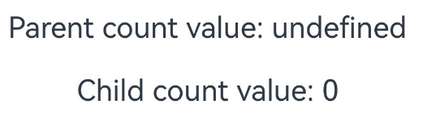
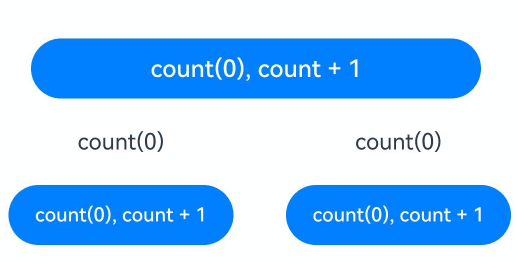
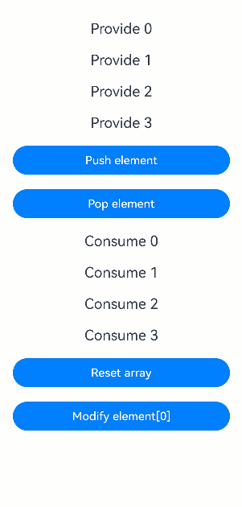
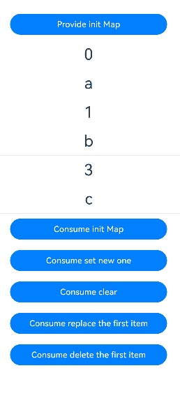
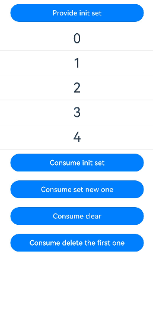
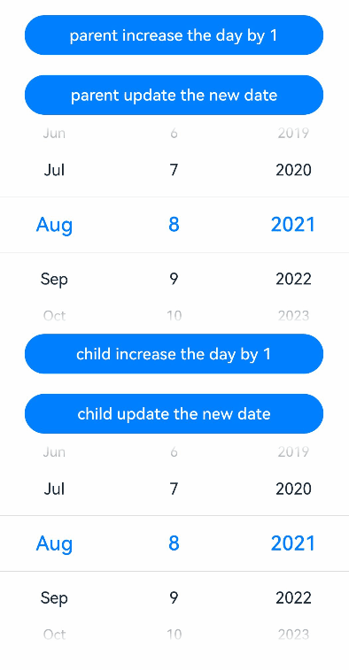
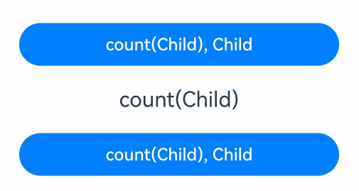
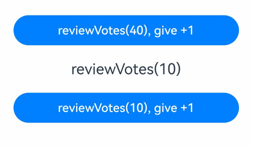
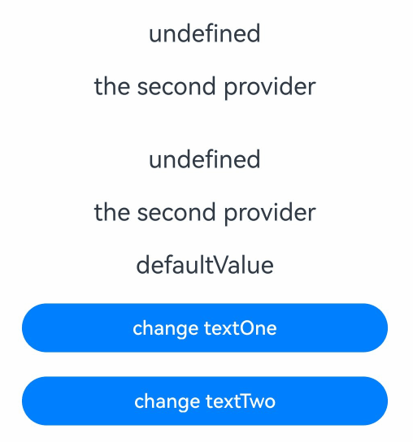
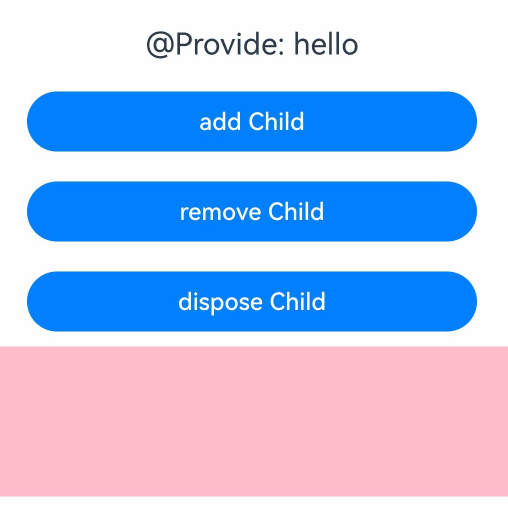

# \@Provide and \@Consume Decorators: Two-Way Synchronization with Descendant Components

<!--Kit: ArkUI-->
<!--Subsystem: ArkUI-->
<!--Owner: @liwenzhen3-->
<!--Designer: @zhangboren-->
<!--Tester: @TerryTsao-->
<!--Adviser: @zhang_yixin13-->
<!-- md-trans-meta sourceCommit=2fe87adc16af5a903a1eb4a9624e4d36fa962e3d translatedAt=2026-07-25T08:56:38.732Z pushedAt=2026-07-25T09:33:49.523Z -->

[\@Provide](../../reference/apis-arkui/arkui-ts/ts-state-management-provide.md#provide) and [\@Consume](../../reference/apis-arkui/arkui-ts/ts-state-management-consume.md#consume) are used for two-way data synchronization with descendent components and for passing state data across multiple levels. Unlike the named parameter mechanism used between parent and child components mentioned earlier, \@Provide and \@Consume break free from the parameter passing mechanism and enable cross-level transfer.

An \@Provide decorated state variable exists in the ancestor component and is said to be "provided" to descendent components. An \@Consume decorated state variable is used in a descendent component. It is linked to ("consumes") the provided state variable in its ancestor component.

\@Provide/\@Consume is bidirectional synchronization across component levels. Before reading the @Provide and @Consume documents, it would be helpful if you have a basic understanding of the basic syntax of the UI paradigm and custom components. You are advised to read [Basic Syntax Overview](./arkts-basic-syntax-overview.md), [Declarative UI Description](./arkts-declarative-ui-description.md), and [Creating a Custom Component](./arkts-create-custom-components.md) in advance. For best practices, see [State Management](https://developer.huawei.com/consumer/en/doc/best-practices/bpta-status-management). For FAQs, see [State Management Development](./arkts-state-management-faq.md).

> **NOTE**
>
> These two decorators can be used in ArkTS widgets since API version 9.
>
> These two decorators can be used in atomic services since API version 11.
>
> In API version 19 and earlier versions, \@Provide and \@Consume bidirectional synchronization supports only declarative nodes.
>
> Since API version 20, @Consume decorated variables support default value assignment. If no matching @Provide is found, the @Consume decorated variable initializes with its default value. When a matching @Provide is found, the @Consume decorated variable uses the @Provide value, and the default value is ignored.
>
> Since API version 20, you can set the [BuildOptions](../../reference/apis-arkui/js-apis-arkui-builderNode.md#buildoptions12) parameter **enableProvideConsumeCrossing** to **true** in [BuilderNode](../../reference/apis-arkui/js-apis-arkui-builderNode.md) to enable cross-[BuilderNode](../../reference/apis-arkui/js-apis-arkui-builderNode.md) two-way synchronization for \@Provide and \@Consume. Note that BuilderNode constructs nodes before adding them to the component tree. Therefore, \@Consume decorated variables defined within BuilderNode must have default values. After BuilderNode is mounted to the tree, it retrieves the latest @Provide data to establish two-way synchronization. For details, see [Using @Consume to Establish Two-Way Synchronization with @Provide Across BuilderNode Scenarios](#using-consume-to-establish-two-way-synchronization-with-provide-across-buildernode-scenarios).

## **Overview**

\@Provide/\@Consume decorated state variables have the following features:

- State variables decorated with @Provide are automatically available to all their descendant components, eliminating the need for manual variable passing through component hierarchies.

- The descendants use \@Consume to obtain the variables provided by \@Provide and establish bidirectional data synchronization between \@Provide and \@Consume. [\@State](./arkts-state.md)/[\@Link](./arkts-link.md) The difference is that the former can be transferred between multi-level parent and child components more conveniently.

- \@Provide and \@Consume are bound using variable names or aliases. They must be of the same type. Otherwise, implicit type conversion occurs, causing application exceptions.

```ts
// Binding through the same variable name
@Provide age: number = 0;
@Consume age: number;
   
// Binding through the same variable alias
@Provide('a') id: number = 0;
@Consume('a') age: number;
   
// Binding by matching the alias of the @Provide decorated variable with the name of the @Consume decorated variable
@Provide('a') id: number = 0;
@Consume a: number;
   
// Binding by matching the name of the @Provide decorated variable with the alias of the @Consume decorated variable
@Provide id: number = 0;
@Consume('id') a: number;
   
```

When \@Provide specifies a variable alias, both the original variable name and alias are stored. \@Consume uses its specified alias (or variable name if no alias exists) as the search key. A binding is successfully established when \@Consume's search key matches either the variable name or alias stored by \@Provide.

## Decorator Description

<!--Table: 25%; 75%-->

| \@Provide Decorator| Description                                      |
| -------------- | ---------------------------------------- |
| Parameters         | Alias: constant string, optional.<br>If an alias is specified, the variable is bound using the alias. If no alias is specified, the variable is bound using the variable name.<br>allowOverride: (optional) overriding allowed. The value is of the string type.<br>If allowOverride is used to specify an alias, the alias can be overridden, that is, the @Provide variable with the same name can exist.<br>If allowOverride is not used, the name must be unique. For details, see [Support for the allowOverride Parameter](#support-for-the-allowoverride-parameter).|
| Allowed variable types     | Object, class, string, number, Boolean, enum, and array of these types.<br>API version 10 and later: [Date type](#decorating-variables-of-the-date-type).<br>API version 11 and later: [Map](#decorating-variables-of-the-map-type), [Set](#decorating-variables-of-the-set-type), undefined, null, union types defined by the ArkUI framework, for example, [Length](../../reference/apis-arkui/arkui-ts/ts-types.md#length), [ResourceStr](../../reference/apis-arkui/arkui-ts/ts-types.md#resourcestr), and [ResourceColor](../../reference/apis-arkui/arkui-ts/ts-types.md#resourcecolor). For details, see [Example of @Provide and @Consume Supporting Union Types](#example-of-provide-and-consume-supporting-union-types).|
| Disallowed variable types| Function.|
| Initialization Rules| Local default values must be defined.<br>A non-undefined variable can be transferred from the parent component. In this case, the variable is used for initialization.<br>If the parent component does not transfer a variable or transfers an undefined variable, the local default value is used for initialization.|
| Synchronization rule       | **When a child component is used**:<br>Does not synchronize with any type of variable in the parent component.<br>When the external variable transferred by the parent component is initialized for \@Provide, it is used only as the initial value. The subsequent variable changes will not be synchronized to \@Provide.<br>**When the parent component is used**:<br>You can initialize the regular variables, \@State, \@Link, [\@Prop](./arkts-prop.md), and \@Provide of the child component.<br>The changes of the \@Provide variable are synchronized to the \@Link and \@Prop variables of the child component.<br>The \@Consume variable that matches the alias in the descendant child component is double-synchronized.|

  **Figure 1** \@Provide initialization rule 


<!--Table: 25%; 75%-->

| \@Consume Decorator | Description                                                        |
| -------------------- | ------------------------------------------------------------ |
| Parameters          | Alias: constant string, optional.<br>If an alias is specified, the variable is bound via the alias; if not, it is bound via the variable name.|
| Allowed variable types  | Object, class, string, number, Boolean, enum, and array of these types.<br>API version 10 and later: [Date type](#decorating-variables-of-the-date-type).<br>API version 11 and later: [Map](#decorating-variables-of-the-map-type), [Set](#decorating-variables-of-the-set-type), undefined, null, union types defined by the ArkUI framework, for example, [Length](../../reference/apis-arkui/arkui-ts/ts-types.md#length), [ResourceStr](../../reference/apis-arkui/arkui-ts/ts-types.md#resourcestr), and [ResourceColor](../../reference/apis-arkui/arkui-ts/ts-types.md#resourcecolor). For details, see [Example of @Provide and @Consume Supporting Union Types](#example-of-provide-and-consume-supporting-union-types).<br>**NOTE**<br>Before API version 20: An \@Consume decorated variable must have a matching @Provide decorated variable with the corresponding attribute name or alias in its parent or ancestor component chain.|
| Disallowed variable types| Function.                                    |
| Initialization Rules          | In versions earlier than API version 20, the default value of the variable decorated by \@Consume cannot be set locally. The variable decorated by \@Provide must match the variable decorated by \@Consume.<br>Since API version 20, \@Consume supports default values. If a matching @Provide is found, the \@Provide decorated variable value takes precedence as the initial value. If the \@Provide variable is not matched, the local default value is used. For details, see [Setting Default Values for @Consume Decorated Variables](#setting-default-values-for-consume-decorated-variables).|
| Synchronization Rule            | **When a child component is used**:<br>The \@Provide variable that matches the ancestor component is synchronized bidirectionally.<br>**When the parent component is used**:<br>You can initialize the regular variables, \@State, \@Link, \@Prop, and \@Provide of child components.<br>Changes of the @Consume variable are synchronized to the \@Link and \@Prop variables of the child component.|

  **Figure 2** \@Consume initialization rules


## Observed Changes and Behavior

### Observed Changes

- When the decorated variable is of the Boolean, string, or number type, its value change can be observed.

- When the decorated variable is of the class or Object type, its value change and value changes of all its attributes, that is, the attributes that **Object.keys(observedObject)** returns, can be observed.

- When the decorated variable is an array, you can observe changes to the array, array elements, and API operations performed on the array. For details, see [Decorating Variables of the Array Type](#decorating-variables-of-the-array-type).

- When the decorated object is Date, you can observe the overall value assignment of Date. In addition, you can call the **setFullYear**, **setMonth**, **setDate**, **setHours**, **setMinutes**, **setSeconds**, **setMilliseconds**, **setTime**, **setUTCFullYear**, **setUTCMonth**, **setUTCDate**, **setUTCHours**, **setUTCMinutes**, **setUTCSeconds**, and **setUTCMilliseconds** APIs of Date to update the attributes of Date. For details, see [Decorating Variables of the Date Type](#decorating-variables-of-the-date-type).

- When the decorated object is of the **Map** type, the following changes can be observed: (1) complete **Map** object reassignment; (2) changes caused by calling **set**, **clear**, or **delete**. For details, see [Decorating Variables of the Map Type](#decorating-variables-of-the-map-type).

- When the decorated object is of the **Set** type, the following changes can be observed: (1) complete **Set** object reassignment; (2) changes caused by calling **add**, **clear**, or **delete**. For details, see [Decorating Variables of the Set Type](#decorating-variables-of-the-set-type).

### Framework Behavior

1. Initial rendering:

   1. The @Provide decorated variable is passed to all child components of the owning component as a map.

   2. If \@Consume decorated variables are used in child components, the framework searches the map for \@Provide decorated variables matching the variable name or alias. If no match is found: Before API version 20: A JS error is thrown. Since API version 20: The framework checks whether \@Consume has a default value; if not, a JS error is thrown.

   3. During initialization of @Consume variables, if a matching @Provide is found in the map, the process resembles \@State/\@Link initialization: \@Consume saves the \@Provide reference and registers itself with the \@Provide decorated variable.

   4. Since API version 20, if no matching \@Provide is found and \@Consume has a default value, \@Consume creates a temporary data source using the default value to maintain notification chain continuity.

2. When the \@Provide decorated variable is updated:

   1. The system traverses and updates all system components (**elementId**) and state variable (\@Consume) that depend on the \@Provide decorated variable, with which the \@Consume decorated variable has registered itself on initial render. After the \@Provide decorated variable of the parent component is changed, all system components (**elementId**) and state variables (\@Consume) that depend on the parent component are traversed and updated.

   2. After the \@Consume decorated variable is updated in all owning child components, all system components (**elementId**) that depend on the \@Consume decorated variable are updated. In this way, changes to the \@Provide decorated variable are synchronized to the \@Consume decorated variable.

3. When the \@Consume decorated variable is updated:

   As can be learned from the initial render procedure, the \@Consume decorated variable holds an instance of \@Provide. After the \@Consume decorated variable is updated, the update method of \@Provide is called to synchronize the changes to \@Provide.


## Constraints

1. The **key** parameter of \@Provide and \@Consume must be of the string type. Otherwise, a compilation error is thrown.

    ```ts
    // Incorrect usage. An error is reported during compilation.
    let change: number = 10;
    @Provide(change) message: string = 'Hello';
    
    // Correct usage.
    let change: string = 'change';
    @Provide(change) message: string = 'Hello';
    ```

2. \@Consume decorated variables cannot be initialized via constructor parameters. Otherwise, a compilation error is thrown. \@Consume can only be initialized by matching corresponding \@Provide decorated variables via **key** or, since API version 20, by using default values.

   **Incorrect Usage**

   ```ts
   @Component
   struct Child {
     @Consume msg: string;
   
     build() {
       Text(this.msg)
     }
   }
   
   @Entry
   @Component
   struct Parent {
     @Provide message: string = 'Hello';
   
     build() {
       Column() {
         // Incorrect format. External initialization is not allowed.
         Child({msg: 'Hello'})
       }
     }
   }
   ```

   **Correct Usage**

   <!-- @[provide_consume_proper_demo](https://gitcode.com/openharmony/applications_app_samples/blob/master/code/DocsSample/ArkUISample/ParadigmStateManagement/entry/src/main/ets/pages/provideAndConsume/ProvideConsumeProperDemo.ets) --> 

   ``` TypeScript
   @Component
   struct Child {
     @Consume num: number;
     // Since API version 20, @Consume decorated variables support default values.
     @Consume num1: number = 17;
   
     build() {
       Column() {
         Text(`Value of num: ${this.num}`)
         Text(`Value of num1: ${this.num1}`)
       }
     }
   }
   
   @Entry
   @Component
   struct Parent {
     @Provide num: number = 10;
   
     build() {
       Column() {
         Text(`Value of num: ${this.num}`)
         Child()
       }
     }
   }
   ```

   

3. If the key of \@Provide is defined repeatedly, the framework throws a runtime error. Since API version 23, the error code [140114](../../reference/apis-arkui/errorcode-stateManagement.md#140114-provide-decorators-with-the-duplicate-key-declared) will be returned to notify you of the repeated key definition. If you need to use duplicate keys, use [allowOverride](#support-for-the-allowoverride-parameter).

    ```ts
    // Incorrect format. "a" is defined repeatedly.
    @Provide('a') count: number = 10;
    @Provide('a') num: number = 10;
    
    // Correct usage.
    @Provide('a') count: number = 10;
    @Provide('b') num: number = 10;
    ```

4. Before API version 20: A runtime error is thrown if no matching \@Provide decorated variable is found during \@Consume initialization. Starting from API version 20, when initializing an @Consume variable, if the developer has not defined an @Provide variable with the corresponding key and has not set a default value, the framework will throw a runtime error. Starting from API version 23, it will return error code [140112](../../reference/apis-arkui/errorcode-stateManagement.md#140112-consume-does-not-have-the-corresponding-provide), indicating that the initialization of the @Consume variable failed because the corresponding @Provide variable with that key could not be found and no default value was set.

   **Incorrect Usage**

    ```ts
    @Component
    struct Child {
      @Consume num: number;
    
      build() {
        Column() {
          Text(`Value of num: ${this.num}`)
        }
      }
    }
    
    @Entry
    @Component
    struct Parent {
      // Incorrect format. @Provide is missing.
      num: number = 10;
    
      build() {
        Column() {
          Text(`Value of num: ${this.num}`)
          Child()
        }
      }
    }
    ```

   **Correct Usage**

   <!-- @[provide_consume_proper_demo_two](https://gitcode.com/openharmony/applications_app_samples/blob/master/code/DocsSample/ArkUISample/ParadigmStateManagement/entry/src/main/ets/pages/provideAndConsume/ProvideConsumeProperDemoTwo.ets) --> 

   ``` TypeScript
   @Component
   struct Child {
     @Consume num: number;
     // Correct usage. Since API version 20, @Consume decorated variables support default values.
     @Consume numWithDefaultValue: number = 6;
   
     build() {
       Column() {
         Text(`Value of num: ${this.num}`)
         Text(`Value of numWithDefaultValue: ${this.numWithDefaultValue}`)
       }
     }
   }
   
   @Entry
   @Component
   struct Parent {
     // Correct usage.
     @Provide num: number = 10;
   
     build() {
       Column() {
         Text(`Value of num: ${this.num}`)
         Child()
       }
     }
   }
   ```

   

5. \@Provide and \@Consume do not support variables of type **Function**. In versions earlier than API version 23, the application would encounter a runtime error.

   Starting from API version 23, relevant compile-time validation has been added. Decorating a **Function** type variable with \@Provide and \@Consume will result in an **ERROR** message. You should remove the \@Provide and \@Consume decorators from variables of the **Function** type in your code.

6. Since API version 20, @Provide and @Consume support cross-BuilderNode pairing. When BuilderNode is constructed, \@Consume locates the nearest \@Provide by key matching. Both must have identical types; type mismatches result in runtime errors.

   You must verify type compatibility, including class instances. For example:

   ```ts
   class A {}
   class B {}
   // Both variables are objects but have different constructors, making them incompatible types.
   @Provide message: A = new A();
   @Consume message: B = new B();
   ```

   In non-BuilderNode scenarios, it is recommended that you maintain identical types for \@Provide/\@Consume pairs. Although runtime validation is not strict, the \@Consume variable undergoes implicit type conversion to match the \@Provide variable type during initialization.

   <!-- @[provide_consume_Builder_Node](https://gitcode.com/openharmony/applications_app_samples/blob/master/code/DocsSample/ArkUISample/ParadigmStateManagement/entry/src/main/ets/pages/provideAndConsume/ProvideConsumeBuilderNode.ets) -->

   ``` TypeScript
   import { NodeController, BuilderNode, FrameNode, UIContext } from '@kit.ArkUI';
   
   @Builder
   function buildText() {
     Column() {
       Child()
     }
   }
   
   class TextNodeController extends NodeController {
     private builderNode: BuilderNode<[]> | null = null;
   
     constructor() {
       super();
     }
   
     makeNode(context: UIContext): FrameNode | null {
       this.builderNode = new BuilderNode(context);
       // Configure cross-BuilderNode support for @Provide/@Consume.
       this.builderNode.build(wrapBuilder(buildText), undefined,
         { enableProvideConsumeCrossing: true });
       // Mount the root node of the BuilderNode to the NodeContainer.
       return this.builderNode.getFrameNode();
     }
   }
   
   @Entry
   @Component
   struct Index {
     @Provide message: string = 'Hello World';
     controller: TextNodeController = new TextNodeController();
   
     build() {
       Column() {
         Text(`@Provide: ${this.message}`)
         NodeContainer(this.controller)
           .width('100%')
           .height(100)
       }
       .width('100%')
       .height('100%')
     }
   }
   
   @Component
   struct Child {
     // Incorrect usage: When Child is mounted via BuilderNode, a type mismatch is detected when @Consume establishes a connection with @Provide in Index, and a runtime error is thrown.
     // @Consume message: number = 0;
   
     // Correct usage: @Consume and @Provide keep their types consistent.
     @Consume message: string = 'Hello ArkUI';
   
     build() {
       Column() {
         Text(`@Consume: ${this.message}`)
       }
       .width('100%')
     }
   }
   ```

   

7. If the parent component passes **undefined**, the variable decorated by \@Provide is still initialized using the local default value.

   <!-- @[provide_consume_undefined](https://gitcode.com/openharmony/applications_app_samples/blob/master/code/DocsSample/ArkUISample/ParadigmStateManagement/entry/src/main/ets/pages/provideAndConsume/ProvideConsumeUndefined.ets) -->  

   ``` TypeScript
   @Entry
   @Component
   struct Parent {
     @State count: number | undefined = undefined;
   
     build() {
       Column() {
         Text(`Parent count value: ${this.count}`)
           .fontSize(20)
           .margin(10)
         Child({ count: this.count })
       }
     }
   }
   
   @Component
   struct Child {
     // If the parent component passes **undefined**, the variable decorated with @Provide is still initialized using the local default value.
     @Provide count: number | undefined = 0;
   
     build() {
       Column() {
         Text(`Child count value: ${this.count}`)
           .fontSize(20)
           .margin(10)
       }
     }
   }
   ```

   

## When to Use

### Establishing Two-way Binding Between the @Provide Variable and @Consume Variable

The following example demonstrates two-way synchronization between @Provide and @Consume variables in child components. When buttons in **ToDo** and **ToDoItem** components are clicked, **count** changes are synchronized bidirectionally across both components.

<!-- @[provide_consume_bidirectional_sync](https://gitcode.com/openharmony/applications_app_samples/blob/master/code/DocsSample/ArkUISample/ParadigmStateManagement/entry/src/main/ets/pages/provideAndConsume/ProvideConsumeBidirectionalSync.ets) --> 

``` TypeScript
@Component
struct ToDoItem {
  // The @Consume decorated variable is bound to the @Provide decorated variable in its ancestor component ToDo under the same attribute name.
  @Consume count: number;

  build() {
    Column() {
      Text(`count(${this.count})`)
        .fontSize(15)
        .margin(10)
      Button(`count(${this.count}), count + 1`)
        .onClick(() => this.count += 1)
        .width(150)
        .margin(10)
    }
    .width('50%')
  }
}

@Component
struct ToDoList {
  build() {
    Row({ space: 5 }) {
      ToDoItem()
      ToDoItem()
    }
  }
}

@Component
struct ToDoDemo {
  build() {
    ToDoList()
  }
}

@Entry
@Component
struct ToDo {
  // @Provide decorated variable count is provided by the entry component ToDo to its descendants.
  @Provide count: number = 0;

  build() {
    Column() {
      Button(`count(${this.count}), count + 1`)
        .onClick(() => this.count += 1)
        .width(300)
        .margin(10)
      ToDoDemo()
    }
    .width('100%')
  }
}
```



### Decorating Variables of the Array Type

In this example, the **message** variable is of the **number[]** type. When the button is clicked, the value of **message** changes, and the UI is re-rendered.

<!-- @[provide_consume_array_sync](https://gitcode.com/openharmony/applications_app_samples/blob/master/code/DocsSample/ArkUISample/ParadigmStateManagement/entry/src/main/ets/pages/provideAndConsume/ProvideConsumeArraySync.ets) --> 

``` TypeScript
@Entry
@Component
struct Index {
  @Provide message: number[] = [0, 1, 2, 3];

  build() {
    Column() {
      ForEach(this.message, (item: number) => {
        Text(`Provide ${item}`)
          .fontSize(20)
          .margin(10)
      })
      // Add an element to the array, triggering UI re-rendering.
      Button('Push element')
        .onClick(() => {
          this.message.push(4);
        })
        .width(300)
        .margin(10)
      // Delete an array element, triggering UI re-rendering.
      Button('Pop element')
        .onClick(() => {
          this.message.pop();
        })
        .width(300)
        .margin(10)
      Child()
    }
    .width('100%')
  }
}

@Component
struct Child {
  @Consume message: number[] = [0, 1, 2, 3];

  build() {
    Row() {
      Column() {
        ForEach(this.message, (item: number) => {
          Text(`Consume ${item}`)
            .fontSize(20)
            .margin(10)
        })
        // Reassign the value of the array, triggering UI re-rendering.
        Button('Reset array')
          .onClick(() => {
            this.message = [9, 8, 7, 6];
          })
          .width(300)
          .margin(10)
        // Update the array element, triggering UI re-rendering.
        Button('Modify element[0]')
          .onClick(() => {
            this.message[0] = 10;
          })
          .width(300)
          .margin(10)
      }
      .width('100%')
    }
  }
}
```



### Decorating Variables of the Map Type

> **NOTE**
>
> \@Provide and \@Consume support the Map type since API version 11.

In this example, the **message** variable is of the Map\<number, string\> type. When the button is clicked, the value of **message** changes, and the UI is re-rendered.

<!-- @[provide_consume_map_sync](https://gitcode.com/openharmony/applications_app_samples/blob/master/code/DocsSample/ArkUISample/ParadigmStateManagement/entry/src/main/ets/pages/provideAndConsume/ProvideConsumeMapSync.ets) -->  

``` TypeScript
@Component
struct Child {
  @Consume message: Map<number, string>

  build() {
    Column() {
      ForEach(Array.from(this.message.entries()), (item: [number, string]) => {
        Text(`${item[0]}`)
          .fontSize(30)
          .margin(10)
        Text(`${item[1]}`)
          .fontSize(30)
          .margin(10)
        Divider()
      })
      // message is decorated with @Consume, which can observe both the assignment of the entire Map and changes caused by calling the Map API.
      Button('Consume init Map')
        .onClick(() => {
          this.message = new Map([[0, 'a'], [1, 'b'], [3, 'c']]);
        })
        .width(300)
        .margin(10)
      Button('Consume set new one')
        .onClick(() => {
          this.message.set(4, 'd');
        })
        .width(300)
        .margin(10)
      Button('Consume clear')
        .onClick(() => {
          this.message.clear();
        })
        .width(300)
        .margin(10)
      Button('Consume replace the first item')
        .onClick(() => {
          this.message.set(0, 'aa');
        })
        .width(300)
        .margin(10)
      Button('Consume delete the first item')
        .onClick(() => {
          this.message.delete(0);
        })
        .width(300)
        .margin(10)
    }
    .width('100%')
  }
}


@Entry
@Component
struct MapSample {
  @Provide message: Map<number, string> = new Map([[0, 'a'], [1, 'b'], [3, 'c']])

  build() {
    Row() {
      Column() {
        // message is decorated with @Provide, which can observe both the assignment of the entire Map and changes caused by calling the Map API.
        Button('Provide init Map')
          .onClick(() => {
            this.message = new Map([[0, 'a'], [1, 'b'], [3, 'c'], [4, 'd']]);
          })
          .width(300)
          .margin(10)
        Child()
      }
      .width('100%')
    }
  }
}
```



### Decorating Variables of the Set Type

> **NOTE**
>
> \@Provide and \@Consume support the Set type since API version 11.

In this example, the **message** variable is of the Set\<number\> type. When the button is clicked, the value of **message** changes, and the UI is re-rendered.

<!-- @[provide_consume_set_sync](https://gitcode.com/openharmony/applications_app_samples/blob/master/code/DocsSample/ArkUISample/ParadigmStateManagement/entry/src/main/ets/pages/provideAndConsume/ProvideConsumeSetSync.ets) -->  

``` TypeScript
@Component
struct Child {
  @Consume message: Set<number>

  build() {
    Column() {
      ForEach(Array.from(this.message.entries()), (item: [number, number]) => {
        Text(`${item[0]}`)
          .fontSize(30)
          .margin(10)
        Divider()
      })
      // message is decorated with @Consume, which can observe both the assignment of the entire Set and changes caused by calling the Set API.
      Button('Consume init set')
        .onClick(() => {
          this.message = new Set([0, 1, 2, 3, 4]);
        })
        .width(300)
        .margin(10)
      Button('Consume set new one')
        .onClick(() => {
          this.message.add(5);
        })
        .width(300)
        .margin(10)
      Button('Consume clear')
        .onClick(() => {
          this.message.clear();
        })
        .width(300)
        .margin(10)
      Button('Consume delete the first one')
        .onClick(() => {
          this.message.delete(0);
        })
        .width(300)
        .margin(10)
    }
    .width('100%')
  }
}


@Entry
@Component
struct SetSample {
  @Provide message: Set<number> = new Set([0, 1, 2, 3, 4])

  build() {
    Row() {
      Column() {
        // message is decorated with @Provide, which can observe both the assignment of the entire Set and changes caused by calling the Set API.
        Button('Provide init set')
          .onClick(() => {
            this.message = new Set([0, 1, 2, 3, 4, 5]);
          })
          .width(300)
          .margin(10)
        Child()
      }
      .width('100%')
    }
  }
}
```



### Decorating Variables of the Date Type

In this example, the **selectedDate** variable is of the Date type. After the button is clicked, the value of **selectedDate** changes, and the UI is re-rendered.

<!-- @[provide_consume_date_sync](https://gitcode.com/openharmony/applications_app_samples/blob/master/code/DocsSample/ArkUISample/ParadigmStateManagement/entry/src/main/ets/pages/provideAndConsume/ProvideConsumeDateSync.ets) -->  

``` TypeScript
@Component
struct Child {
  @Consume selectedDate: Date;

  build() {
    Column() {
      // selectedDate is decorated with @Consume, which can observe both the assignment of the entire Date and changes caused by calling the Date API.
      Button(`child increase the day by 1`)
        .onClick(() => {
          this.selectedDate.setDate(this.selectedDate.getDate() + 1);
        })
        .width(300)
        .margin(10)
      Button('child update the new date')
        .margin(10)
        .onClick(() => {
          this.selectedDate = new Date('2023-09-09');
        })
        .width(300)
      DatePicker({
        start: new Date('1970-1-1'),
        end: new Date('2100-1-1'),
        selected: this.selectedDate
      })
    }
    .width('100%')
  }
}

@Entry
@Component
struct Parent {
  @Provide selectedDate: Date = new Date('2021-08-08')

  build() {
    Column() {
      // selectedDate is decorated with @Provide, which can observe both the assignment of the entire Date and changes caused by calling the Date API.
      Button('parent increase the day by 1')
        .margin(10)
        .onClick(() => {
          this.selectedDate.setDate(this.selectedDate.getDate() + 1);
        })
        .width(300)
      Button('parent update the new date')
        .margin(10)
        .onClick(() => {
          this.selectedDate = new Date('2023-07-07');
        })
        .width(300)
      DatePicker({
        start: new Date('1970-1-1'),
        end: new Date('2100-1-1'),
        selected: this.selectedDate
      })
      Child()
    }
    .width('100%')
  }
}
```



### Example of @Provide and @Consume Supporting Union Types

\@Provide and \@Consume support union types, **undefined**, and **null**. In the following example, the type of count is **string** | **undefined**. When **Button** in the ancestor component **Ancestors** is clicked to change the attribute or type of **count**, the **Child** component refreshes accordingly.

<!-- @[provide_consume_Provide_Consume](https://gitcode.com/openharmony/applications_app_samples/blob/master/code/DocsSample/ArkUISample/ParadigmStateManagement/entry/src/main/ets/pages/provideAndConsume/ProvideConsumeFederation.ets) --> 

``` TypeScript
@Component
struct Child {
  // The @Consume decorated variable is bound to the @Provide decorated variable in its ancestor component Ancestors under the same attribute name.
  @Consume count: string | undefined;

  build() {
    Column() {
      Text(`count(${this.count})`)
        .fontSize(20)
        .margin(10)
      Button(`count(${this.count}), Child`)
        .onClick(() => this.count = 'Ancestors')
        .width(300)
        .margin(10)
    }
    .width('50%')
  }
}

@Component
struct Parent {
  build() {
    Row({ space: 5 }) {
      Child()
    }
  }
}

@Entry
@Component
struct Ancestors {
  // The @Provide decorated variable count of the union type is provided by the entry component Ancestors for its descendant components.
  @Provide count: string | undefined = 'Child';

  build() {
    Column() {
      Button(`count(${this.count}), Child`)
        .onClick(() => this.count = undefined)
        .width(300)
        .margin(10)
      Parent()
    }
    .width('100%')
  }
}
```



### Support for the allowOverride Parameter

**allowOverride** allows you to override an existing \@Provide decorated variable.

> **NOTE**
>
> This API is available since API version 11.

| Name  | Type  | Mandatory| Description                                                        |
| ------ | ------ | ---- | ------------------------------------------------------------ |
| allowOverride | string | No| Enables overriding for \@Provide. When you define an \@Provide decorated variable, use this parameter to override the existing variable with the same name (if any) in the same component tree. If this parameter is not used, defining a variable whose name is already in use will return an error.|

<!-- @[Provide_Consume_Provide_AllowOverride1](https://gitcode.com/openharmony/applications_app_samples/blob/master/code/DocsSample/ArkUISample/ParadigmStateManagement/entry/src/main/ets/pages/provideAndConsume/ProvideConsumeProvideAllowOverride.ets) -->  

``` TypeScript
@Component
struct MyComponent {
  // Override a homonymous @Provide using the allowOverride parameter.
  @Provide({ allowOverride: 'reviewVotes' }) reviewVotes: number = 10;

  build() {
  }

}
```

The complete sample code is as follows:

<!-- @[Provide_Consume_Provide_AllowOverride2](https://gitcode.com/openharmony/applications_app_samples/blob/master/code/DocsSample/ArkUISample/ParadigmStateManagement/entry/src/main/ets/pages/provideAndConsume/ProvideConsumeProvideAllowOverride.ets) --> 

``` TypeScript
@Component
struct GrandSon {
  // The @Consume decorated variable is bound to the @Provide decorated variable in its ancestor component under the same attribute name.
  @Consume('reviewVotes') reviewVotes: number;

  build() {
    Column() {
      Text(`reviewVotes(${this.reviewVotes})`) // The Text component displays 10.
        .fontSize(20)
        .margin(10)
      Button(`reviewVotes(${this.reviewVotes}), give +1`)
        .onClick(() => this.reviewVotes += 1)
        .width(300)
        .margin(10)
    }
    .width('50%')
  }
}

@Component
struct Child {
  @Provide({ allowOverride: 'reviewVotes' }) reviewVotes: number = 10;

  build() {
    Row({ space: 5 }) {
      GrandSon()
    }
  }
}

@Component
struct Parent {
  @Provide({ allowOverride: 'reviewVotes' }) reviewVotes: number = 20;

  build() {
    Child()
  }
}

@Entry
@Component
struct GrandParent {
  @Provide('reviewVotes') reviewVotes: number = 40;

  build() {
    Column() {
      Button(`reviewVotes(${this.reviewVotes}), give +1`)
        .onClick(() => this.reviewVotes += 1)
        .width(300)
        .margin(10)
      Parent()
    }
    .width('100%')
  }
}
```



In the preceding example:

- GrandParent declares @Provide('reviewVotes') reviewVotes: number = 40.

- Parent is a child component of GrandParent. Declare @Provide as allowOverride and override @Provide('reviewVotes') reviewVotes: number = 40 of GrandParent. If **allowOverride** is not declared, a runtime error is thrown to indicate that the @Provide decorated variable is already in use. The same case applies to **Child**.

- The @Consume decorated variable of **GrandSon** is initialized from the @Provide decorated variable of its nearest ancestor under the same attribute name.

- **GrandSon** finds that @Provide with the same attribute name is in the ancestor **Child**. Therefore, the initial value of @Consume('reviewVotes') reviewVotes: number is **10**. If a @Provide decorated variable with the same attribute name as @Consume decorated variable is not defined in **Child**, **GrandSon** continues its search in **Parent** until it finds the one decorated by @Provide with the same attribute name, whose value is **20**.

- If no such a variable is found when **GrandSon** has reached the root node, an error is thrown to indicate that @Provide could not be found for @Consume initialization.

### Setting Default Values for @Consume Decorated Variables

> **NOTE**
>
> Since API version 20, \@Consume decorated variables support default value assignment.

<!-- @[Provide_Consume_Decorated_Variable1](https://gitcode.com/openharmony/applications_app_samples/blob/master/code/DocsSample/ArkUISample/ParadigmStateManagement/entry/src/main/ets/pages/provideAndConsume/ProvideConsumeDecoratedVariable.ets) -->  

``` TypeScript
@Component
struct MyComponent {
  // Set the default values for @Consume decorated variables.
  @Consume('withDefault') defaultValue: number = 10;

  build() {
  }

}
```

The complete sample code is as follows:

<!-- @[Provide_Consume_Decorated_Variable2](https://gitcode.com/openharmony/applications_app_samples/blob/master/code/DocsSample/ArkUISample/ParadigmStateManagement/entry/src/main/ets/pages/provideAndConsume/ProvideConsumeDecoratedVariable.ets) --> 

``` TypeScript
@Entry
@Component
struct Parent {
  @Provide('firstKey') provideOne: string | undefined = undefined;
  @Provide('secondKey') provideTwo: string = 'the second provider';

  build() {
    Column() {
      Row() {
        Column() {
          Text(`${this.provideOne}`)
            .fontSize(20)
            .margin(10)
          Text(`${this.provideTwo}`)
            .fontSize(20)
            .margin(10)
        }
        .width('100%')

        Column() {
          // Click the change provideOne button. The textOne attribute in the provideOne and child components changes at the same time.
          Button('change provideOne')
            .onClick(() => {
              this.provideOne = undefined;
            })
            .width(300)
            .margin(10)
          // When the change provideTwo button is clicked, the provideTwo attribute and the textTwo attribute in the child component change at the same time.
          Button('change provideTwo')
            .onClick(() => {
              this.provideTwo = 'the next provider';
            })
            .width(300)
            .margin(10)
        }
        .width('100%')
      }

      Row() {
        Column() {
          Child()
        }
        .width('100%')
      }
    }
    .width('100%')
  }
}

@Component
struct Child {
  // The @Consume decorated variable is bound to the @Provide decorated variable in its ancestor using the same alias, and the default value is set.
  @Consume('firstKey') textOne: string | undefined = 'child';
  // @Consume decorated variables are bound to @Provide decorated variables in their ancestors using the same alias. No default value is set.
  @Consume('secondKey') textTwo: string;
  // The @Consume decorated variable does not match the @Provide decorated variable in the ancestor, but the default value is set.
  @Consume('thirdKey') textThree: string = 'defaultValue';

  build() {
    Column() {
      Text(`${this.textOne}`)
        .fontSize(20)
        .margin(10)
      Text(`${this.textTwo}`)
        .fontSize(20)
        .margin(10)
      Text(`${this.textThree}`)
        .fontSize(20)
        .margin(10)
      // Click the change textOne button. The textOne and provideOne of the parent component change at the same time.
      Button('change textOne')
        .onClick(() => {
          this.textOne = 'not undefined';
        })
        .width(300)
        .margin(10)
      // Click the change textTwo button. The textTwo and provideTwo of the parent component change at the same time.
      Button('change textTwo')
        .onClick(() => {
          this.textTwo = 'change textTwo';
        })
        .width(300)
        .margin(10)
    }
    .width('100%')
  }
}
```



In the preceding example:

- Parent declares **@Provide('firstKey') provideOne: string | undefined = undefined** and **@Provide('secondKey') provideTwo: string = 'the second provider'**.

- Child declares **@Consume('firstKey') textOne: string | undefined = 'child'**, **@Consume('secondKey') textTwo: string**, and **@Consume('thirdKey') textThree: string = 'defaultValue'**.

- **Child** is a child component of **Parent**. When **Child** initializes the three \@Consume decorated attributes, **textOne** binds to the **provideOne** attribute in **Parent** via the **'firstKey'** alias. The value of **provideOne** overrides the default value of **textOne**, so **textOne** is initialized to **undefined**. **textTwo** binds to the **provideTwo** attribute in **Parent** via the **'secondKey'** alias, so **textTwo** is initialized to **'the second provider'**. **textThree** finds no match in the ancestor component. If \@Consume has no default value, a runtime error is thrown. In this example, **textThree** has the default value **'defaultValue'**, so **textThree** is initialized to **'defaultValue'**.

- The default value set for @Consume decorated variables takes effect only when no matching @Provide (via alias or name) is found in ancestor components.

### Using \@Consume to Establish Two-Way Synchronization with \@Provide Across BuilderNode Scenarios

> **NOTE**
>
> Since API version 20, @Provide and @Consume support cross-BuilderNode pairing.

\@Provide and \@Consume are supported within BuilderNode. Key considerations:

1. \@Consume variables defined in BuilderNode subtrees must have default values, or \@Provide must exist within the subtree. Otherwise, runtime errors occur.

2. After the BuilderNode is mounted to the tree, \@Consume with default values searches upward for \@Provide. Upon finding the nearest matching \@Provide by key, \@Consume establishes two-way synchronization. If no match is found, \@Consume retains its default value.

3. After the bidirectional synchronization relationship is established, if the value of the @Provide-decorated variable is different from the default value of @Consume, the [\@Watch](./arkts-watch.md) method of @Consume is called back, and the @Watch methods of variables that have synchronization relationships with @Consume are also called back. For example, @Consume triggers the @Watch method of the @Link that is bidirectionally synchronized with it.

4. When **BuilderNode** is unmounted from the tree, \@Consume searches for the corresponding \@Provide again. If the previously paired \@Provide is unavailable, the synchronization relationship breaks and \@Consume reverts to its default value.

5. When \@Consume disconnects from \@Provide and reverts to the default value, if the value changes from \@Provide's value to \@Consume's default, \@Watch methods on \@Consume and synchronized variables are triggered.

In the following example:

1. Click **add Child**.

   - Construct the child node Child under BuilderNode. If \@Consume in Child does not find \@Provide, use the local default value for initialization.

   - When the BuilderNode is added to the tree, \@Consume in Child finds \@Provide in the nearest Index, updates \@Consume from the default value to the value of \@Provide, and calls back the \@Watch method of \@Consume.

2. After \@Provide and \@Consume are paired, a bidirectional synchronization relationship is established. Click either **Text(`@Provide: ${this.message}`)** or **Text(`@Consume ${this.message}`)**. Both **Text** components bound to \@Provide and \@Consume will refresh. In addition, the \@Watch methods on both \@Provide and \@Consume are triggered.

3. Click remove Child. In the tree under BuilderNode, \@Consume in Child is disconnected from \@Provide in Index. \@Consume in Child is restored to the default value, and the \@Watch method of \@Consume is called back.

4. Click dispose Child to release the child nodes of BuilderNode, destroy the child nodes of BuilderNode, and execute [aboutToDisappear](../../reference/apis-arkui/arkui-ts/ts-custom-component-lifecycle.md#abouttodisappear).

<!-- @[provide_consume_Two_Way](https://gitcode.com/openharmony/applications_app_samples/blob/master/code/DocsSample/ArkUISample/ParadigmStateManagement/entry/src/main/ets/pages/provideAndConsume/ProvideConsumeTwoWay.ets) -->  

``` TypeScript
import { NodeController, BuilderNode, FrameNode, UIContext } from '@kit.ArkUI';
import { hilog } from '@kit.PerformanceAnalysisKit';

const DOMAIN = 0x0000;

@Builder
function buildText() {
  Column() {
    Child()
  }
  .width('100%')
}

class TextNodeController extends NodeController {
  private rootNode: FrameNode | null = null;
  private uiContext: UIContext | null = null;
  private builderNode: BuilderNode<[]> | null = null;

  constructor() {
    super();
  }

  makeNode(context: UIContext): FrameNode | null {
    this.rootNode = new FrameNode(context);
    this.uiContext = context;
    // Mount the rootNode to the NodeContainer.
    return this.rootNode;
  }

  addBuilderNode(): void {
    if (this.builderNode === null && this.uiContext && this.rootNode) {
      this.builderNode = new BuilderNode(this.uiContext);
      // Configure cross-BuilderNode support for @Provide/@Consume.
      this.builderNode.build(wrapBuilder(buildText), undefined,
        { enableProvideConsumeCrossing: true });
      // Mount the root node of BuilderNode to the rootNode node.
      try {
        this.rootNode.appendChild(this.builderNode.getFrameNode());
      } catch (e) {
        hilog.error(DOMAIN, 'testTag', 'Failed to appendChild %{public}s', JSON.stringify(e) ?? '');
      }
    }
  }

  removeBuilderNode(): void {
    if (this.rootNode && this.builderNode) {
      // Remove from the BuildNode node under the rootNode node.
      try {
        this.rootNode.removeChild(this.builderNode.getFrameNode());
      } catch (e) {
        hilog.error(DOMAIN, 'testTag', 'Failed to removeChild %{public}s', JSON.stringify(e) ?? '');
      }
    }
  }

  disposeNode(): void {
    if (this.rootNode && this.builderNode) {
      // Release the current BuilderNode immediately.
      this.builderNode.dispose();
    }
  }
}

@Entry
@Component
struct Index {
  @Provide @Watch('onChange') message: string = 'hello';
  controller: TextNodeController = new TextNodeController();

  onChange() {
    hilog.info(DOMAIN, 'testTag', '%{public}s', `Index Provide change ${this.message}`);
  }

  build() {
    Column() {
      Text(`@Provide: ${this.message}`)
        .fontSize(20)
        .onClick(() => {
          this.message += ' Provide';
        })
        .margin(10)

      // Execute the build method of BuilderNode to construct the customized Child component.
      // Mount BuilderNode to NodeContainer.
      // @Consume in Child can be paired with @Provide in the current index.
      // The decorated variable message of @Consume changes from default value to hello, and the @Watch method of @Consume is called back.
      Button('add Child')
        .onClick(() => {
          this.controller.addBuilderNode();
        })
        .width(300)
        .margin(10)
      // Remove the nodes under BuilderNode from NodeContainer.
      // The value of the variable message modified by @Consume is changed from the value matching @Provide to the default value, and the @Watch method of @Consume is called back.
      Button('remove Child')
        .onClick(() => {
          this.controller.removeBuilderNode();
        })
        .width(300)
        .margin(10)

      // Release the current BuilderNode immediately, destroy the nodes under the BuilderNode, and execute aboutToDisappear for the Child component.
      Button('dispose Child')
        .onClick(() => {
          this.controller.disposeNode();
        })
        .width(300)
        .margin(10)
      NodeContainer(this.controller)
        .width('100%')
        .height(100)
        .backgroundColor(Color.Pink)
    }
    .width('100%')
    .height('100%')
  }
}


@Component
struct Child {
  @Consume @Watch('onChange') message: string = 'default value';

  onChange() {
    hilog.info(DOMAIN, 'testTag', '%{public}s', `Child Consume change ${this.message}`);
  }

  aboutToDisappear(): void {
    hilog.info(DOMAIN, 'testTag', '%{public}s', `Child aboutToDisappear`);
  }

  build() {
    Column() {
      Text(`@Consume ${this.message}`)
        .fontSize(20)
        .onClick(() => {
          this.message += ' Consume';
        })
        .margin(10)
    }
    .width('100%')
  }
}
```



## FAQs

### \@Provide Not Defined Error in the Case of a \@BuilderParam Trailing Closure

In the [trailing closure](arkts-builderparam.md#component-initialization-through-trailing-closure) scenario, when **CustomWidget** executes **this.builder()** to create its child component **CustomWidgetChild**, the **this** keyword points to the parent component **HomePage** (not **CustomWidget** itself). As such, the \@Provide decorated variable declared in **CustomWidget** cannot be found, and an error is thrown. For this reason, exercise caution when using the **this** keyword with \@BuilderParam.

Incorrect example:

```ts
class Tmp {
  a: string = '';
}

@Entry
@Component
struct HomePage {
  // Error 1: @Provide is not declared for HomePage.
  @Builder
  builder2($$: Tmp) {
    Text(`${$$.a}test`)
  }

  build() {
    Column() {
      // Error 2: A trailing closure is used to transfer the function for creating CustomWidgetChild to CustomWidget. In this case, this in the trailing closure points to HomePage.
      CustomWidget() {
        CustomWidgetChild({ builder: this.builder2 })
      }
    }
  }
}

@Component
struct CustomWidget {
  // Error 3: The @Provide variable is declared in CustomWidget. Only CustomWidget itself and its child components can consume the variable.
  @Provide('a') a: string = 'abc';
  @BuilderParam
  builder: () => void;

  build() {
    Column() {
      Button('Hello').onClick(() => {
        if (this.a == 'ddd') {
          this.a = 'abc';
        }
        else {
          this.a = 'ddd';
        }

      })
      this.builder()
    }
  }
}

@Component
struct CustomWidgetChild {
  // Error point 4: Attempting to consume @Provide('a') from CustomWidget. However, CustomWidgetChild's parent component is HomePage, and the corresponding @Provide cannot be found.
  @Consume('a') a: string;
  @BuilderParam
  builder: ($$: Tmp) => void;

  build() {
    Column() {
      this.builder({ a: this.a })
    }
  }
}
```

Correct:

<!-- @[provide_consume_Two_Way](https://gitcode.com/openharmony/applications_app_samples/blob/master/code/DocsSample/ArkUISample/ParadigmStateManagement/entry/src/main/ets/pages/provideAndConsume/ProvideConsumeProvideError.ets) -->   

``` TypeScript
class Tmp {
  public name: string = '';
}

@Entry
@Component
struct HomePage {
  // Correction point 1: Declare @Provide in the Entry component (root scope) to ensure that child components can correctly consume.
  @Provide('name') name: string = 'abc';

  @Builder
  builder2($$: Tmp) {
    Text(`${$$.name} test`)
      .fontSize(20)
      .margin(10)
  }

  build() {
    Column() {
      Button('Hello')
        .onClick(() => {
          if (this.name == 'ddd') {
            this.name = 'abc';
          } else {
            this.name = 'ddd';
          }
          })
          .width(300)
          .margin(10)
      // Correction point 2: CustomWidget acts as a container without declaring @Provide, only forwarding the builder.
      CustomWidget() {
        CustomWidgetChild({ builder: this.builder2 })
      }
    }
    .width('100%')
  }
}

@Component
struct CustomWidget {
  @BuilderParam
  builder: () => void;

  build() {
    this.builder()
  }
}

@Component
struct CustomWidgetChild {
  // Correction point 3: @Consume correctly obtains @Provide('name') from the root scope (HomePage).
  @Consume('name') name: string;
  @BuilderParam
  builder: ($$: Tmp) => void;

  build() {
    Column() {
      this.builder({ name: this.name })
    }
    .width('100%')
  }
}
```

