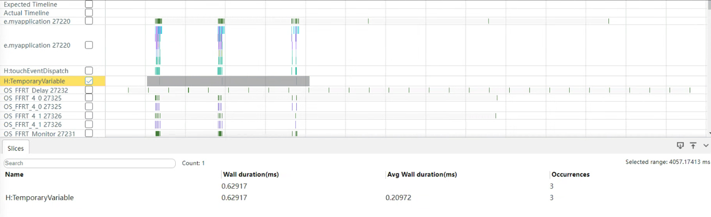

# Best Practices for State Management


This guide outlines best practices for state management in ArkUI applications. Read on to discover the common pitfalls in state management and how to avoid them, with carefully selected examples of recommended and not-recommended practices.

## Replacing @Prop with @ObjectLink to Minimize Unnecessary Deep Copy

When you need to pass values between parent and child components, choosing the right decorator can significantly improve application performance. If the value of a state variable is not changed in the child component, using @Prop to decorate the state variable will mean more time required in component creation.

[Incorrect Usage]

```ts
@Observed
class MyClass {
  public num: number = 0;

  constructor(num: number) {
    this.num = num;
  }
}

@Component
struct PropChild {
  @Prop testClass: MyClass; // @Prop makes a deep copy.

  build() {
    Text(`PropChild testNum ${this.testClass.num}`)
  }
}

@Entry
@Component
struct Parent {
  @State testClass: MyClass[] = [new MyClass(1)];

  build() {
    Column() {
      Text(`Parent testNum ${this.testClass[0].num}`)
        .onClick(() => {
          this.testClass[0].num += 1;
        })

      // PropChild does not change the value of @Prop testClass: MyClass. Therefore, @ObjectLink is a better choice.
      PropChild({ testClass: this.testClass[0] })
    }
  }
}
```

In the preceding example, the **PropChild** component does not change the value of **\@Prop testClass: MyClass**. In this case, \@ObjectLink is a better choice, because \@Prop makes a deep copy and increases performance overhead.

[Correct Usage]

```ts
@Observed
class MyClass {
  public num: number = 0;

  constructor(num: number) {
    this.num = num;
  }
}

@Component
struct PropChild {
  @ObjectLink testClass: MyClass; // @ObjectLink does not make a deep copy.

  build() {
    Text(`PropChild testNum ${this.testClass.num}`)
  }
}

@Entry
@Component
struct Parent {
  @State testClass: MyClass[] = [new MyClass(1)];

  build() {
    Column() {
      Text(`Parent testNum ${this.testClass[0].num}`)
        .onClick(() => {
          this.testClass[0].num += 1;
        })

      // When a child component does not need to be changed locally, @ObjectLink is preferred over @Prop, whose deep copy can result in an increase in overhead.
      PropChild({ testClass: this.testClass[0] })
    }
  }
}
```


## Avoiding Forcibly Updating Unassociated Components Through State Variables

[Incorrect Usage]


```ts
@Entry
@Component
struct MyComponent {
  @State needsUpdate: boolean = true;
  realStateArr: Array<number> = [4, 1, 3, 2]; // No state variable decorator is used.
  realState: Color = Color.Yellow;

  updateUIArr(param: Array<number>): Array<number> {
    const triggerAGet = this.needsUpdate;
    return param;
  }
  updateUI(param: Color): Color {
    const triggerAGet = this.needsUpdate;
    return param;
  }
  build() {
    Column({ space: 20 }) {
      ForEach(this.updateUIArr(this.realStateArr),
        (item: Array<number>) => {
          Text(`${item}`)
        })
      Text("add item")
        .onClick(() => {
          // Changing realStateArr does not trigger UI re-render.
          this.realStateArr.push(this.realStateArr[this.realStateArr.length-1] + 1);

          // Trigger the UI re-render.
          this.needsUpdate = !this.needsUpdate;
        })
      Text("chg color")
        .onClick(() => {
          // Changing realState does not trigger UI re-render.
          this.realState = this.realState == Color.Yellow ? Color.Red : Color.Yellow;

          // Trigger the UI re-render.
          this.needsUpdate = !this.needsUpdate;
        })
    }.backgroundColor(this.updateUI(this.realState))
    .width(200).height(500)
  }
}
```

The preceding example has the following pitfalls:

- The application wants to control the UI re-render logic, but in ArkUI, this logic should be implemented by the framework detecting changes to the application state variables.

- **this.needsUpdate** is a custom state variable that should be applied only to the UI component to which it is bound. Because **this.realStateArr** and **this.realState** are regular variables (not decorated), their changes do not trigger UI re-render.

- However, in this application, an attempt is made to update these two regular variables through **this.needsUpdate**. This approach is nonviable and may result in poor re-render performance.

[Correct Usage]

To address this issue, decorate the **realStateArr** and **realState** variables with \@State. Then, the variable **needsUpdate** is no longer required.


```ts
@Entry
@Component
struct CompA {
  @State realStateArr: Array<number> = [4, 1, 3, 2];
  @State realState: Color = Color.Yellow;
  build() {
    Column({ space: 20 }) {
      ForEach(this.realStateArr,
        (item: Array<number>) => {
          Text(`${item}`)
        })
      Text("add item")
        .onClick(() => {
          // Changing realStateArr triggers UI re-render.
          this.realStateArr.push(this.realStateArr[this.realStateArr.length-1] + 1);
        })
      Text("chg color")
        .onClick(() => {
          // Changing realState triggers UI re-render.
          this.realState = this.realState == Color.Yellow ? Color.Red : Color.Yellow;
        })
    }.backgroundColor(this.realState)
    .width(200).height(500)
  }
}
```

## Precisely Controlling the Number of Components Associated with State Variables

It is recommended that the number of components associated with each state variable be less than 20. When components are associated with a state variable, they are re-rendered when the state value changes. The more components associated, the more components re-rendered, and the heavier the UI thread load, which causes a drop in application performance. Things can get worse when the associated components are complex. Therefore, it is critical to precisely control the number of associated components. For example, instead of associating a state variable with multiple components at the same level, associating it with these components' parent can greatly reduce the number of components to be re-rendered, thereby improving UI responsiveness.

[Incorrect Usage]

```ts
@Observed
class Translate {
  translateX: number = 20;
}
@Component
struct Title {
  @ObjectLink translateObj: Translate;
  build() {
    Row() {
      // 'app.media.icon' is only an example. Replace it with the actual one in use. Otherwise, the imageSource instance fails to be created, and subsequent operations cannot be performed.
      Image($r('app.media.icon'))
        .width(50)
        .height(50)
        .translate({
          x:this.translateObj.translateX // this.translateObj.translateX is bound to the Image and Text components.
        })
      Text("Title")
        .fontSize(20)
        .translate({
          x: this.translateObj.translateX
        })
    }
  }
}
@Entry
@Component
struct Page {
  @State translateObj: Translate = new Translate();
  build() {
    Column() {
      Title({
        translateObj: this.translateObj
      })
      Stack() {
      }
      .backgroundColor("black")
      .width(200)
      .height(400)
      .translate({
        x:this.translateObj.translateX // this.translateObj.translateX is bound to the Stack and Button components.
      })
      Button("move")
        .translate({
          x:this.translateObj.translateX
        })
        .onClick(() => {
          animateTo({
            duration: 50
          },()=>{
            this.translateObj.translateX = (this.translateObj.translateX + 50) % 150
          })
        })
    }
  }
}
```

In the preceding example, the state variable **this.translateObj.translateX** is used in multiple child components at the same level. When it changes, all these associated components are re-rendered. Since the changes of these components are the same, you can associate the state variable with their parent component to reduce the number of components re-rendered. Analysis reveals that all these child components are located in the **Column** component under struct **Page**. Therefore, you can associate the **translate** attribute to the **Column** component instead.

[Correct Usage]

```ts
@Observed
class Translate {
  translateX: number = 20;
}
@Component
struct Title {
  build() {
    Row() {
      // 'app.media.icon' is only an example. Replace it with the actual one in use. Otherwise, the imageSource instance fails to be created, and subsequent operations cannot be performed.
      Image($r('app.media.icon'))
        .width(50)
        .height(50)
      Text("Title")
        .fontSize(20)
    }
  }
}
@Entry
@Component
struct Page1 {
  @State translateObj: Translate = new Translate();
  build() {
    Column() {
      Title()
      Stack() {
      }
      .backgroundColor("black")
      .width(200)
      .height(400)
      Button("move")
        .onClick(() => {
          animateTo({
            duration: 50
          },()=>{
            this.translateObj.translateX = (this.translateObj.translateX + 50) % 150
          })
        })
    }
    .translate({ // The same translate attribute is set for both the Stack and Button child components on the Column layer.
      x: this.translateObj.translateX
    })
  }
}
```

## Properly Controlling the Number of Components Associated with Object State Variables


When a complex object is defined as a state variable, take care to control the number of components associated with the object—a change to any property of the object will cause a re-render of these components, even when they do not directly use the changed property. To reduce redundant re-renders and help deliver a smooth experience, split the complex object as appropriate and control the number of components associated with the object.

## Querying the Number of Components Associated with a State Variable

During application development, you can use HiDumper to view the number of components associated with a state variable for performance optimization.


## Avoid Frequent Reads of State Variables in a Loop

Avoid frequent reads of state variables inside a loop, such as the **for** and **while** loop. A best practice is to read state variables outside a loop.

[Incorrect Usage]

```ts
import hilog from '@ohos.hilog';

@Entry
@Component
struct Index {
  @State message: string = '';

  build() {
    Column() {
      Button ('Print Log')
        .onClick(() => {
          for (let i = 0; i < 10; i++) {
            hilog.info(0x0000, 'TAG', '%{public}s', this.message);
          }
        })
        .width('90%')
        .backgroundColor(Color.Blue)
        .fontColor(Color.White)
        .margin({
          top: 10
        })
    }
    .justifyContent(FlexAlign.Start)
    .alignItems(HorizontalAlign.Center)
    .margin({
      top: 15
    })
  }
}
```

[Correct Usage]

```ts
import hilog from '@ohos.hilog';

@Entry
@Component
struct Index {
  @State message: string = '';

  build() {
    Column() {
      Button ('Print Log')
        .onClick(() => {
          let logMessage: string = this.message;
          for (let i = 0; i < 10; i++) {
            hilog.info(0x0000, 'TAG', '%{public}s', logMessage);
          }
        })
        .width('90%')
        .backgroundColor(Color.Blue)
        .fontColor(Color.White)
        .margin({
          top: 10
        })
    }
    .justifyContent(FlexAlign.Start)
    .alignItems(HorizontalAlign.Center)
    .margin({
      top: 15
    })
  }
}
```

## Using Temporary Variables instead of State Variables

During application development, you should reduce direct value changes to the state variables and compute data by using temporary variables.

When a state variable changes, ArkUI queries the components that require the use of state variables and executes an update method to render the components. However, by computing the temporary variables instead of directly changing the state variables, ArkUI can query and render components only when the last state variable changes, reducing unnecessary behaviors and improving application performance. For details about the behavior of state variables, see [@State Decorator: State Owned by Component](arkts-state.md).

[Incorrect Usage]

```ts
import { hiTraceMeter } from '@kit.PerformanceAnalysisKit';

@Entry
@Component
struct Index {
  @State message: string = '';

  appendMsg(newMsg: string) {
    // Performance Tracing
    hiTraceMeter.startTrace('StateVariable', 1);
    this.message += newMsg;
    this.message += ';';
    this.message += '<br/>';
    hiTraceMeter.finishTrace('StateVariable', 1);
  }

  build() {
    Column() {
      Button('Print Log')
        .onClick(() => {
          this.appendMsg('Change State Variables');
        })
        .width('90%')
        .backgroundColor(Color.Blue)
        .fontColor(Color.White)
        .margin({
          top: 10
        })
    }
    .justifyContent(FlexAlign.Start)
    .alignItems(HorizontalAlign.Center)
    .margin({
      top: 15
    })
  }
}
```

In this case, state variables are directly changed, triggering the computation for three times. The running duration is as follows.


[Correct Usage]

```ts
import { hiTraceMeter } from '@kit.PerformanceAnalysisKit';

@Entry
@Component
struct Index {
  @State message: string = '';

  appendMsg(newMsg: string) {
    // Performance Tracing
    hiTraceMeter.startTrace('TemporaryVariable', 2);
    let message = this.message;
    message += newMsg;
    message += ';';
    message += '<br/>';
    this.message = message;
    hiTraceMeter.finishTrace('TemporaryVariable', 2);
  }

  build() {
    Column() {
      Button('Print Log')
        .onClick(() => {
          this.appendMsg('Change Temporary Variables');
        })
        .width('90%')
        .backgroundColor(Color.Blue)
        .fontColor(Color.White)
        .margin({
          top: 10
        })
    }
    .justifyContent(FlexAlign.Start)
    .alignItems(HorizontalAlign.Center)
    .margin({
      top: 15
    })
  }
}
```

In this case, temporary variables are used instead of state variables, triggering the computation for three times. The running duration is as follows.



[Summary]
| **Computation Method**| **Time Required (for Reference Only)** | **Description**|
| ------ | ------- | ------------------------------------- |
| Changing state variables | 1.01 ms| Increases unnecessary query and rendering of ArkUI, causing poor performance.|
| Using temporary variables for computing | 0.63 ms| Streamlines ArkUI behaviors and improve application performance.|
