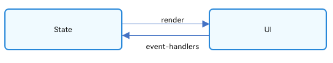
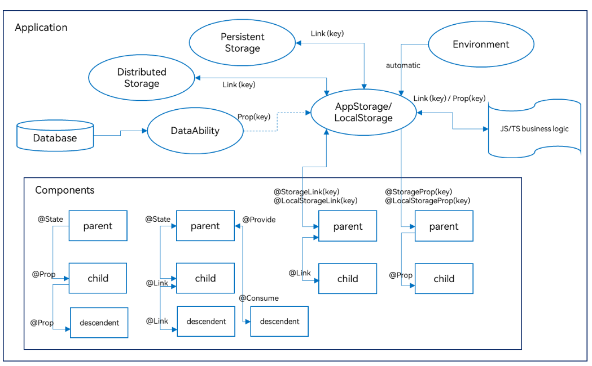
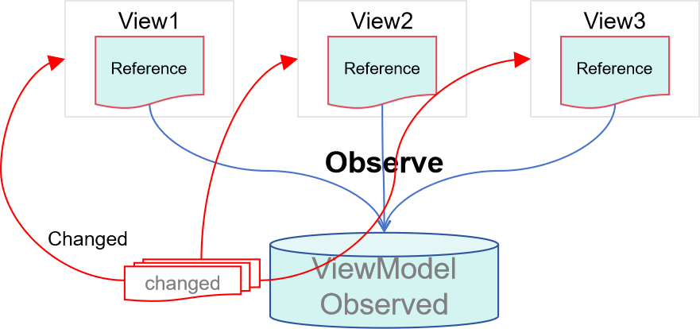

# State Management Overview
<!--Kit: ArkUI-->
<!--Subsystem: ArkUI-->
<!--Owner: @jiyujia926-->
<!--Designer: @s10021109-->
<!--Tester: @TerryTsao-->
<!--Adviser: @zhang_yixin13-->

In previous examples, most of the pages built are static pages, which are delivered to the end user without having to be processed. If you are building dynamic, interactive pages, you need to master state management.

  **Figure 1** State managed UI 


In the preceding example, the interaction between the user and the application triggers an update in the text state, which in turn triggers re-rendering of the UI. As a result, the **Hello World** text changes to **Hello ArkUI**.

In the declarative UI framework, the UI is the execution result of the application state. You build a UI model in which the application runtime state is a parameter. When the parameter is changed, the UI as the return result is updated accordingly. This state-driven UI re-rendering process is called the state management mechanism in ArkUI.

Custom components have variables. A variable must be decorated by a decorator whenever the re-rendering of the UI depends on this variable. Otherwise, the UI is rendered only at initialization and will not be updated. The following figure shows the relationship between the state and view (UI).



- View (UI): UI rendering, which is visual representation of the UI description in the **build** method and \@Builder decorated method.

- State: data that drives UI re-rendering. State data is changed through component event methods, which in turn causes the UI to re-render.

Before implementing state management, you need to understand the basic syntax of the UI paradigm. A review of the following topics would be helpful: [Basic Syntax Overview](./arkts-basic-syntax-overview.md), [Declarative UI Description](./arkts-declarative-ui-description.md), [Creating a Custom Component](./arkts-create-custom-components.md).

## Fundamental Concepts

- State variable: a variable decorated by a state decorator. Its value change will trigger UI re-renders. Example: @State num: number = 1, where @State is a state decorator and **num** is a state variable.

- Regular variable: a variable that is not decorated by a state decorator and is usually used for auxiliary calculation. Its value change will not trigger UI re-renders. In the following example, the **increaseBy** variable is a regular variable.

- Data source/Synchronization source: original source of a state variable, which can be synchronized to different state data. Generally, it is the data passed from the parent component to the child component. In the following example, the data source is **count: 1**.

- Named parameter mechanism: a mechanism where the parent component passes state variables to the child component by specifying parameters. It is the primary means of passing synchronization parameters from the parent component to the child component. Example: **CompA({ aProp: this.aProp })**.

- Initialization from the parent component: a process where the parent component uses the named parameter mechanism to pass specified parameters to the child component. The default value used in local initialization will be overwritten by the value passed from the parent component. Examples:

  ```ts
  @Component
  struct MyComponent {
    @State count: number = 0;
    private increaseBy: number = 1;

    build() {
    }
  }

  @Entry
  @Component
  struct Parent {
    build() {
      Column() {
        // Initialization from the parent component: The named parameter specified here will overwrite the default value defined locally.
        MyComponent({ count: 1, increaseBy: 2 })
      }
    }
  }
  ```

- Child component initialization: a capability to pass state variables to the child component to initialize the corresponding state variables therein. The example is the same as above.

- Local initialization: a process where a value is assigned to a variable as its default value in the variable declaration. Example: \@State count: number = 0.

>**NOTE**
>
>Currently, the state management can be used only in the UI main thread and cannot be used in child threads, Worker, or TaskPool.

## State Management Versions

ArkUI provides two versions of state management: V1 and V2.
1. V2 represents an enhanced iteration of V1, offering expanded functionality and increased flexibility through ongoing optimization.
2. For new applications, you are advised to adopt the V2 version directly.
3. For applications already using V1, there is no need to switch to V2 immediately if the features and performance of V1 already meet requirements.

## State Management V1

State management V1 provides a diverse range of decorators for applicaiton development.

### State Management V1 Decorators

ArkUI state management V1 provides a diverse array of decorators. You can use these decorators to observe state variables changes within a component or globally and pass the changes between different component levels (for example, between parent and child components or grandparent and grandchild components). According to the scope of the state variable, decorators can be roughly classified into the following types:

- Component-level decorators: manage state within a component tree (single page), observing variable changes inside individual components or across different component levels.

- Application-level decorators: manage global application state across different pages or even different UIAbilities.

By data flow patterns and synchronization types, decorators can be categorized into read-only (one-way data flow) and mutable (two-way synchronization).

The following figure illustrates the decorators. For details, see [Component State Management](arkts-state.md) and [Application State Management](arkts-application-state-management-overview.md). You can use these decorators to implement linkage between data and the UI.



In the preceding figure, the decorators in the **Components** area are used for component-level state management, while others are used for application-level state management. Specifically, you can use [@StorageLink](arkts-appstorage.md#storagelink) or [@LocalStorageLink](arkts-localstorage.md#localstoragelink) to implement two-way synchronization for the application and component state, and [@StorageProp](arkts-appstorage.md#storageprop) or [@LocalStorageProp](arkts-localstorage.md#localstorageprop) to implement one-way synchronization.

Decorators for [component-level state management](arkts-state.md):

- [\@State](arkts-state.md): An \@State decorated variable holds the state of the owning component. It can be the source of one- or two-way synchronization with child components. When the variable changes, the dependent component will be updated.

- [\@Prop](arkts-prop.md): An \@Prop decorated variable can create one-way synchronization with a variable of its parent component. \@Prop decorated variables are mutable, but changes are not synchronized to the parent component.

- [\@Link](arkts-link.md): An \@Link decorated variable creates two-way synchronization with a variable of its parent component. When the @Link decorated variable has its value changed, its source is updated as well; when the source updates, the @Link decorated variable will do as well.

- [\@Provide/\@Consume](arkts-provide-and-consume.md): Variables decorated by \@Provide/\@Consume are used for data synchronization across component levels. The components can be bound to the variables through aliases or property names. Data does not need to be passed through the named parameter mechanism.

- [\@Observed](arkts-observed-and-objectlink.md): \@Observed is a class decorator. You can use it to decorate the class that has multiple levels of nested objects or arrays to be observed. Note that \@Observed must be used with \@ObjectLink for two-way synchronization or with \@Prop for one-way synchronization.

- [\@ObjectLink](arkts-observed-and-objectlink.md): An \@ObjectLink decorated variable is used with an \@Observed decorated class of the parent component for two-way data synchronization. It is applicable in scenarios involving multiple levels of nested objects or arrays in the class.

> **NOTE**
>
> Only [\@Observed/\@ObjectLink](arkts-observed-and-objectlink.md) can be used to observe changes of nested properties. Other decorators can be used to observe top-level property changes. For details, see the "Observed Changes and Behavior" part in each decorator section.


Decorators for [application-level state management](arkts-application-state-management-overview.md):


- [AppStorage](arkts-appstorage.md): a special [LocalStorage](arkts-localstorage.md) singleton instance. It is an application-wide database bound to the application process and can be linked to components through the [@StorageProp](arkts-appstorage.md#storageprop) and [@StorageLink](arkts-appstorage.md#storagelink) decorators.

- AppStorage is the hub for application state. Data that needs to interact with components (UI) is stored in AppStorage, including [PersistentStorage](arkts-persiststorage.md) and [environment](arkts-environment.md) variables. The UI accesses the data through the decorators or APIs provided by AppStorage.

- LocalStorage: an in-memory "database" for the application state declared by the application and typically used to share state across pages. It can be linked to the UI through the [@LocalStorageProp](arkts-localstorage.md#localstorageprop) and [@LocalStorageLink](arkts-localstorage.md#localstoragelink) decorators.


### Other Features in State Management V1

[\@Watch decorator](arkts-watch.md): listens for the changes of state variables.


[$$ operator](arkts-two-way-sync.md): creates two-way binding between TypeScript variables and built-in component states.


## State Management V2

State management V2 builds on V1 by introducing new features, such as deep observation and property-level update.

### State Management V1 Limitations and V2 Enhancements

State management V1 uses a proxy-based observation mechanism, where a proxy wrapper is created for each state variable. This approach has inherent constraints:

- State variables cannot exist independently of the UI. Changes in one view are not automatically synchronized to other views sharing the same data.
- Only changes to top-level object properties can be detected; deep observation and listening are unsupported.
- Redundant re-renders exist in scenarios where nested object properties or array elements are changed.
- Decorator usage is restrictive. The input and output of state variables are not specified in components, complicating componentization design.


State management V2 adopts direct data observation, making the data itself observable. Changes to data automatically trigger view re-renders. Compared with state management V1, state management V2 offers the following advantages:

- State variables are independent of the UI. Data changes automatically trigger updates to associated views.

- Deep observation and listening of objects are supported, with no performance impact from the deep observation mechanism.

- Objects support property-level updates, and arrays support element-level updates.

- Decorators are more user-friendly and scalable. Components explicitly define inputs and outputs, simplifying componentization.



### State Management V2 Decorators

State management of V2 provides a new set of decorators.

- [\@ObservedV2](arkts-new-observedV2-and-trace.md): \@ObservedV2 allows for deep observation on the decorated classes. \@ObservedV2 and \@Trace are used in pairs to enable deep observation of properties in a class.

- [\@Trace](arkts-new-observedV2-and-trace.md): \@Trace is used to decorate a property in an \@ObservedV2 class, enabling the property to be observed.

- [\@ComponentV2](arkts-new-componentV2.md): In structs decorated by \@ComponentV2, the following decorators can be used: \@Local, \@Param, \@Event, \@Once, \@Monitor, \@Provider and \@Consumer.

- [\@Local](arkts-new-local.md): An \@Local decorated variable is internal state of the component and cannot be initialized externally.

- [\@Param](arkts-new-param.md): An \@Param decorated variable is used as the input of the component and can be initialized and synchronized externally.

- [\@Once](arkts-new-once.md): An \@Once decorated variable is synchronized only once during initialization and must be used together with \@Param.

- [\@Event](arkts-new-event.md): An \@Event decorated method, as component output, can be used to affect variables in the parent component.

- [\@Monitor](arkts-new-monitor.md): \@Monitor is used in custom components decorated with \@ComponentV2 or classes decorated with \@ObservedV2 to implement deep observation on state variables.

- [\@Provider and \@Consumer](arkts-new-Provider-and-Consumer.md): These decorators are used to implement two-way synchronization across component levels.

- [\@Computed](arkts-new-Computed.md): An \@Computed decorated method is a computed property, for which computation is performed only once when the value changes. It is mainly used to solve the performance problem caused by repeated computation when the UI reuses the property multiple times.

- [!! Syntax](arkts-new-binding.md): The **!!** syntax is syntax sugar used for two-way binding.

### Capability Comparison Between State Management V1 and V2

| V1 Capability  | V2 Capability                                            | Description                                                        |
| ------------ | ------------------------------------------------------ | ------------------------------------------------------------ |
| \@Observed   | \@ObservedV2                                           | Both mark an object as observable, but with key differences:<br>\@Observed is used to observe the top-level properties and requires \@ObjectLink to take effect.<br>\@ObservedV2 does not have the observation capability. It only marks a class as observable. To observe the class properties, use it together with \@Trace.|
| \@Track      | \@Trace                                                | \@Track enables precise observation and can be used independently of @Observed. without it, precise observation of class properties is unavailable.<br>\@Trace in V2 similarly enables precise tracking of decorated properties.|
| \@Component  | \@ComponentV2                                          | \@Component is the decorator for custom components in V1.<br>@ComponentV2 is the decorator for custom components in V2.|
| \@State      | \@Local (no external initialization)<br>\@Param and \@Once (one-time external initialization)| Both \@State and \@Local can work as data sources. The difference is that \@State can be initialized through external input, but \@Local cannot.|
| \@Prop       | \@Param                                                | \@Prop and \@Param both represent parameters for custom components. For complex input types, \@Prop uses deep copying, while \@Param uses references.|
| \@Link       | \@Param\@Event                                         | \@Link is a framework-encapsulated implementation of two-way synchronization. In V2, you can implement two-way synchronization manually using \@Param and \@Event.|
| \@ObjectLink            | \@Param                   | Compatible. \@ObjectLink requires initialization with an instance of the @Observed decorated class, while \@Param has no such constraint.|
| \@Provide    | \@Provider                                             | Compatible.                                                      |
| \@Consume    | \@Consumer                                             | Compatible.                                                      |
| \@Watch               | \@Monitor                | \@Watch is used to listen for the changes of state variables and their top-level properties in V1. Observable changes trigger \@Watch events.<br>\@Monitor is used to listen for the changes of state variables in V2. Used together with \@Trace, it enables deep listening. If a state variable changes multiple times in one event, the final result is used to determine whether to trigger the \@Monitor event.|
| LocalStorage               | Global \@ObservedV2 and \@Trace  | Compatible.|
| AppStorage               | AppStorageV2   | Compatible.|
| Environment       | Direct ability API calls  | **Environment** for obtaining environment variables is coupled with AppStorage. V2 removes AppStorage dependency, enabling direct ability API calls for obtaining environment variables.|
| PersistentStorage     | PersistenceV2   | PersistentStorage's persistence capability is coupled with AppStorage, while PersistenceV2 can be used independently.|
| Custom component lifecycle    | Custom component lifecycle  | Both are supported. Example: [aboutToAppear](../../reference/apis-arkui/arkui-ts/ts-custom-component-lifecycle.md#abouttoappear), [onDidBuild](../../reference/apis-arkui/arkui-ts/ts-custom-component-lifecycle.md#ondidbuild12), and [aboutToDisappear](../../reference/apis-arkui/arkui-ts/ts-custom-component-lifecycle.md#abouttodisappear)|
| Page lifecycle    | Page lifecycle  | Both are supported. Example: [onPageShow](../../reference/apis-arkui/arkui-ts/ts-custom-component-lifecycle.md#onpageshow), [onPageHide](../../reference/apis-arkui/arkui-ts/ts-custom-component-lifecycle.md#onpagehide), and [onBackPress](../../reference/apis-arkui/arkui-ts/ts-custom-component-lifecycle.md#onbackpress) |
| \@Reusable   | \@ReusableV2                                                 | Component reuse, including [aboutToReuse](../../reference/apis-arkui/arkui-ts/ts-custom-component-lifecycle.md#abouttoreuse10) and [aboutToRecycle](../../reference/apis-arkui/arkui-ts/ts-custom-component-lifecycle.md#abouttorecycle10)|
| $$            | !!         | Two-way binding. For V2, you are advised to use **!!** to implement a two-way binding.|
| \@CustomDialog | [openCustomDialog](../../../application-dev/reference/apis-arkui/arkts-apis-uicontext-promptaction.md#opencustomdialog12)  | Custom dialog box. For V2, you are advised to use **openCustomDialog** to implement a custom dialog box.|
| WithTheme     | WithTheme   | Theming, used to set custom theme styles for partial application pages, including [onWillApplyTheme](../../reference/apis-arkui/arkui-ts/ts-custom-component-lifecycle.md#onwillapplytheme12).<br>Since API version 18, this API is supported in V2 components.|
| Built-in UI component library    | Built-in UI component library   | Built-in UI component libraries for their respective state management versions. Built-in UI components that work with V1 include the following: [Dialog](../../../application-dev/reference/apis-arkui/arkui-ts/ohos-arkui-advanced-Dialog.md), [ProgressButton](../../../application-dev/reference/apis-arkui/arkui-ts/ohos-arkui-advanced-ProgressButton.md), and [SegmentButton](../../../application-dev/reference/apis-arkui/arkui-ts/ohos-arkui-advanced-SegmentButton.md).<br>New V2-optimized components are available since API version 18, including [DialogV2](../../../application-dev/reference/apis-arkui/arkui-ts/ohos-arkui-advanced-DialogV2.md), [ProgressButtonV2](../../../application-dev/reference/apis-arkui/arkui-ts/ohos-arkui-advanced-ProgressButtonV2.md), and [SegmentButtonV2](../../../application-dev/reference/apis-arkui/arkui-ts/ohos-arkui-advanced-SegmentButtonV2.md).|
| animateTo | Partial support| When **animateTo** is used in V2, exceptions may occur under certain scenarios. For details, see [Using animationTo Failed in State Management V2](./arkts-new-local.md#using-animationto-failed-in-state-management-v2).|

For details about how to migrate applications from V1 to V2, see [Migrating Applications from V1 to V2](./arkts-v1-v2-migration.md).<br>For details about how to use decorators of V1 and V2 together, see [Mixing Use of Custom Components](./arkts-custom-component-mixed-scenarios.md).
<!--no_check-->