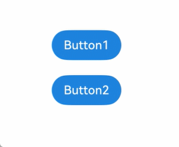

# stateStyles: Applying Polymorphic Styles

<!--Kit: ArkUI-->
<!--Subsystem: ArkUI-->
<!--Owner: @yihao-lin-->
<!--Designer: @piggyguy-->
<!--Tester: @songyanhong-->
<!--Adviser: @zhang_yixin13-->
<!-- md-trans-meta sourceCommit=c6d2a51ae0d4d741fa9801df0b2e84e58290f6c1 translatedAt=2026-07-24T01:21:35.328Z pushedAt=2026-07-24T03:22:43.813Z -->

Unlike \@Styles, which are used to reuse styles only on static pages, stateStyles enables you to set dynamic, state-specific styles. This topic explores the implementation of polymorphic styles through stateStyles.

> **NOTE**
>
> Polymorphic styles support only universal attributes. If a polymorphic style does not take effect, the attribute may be a private attribute of the component, such as [fontColor](../../reference/apis-arkui/arkui-ts/ts-basic-components-button.md#fontcolor) and the [backgroundColor](../../reference/apis-arkui/arkui-ts/ts-universal-attributes-background.md#backgroundcolor) attribute of the [TextInput](../../reference/apis-arkui/arkui-ts/ts-basic-components-textinput.md) component. In such cases, you can use [attributeModifier](../../reference/apis-arkui/arkui-ts/ts-universal-attributes-attribute-modifier.md#attributemodifier) to dynamically set component attributes as a workaround.

## Overview

stateStyles is an attribute method that sets the style based on the internal state of a component. It is similar to a CSS pseudo-class, with different syntax. ArkUI provides the following states:

- focused

- normal

- pressed

- disabled

- clicked

- selected<sup>10+</sup>

> **NOTE**
>
> Currently, the focused state can be triggered only by pressing the **Tab** or arrow keys on an external keyboard. Triggering through key presses in nested scrollable components is not supported.

## Use Scenarios

### Common Scenarios

The following example demonstrates the most basic usage of **stateStyles**. **Button1** is the first component, and **Button2** is the second. When pressed, a button is displayed in the gray color specified for the pressed state. When the **Tab** key is used to navigate focus, **Button1** gains focus and is displayed in the pink color specified for the **focused** state. When **Button2** gains focus, it is displayed in the pink color specified for the **focused** state, while **Button1** loses focus and is displayed in the blue color specified for the **normal** state.

<!-- @[state_style](https://gitcode.com/openharmony/applications_app_samples/blob/master/code/DocsSample/ArkUISample/StateStyle/entry/src/main/ets/pages/StateStyle/StateStylesSample.ets) -->

``` TypeScript
@Entry
@Component
struct StateStylesSample {
  build() {
    Column() {
      Button('Button1')
        .stateStyles({
          focused: {
            .backgroundColor('#ffffeef0')
          },
          pressed: {
            .backgroundColor('#ff707070')
          },
          normal: {
            .backgroundColor('#ff2787d9')
          }
        })
        .margin(20)
      Button('Button2')
        .stateStyles({
          focused: {
            .backgroundColor('#ffffeef0')
          },
          pressed: {
            .backgroundColor('#ff707070')
          },
          normal: {
            .backgroundColor('#ff2787d9')
          }
        })
    }.margin('30%')
  }
}
```

  **Figure 1** Focused and pressed states 



### Combined Use of \@Styles and stateStyles

The following example uses \@Styles to specify different states of stateStyles.

<!-- @[normal_style](https://gitcode.com/openharmony/applications_app_samples/blob/master/code/DocsSample/ArkUISample/StateStyle/entry/src/main/ets/pages/NormalStyle/MyComponent.ets) -->

``` TypeScript
@Entry
@Component
struct MyComponent {
  @Styles normalStyle() {
    .backgroundColor(Color.Gray)
  }

  @Styles pressedStyle() {
    .backgroundColor(Color.Red)
  }
  build() {
    Column() {
      Text('Text1')
        .fontSize(50)
        .fontColor(Color.White)
        .stateStyles({
          normal: this.normalStyle,
          pressed: this.pressedStyle,
        })
    }
  }
}
```

  **Figure 2** Normal and pressed states 


### Using Regular Variables and State Variables in stateStyles

stateStyles can use **this** to bind regular variables and state variables in a component.

<!-- @[focus_style](https://gitcode.com/openharmony/applications_app_samples/blob/master/code/DocsSample/ArkUISample/StateStyle/entry/src/main/ets/pages/FocusStyle/CompWithInlineStateStyles.ets) -->

``` TypeScript
@Entry
@Component
struct CompWithInlineStateStyles {
  @State focusedColor: Color = 0xD5D5D5;
  normalColor: Color = 0x004AAF;

  build() {
    Column() {
      Button('clickMe')
        .height(100)
        .width(100)
        .stateStyles({
          normal: {
            .backgroundColor(this.normalColor)
          },
          focused: {
            .backgroundColor(this.focusedColor)
          }
        })
        .onClick(() => {
          this.focusedColor = 0x707070;
        })
        .margin('30%')
    }
  }
}
```

By default, the button is displayed in blue in the normal state. When you press the **Tab** key for the first time, the button obtains focus and is displayed in the light gray style specified for **focused**. After a click event occurs and you press the **Tab** key again, the button obtains focus and changes to dark gray.

  **Figure 3** Change of the styles in focused state by a click 

