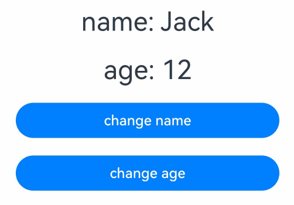
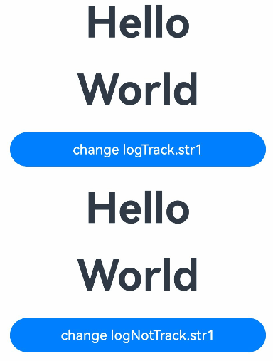

# \@Track Decorator: Implementing Class Object Property-Level Updates

<!--Kit: ArkUI-->
<!--Subsystem: ArkUI-->
<!--Owner: @jiyujia926-->
<!--Designer: @zhangboren-->
<!--Tester: @TerryTsao-->
<!--Adviser: @zhang_yixin13-->
<!-- md-trans-meta sourceCommit=c6d2a51ae0d4d741fa9801df0b2e84e58290f6c1 translatedAt=2026-07-24T01:21:41.137Z pushedAt=2026-07-24T03:22:49.079Z -->

[@Track](../../reference/apis-arkui/arkui-ts/ts-state-management-track.md#track) is used for property-level updates of class objects. When a property decorated with @Track changes, only the UI update associated with this property is triggered.

Before reading this topic, you are advised to read [\@State](./arkts-state.md) to have an understanding of the basic observation capabilities of state management.

> **NOTE**
>
> This decorator is supported in ArkTS widgets since API version 11.
>
> This decorator can be used in atomic services since API version 12.

## Overview

\@Track enables property-level update for the class object. When a class object is a state variable, the change of the \@Track decorated property triggers only the update of the property associated UI. If the class uses the \@Track decorator, do not use properties that are not decorated with \@Track in the UI. Otherwise, a runtime error will be reported.

## Class Property-Level Update

In state management V1, decorators such as \@State support observation of the changes of first-layer properties by default. Although the changes of first-layer properties can trigger updates, observation at the class property level cannot be implemented. The following example shows such a restriction:

<!-- @[Index_start](https://gitcode.com/openharmony/applications_app_samples/blob/master/code/DocsSample/ArkUISample/StateTrack/entry/src/main/ets/pages/stateTrack/StateTrackClass.ets) --> 

``` TypeScript
import { hilog } from '@kit.PerformanceAnalysisKit';
const DOMAIN_NUMBER: number = 0XFF00;
const TAG: string = '[Sample_StateTrack]';
class Info {
  public name: string = 'Jack';
  public age: number = 12;
}

@Entry
@Component
struct Index {
  @State info: Info = new Info();

  // Use the log printing of getFontSize to determine which component triggers rendering.
  getFontSize(id: number): number {
    hilog.info(DOMAIN_NUMBER, TAG, `Component ${id} render`);
    return 30;
  }

  build() {
    Column() {
      Text(`name: ${this.info.name}`)
        .fontSize(this.getFontSize(1))
        .margin(10)
      Text(`age: ${this.info.age}`)
        .fontSize(this.getFontSize(2))
        .margin(10)

      // Click the current button. You can find that only the name property is changed.
      // However, the refresh of two Text components is still triggered.
      // Text(`age: ${this.info.age}`) is a redundant refresh.
      Button('change name')
        .width(300)
        .margin(10)
        .onClick(() => {
          this.info.name = 'Jane';
        })

      // Click the current button. You can find that only the age property is changed.
      // However, the refresh of two Text components is still triggered.
      // Text(`name: ${this.info.name}`) is a redundant refresh.
      Button('change age')
        .width(300)
        .margin(10)
        .onClick(() => {
          this.info.age++;
        })
    }
    .height('100%')
    .width('100%')
  }
}
```



> **NOTE**
>
> When the UI is refreshed, the property setting method of the component is executed. You can check whether the **getFontSize** API is called to determine whether the current component is refreshed.

- After the first UI rendering is complete, the following log is displayed:

  ```text
  Component 1 render
  Component 2 render
  ```

- When you click **Button('change name')**, the two **Text** components are still re-rendered even if only **info.name** is modified. The **Text(`age: ${this.info.age}`)** component does not use the **name** property, but is still refreshed because the **info.name** property is changed. Therefore, this refresh is redundant. The output logs are as follows:

  ```text
  Component 1 render
  Component 2 render
  ```

- Similarly, when you click **Button('change age')**, **Text(`name: ${this.info.name}`)** is also refreshed. The output logs are as follows:

  ```text
  Component 1 render
  Component 2 render
  ```

The root cause of the preceding redundant refresh is that the \@State decorator in state management V1 cannot accurately observe the access and change of class properties. To observe class object properties accurately, the \@Track decorator is introduced.

## Decorator Description

| \@Track Decorator | Description                 |
| ------------------ | -------------------- |
| Decorator parameters  | None|
| Allowed variable types| Non-static properties of class objects. \@Track does not support observing changes in data of the function type. If the data of the function type decorated with \@Track is modified, the UI is not refreshed accordingly.|

## Observed Changes and Behavior

When a class object is a state variable, any changes to its properties decorated with \@Track will trigger only updates to the UI associated with those properties.

> **NOTE**
>
> When no property in the class object is decorated with \@Track, the behavior remains unchanged. \@Track is unable to observe changes of nested objects.

Using the \@Track decorator can avoid redundant updates.

<!-- @[AddLog_start](https://gitcode.com/openharmony/applications_app_samples/blob/master/code/DocsSample/ArkUISample/StateTrack/entry/src/main/ets/pages/stateTrack/StateTrackClass2.ets) --> 

``` TypeScript
import { hilog } from '@kit.PerformanceAnalysisKit';
const DOMAIN_NUMBER: number = 0XFF00;
const TAG: string = '[Sample_StateTrack]';

class LogTrack {
  @Track public str1: string;
  @Track public str2: string;

  constructor(str1: string) {
    this.str1 = str1;
    this.str2 = 'World';
  }
}

class LogNotTrack {
  public str1: string;
  public str2: string;

  constructor(str1: string) {
    this.str1 = str1;
    this.str2 = 'World';
  }
}

@Entry
@Component
struct AddLog {
  @State logTrack: LogTrack = new LogTrack('Hello');
  @State logNotTrack: LogNotTrack = new LogNotTrack('Hello');

  isRender(index: number): number {
    hilog.info(DOMAIN_NUMBER, TAG, `Text ${index} is rendered`);
    return 50;
  }

  build() {
    Row() {
      Column() {
        Text(this.logTrack.str1) // Text1
          .id('str1')
          .fontSize(this.isRender(1))
          .fontWeight(FontWeight.Bold)
          .margin(10)
        Text(this.logTrack.str2) // Text2
          .fontSize(this.isRender(2))
          .fontWeight(FontWeight.Bold)
          .margin(10)
        Button('change logTrack.str1')
          .id('str2')
          .width(300)
          .margin(10)
          .onClick(() => {
            this.logTrack.str1 = 'Bye';
          })
        Text(this.logNotTrack.str1) // Text3
          .fontSize(this.isRender(3))
          .fontWeight(FontWeight.Bold)
          .margin(10)
        Text(this.logNotTrack.str2) // Text4
          .fontSize(this.isRender(4))
          .fontWeight(FontWeight.Bold)
          .margin(10)
        Button('change logNotTrack.str1')
          .width(300)
          .margin(10)
          .onClick(() => {
            this.logNotTrack.str1 = 'Bye';
          })
      }
      .width('100%')
    }
    .height('100%')
  }
}
```



In the preceding example:

1. All properties in the **LogTrack** class are decorated with \@Track. After the **change logTrack.str1** button is clicked, **Text1** is updated, but **Text2** is not, as only one log record is generated.

    ```ts
    Text 1 is rendered
    ```

2. None of the properties in the **LogNotTrack** class are decorated with the @Track decorator. When the button **change logNotTrack.str1** is clicked, both **Text3** and **Text4** are refreshed, generating two log entries and resulting in redundant updates.

    ```ts
    Text 3 is rendered
    Text 4 is rendered
    ```

## Constraints

- If the \@Track decorator is used in a class, the properties that are not decorated with the \@Track decorator in the class cannot be used in the \@Component decorated UI. For example, these properties cannot be bound to components or used to initialize child components. If the properties are incorrectly used, an error is reported during runtime. To be specific, since API version 23, error code [140110](../../reference/apis-arkui/errorcode-stateManagement.md#140110-using-non-track-decorated-properties-in-the-ui-causes-errors) is returned. For details, see [Improperly Using Non-\@Track Decorated Properties Causes Errors](#improperly-using-non-track-decorated-properties-causes-errors). You can use a non-\@Track decorated property in non-UI functions, such as event callbacks and lifecycle callbacks.

- Since API version 19, \@Track is used in the [\@ComponentV2](./arkts-create-custom-components.md#componentv2) decorated UI. In this case, no runtime error is reported, but the UI still does not refresh. For details, see [\@Observed+\@Track Decorated Class (V1->V2)](./arkts-v1-v2-mixusage.md#transferring-the-class-type-v1-v2) and [@Observed+\@Track Decorated Class (V2->V1)](./arkts-v1-v2-mixusage.md#transferring-the-class-type-v2-v1).

- Whenever possible, avoid any combination of class objects that contain \@Track and those that do not in, for example, union types and class inheritance. Otherwise, non-\@Track-decorated attributes may be misused in the UI, causing a runtime error.

## Scenario

### \@Track and Custom Component Updates

This example is used to clarify the processing steps of custom component updates and \@Track. The **log** object is a state variable decorated with \@State. Its **logInfo** property is decorated with \@Track, but other properties are not, and the values of these other properties are not updated through the UI.

<!-- @[addLog3_start](https://gitcode.com/openharmony/applications_app_samples/blob/master/code/DocsSample/ArkUISample/StateTrack/entry/src/main/ets/pages/stateTrack/StateTrackClass3.ets) --> 

``` TypeScript
import { hilog } from '@kit.PerformanceAnalysisKit';
const DOMAIN_NUMBER: number = 0XFF00;
const TAG: string = '[Sample_StateTrack]';
class Log {
  @Track public logInfo: string;
  public owner: string;
  public id: number;
  public time: Date;
  public location: string;
  public reason: string;

  constructor(logInfo: string) {
    this.logInfo = logInfo;
    this.owner = 'OH';
    this.id = 0;
    this.time = new Date();
    this.location = 'CN';
    this.reason = 'NULL';
  }
}

@Entry
@Component
struct AddLog {
  @State log: Log = new Log('origin info.');

  build() {
    Row() {
      Column() {
        Text(this.log.logInfo)
          .fontSize(50)
          .fontWeight(FontWeight.Bold)
          .onClick(() => {
            // Properties that are not decorated with @Track can be used in click events.
            hilog.info(DOMAIN_NUMBER, TAG, 'owner: ' + this.log.owner +
              ' id: ' + this.log.id +
              ' time: ' + this.log.time +
              ' location: ' + this.log.location +
              ' reason: ' + this.log.reason);
            this.log.time = new Date();
            this.log.id++;
            this.log.logInfo += ' info.';
          })
      }
      .width('100%')
    }
    .height('100%')
  }
}
```


Procedure:

1. The click event **Text.onClick** of the **AddLog** custom component increases the value of **'info.'**.

2. The **Text** component is re-rendered because the \@Track decorated property **logInfo** of \@State decorated variable **log** is changed.

## FAQs

### Improperly Using Non-\@Track Decorated Properties Causes Errors

If a non-\@Track decorated property is used in the UI, an error (error code 140110 since API version 23) is reported during runtime. You need to decorate **age** with \@Track.

```ts
class Person {
  // id is decorated with @Track.
  @Track id: number;
  // age is not decorated with @Track.
  age: number;

  constructor(id: number, age: number) {
    this.id = id;
    this.age = age;
  }
}

@Entry
@Component
struct Parent {
  @State parent: Person = new Person(2, 30);

  build() {
    // Property that is not decorated by @Track cannot be used in the UI. Otherwise, an error is reported during runtime.
    Text(`Parent id is: ${this.parent.id} and Parent age is: ${this.parent.age}`)
      .fontSize(20)
      .margin(10)
  }
}
```