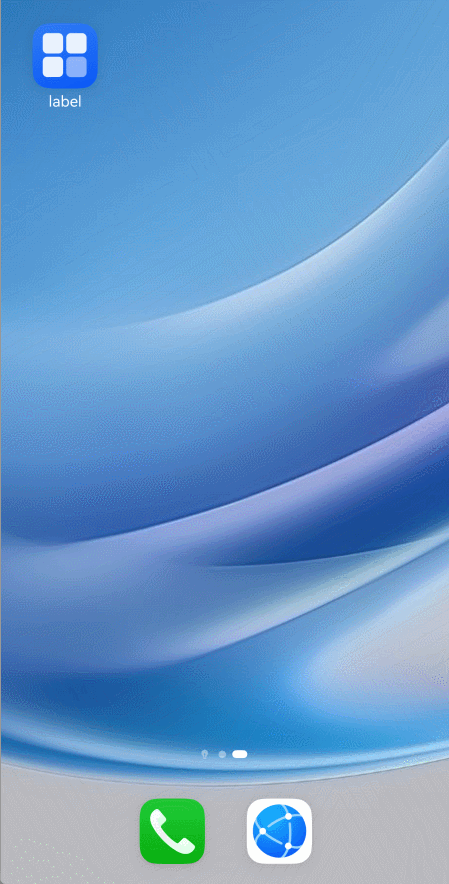

# Widget State Variable Migration
<!--Kit: ArkUI-->
<!--Subsystem: ArkUI-->
<!--Owner: @jiyujia926-->
<!--Designer: @zhangboren-->
<!--Tester: @TerryTsao-->
<!--Adviser: @zhang_yixin13-->
<!-- md-trans-meta sourceCommit=c6d2a51ae0d4d741fa9801df0b2e84e58290f6c1 translatedAt=2026-07-24T01:23:30.807Z pushedAt=2026-07-24T03:22:53.703Z -->

Starting from API version 23, ArkTS widgets support development with state management V2. You are advised to use <a href="./arkts-state-management-overview.md#decorator-overview-1">V2 decorators</a> instead of <a href="./arkts-state-management-overview.md#decorator-overview">V1 decorators</a> for state management, to achieve better component rendering performance and state synchronization capabilities.

The state management migration for widgets is largely consistent with that for common app pages. For migration of general scenarios such as intra-component and data object state variables, see [Migration for Component State Variables](./arkts-v1-v2-migration-inner-component.md) and [Migration for Data Object State Variables](./arkts-v1-v2-migration-inner-class.md). This document only describes the differences specific to widgets, namely the data receiving mechanism between the widget provider and the widget UI.

The following table compares the scenarios:

| Widget Scenario | V1 Decorator | V2 Decorator |
| -------- | -------- | -------- |
| Widget entry component | [@Component](./arkts-create-custom-components.md#component) | [@ComponentV2](./arkts-create-custom-components.md#componentv2) |
| Receiving refresh data from the widget provider | [@LocalStorageProp](./arkts-localstorage.md#localstorageprop) | [@Local](./arkts-new-local.md), [@Provider](./arkts-new-provider-and-consumer.md), etc. |
| Widget internal state variable | [@State](./arkts-state.md) | [@Local](./arkts-new-local.md) |
| Nested data object | [@Observed](./arkts-observed-and-objectlink.md)/[@ObjectLink](./arkts-observed-and-objectlink.md) | [@ObservedV2](./arkts-new-observedV2-and-trace.md)/[@Trace](./arkts-new-observedV2-and-trace.md) |


## Differences in Widget Data Receiving Mechanism

The widget UI (widget page) runs in the system's widget rendering service process and is independent of the widget provider app (**FormExtensionAbility**). Data interaction between the two can only be achieved through the [updateForm](../../reference/apis-form-kit/js-apis-app-form-formProvider.md#formproviderupdateform) API. The widget provider calls **updateForm** to push data, and the widget UI refreshes after receiving the data.

The core difference between V1 and V2 in data receiving lies in the matching rules:

- V1: The widget UI receives refresh data through [\@LocalStorageProp](./arkts-localstorage.md#localstorageprop). The matching is based on the key parameter of the \@LocalStorageProp decorator, meaning `@LocalStorageProp('title')` matches the field with the key `'title'` in the **updateForm** data. The widget entry component must use `@Entry(storage)` to pass in a **LocalStorage** instance.
- V2: The widget UI supports directly receiving refresh data through notifiable state decorators such as \@Local and \@Provider. The matching is based on the variable name, meaning `@Local title` matches the field with the key `'title'` in the **updateForm** data. The widget entry component only needs to use `@Entry`, without passing in a **LocalStorage** instance.

## Constraints

- Widgets support only some components, events, animations, data management, and state management capabilities of the [ArkTS declarative development paradigm](../../form/arkts-ui-widget-page-overview.md). During development, pay attention to whether a related API is marked with "widget capability" (for example, starting from API version 12, this API is supported in ArkTS widgets).

- The V2 decorators supported by widgets are subject to the "widget capability" annotation of the API. If a V2 API is not marked as supported in ArkTS widgets, it is unavailable in widgets.

- After the widget entry component is migrated to [\@ComponentV2](./arkts-create-custom-components.md#componentv2), \@ComponentV2 does not support **LocalStorage**-related capabilities. In the widget scenario, **updateForm** refresh data can be directly notified to V2 state decorators such as \@Local and \@Provider by variable name, so the widget entry component no longer needs to use **LocalStorage**.

- For more widget development constraints, see [ArkTS Widget Overview](../../form/arkts-form-overview.md#constraints).


## Widget Data Reception Migration

**Migration rules:**

- The entry component is migrated from `@Entry(storage) @Component` to `@Entry @ComponentV2`, eliminating the need to create and pass in a LocalStorage instance.
- \@LocalStorageProp is migrated to V2 state decorators such as \@Local (for intra-component use) or \@Provider (for cross-component sharing) as needed.
- During migration, ensure that the variable names of V2 decorators match the key values pushed by the widget provider's `updateForm` data. If the **key** parameter of \@LocalStorageProp in the original V1 code differs from the variable name, unify them to the same name during migration.
- The **updateForm** call logic of the widget provider's **FormExtensionAbility** does not need to be modified.

Take the active widget refresh scenario as an example: The widget displays a title and details. After the user taps the refresh button, a message event is triggered through [postCardAction](../../reference/apis-arkui/js-apis-postCardAction.md#postcardaction-1). In the [onFormEvent](../../reference/apis-form-kit/js-apis-app-form-formExtensionAbility.md#formextensionabilityonformevent) callback, **FormExtensionAbility** calls **updateForm** to refresh the widget data.

**V1 implementation code**:

The widget entry component uses `@Entry(storage)` to pass in LocalStorage, and receives the refresh data through `@LocalStorageProp('title')` and `@LocalStorageProp('detail')`, with matching based on the decorator's input key value.

<!-- @[CardMigrationV1](https://gitcode.com/openharmony/applications_app_samples/blob/master/code/DocsSample/ArkUISample/StateMigrationProject/entry/src/main/ets/widget/pages/WidgetCardV1.ets) -->

``` TypeScript
// Create a LocalStorage instance to pass refresh data between the widget entry component and the card provider.
let storage = new LocalStorage();

// Pass in a LocalStorage instance through @Entry for the V1 widget entry component to receive data pushed by the widget provider's updateForm.
@Entry(storage)
@Component
struct WidgetCardV1 {
  // Match the corresponding fields in the updateForm data through the input key value of @LocalStorageProp.
  // The input parameter key 'title' here matches the field with the key 'title' in the updateForm data.
  @LocalStorageProp('title') title: string = 'Default title';
  @LocalStorageProp('detail') detail: string = 'Default detail';

  build() {
    Column() {
      Column() {
        Text(this.title)
          .fontSize(14)
          .margin({ top: '8%', left: '10%' })
        Text(this.detail)
          .fontSize(12)
          .margin({ top: '5%', left: '10%' })
      }
      .width('100%')
      .height('50%')
      .alignItems(HorizontalAlign.Start)

      Button('update')
        .margin({ top: '15%' })
        .onClick(() => {
          // Tap the button to trigger a message event through postCardAction.
          // This event is received by the onFormEvent callback of the card provider FormExtensionAbility.
          postCardAction(this, {
            'action': 'message',
            'params': { 'msgTest': 'messageEvent' }
          });
        })
    }
    .width('100%')
    .height('100%')
  }
}
```

**Migration from V1 to V2:**

The entry component is migrated to `@Entry @ComponentV2`, and the creation and passing of the LocalStorage instance are removed. @LocalStorageProp is migrated to @Local, with the variable names `title` and `detail` kept consistent with the keys of the data pushed by updateForm. Based on this, the system directly notifies the corresponding decorators of the refresh data.

<!-- @[CardMigrationV2](https://gitcode.com/openharmony/applications_app_samples/blob/master/code/DocsSample/ArkUISample/StateMigrationProject/entry/src/main/ets/widget/pages/WidgetCard.ets) -->

``` TypeScript
// After migration to V2, the entry component uses @ComponentV2 and no longer requires passing in a LocalStorage instance.
@Entry
@ComponentV2
struct WidgetCard {
  // Migrate @LocalStorageProp to @Local. The system now matches updateForm data by variable name.
  // The variable name here is **title**, which will match the field with the key **'title'** in the updateForm data.
  @Local title: string = 'Default title';
  @Local detail: string = 'Default detail';

  build() {
    Column() {
      Column() {
        Text(this.title)
          .fontSize(14)
          .margin({ top: '8%', left: '10%' })
        Text(this.detail)
          .fontSize(12)
          .margin({ top: '5%', left: '10%' })
      }
      .width('100%')
      .height('50%')
      .alignItems(HorizontalAlign.Start)

      Button('update')
        .margin({ top: '15%' })
        .onClick(() => {
          // Tap the button to trigger the **message** event through postCardAction.
          // This event will be received by the **onFormEvent** callback of the widget provider FormExtensionAbility.
          postCardAction(this, {
            'action': 'message',
            'params': { 'msgTest': 'messageEvent' }
          });
        })
    }
    .width('100%')
    .height('100%')
  }
}
```

The implementation of the widget provider FormExtensionAbility does not need to be modified. The data keys pushed by **updateForm** only need to be consistent with the variable names in the V2 widget for the mechanism to take effect.

<!-- @[CardMigrationFormAbility](https://gitcode.com/openharmony/applications_app_samples/blob/master/code/DocsSample/ArkUISample/StateMigrationProject/entry/src/main/ets/entryformability/EntryFormAbility.ets) -->

``` TypeScript
// After the form provider receives the message event triggered by the widget page's postCardAction, process the refresh logic in this callback.
onFormEvent(formId: string, message: string) {
  class FormDataClass {
    // Keep the variable name consistent with the variable name that receives data in the card page.
    // The widget UI side (V2) matches these fields by variable name, while V1 matches them by the key parameter of @LocalStorageProp.
    title: string = 'Title Update.';
    detail: string = 'Description update success.';
  }

  let formData = new FormDataClass();
  // Encapsulate the service data into the FormBindingData format recognizable by the widget.
  let formInfo: formBindingData.FormBindingData = formBindingData.createFormBindingData(formData);
  // Call updateForm to push the refresh data to the specified widget (formId). The widget UI automatically refreshes the interface upon receiving the data.
  formProvider.updateForm(formId, formInfo).then(() => {
    hilog.info(DOMAIN_NUMBER, TAG, 'FormAbility updateForm success.');
  }).catch((error: BusinessError) => {
    hilog.error(DOMAIN_NUMBER, TAG, `Operation updateForm failed. Cause: ${JSON.stringify(error)}`);
  });
}
```



## Cross-Component Widget Data Sharing Migration

**Migration rules:**

In V1, multiple widget components can share data by reading the same LocalStorage through their respective @LocalStorageProp decorators. After migrating to V2, the widget entry component can use @Provider to receive refresh data, and child components automatically synchronize via @Consumer, eliminating the need for **LocalStorage**.

In the following example, the `detail` variable needs to be shared across components.

**V1 implementation code**:

Both the entry component and child components read the same data in **LocalStorage** through @LocalStorageProp to achieve sharing.

<!-- @[CardMigrationShareV1](https://gitcode.com/openharmony/applications_app_samples/blob/master/code/DocsSample/ArkUISample/StateMigrationProject/entry/src/main/ets/sharewidget/pages/ShareWidgetCardV1.ets) -->

``` TypeScript
// Create a LocalStorage instance for transferring shared data among the widget entry component, child components, and the widget provider.
let storage = new LocalStorage();

// The V1 widget entry component must pass in a LocalStorage instance via @Entry.
@Entry(storage)
@Component
struct ShareWidgetCardV1 {
  // Use the key parameter of @LocalStorageProp to match updateForm data.
  @LocalStorageProp('title') title: string = 'Default title';
  @LocalStorageProp('detail') detail: string = 'Default detail';

  build() {
    Column() {
      Column() {
        Text(this.title)
          .fontSize(14)
          .margin({ top: '8%', left: '10%' })
        Text(this.detail)
          .fontSize(12)
          .margin({ top: '5%', left: '10%' })
        // Reference the child component, which internally reads the shared data from the same LocalStorage through @LocalStorageProp with the same key.
        ChildComp1()
      }
      .width('100%')
      .height('50%')
      .alignItems(HorizontalAlign.Start)

      Button('update')
        .margin({ top: '15%' })
        .onClick(() => {
          // Tap the button to trigger a message event via postCardAction, which is then handled by the widget provider for refresh.
          postCardAction(this, {
            'action': 'message',
            'params': { 'msgTest': 'messageEvent' }
          });
        })
    }
    .width('100%')
    .height('100%')
  }
}

@Component
struct ChildComp1 {
  // The child component also reads shared data from LocalStorage via @LocalStorageProp.
  // The input parameter key is 'detail', which must be consistent with that in the entry component to read the same data.
  @LocalStorageProp('detail') detail: string = 'Default detail';

  build() {
    Text(this.detail)
      .fontSize(12)
      .margin({ top: '3%', left: '10%' })
  }
}
```

**Migration from V1 to V2:**

Remove **LocalStorage** from the entry component. Migrate `title`, which is used only within the component, to @Local. Migrate `detail`, which needs to be shared across components, to @Provider, and have the child component synchronize data via @Consumer. The key for data pushed by **updateForm** is `detail`, which matches the variable name of @Provider. After data is updated, it is automatically synchronized to the child component via [@Provider](./arkts-new-provider-and-consumer.md)/[@Consumer](./arkts-new-provider-and-consumer.md).

<!-- @[CardMigrationShareV2](https://gitcode.com/openharmony/applications_app_samples/blob/master/code/DocsSample/ArkUISample/StateMigrationProject/entry/src/main/ets/sharewidget/pages/ShareWidgetCard.ets) -->

``` TypeScript
// After V2 migration, the entry component uses @ComponentV2 and no longer needs to pass in a LocalStorage instance.
@Entry
@ComponentV2
struct ShareWidgetCard {
  // Variables used only within the component are migrated to @Local.
  @Local title: string = 'Default title';
  // Variables that need to be shared across components are migrated to @Provider. The system matches updateForm data by variable name.
  // After updateForm pushes data with the key 'detail', the @Provider here is automatically updated and synchronized to @Consumer in descendant components.
  @Provider() detail: string = 'Default detail';

  build() {
    Column() {
      Column() {
        Text(this.title)
          .fontSize(14)
          .margin({ top: '8%', left: '10%' })
        Text(this.detail)
          .fontSize(12)
          .margin({ top: '5%', left: '10%' })
        // Reference the child component, which automatically synchronizes the detail data provided by the parent component's @Provider through @Consumer.
        ChildComp()
      }
      .width('100%')
      .height('50%')
      .alignItems(HorizontalAlign.Start)

      Button('update')
        .margin({ top: '15%' })
        .onClick(() => {
          // Tap the button to trigger the message event through postCardAction, which is handled by the form provider for refresh.
          postCardAction(this, {
            'action': 'message',
            'params': { 'msgTest': 'messageEvent' }
          });
        })
    }
    .width('100%')
    .height('100%')
  }
}

@ComponentV2
struct ChildComp {
  // Child components synchronize data provided by @Provider through @Consumer.
  // @Consumer automatically establishes a connection with the @Provider of the same variable name in the ancestor component, without the need for manual parameter passing.
  @Consumer() detail: string = 'Default detail for Consumer';

  build() {
    Text(this.detail)
      .fontSize(12)
      .margin({ top: '3%', left: '10%' })
  }
}
```

