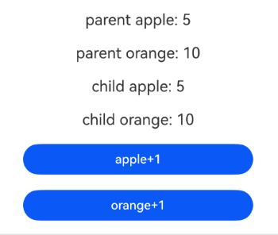
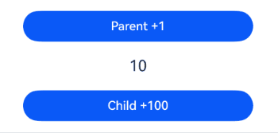
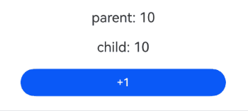
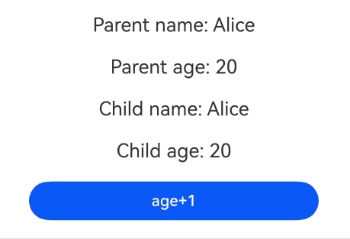
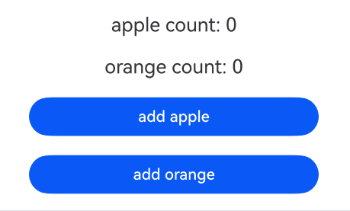
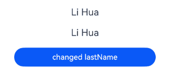

# Migration for Component State Variables
<!--Kit: ArkUI-->
<!--Subsystem: ArkUI-->
<!--Owner: @liwenzhen3-->
<!--Designer: @zhangboren-->
<!--Tester: @TerryTsao-->
<!--Adviser: @zhang_yixin13-->
<!-- md-trans-meta sourceCommit=2fe87adc16af5a903a1eb4a9624e4d36fa962e3d translatedAt=2026-07-25T08:58:07.187Z pushedAt=2026-07-25T09:38:33.788Z -->

This topic provides migration guidance for component state variables across different scenarios.

| V1 Decorator               | V2 Decorator                 |
|------------------------|--------------------------|
| [\@State](./arkts-state.md)                 | No external initialization: [\@Local](./arkts-new-local.md)<br>One-time external initialization: [\@Param](./arkts-new-param.md) or [\@Once](./arkts-new-once.md)|
| [\@Prop](./arkts-prop.md)                   | [\@Param](./arkts-new-param.md)                   |
| [\@Link](./arkts-link.md)                  | [\@Param](./arkts-new-param.md)/[\@Event](./arkts-new-event.md)    |
|  [\@ObjectLink](./arkts-observed-and-objectlink.md)           |[\@Param](./arkts-new-param.md)                   |
|  [\@Provide](./arkts-provide-and-consume.md)               |[\@Provider](./arkts-new-provider-and-consumer.md)                |
| [\@Consume](./arkts-provide-and-consume.md)               |[\@Consumer](./arkts-new-provider-and-consumer.md)                |
| [\@Watch](./arkts-watch.md)               |[\@Monitor](./arkts-new-monitor.md)                |
| No computed property capability (manual recalculation required)| [\@Computed](./arkts-new-computed.md)                |


## Migration Examples

### \@State -> \@Local

**Migration Rules**

In V1, \@State decorates internal component state variables. V2 provides \@Local as its replacement, but with significant differences in observation capabilities and initialization rules. The migration strategies for different use scenarios are as follows:

- Primitive types: For primitive type variables, directly replace \@State with \@Local.

- Complex types: In V1, \@State can observe the top-level property changes of a complex object. In V2, \@Local can observe only the changes of the object itself. To listen for the internal property changes of an object, you can use \@ObservedV2 and \@Trace together.

- External initialization: \@State in V1 supports initialization from external values, while \@Local in V2 prohibits external initialization. If an initial value needs to be passed in externally, you can use the \@Param and \@Once decorators.

**Example**

**Primitive Types**

For primitive type variables, \@State in V1 can be replaced with \@Local in V2.

V1:

<!-- @[Child1_start](https://gitcode.com/openharmony/applications_app_samples/blob/master/code/DocsSample/ArkUISample/StateMigrationProject/entry/src/main/ets/pages/componentstatemigration/StateEasyV1.ets) --> 

``` TypeScript
const INITIAL_VALUE = 10;

@Entry
@Component
struct Child {
  // @State in V1 decorates primitive-type variables.
  @State val: number = INITIAL_VALUE;

  build() {
    Column() {
      Text(this.val.toString())
        .fontSize(20)
        .margin(10)
    }
    .width('100%')
  }
}
```

V2:

<!-- @[Child2_start](https://gitcode.com/openharmony/applications_app_samples/blob/master/code/DocsSample/ArkUISample/StateMigrationProject/entry/src/main/ets/pages/componentstatemigration/StateEasyV2.ets) --> 

``` TypeScript
const INITIAL_VALUE = 10;

@Entry
@ComponentV2
struct Child {
  // @Local in V2 decorates primitive-type variables.
  @Local val: number = INITIAL_VALUE;

  build() {
    Column() {
      Text(this.val.toString())
        .fontSize(20)
        .margin(10)
    }
    .width('100%')
  }
}
```

Example effect:


**Complex Types**

In V1, \@State can observe changes in the top-level properties of complex objects. In V2, however, \@Local can only observe changes to the object itself, not its internal properties. To solve this issue, you need to add \@ObservedV2 to the class and add \@Trace to target properties. In this way, V2 can listen for property changes inside the object.

V1:

<!-- @[example1_start](https://gitcode.com/openharmony/applications_app_samples/blob/master/code/DocsSample/ArkUISample/StateMigrationProject/entry/src/main/ets/pages/componentstatemigration/StateComplexV1.ets) -->

``` TypeScript
const INITIAL_VALUE = 10;

class Child {
  public value: number = INITIAL_VALUE;
}

@Component
@Entry
struct Example {
  // @State can observe first-level changes.
  @State child: Child = new Child();

  build() {
    Column() {
      Text(this.child.value.toString())
        .fontSize(20)
        .margin(10)
      Button('value+1')
        .width(300)
        .margin(10)
        .onClick(() => {
          this.child.value++; // Modify the object property to trigger UI re-rendering.
        })
    }
    .width('100%')
  }
}
```

V2 migration policy: Use \@ObservedV2 and \@Trace.

<!-- @[example2_start](https://gitcode.com/openharmony/applications_app_samples/blob/master/code/DocsSample/ArkUISample/StateMigrationProject/entry/src/main/ets/pages/componentstatemigration/StateComplexV2.ets) -->

``` TypeScript
const INITIAL_VALUE = 10;

@ObservedV2
class Child {
  @Trace public value: number = INITIAL_VALUE;
}

@ComponentV2
@Entry
struct Example {
  // @Local can only observe the object itself. Add @ObservedV2 and @Trace to Child to enable observation of internal properties.
  @Local child: Child = new Child();

  build() {
    Column() {
      Text(this.child.value.toString())
        .fontSize(20)
        .margin(10)
      Button('value+1')
        .width(300)
        .margin(10)
        .onClick(() => {
          this.child.value++; // Modify the object property to trigger a UI refresh.
        })
    }
    .width('100%')
  }
}
```

Example effect:


**External Initialization**

In V1, \@State enables variables to be initialized from outside the component. In V2, however, \@Local explicitly prohibits external initialization. To implement similar functionality, replace \@State with \@Param and \@Once in V2 to allow passing an initial value from outside and ensure that it is only synchronized once during initialization.

V1:

<!-- @[Parent5_start](https://gitcode.com/openharmony/applications_app_samples/blob/master/code/DocsSample/ArkUISample/StateMigrationProject/entry/src/main/ets/pages/componentstatemigration/StateExternalInitializationV1.ets) -->

``` TypeScript
@Component
struct Child {
  @State value: number = 0;

  build() {
    Text(this.value.toString())
      .fontSize(20)
      .margin(10)
  }
}

@Entry
@Component
struct Parent {
  build() {
    Column() {
      // @State supports external initialization.
      Child({ value: 30 })
    }
    .width('100%')
  }
}
```

V2 migration policy: Use \@Param and \@Once.

<!-- @[Parent6_start](https://gitcode.com/openharmony/applications_app_samples/blob/master/code/DocsSample/ArkUISample/StateMigrationProject/entry/src/main/ets/pages/componentstatemigration/StateExternalInitializationV2.ets) -->

``` TypeScript
@ComponentV2
struct Child {
  @Param @Once value: number = 0;

  build() {
    Text(this.value.toString())
      .fontSize(20)
      .margin(10)
  }
}

@Entry
@ComponentV2
struct Parent {
  build() {
    Column() {
      // @Local does not support external initialization. Use @Param and @Once instead.
      Child({ value: 30 })
    }
    .width('100%')
  }
}
```


Example effect:


### \@Prop -> \@Param

**Migration Rules**

In V1, the \@Prop decorator allows child components to receive and modify parent-passed parameters. In V2, \@Param replaces \@Prop. However, \@Param decorated parameters are read-only and cannot be modified in the child component. Depending on the scenario, there are 3 migration strategies:

- Primitive types: For primitive type parameters, replace \@Prop with \@Param.

- Complex types: For complex objects requiring strict one-way data flow, perform a deep copy to prevent the child component from modifying the parent's data.

- Variable modification by the child component: Use \@Once to allow one-time local modification. Note that if \@Once is used, the current child component is initialized only once, and changes from the parent component cannot be synchronized to the child component.

**Example**

**Primitive Types**

For primitive type variables, \@Prop in V1 can be replaced with \@Param in V2.

V1:

<!-- @[Parent9_start](https://gitcode.com/openharmony/applications_app_samples/blob/master/code/DocsSample/ArkUISample/StateMigrationProject/entry/src/main/ets/pages/componentstatemigration/PropEasyV1.ets) --> 

``` TypeScript
@Component
struct Child {
  // @Prop in V1 decorates primitive-type variables.
  @Prop value: number;

  build() {
    Text(this.value.toString())
      .fontSize(20)
      .margin(10)
  }
}

@Entry
@Component
struct Parent {
  build() {
    Column() {
      Child({ value: 30 })
    }
    .width('100%')
  }
}
```

V2:

<!-- @[Parent10_start](https://gitcode.com/openharmony/applications_app_samples/blob/master/code/DocsSample/ArkUISample/StateMigrationProject/entry/src/main/ets/pages/componentstatemigration/PropEasyV2.ets) -->

``` TypeScript
@ComponentV2
struct Child {
  // @Param in V2 decorates primitive-type variables.
  @Param value: number = 0;

  build() {
    Text(this.value.toString())
      .fontSize(20)
      .margin(10)
  }
}

@Entry
@ComponentV2
struct Parent {
  build() {
    Column() {
      Child({ value: 30 })
    }
    .width('100%')
  }
}
```

Example effect:


**Complex Types**

In V2, to enforce strict one-way data flow and prevent child components from modifying parent data, you must use a deep copy when passing complex objects with \@Param. This prevents the transfer of object references.

V1:

<!-- @[Parent11_start](https://gitcode.com/openharmony/applications_app_samples/blob/master/code/DocsSample/ArkUISample/StateMigrationProject/entry/src/main/ets/pages/componentstatemigration/PropComplexV1.ets) -->

``` TypeScript
const APPLE_INITIAL_COUNT = 5;
const ORANGE_INITIAL_COUNT = 10;

class Fruit {
  public apple: number = APPLE_INITIAL_COUNT;
  public orange: number = ORANGE_INITIAL_COUNT;
}

@Component
struct Child {
  // @Prop passes the Fruit class. When the properties of the child class are changed, the parent class is not affected.
  @Prop fruit: Fruit;

  build() {
    Column() {
      Text('child apple: ' + this.fruit.apple.toString())
        .fontSize(20)
        .margin(10)
      Text('child orange: ' + this.fruit.orange.toString())
        .fontSize(20)
        .margin(10)
      Button('apple+1')
        .width(300)
        .margin(10)
        .onClick(() => {
          this.fruit.apple++; // Modify the child component's @Prop object. The parent component is not affected.
        })
      Button('orange+1')
        .width(300)
        .margin(10)
        .onClick(() => {
          this.fruit.orange++;
        })
    }
    .width('100%')
  }
}

@Entry
@Component
struct Parent {
  @State parentFruit: Fruit = new Fruit();

  build() {
    Column() {
      Text('parent apple: ' + this.parentFruit.apple.toString())
        .fontSize(20)
        .margin(10)
      Text('parent orange: ' + this.parentFruit.orange.toString())
        .fontSize(20)
        .margin(10)
      Child({ fruit: this.parentFruit })
    }
    .width('100%')
  }
}
```

V2:

<!-- @[Parent12_start](https://gitcode.com/openharmony/applications_app_samples/blob/master/code/DocsSample/ArkUISample/StateMigrationProject/entry/src/main/ets/pages/componentstatemigration/PropComplexV2.ets) -->

``` TypeScript
const APPLE_INITIAL_COUNT = 5;
const ORANGE_INITIAL_COUNT = 10;

@ObservedV2
class Fruit {
  @Trace public apple: number = APPLE_INITIAL_COUNT;
  @Trace public orange: number = ORANGE_INITIAL_COUNT;

  // Use a deep copy to prevent the child component from modifying parent data.
  clone(): Fruit {
    let newFruit: Fruit = new Fruit();
    newFruit.apple = this.apple;
    newFruit.orange = this.orange;
    return newFruit;
  }
}

@ComponentV2
struct Child {
  @Param fruit: Fruit = new Fruit();

  build() {
    Column() {
      Text('child apple: ' + this.fruit.apple.toString())
        .fontSize(20)
        .margin(10)
      Text('child orange: ' + this.fruit.orange.toString())
        .fontSize(20)
        .margin(10)
      Button('apple+1')
        .width(300)
        .margin(10)
        .onClick(() => {
          this.fruit.apple++; // Modify the deep copy object. The parent component is not affected.
        })
      Button('orange+1')
        .width(300)
        .margin(10)
        .onClick(() => {
          this.fruit.orange++;
        })
    }
    .width('100%')
  }
}

@Entry
@ComponentV2
struct Parent {
  @Local parentFruit: Fruit = new Fruit();

  build() {
    Column() {
      Text('parent apple: ' + this.parentFruit.apple.toString())
        .fontSize(20)
        .margin(10)
      Text('parent orange: ' + this.parentFruit.orange.toString())
        .fontSize(20)
        .margin(10)
      Child({ fruit: this.parentFruit.clone() })
    }
    .width('100%')
  }
}
```

Example effect:



**Variable Modification in Child Components**

In V1, child components can modify \@Prop decorated variables. However, in V2, \@Param is read-only. If a child component needs to modify a passed value, it can use \@Param together with \@Once to make local changes.

V1:

<!-- @[Parent13_start](https://gitcode.com/openharmony/applications_app_samples/blob/master/code/DocsSample/ArkUISample/StateMigrationProject/entry/src/main/ets/pages/componentstatemigration/PropSubComponentUpdateVarV1.ets) -->

``` TypeScript
@Component
struct Child {
  // @Prop allows direct modification of the variable.
  @Prop value: number;

  build() {
    Column() {
      Text(this.value.toString())
        .fontSize(20)
        .margin(10)
      Button('+1')
        .width(300)
        .margin(10)
        .onClick(() => {
          this.value++; // Local modification. Will not be synced back to the parent component.
        })
    }
    .width('100%')
  }
}

@Entry
@Component
struct Parent {
  build() {
    Column() {
      Child({ value: 30 })
    }
    .width('100%')
  }
}
```

V2 migration policy: Use \@Param and \@Once.

<!-- @[Parent14_start](https://gitcode.com/openharmony/applications_app_samples/blob/master/code/DocsSample/ArkUISample/StateMigrationProject/entry/src/main/ets/pages/componentstatemigration/PropSubComponentUpdateVarV2.ets) -->

``` TypeScript
@ComponentV2
struct Child {
  // @Param used together with @Once enables local modification.
  @Param @Once value: number = 0;

  build() {
    Column() {
      Text(this.value.toString())
        .fontSize(20)
        .margin(10)
      Button('+1')
        .width(300)
        .margin(10)
        .onClick(() => {
          this.value++; // Local modification; not synced back to the parent component.
        })
    }
    .width('100%')
  }
}

@Entry
@ComponentV2
struct Parent {
  build() {
    Column() {
      Child({ value: 30 })
    }
    .width('100%')
  }
}
```

Example effect:


In V1, a child component can modify its @Prop decorated variables. These changes are applied locally and are not synced to the parent component. When the parent's data source updates, the child component receives the update and its local \@Prop values are overwritten.

V1:

- Changes to **localValue** in the child component **Child** are not synchronized to the parent component **Parent**.
- When **Parent** updates **value**, **Child** is notified and its **localValue** is overwritten.

<!-- @[Parent15_start](https://gitcode.com/openharmony/applications_app_samples/blob/master/code/DocsSample/ArkUISample/StateMigrationProject/entry/src/main/ets/pages/componentstatemigration/PropSubComponentUpdateVarLocalV1.ets) -->

``` TypeScript
const PARENT_INITIAL_STATE_VALUE = 10;

@Component
struct Child {
  @Prop localValue: number = 0;

  build() {
    Column() {
      Text(`${this.localValue}`)
        .fontSize(20)
        .margin(10)
      Button('Child +100')
        .width(300)
        .margin(10)
        .onClick(() => {
          // Changes to localValue are not synchronized to Parent.
          this.localValue += 100;
        })
    }
    .width('100%')
  }
}

@Entry
@Component
struct Parent {
  @State value: number = PARENT_INITIAL_STATE_VALUE;

  build() {
    Column() {
      Button('Parent +1')
        .width(300)
        .margin(10)
        .onClick(() => {
          // When value is updated, Child is notified.
          this.value += 1;
        })
      Child({ localValue: this.value })
    }
    .width('100%')
  }
}
```

In V2, \@Param cannot be modified locally. When used with \@Once, the value is synchronized only once. In contrast, \@Monitor enables a writable local copy in the child component while still receiving updates from the parent component.

V2:

- When **Parent** is updated, it notifies the child component and triggers the **onValueChange** callback decorated with \@Monitor. This callback assigns the new value to **localValue** in the child component.
- Modifications to **localValue** remain local and are not propagated to **Parent**.
- Subsequent updates from **Parent** will overwrite **localValue** in the child component.

<!-- @[Parent16_start](https://gitcode.com/openharmony/applications_app_samples/blob/master/code/DocsSample/ArkUISample/StateMigrationProject/entry/src/main/ets/pages/componentstatemigration/PropSubComponentUpdateVarLocalV2.ets) -->

``` TypeScript
import { hilog } from '@kit.PerformanceAnalysisKit';
const DOMAIN = 0xFF00;
const TAG = '[Sample_StateMigration_App]';
const PARENT_INITIAL_LOCAL_VALUE = 10;

@ComponentV2
struct Child {
  @Param value: number = 0;
  @Local localValue: number = this.value;

  @Monitor('value')
  onValueChange(mon: IMonitor) {
    hilog.info(DOMAIN, TAG, `value has been changed from ${mon.value()?.before} to ${mon.value()?.now}`);
    // When the parent component's value changes, the child component receives an update notification, triggering the @Monitor decorated callback, which overwrites the local value with the new value from the parent.
    this.localValue = this.value;
  }

  build() {
    Column() {
      Text(`${this.localValue}`)
        .fontSize(20)
        .margin(10)
      Button('Child +100')
        .width(300)
        .margin(10)
        .onClick(() => {
          // Changes to localValue are not synchronized to Parent.
          this.localValue += 100;
        })
    }
    .width('100%')
  }
}

@Entry
@ComponentV2
struct Parent {
  @Local value: number = PARENT_INITIAL_LOCAL_VALUE;

  build() {
    Column() {
      Button('Parent +1')
        .width(300)
        .margin(10)
        .onClick(() => {
          // When value is updated, Child is notified.
          this.value += 1;
        })
      Child({ value: this.value })
    }
    .width('100%')
  }
}
```


Example effect:



### \@Link -> \@Param/\@Event

**Migration Rules**

In V1, \@Link enables two-way data binding between parent and child components. When migrating to V2, you can use \@Param and \@Event to simulate two-way synchronization. \@Param implements one-way data transfer from parent to child, and the child component then triggers state updates in the parent component through an \@Event callback function.

**Example**

V1 implementation:

<!-- @[Parent7_start](https://gitcode.com/openharmony/applications_app_samples/blob/master/code/DocsSample/ArkUISample/StateMigrationProject/entry/src/main/ets/pages/componentstatemigration/LinkMiigrationV1.ets) -->

``` TypeScript
const INITIAL_MYVAL = 10;

@Component
struct Child {
  // @Link enables bidirectional data synchronization.
  @Link val: number;

  build() {
    Column() {
      Text('child: ' + this.val.toString())
        .fontSize(20)
        .margin(10)
      Button('+1')
        .width(300)
        .margin(10)
        .onClick(() => {
          this.val++; // The child component modifies val, and both parent and child components refresh synchronously.
        })
    }
    .width('100%')
  }
}

@Entry
@Component
struct Parent {
  @State myVal: number = INITIAL_MYVAL;

  build() {
    Column() {
      Text('parent: ' + this.myVal.toString())
        .fontSize(20)
        .margin(10)
      Child({ val: this.myVal }) // Establish parent-child bidirectional synchronization through @Link.
    }
    .width('100%')
  }
}
```

V2 migration strategy: Use \@Param and \@Event.

<!-- @[Parent8_start](https://gitcode.com/openharmony/applications_app_samples/blob/master/code/DocsSample/ArkUISample/StateMigrationProject/entry/src/main/ets/pages/componentstatemigration/LinkMiigrationV2.ets) -->

``` TypeScript
const INITIAL_MYVAL = 10;

@ComponentV2
struct Child {
  // @Param works with the @Event callback to implement bidirectional data synchronization.
  @Param val: number = 0;
  @Event addOne: () => void;

  build() {
    Column() {
      Text('child: ' + this.val.toString())
        .fontSize(20)
        .margin(10)
      Button('+1')
        .width(300)
        .margin(10)
        .onClick(() => {
          this.addOne(); // Notify the parent component to update through the @Event callback.
        })
    }
    .width('100%')
  }
}

@Entry
@ComponentV2
struct Parent {
  @Local myVal: number = INITIAL_MYVAL;

  build() {
    Column() {
      Text('parent: ' + this.myVal.toString())
        .fontSize(20)
        .margin(10)
      Child({ val: this.myVal, addOne: () => this.myVal++ }) // @Param passes data, and @Event passes the callback to implement bidirectional synchronization.
    }
    .width('100%')
  }
}
```


Example effect:



### \@ObjectLink -> \@Param

**Migration Rules**

In V1, \@ObjectLink is used to receive \@Observed-decorated class objects passed from the parent component, enabling synchronization of nested objects. When the parent component performs a full reassignment, the change is unidirectionally synced to the child component. The child component is not allowed to perform full reassignment, but can modify object properties, and property changes are bidirectionally synced between the parent and child components.

When migrating to V2, the child component uses \@Param to receive the object, and the synchronization behavior is consistent with \@ObjectLink.

**Example**

V1 implementation:

<!-- @[Parent23_start](https://gitcode.com/openharmony/applications_app_samples/blob/master/code/DocsSample/ArkUISample/StateMigrationProject/entry/src/main/ets/pages/componentstatemigration/ObjectLinkMigrationV1.ets) -->

``` TypeScript
@Observed
class Person {
  public name: string;
  public age: number;

  constructor(name: string, age: number) {
    this.name = name;
    this.age = age;
  }
}

@Component
struct Child {
  // @ObjectLink receives class objects decorated by @Observed, with bidirectional synchronization of property changes.
  @ObjectLink person: Person;

  build() {
    Column() {
      Text(`Child name: ${this.person.name}`)
        .fontSize(20)
        .margin(10)
      Text(`Child age: ${this.person.age}`)
        .fontSize(20)
        .margin(10)
      Button('age+1')
        .width(300)
        .margin(10)
        .onClick(() => {
          this.person.age++; // The child component modifies object properties, and both parent and child components refresh synchronously.
        })
    }
    .width('100%')
  }
}

@Entry
@Component
struct Parent {
  @State person: Person = new Person('Alice', 20);

  build() {
    Column() {
      Text(`Parent name: ${this.person.name}`)
        .fontSize(20)
        .margin(10)
      Text(`Parent age: ${this.person.age}`)
        .fontSize(20)
        .margin(10)
      Child({ person: this.person }) // Pass the object to the child component.
    }
    .width('100%')
  }
}
```

V2 migration strategy: Use \@Param to receive the object.

<!-- @[Parent24_start](https://gitcode.com/openharmony/applications_app_samples/blob/master/code/DocsSample/ArkUISample/StateMigrationProject/entry/src/main/ets/pages/componentstatemigration/ObjectLinkMigrationV2.ets) -->

``` TypeScript
@ObservedV2
class Person {
  @Trace public name: string;
  @Trace public age: number;

  constructor(name: string, age: number) {
    this.name = name;
    this.age = age;
  }
}

@ComponentV2
struct Child {
  // @Param receives class objects, with bidirectional synchronization of property changes.
  @Param person: Person = new Person('', 0);

  build() {
    Column() {
      Text(`Child name: ${this.person.name}`)
        .fontSize(20)
        .margin(10)
      Text(`Child age: ${this.person.age}`)
        .fontSize(20)
        .margin(10)
      Button('age+1')
        .width(300)
        .margin(10)
        .onClick(() => {
          this.person.age++; // The child component modifies object properties, and both parent and child components refresh synchronously.
        })
    }
    .width('100%')
  }
}

@Entry
@ComponentV2
struct Parent {
  @Local person: Person = new Person('Alice', 20);

  build() {
    Column() {
      Text(`Parent name: ${this.person.name}`)
        .fontSize(20)
        .margin(10)
      Text(`Parent age: ${this.person.age}`)
        .fontSize(20)
        .margin(10)
      Child({ person: this.person }) // Pass the object to the child component.
    }
    .width('100%')
  }
}
```


Example effect:



### \@Provide/\@Consume -> \@Provider/\@Consumer

**Migration Rules**

The functionality of \@Provide and \@Consume in V1 is largely similar to \@Provider and \@Consumer in V2, making them generally interchangeable. However, several key differences may require adjustments depending on your implementation.

In V1, @Provide and @Consume enable data sharing between parent and child components. They can be matched by alias or attribute name, with \@Consume depending on the parent component's \@Provide. Local initialization is not supported before API version 20. In V2, \@Provider and \@Consumer enhance these features, offering more flexible data sharing. Key improvements are as follows:

- Syntax requirement: In V1, \@Provide and \@Consume can be used without parentheses () if no alias is specified. In V2, \@Provider and \@Consumer must always be followed by parentheses (), whether or not an alias is specified.

- Matching rules: In V1, \@Provide and \@Consume can be matched by alias or variable name. In V2, matching is performed only by alias. Once an alias is specified, it becomes the exclusive matching key.

- Local initialization: In V1, \@Consume depends on the parent component's @Provide and does not support local initialization before API version 20. Since API version 20, local default values are used if no matching @Provide is found. For details, see [Setting Default Values for @Consume Decorated Variables](./arkts-provide-and-consume.md#setting-default-values-for-consume-decorated-variables). In V2, \@Consumer supports local initialization by default, using the local value if no matching \@Provider is available.

- Initialization from the parent component: In V1, \@Provide can be directly initialized from the parent component. In V2, \@Provider does not support external initialization. You must use @Param with \@Once to receive the initial value from the parent and assign it to \@Provider.

- Overriding support: In V1, \@Provide requires explicit **allowOverride** to support overriding. In V2, \@Provider supports overriding by default. \@Consumer automatically resolves to the nearest \@Provider in the component tree.

**Example**

**Matching Rules**

In V1, \@Provide and \@Consume can be matched by alias or variable name. In V2, matching is performed only by alias (not variable name). Once an alias is specified, it becomes the exclusive matching key.

V1:

<!-- @[Parent17_start](https://gitcode.com/openharmony/applications_app_samples/blob/master/code/DocsSample/ArkUISample/StateMigrationProject/entry/src/main/ets/pages/componentstatemigration/ProvideAliasV1.ets) -->

``` TypeScript
@Component
struct Child {
  // Both alias and variable name can be used as matching keys.
  @Consume('text') childMessage: string;
  @Consume message: string;

  build() {
    Column() {
      Text(this.childMessage)
        .fontSize(20)
        .margin(10)
      Text(this.message)
        .fontSize(20)
        .margin(10)
    }
    .width('100%')
  }
}

@Entry
@Component
struct Parent {
  @Provide('text') message: string = 'Hello World';

  build() {
    Column() {
      Child()
    }
    .width('100%')
  }
}
```

For V2 migration, make sure aliases match. If you do not specify an alias, the system matches by variable name.

<!-- @[Parent18_start](https://gitcode.com/openharmony/applications_app_samples/blob/master/code/DocsSample/ArkUISample/StateMigrationProject/entry/src/main/ets/pages/componentstatemigration/ProvideAliasV2.ets) -->

``` TypeScript
@ComponentV2
struct Child {
  @Consumer('text') childMessage: string = 'default'; // When alias is specified, matching is performed by alias.
  @Consumer() message: string = 'default'; // When alias is not specified, matching is performed by property name.

  build() {
    Column() {
      Text(this.childMessage)
        .fontSize(20)
        .margin(10)
      Text(this.message)
        .fontSize(20)
        .margin(10)
    }
    .width('100%')
  }
}

@Entry
@ComponentV2
struct Parent {
  @Provider('text') parentMessage: string = 'Hello World';
  @Provider() message: string = 'Hello World';

  build() {
    Column() {
      Child()
    }
    .width('100%')
  }
}
```

Example effect:


**Local Initialization**

In V1 prior to API version 20, \@Consume decorated variables cannot be locally initialized. They must rely on a matching \@Provide from a parent component. Failure to find a corresponding \@Provide results in a runtime exception. After migration to V2, @Consumer allows local initialization. If the matching @Provider is unavailable, the local default value is used.

V1:

<!-- @[Parent19_start](https://gitcode.com/openharmony/applications_app_samples/blob/master/code/DocsSample/ArkUISample/StateMigrationProject/entry/src/main/ets/pages/componentstatemigration/ProvideConsumeNoInitV1.ets) -->

``` TypeScript
@Component
struct Child {
  // @Consume prohibits local initialization. If no matching @Provide is found, an exception is thrown.
  @Consume message: string;

  build() {
    Text(this.message)
      .fontSize(20)
      .margin(10)
  }
}

@Entry
@Component
struct Parent {
  @Provide message: string = 'Hello World';

  build() {
    Column() {
      Child()
    }
    .width('100%')
  }
}
```

V2:

<!-- @[Parent20_start](https://gitcode.com/openharmony/applications_app_samples/blob/master/code/DocsSample/ArkUISample/StateMigrationProject/entry/src/main/ets/pages/componentstatemigration/ProvideConsumeInitV2.ets) -->

``` TypeScript
@ComponentV2
struct Child {
  // @Consumer allows local initialization. The local default value will be used when \@Provider is not found.
  @Consumer() message: string = 'Hello World';

  build() {
    Text(this.message)
      .fontSize(20)
      .margin(10)
  }
}

@Entry
@ComponentV2
struct Parent {
  build() {
    Column() {
      Child()
    }
    .width('100%')
  }
}
```

Example effect:


**Initialization from the Parent Component**

In V1, \@Provide allows initialization from the parent component, and initial values can be passed directly through component parameters. In V2, \@Provider prohibits external initialization. To achieve equivalent functionality, use \@Param with \@Once in the child component to receive the initial value from the parent, and then assign it to the \@Provider variable.

V1:

<!-- @[Parent21_start](https://gitcode.com/openharmony/applications_app_samples/blob/master/code/DocsSample/ArkUISample/StateMigrationProject/entry/src/main/ets/pages/componentstatemigration/ProvideParentInitV1.ets) -->

``` TypeScript
const STATE_INITIAL_PARENT_VALUE = 42;

@Entry
@Component
struct Parent {
  @State parentValue: number = STATE_INITIAL_PARENT_VALUE;

  build() {
    Column() {
      // @Provide supports initialization from the parent component.
      Child({ childValue: this.parentValue })
    }
    .width('100%')
  }
}

@Component
struct Child {
  @Provide childValue: number = 0;

  build() {
    Column() {
      Text(this.childValue.toString())
        .fontSize(20)
        .margin(10)
    }
    .width('100%')
  }
}
```

V2:

<!-- @[Parent22_start](https://gitcode.com/openharmony/applications_app_samples/blob/master/code/DocsSample/ArkUISample/StateMigrationProject/entry/src/main/ets/pages/componentstatemigration/ProvideParentNoInitV2.ets) -->

``` TypeScript
const LOCAL_INITIAL_PARENT_VALUE = 42;

@Entry
@ComponentV2
struct Parent {
  @Local parentValue: number = LOCAL_INITIAL_PARENT_VALUE;

  build() {
    Column() {
      // @Provider prohibits localization from the parent component. To work around this, you can use @Param to receive the initial value and then assign it to @Provider.
      Child({ initialValue: this.parentValue })
    }
    .width('100%')
  }
}

@ComponentV2
struct Child {
  @Param @Once initialValue: number = 0;
  @Provider() childValue: number = this.initialValue;

  build() {
    Column() {
      Text(this.childValue.toString())
        .fontSize(20)
        .margin(10)
    }
    .width('100%')
  }
}
```

Example effect:


**Overriding Support**

In V1, \@Provide does not support overriding by default and cannot override an ancestor component's \@Provide with the same name. To enable overriding, configure **allowOverride**. In V2, \@Provider supports overriding by default. \@Consumer automatically resolves to the nearest \@Provider in the component tree.

V1:

<!-- @[GrandParent1_start](https://gitcode.com/openharmony/applications_app_samples/blob/master/code/DocsSample/ArkUISample/StateMigrationProject/entry/src/main/ets/pages/componentstatemigration/ProvideNoAllowOverrideV1.ets) --> 

``` TypeScript
const GRANDPARENT_REVIEW_VOTES_INITIAL = 40;
const PARENT_REVIEW_VOTES_INITIAL = 20;

@Entry
@Component
struct GrandParent {
  @Provide('reviewVotes') reviewVotes: number = GRANDPARENT_REVIEW_VOTES_INITIAL;

  build() {
    Column() {
      Parent()
    }
    .width('100%')
  }
}

@Component
struct Parent {
  // @Provide does not support overriding by default. To support overriding, set the allowOverride option.
  @Provide({ allowOverride: 'reviewVotes' }) reviewVotes: number = PARENT_REVIEW_VOTES_INITIAL;

  build() {
    Child()
  }
}

@Component
struct Child {
  @Consume('reviewVotes') reviewVotes: number;

  build() {
    Text(this.reviewVotes.toString())
      .fontSize(20)
      .margin(10)
  }
}
```

V2:

<!-- @[GrandParent2_start](https://gitcode.com/openharmony/applications_app_samples/blob/master/code/DocsSample/ArkUISample/StateMigrationProject/entry/src/main/ets/pages/componentstatemigration/ProvideAllowOverrideV2.ets) -->

``` TypeScript
const GRANDPARENT_REVIEW_VOTES_INITIAL = 40;
const PARENT_REVIEW_VOTES_INITIAL = 20;

@Entry
@ComponentV2
struct GrandParent {
  @Provider('reviewVotes') reviewVotes: number = GRANDPARENT_REVIEW_VOTES_INITIAL;

  build() {
    Column() {
      Parent()
    }
    .width('100%')
  }
}

@ComponentV2
struct Parent {
  // @Provider supports overriding by default. @Consumer searches for the nearest @Provider upwards.
  @Provider() reviewVotes: number = PARENT_REVIEW_VOTES_INITIAL;

  build() {
    Child()
  }
}

@ComponentV2
struct Child {
  @Consumer() reviewVotes: number = 0;

  build() {
    Text(this.reviewVotes.toString())
      .fontSize(20)
      .margin(10)
  }
}
```


Example effect:


### \@Watch -> \@Monitor

**Migration Rules**

In V1, \@Watch observes state variable changes and triggers specified callbacks. In V2, \@Monitor replaces \@Watch, offering more flexible change detection with access to both previous and current variable values. The migration policies for different use scenarios are as follows:

- Single-variable listening: Directly replace \@Watch with \@Monitor.

- Multi-variable listening: In V1, \@Watch cannot access the previous value of the variable before the change. In V2, \@Monitor can listen for multiple variables at the same time and can access the values of the variables before and after the change.

**Example**

**Single-Variable Listening**

Use \@Monitor of V2 instead of \@Watch of V1.

V1:

<!-- @[WatchExample1_start](https://gitcode.com/openharmony/applications_app_samples/blob/master/code/DocsSample/ArkUISample/StateMigrationProject/entry/src/main/ets/pages/componentstatemigration/WatchSingleVarV1.ets) -->

``` TypeScript
import { hilog } from '@kit.PerformanceAnalysisKit';

const DOMAIN = 0xFF00;
const TAG = '[Sample_StateMigration_App]';

@Entry
@Component
struct WatchExample {
  @State @Watch('onAppleChange') apple: number = 0;

  onAppleChange(): void {
    hilog.info(DOMAIN, TAG, 'apple count changed to ' + this.apple);
  }

  build() {
    Column() {
      Text(`apple count: ${this.apple}`)
        .fontSize(20)
        .margin(10)
      // Tap the button to increment apple, triggering a UI refresh.
      Button('add apple')
        .width(300)
        .margin(10)
        .onClick(() => {
          this.apple++;
        })
    }
    .width('100%')
  }
}
```

V2:

<!-- @[MonitorExample1_start](https://gitcode.com/openharmony/applications_app_samples/blob/master/code/DocsSample/ArkUISample/StateMigrationProject/entry/src/main/ets/pages/componentstatemigration/WatchSingleVarV2.ets) -->

``` TypeScript
import { hilog } from '@kit.PerformanceAnalysisKit';

const DOMAIN = 0xFF00;
const TAG = '[Sample_StateMigration_App]';

@Entry
@ComponentV2
struct MonitorExample {
  @Local apple: number = 0;

  @Monitor('apple')
  onFruitChange(monitor: IMonitor) {
    hilog.info(DOMAIN, TAG, `apple changed from ${monitor.value()?.before} to ${monitor.value()?.now}`);
  }

  build() {
    Column() {
      Text(`apple count: ${this.apple}`)
        .fontSize(20)
        .margin(10)
      // Tap the button to increment apple, triggering a UI refresh.
      Button('add apple')
        .width(300)
        .margin(10)
        .onClick(() => {
          this.apple++;
        })
    }
    .width('100%')
  }
}
```

Example effect:


**Multi-Variable Listening**

In V1, each \@Watch callback function can monitor only one variable and cannot obtain the value before the change. After migration to V2, you can use one \@Monitor to listen for multiple variables at the same time and obtain the values of the variables before and after the change.

V1:

<!-- @[WatchExample2_start](https://gitcode.com/openharmony/applications_app_samples/blob/master/code/DocsSample/ArkUISample/StateMigrationProject/entry/src/main/ets/pages/componentstatemigration/WatchMoreVarV1.ets) -->

``` TypeScript
import { hilog } from '@kit.PerformanceAnalysisKit';

const DOMAIN = 0xFF00;
const TAG = '[Sample_StateMigration_App]';

@Entry
@Component
struct WatchExample {
  @State @Watch('onAppleChange') apple: number = 0;
  @State @Watch('onOrangeChange') orange: number = 0;

  // The @Watch callback can only listen to a single variable and cannot obtain the value before the change.
  onAppleChange(): void {
    hilog.info(DOMAIN, TAG, 'apple count changed to ' + this.apple);
  }

  onOrangeChange(): void {
    hilog.info(DOMAIN, TAG, 'orange count changed to ' + this.orange);
  }

  build() {
    Column() {
      Text(`apple count: ${this.apple}`)
        .fontSize(20)
        .margin(10)
      Text(`orange count: ${this.orange}`)
        .fontSize(20)
        .margin(10)
      Button('add apple')
        .width(300)
        .margin(10)
        .onClick(() => {
          this.apple++; // Click to trigger the onAppleChange callback.
        })
      Button('add orange')
        .width(300)
        .margin(10)
        .onClick(() => {
          this.orange++; // Click to trigger the onOrangeChange callback.
        })
    }
    .width('100%')
  }
}

```

V2:

<!-- @[MonitorExample2_start](https://gitcode.com/openharmony/applications_app_samples/blob/master/code/DocsSample/ArkUISample/StateMigrationProject/entry/src/main/ets/pages/componentstatemigration/WatchMoreVarV2.ets) -->

``` TypeScript
import { hilog } from '@kit.PerformanceAnalysisKit';

const DOMAIN = 0xFF00;
const TAG = '[Sample_StateMigration_App]';

@Entry
@ComponentV2
struct MonitorExample {
  @Local apple: number = 0;
  @Local orange: number = 0;

  // @Monitor callback, which is used to listen for multiple variables and obtain the value before change.
  @Monitor('apple','orange')
  onFruitChange(monitor: IMonitor) {
    monitor.dirty.forEach((name: string) => {
      hilog.info(DOMAIN, TAG, `${name} changed from ${monitor.value(name)?.before} to ${monitor.value(name)?.now}`);
    });
  }

  build() {
    Column() {
      Text(`apple count: ${this.apple}`)
        .fontSize(20)
        .margin(10)
      Text(`orange count: ${this.orange}`)
        .fontSize(20)
        .margin(10)
      Button('add apple')
        .width(300)
        .margin(10)
        .onClick(() => {
          this.apple++; // Click to trigger the onFruitChange callback.
        })
      Button('add orange')
        .width(300)
        .margin(10)
        .onClick(() => {
          this.orange++; // Click to trigger the onFruitChange callback.
        })
    }
    .width('100%')
  }
}
```


Example effect:



### Repeated Calculation -> \@Computed Property

**Migration Rules**

V1 lacks computed property support, leading to redundant calculations during UI re-renders. To address this, V2 introduces the \@Computed decorator, allowing you to optimize and cache expensive computations.

V1:

In the following example, each time the **lastName** value changes, the **Text** component is re-rendered and **this.lastName +' ' + this.firstName** needs to be computed repeatedly.

<!-- @[ComputedV1_start](https://gitcode.com/openharmony/applications_app_samples/blob/master/code/DocsSample/ArkUISample/StateMigrationProject/entry/src/main/ets/pages/componentstatemigration/ComputedV1.ets) -->

``` TypeScript
@Entry
@Component
struct Index {
  @State firstName: string = 'Li';
  @State lastName: string = 'Hua';

  build() {
    Column() {
      Text(this.firstName + ' ' + this.lastName)
        .fontSize(20)
        .margin(10)
      Text(this.firstName + ' ' + this.lastName)
        .fontSize(20)
        .margin(10)
      // Each change to lastName triggers a refresh of the Text component.
      Button('changed lastName')
        .width(300)
        .margin(10)
        .onClick(() => {
          this.lastName += 'a';
        })
    }
    .width('100%')
  }
}
```

V2:

When \@Computed is used, the computation is triggered only once each time the **lastName** value changes.

<!-- @[ComputedV2_start](https://gitcode.com/openharmony/applications_app_samples/blob/master/code/DocsSample/ArkUISample/StateMigrationProject/entry/src/main/ets/pages/componentstatemigration/ComputedV2.ets) -->

``` TypeScript
@Entry
@ComponentV2
struct Index {
  @Local firstName: string = 'Li';
  @Local lastName: string = 'Hua';

  @Computed
  get fullName() {
    // Each change to lastName triggers only one computation.
    return this.firstName + ' ' + this.lastName;
  }

  build() {
    Column() {
      Text(this.fullName)
        .fontSize(20)
        .margin(10)
      Text(this.fullName)
        .fontSize(20)
        .margin(10)
      Button('changed lastName')
        .width(300)
        .margin(10)
        .onClick(() => {
          this.lastName += 'a';
        })
    }
    .width('100%')
  }
}
```


Example effect:



### Two-way Binding Migration from $$ to !!

In state management V1, [$$](./arkts-two-way-sync.md) is recommended for implementing two-way binding for built-in components. In state management V2, [!!](./arkts-new-binding.md) is recommended for implementing two-way binding.

> **NOTE**
> 
> The **!!** syntax is supported since API version 12.

**Migration policies**

For system component parameters, replace **$$** in V1 with **!!** in V2.

V1:

<!-- @[Migration_Sync_Dollar_Dollar](https://gitcode.com/openharmony/applications_app_samples/blob/master/code/DocsSample/ArkUISample/ParadigmStateManagement/entry/src/main/ets/pages/migrationDataObjectVariables/MigrationSyncDollarDollar.ets) -->

``` TypeScript
@Entry
@Component
struct TextInputExample {
  @State text: string = '';
  controller: TextInputController = new TextInputController();

  build() {
    Column({ space: 20 }) {
      Text(this.text)
        .fontSize(20)
        .margin(10)
      // The $$ operator provides a reference to a TS variable for system components, keeping the TS variable synchronized with the internal state of the system component.
      TextInput({ text: $$this.text, placeholder: 'input your word...', controller: this.controller })
        .placeholderColor(Color.Grey)
        .placeholderFont({ size: 14, weight: 400 })
        .caretColor(Color.Blue)
        .width(300)
    }
    .width('100%')
    .height('100%')
    .justifyContent(FlexAlign.Center)
  }
}
```

V2 migration strategy: When the decorator is modified to V2, $$ is directly replaced with !!.

<!-- @[sync_state_manager_!!](https://gitcode.com/openharmony/applications_app_samples/blob/master/code/DocsSample/ArkUISample/ParadigmStateManagement/entry/src/main/ets/pages/syncStateManager/SyncUsageExampleV2.ets) -->

``` TypeScript
@Entry
@ComponentV2
struct TextInputExampleV2 {
  @Local text: string = '';
  controller: TextInputController = new TextInputController();

  build() {
    Column({ space: 20 }) {
      Text(this.text)
        .fontSize(20)
        .margin(10)
      // Use !! to replace $$ in V2.
      TextInput({ text: this.text!!, placeholder: 'input your word...', controller: this.controller })
        .placeholderColor(Color.Grey)
        .placeholderFont({ size: 14, weight: 400 })
        .caretColor(Color.Blue)
        .width(300)
    }
    .width('100%')
    .height('100%')
    .justifyContent(FlexAlign.Center)
  }
}
```

Example effect:


<!--no_check-->