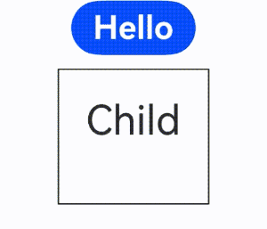
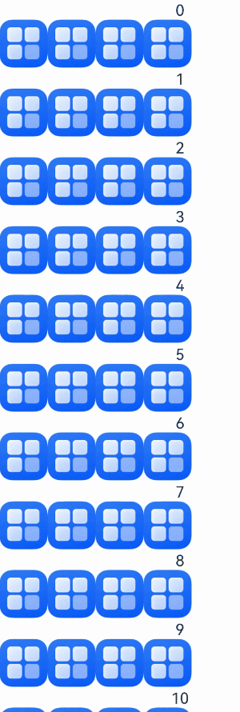
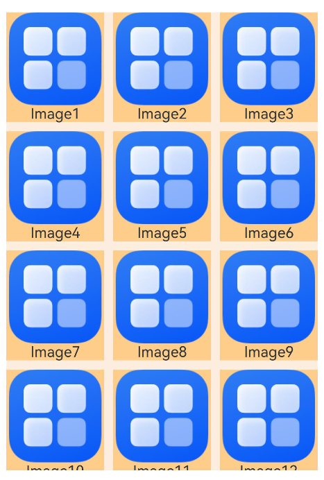
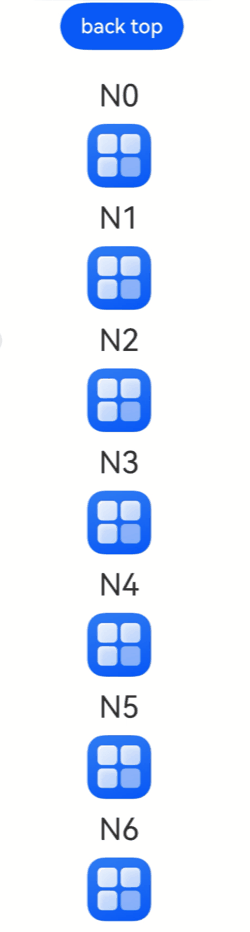
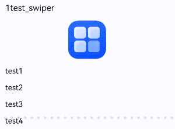
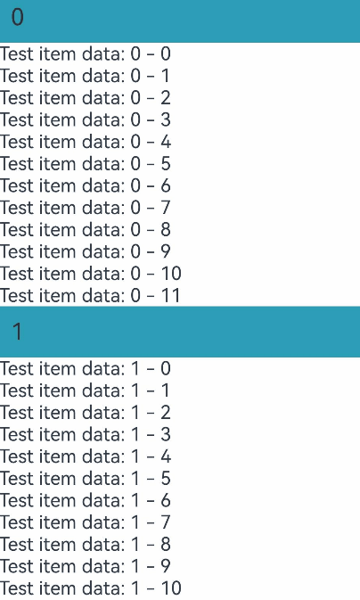
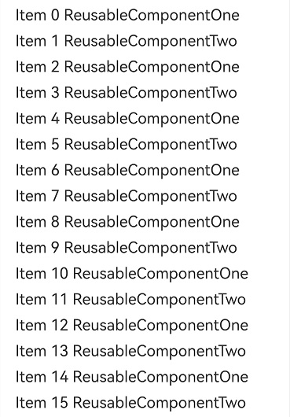
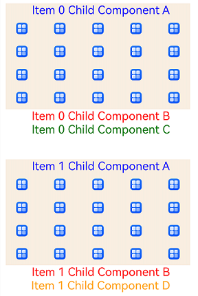

# Migration for Component Reuse

<!--Kit: ArkUI--> 
<!--Subsystem: ArkUI--> 
<!--Owner: @jiyujia926--> 
<!--Designer: @zhangboren--> 
<!--Tester: @zhangwenhan12--> 
<!--Adviser: @zhang_yixin13-->
<!-- md-trans-meta sourceCommit=c6d2a51ae0d4d741fa9801df0b2e84e58290f6c1 translatedAt=2026-07-24T01:22:35.256Z pushedAt=2026-07-24T03:23:13.934Z -->

This document describes how to migrate components from V1 to V2, involving the following decorators.

| V1 Decorator| V2 Decorator|
| -------- | -------- |
| [@Reusable](./arkts-reusable.md) | [@ReusableV2](./arkts-new-reusableV2.md) |

## \@Reusable->\@ReusableV2 Migration Rule

### V1 -> V2 Component Migration

**Migration Rules**

- Migrate the parent custom component decorated by \@Component to \@ComponentV2.

- Migrate the child custom component decorated by \@Reusable to \@ReusableV2.

- For details about the migration of state variables in a component, see [Migration for Component State Variables](./arkts-v1-v2-migration-inner-component.md)

### aboutToRecycle and aboutToReuse Migration

**Migration Rules**

- The [aboutToRecycle](../../reference/apis-arkui/arkui-ts/ts-custom-component-lifecycle.md#abouttorecycle10) lifecycle does not require any changes, and the original implementation can be retained.

- The [aboutToReuse](../../reference/apis-arkui/arkui-ts/ts-custom-component-lifecycle.md#abouttoreuse18) lifecycle has been optimized in component reuse V2. Parameters have been removed, and all state variables are automatically reset before reuse (for details, refer to [Resetting State Variables in Components Before Reuse](./arkts-new-reusableV2.md#resetting-state-variables-in-components-before-reuse)), eliminating the need for developers to manually assign them back to their initial values in **aboutToReuse**.

```ts
// Original V1 component.
@Reusable
@Component
struct ReusableComponent {
  // There is a possibility of external value transfer. The value can be transferred to @Local or @Param @Once.
  @State val: string = 'Hello World';
  aboutToRecycle(): void {
    // This is where you can release memory-intensive content or other non-essential resource references to avoid continuous memory usage.
    console.info('ReusableComponent aboutToRecycle called');
  }
  aboutToReuse(params: ESObject): void {
    console.info('ReusableComponent aboutToReuse called');
    this.val = params.val ?? 'Hello World'; // Reassign the value of the @State variable.
  }
  build() {
    Column() {
      Text(`val: ${this.val}`)
    }
  }
}

// Migrated V2 Component
@ReusableV2
@ComponentV2
struct ReusableV2Component {
  // Migrate to @Local when there are no externally passed values
  @Local val: string = 'Hello World';
  // Migrate to @Param or @Once when an external input value exists.
  @Require @Param @Once param: string;
  aboutToRecycle(): void {
    // aboutToRecycle does not need to be changed.
    console.info('ReusableV2Component aboutToRecycle called');
  }
  aboutToReuse(): void { // aboutToReuse does not have any parameter.
    // When aboutToReuse is executed, @Local has been reset back to 'Hello World', and @Param/@Once have been reset back to the externally passed values.
    console.info('ReusableV2Component aboutToReuse called');
    this.val = 'Hello ArkUI'; // The value can be changed to another one during reuse.
    this.param = 'Hello ArkUI'; // @Param/@Once can be modified locally.
  }
  build() {
    Column() {
      Text(`val: ${this.val}`)
      Text(`param: ${this.param}`)
    }
  }
}
```

### reuseId -> reuse

**Migration Rules**

In component reuse V1, the [reuseId](../../reference/apis-arkui/arkui-ts/ts-universal-attributes-reuse-id.md#reuseid) attribute is used to mark the reuse group of a component. After the migration to component reuse V2, the [reuse](../../reference/apis-arkui/arkui-ts/ts-universal-attributes-reuse.md#reuse) attribute needs to be used.

```ts
// Original writing method of V1
ReusableComponent().reuseId('groupA')
// Writing method after migration to V2
ReusableV2Component().reuse({reuseId: () => 'groupA'})
```

### Component Freezing

**Migration Rules**

In component reuse V1, components in the reuse pool are frozen only when the **freezeWhenInactive** switch is turned on. For details, see [Custom Component Freezing Function](./arkts-custom-components-freeze.md). In component reuse V2, the freezing function is automatically enabled. For details, see [Component Freezing in the Reuse Phase](./arkts-new-reusableV2.md#component-freezing-in-the-reuse-phase).

### LazyForEach -> Repeat

**Migration Rules**

In component reuse V1, **LazyForEach** is often used with component reuse to implement high-performance lazy loading. In component reuse V2, you are advised to use [Repeat](../rendering-control/arkts-new-rendering-control-repeat.md) instead of [LazyForEach](../rendering-control/arkts-rendering-control-lazyforeach.md). **Repeat** can reuse components. Compared with **LazyForEach**, **Repeat** has simpler APIs and better performance. For details about how to migrate **LazyForEach** to **Repeat**, see [Migrating from LazyForEach to Repeat](./arkts-v1-v2-migration-rendering-control-repeat.md#from-lazyforeach-to-repeat).

## @Reusable -> @ReusableV2 Migration Example

### if Statement

For details about the \@Reusable usage example, see [Dynamic Layout Update](./arkts-reusable.md#dynamic-layout-update).

The sample code snippet of **if** for \@ReusableV2 is as follows:

```ts
@ObservedV2
class Message {
  @Trace value: string | undefined;

  constructor(value: string) {
    this.value = value;
  }
}

@Entry
@ComponentV2
struct Index {
  @Local isSwitch: boolean = true;

  build() {
    Column() {
      Button('Hello')
        .fontSize(24)
        .fontWeight(FontWeight.Bold)
        .onClick(() => {
          this.isSwitch = !this.isSwitch;
        })
      if (this.isSwitch) {
        // If there is only one reusable component, you do not need to set the reuse property.
        Child({ message: new Message('Child') })
          .reuse({ reuseId: () => 'Child' })
      }
    }
    .height('100%')
    .width('100%')
  }
}

@ReusableV2
@ComponentV2
struct Child {
  @Require @Param @Once message: Message = new Message('AboutToReuse');

  aboutToReuse() {
    // If no extra modification is required for the state variable, the aboutToReuse callback can be removed.
    console.info('Recycle====Child==');
  }

  build() {
    Column() {
      Text(this.message.value)
        .fontSize(30)
        .margin(20)
    }
    .borderWidth(1)
    .margin({ top: 10 })
    .height(100)
  }
}
```



### List Scrolling with Repeat

For details about the \@Reusable usage example, see [List Scrolling with LazyForEach](./arkts-reusable.md#list-scrolling-with-lazyforeach).

The sample code snippet of list scrolling with **Repeat** for \@ReusableV2 is as follows:

```ts
@Entry
@ComponentV2
struct ReuseV2Demo {
  private data: string[] = [];

  aboutToAppear() {
    for (let i = 1; i < 1000; i++) {
      this.data.push(i + '');
    }
  }

  build() {
    Column() {
      List() {
        Repeat(this.data)
          .virtualScroll()
          .each((ri) => {
            ListItem() {
              CardViewV2({ item: ri.item })
            }
          })
      }
    }
  }
}

// Reusable component
@ReusableV2
@ComponentV2
export struct CardViewV2 {
  // Use @Param @Once to receive externally passed-in variables and observe changes.
  @Param @Once item: string = '';

  aboutToReuse(): void {
    // Repeat can be reused, and the lifecycle of custom components is not involved.
  }

  build() {
    Column() {
      Text(this.item)
        .fontSize(30)
    }
    .borderWidth(1)
    .height(100)
  }
}
```


### List Scrolling with if Statements

For details about the \@Reusable usage example, see [List Scrolling with if Statements](./arkts-reusable.md#list-scrolling-with-if-statements).

The sample code snippet of list scrolling with **if** statements for \@ReusableV2 is as follows:

```ts
@Entry
@ComponentV2
struct Index {
  private dataSource: FriendMoment[] = new Array<FriendMoment>();

  aboutToAppear(): void {
    for (let i = 0; i < 20; i++) {
      let title = i + 1 + 'test_if';
      // Replace the content of the displayed image. The following uses app.media.startIcon as an example.
      this.dataSource.push(new FriendMoment(i.toString(), title, 'app.media.startIcon'));
    }

    for (let i = 0; i < 50; i++) {
      let title = i + 1 + 'test_if';
      this.dataSource.push(new FriendMoment(i.toString(), title, ''));
    }
  }

  build() {
    Column() {
      List({ space: 3 }) {
        Repeat(this.dataSource)
          .virtualScroll()
          .each((ri) => {
            ListItem() {
              if (ri.item.image) {
                OneMoment({ moment: ri.item })
                  .reuse({ reuseId: () => 'withImage' })
              } else {
                OneMoment({ moment: ri.item })
                  .reuse({ reuseId: () => 'noImage' })
              }
            }
          })
      }
      .cachedCount(0)
    }
  }
}

@ObservedV2
class FriendMoment {
  @Trace id: string = '';
  @Trace text: string = '';
  @Trace title: string = '';
  @Trace image: string = '';
  @Trace answers: Array<ResourceStr> = [];

  constructor(id: string, title: string, image: string) {
    this.text = id;
    this.title = title;
    this.image = image;
  }
}

@ReusableV2
@ComponentV2
export struct OneMoment {
  @Require @Param moment: FriendMoment;

  // Only components with the same reuseId trigger reuse.
  aboutToReuse(): void {
    // If no extra modification is required for the state variable, the aboutToReuse callback can be removed.
    console.info(`=====aboutToReuse====OneMoment==Reused==${this.moment.text}`);
  }

  build() {
    Column() {
      Text(this.moment.text)
      // if branch judgment
      if (this.moment.image !== '') {
        Flex({ wrap: FlexWrap.Wrap }) {
          Image($r(this.moment.image)).height(50).width(50)
          Image($r(this.moment.image)).height(50).width(50)
          Image($r(this.moment.image)).height(50).width(50)
          Image($r(this.moment.image)).height(50).width(50)
        }
      }
    }
  }
}
```



### List Scrolling with Repeat Full Loading

In state management V2, you are advised to use the [full loading mode](../rendering-control/arkts-new-rendering-control-repeat.md#lazy-loading-capability) instead of [ForEach](../rendering-control/arkts-rendering-control-foreach.md) to implement cyclic rendering.

For details about the \@Reusable usage example, see [List Scrolling with ForEach](./arkts-reusable.md#).

The sample code snippet of list scrolling with **Repeat** full loading for \@ReusableV2 is as follows:

```ts
// xxx.ets
@Entry
@ComponentV2
struct Index {
  @Local dataSource: ListItemObject[] = [];

  build() {
    Column() {
      Row() {
        Button('clear').onClick(() => {
          for (let i = 1; i < 50; i++) {
            this.dataSource.pop();
          }
        }).height(40)

        Button('update').onClick(() => {
          for (let i = 1; i < 50; i++) {
            let obj = new ListItemObject();
            obj.id = i;
            obj.uuid = Math.random().toString();
            obj.isExpand = false;
            this.dataSource.push(obj);
          }
        }).height(40)
      }

      List({ space: 10 }) {
        Repeat(this.dataSource)
          .each((ri) => {
            ListItem() {
              ListItemView({
                obj: ri.item
              })
            }
          })
      }.cachedCount(0)
      .width('100%')
      .height('100%')
    }
  }
}

@ReusableV2
@ComponentV2
struct ListItemView {
  @Require @Param obj: ListItemObject;

  aboutToAppear(): void {
    // Tap update, enter for the first time, and scroll up and down. Reuse is not possible due to the Full Load attribute of Repeat.
    console.info('=====aboutToAppear=====ListItemView==Created==');
  }

  aboutToReuse() {
    // Reuse succeeds after you click Clear and update again.
    // It meets the requirement of repeatedly creating multiple destroyed custom components in a frame.
    // If no extra modification is required for the state variable, the aboutToReuse callback can be removed.
    console.info('=====aboutToReuse====ListItemView==Reused==');
  }

  build() {
    Column({ space: 10 }) {
      Text(`${this.obj.id}.Title`)
        .fontSize(16)
        .fontColor('#000000')
        .padding({
          top: 20,
          bottom: 20,
        })

      if (this.obj.isExpand) {
        Text('expand')
          .fontSize(14)
          .fontColor('#999999')
      }
    }
    .width('100%')
    .borderRadius(10)
    .backgroundColor(Color.White)
    .padding(15)
    .onClick(() => {
      this.obj.isExpand = !this.obj.isExpand;
    })
  }
}

@ObservedV2
class ListItemObject {
  @Trace uuid: string = '';
  @Trace id: number = 0;
  @Trace isExpand: boolean = false;
}
```


### Grid

For details about the \@Reusable usage example, see [Grid](./arkts-reusable.md#grid).

The sample code snippet of Grid for \@ReusableV2 is as follows:

```ts
@Entry
@ComponentV2
struct MyComponent {
  // Data source.
  @Local data: number[] = [];

  aboutToAppear() {
    for (let i = 1; i < 1000; i++) {
      this.data.push(i);
    }
  }

  build() {
    Column({ space: 5 }) {
      Grid() {
        Repeat(this.data)
          .virtualScroll()
          .each((ri) => {
            GridItem() {
              ReusableV2ChildComponent({ item: ri.item })
            }
          })
      }
      .cachedCount(2) // Set the number of cached GridItem components.
      .columnsTemplate('1fr 1fr 1fr')
      .columnsGap(10)
      .rowsGap(10)
      .margin(10)
      .height(500)
      .backgroundColor(0xFAEEE0)
    }
  }
}

@ReusableV2
@ComponentV2
struct ReusableV2ChildComponent {
  @Param item: number = 0;

  build() {
    Column() {
      // Replace the content of the displayed image. The following uses app.media.startIcon as an example.
      Image($r('app.media.startIcon'))
        .objectFit(ImageFit.Fill)
        .layoutWeight(1)
      Text(`Image${this.item}`)
        .fontSize(16)
        .textAlign(TextAlign.Center)
    }
    .width('100%')
    .height(120)
    .backgroundColor(0xF9CF93)
  }
}
```



### WaterFlow

For details about the \@Reusable usage example, see [WaterFlow](./arkts-reusable.md#waterflow).

The sample code snippet of WaterFlow for \@ReusableV2 is as follows:

```ts
@ReusableV2
@ComponentV2
struct ReusableV2FlowItem {
  @Param item: number = 0;

  build() {
    Column() {
      Text('N' + this.item).fontSize(24).height(26).margin(10)
      // Replace the content of the displayed image. The following uses app.media.startIcon as an example.
      Image($r('app.media.startIcon'))
        .objectFit(ImageFit.Cover)
        .width(50)
        .height(50)
    }
  }
}

@Entry
@ComponentV2
struct Index {
  @Local minSize: number = 50;
  @Local maxSize: number = 80;
  @Local fontSize: number = 24;
  @Local colors: number[] = [0xFFC0CB, 0xDA70D6, 0x6B8E23, 0x6A5ACD, 0x00FFFF, 0x00FF7F];
  scroller: Scroller = new Scroller();
  @Local dataSource: number[] = [];
  private itemWidthArray: number[] = [];
  private itemHeightArray: number[] = [];

  // Calculate the width and height of the flow item.
  getSize() {
    let ret = Math.floor(Math.random() * this.maxSize);
    return (ret > this.minSize ? ret : this.minSize);
  }

  // Save the width and height of the flow item.
  getItemSizeArray() {
    for (let i = 0; i < 100; i++) {
      this.itemWidthArray.push(this.getSize());
      this.itemHeightArray.push(this.getSize());
    }
  }

  aboutToAppear() {
    for (let i = 0; i <= 60; i++) {
      this.dataSource.push(i);
    }
    this.getItemSizeArray();
  }

  build() {
    Stack({ alignContent: Alignment.TopStart }) {
      Column({ space: 2 }) {
        Button('back top')
          .height('5%')
          .onClick(() => {
            // Click to return to the top.
            this.scroller.scrollEdge(Edge.Top);
          })
        WaterFlow({ scroller: this.scroller }) {
          Repeat(this.dataSource)
            .virtualScroll()
            .each((ri) => {
              FlowItem() {
                ReusableV2FlowItem({ item: ri.item })
              }.onAppear(() => {
                if (ri.item + 20 == this.dataSource.length) {
                  for (let i = 0; i < 50; i++) {
                    this.dataSource.splice(this.dataSource.length, 0, this.dataSource.length);
                  }
                }
              })
            })
        }.margin({ left: 160, top: 10 })
      }
    }
  }
}
```



### Swiper

For details about the \@Reusable usage example, see [Swiper](./arkts-reusable.md#swiper).

The sample code snippet of Swiper for \@ReusableV2 is as follows:

```ts
@Entry
@ComponentV2
struct Index {
  private dataSource: Question[] = new Array<Question>();

  aboutToAppear(): void {
    for (let i = 0; i < 1000; i++) {
      let title = i + 1 + 'test_swiper';
      let answers = ['test1', 'test2', 'test3', 'test4'];
      // Replace the content of the displayed image. The following uses app.media.startIcon as an example.
      this.dataSource.push(new Question(i.toString(), title, $r('app.media.startIcon'), answers));
    }
  }

  build() {
    Column({ space: 5 }) {
      Swiper() {
        Repeat(this.dataSource)
          .virtualScroll()
          .each((ri) => {
            QuestionSwiperItem({ itemData: ri.item })
          })
      }
    }
    .width('100%')
    .margin({ top: 5 })
  }
}

@ObservedV2
class Question {
  @Trace id: string = '';
  @Trace title: ResourceStr = '';
  @Trace image: ResourceStr = '';
  @Trace answers: Array<ResourceStr> = [];

  constructor(id: string, title: ResourceStr, image: ResourceStr, answers: Array<ResourceStr>) {
    this.id = id;
    this.title = title;
    this.image = image;
    this.answers = answers;
  }
}

@ReusableV2
@ComponentV2
struct QuestionSwiperItem {
  @Param itemData: Question | null = null;

  build() {
    Column() {
      Text(this.itemData?.title)
        .fontSize(18)
        .fontColor($r('sys.color.ohos_id_color_primary'))
        .alignSelf(ItemAlign.Start)
        .margin({
          top: 10,
          bottom: 16
        })
      Image(this.itemData?.image)
        .width('100%')
        .borderRadius(12)
        .objectFit(ImageFit.Contain)
        .margin({
          bottom: 16
        })
        .height(80)
        .width(80)

      Column({ space: 16 }) {
        Repeat(this.itemData?.answers)
          .each((ri) => {
            Text(ri.item)
              .fontSize(16)
              .fontColor($r('sys.color.ohos_id_color_primary'))
          })
      }
      .width('100%')
      .alignItems(HorizontalAlign.Start)
    }
    .width('100%')
    .padding({
      left: 16,
      right: 16
    })
  }
}
```



### List Scrolling with ListItemGroup

For details about the \@Reusable usage example, see [List Scrolling with ListItemGroup](./arkts-reusable.md#list-scrolling-with-listitemgroup).

The sample code snippet of list scrolling with ListItemGroup for \@ReusableV2 is as follows:

```ts
@Entry
@ComponentV2
struct ListItemGroupAndReusable {
  dataSource: DataSrc[] = new Array<DataSrc>();

  @Builder
  itemHead(text: string) {
    Text(text)
      .fontSize(20)
      .backgroundColor(0xff519db4)
      .width('100%')
      .padding(10)
  }

  aboutToAppear() {
    for (let i = 0; i < 10000; i++) { // Loop 10000 times.
      let data = new DataSrc();
      for (let j = 0; j < 12; j++) { // Loop 12 times.
        data.dataScr1.push(`Test item data: ${i} - ${j}`);
      }
      this.dataSource.push(data);
    }
  }

  build() {
    Stack() {
      List() {
        Repeat(this.dataSource)
          .virtualScroll()
          .each((ri) => {
            ListItemGroup({ header: this.itemHead(ri.index.toString()) }) {
              Repeat(ri.item.dataScr1)
                .virtualScroll()
                .each((ri) => {
                  ListItem() {
                    Inner({ str: ri.item })
                  }
                })
            }
          })
      }
    }
    .width('100%')
    .height('100%')
  }
}

@ReusableV2
@ComponentV2
struct Inner {
  @Param str: string = '';

  build() {
    Text(this.str)
  }
}

@ObservedV2
class DataSrc {
  @Trace dataScr1: string[] = [];
}
```



### Multiple Item Types

For details about the \@Reusable usage example, see [Multiple Item Types](./arkts-reusable.md#scenarios-Involving-multiple-item-types).

The sample code for using multiple item types of \@ReusableV2 is as follows:

**Standard**

The layout of the reusable components is the same. For details, see the examples in the list scrolling part of this document.

**Limited Variation**

There are differences between reusable components, but the number of types is limited. For example, reuse can be achieved by explicitly setting two **reuse** values or using two custom components.

```ts
@Entry
@ComponentV2
struct Index {
  private data: number[] = [];

  aboutToAppear() {
    for (let i = 0; i < 1000; i++) {
      this.data.push(i);
    }
  }

  build() {
    Column() {
      List({ space: 10 }) {
        Repeat(this.data)
          .virtualScroll()
          .each((ri) => {
            ListItem() {
              if (ri.item % 2 === 0 ) {
                ReusableV2Component({ item: ri.item }).reuse({reuseId: () => 'ReusableV2ComponentOne'})
              } else {
                ReusableV2Component({ item: ri.item }).reuse({reuseId: () => 'ReusableV2ComponentTwo'})
              }
            }
          })
      }
      .cachedCount(2)
    }
  }
}

@ReusableV2
@ComponentV2
struct ReusableV2Component {
  @Param item: number = 0;

  aboutToReuse() {
    // If no extra modification is required for the state variable, the aboutToReuse callback can be removed.
    console.info(`ReusableComponent aboutToReuse called${this.item}`)
  }

  build() {
    Column() {
      // Render according to type differences inside the component.
      if (this.item % 2 === 0) {
        Text(`Item ${this.item} ReusableComponentOne`)
          .fontSize(20)
          .margin({ left: 10 })
      } else {
        Text(`Item ${this.item} ReusableComponentTwo`)
          .fontSize(20)
          .margin({ left: 10 })
      }
    }.margin({ left: 10, right: 10 })
  }
}
```



**Composite**

There are multiple differences between reusable components, but they usually share common child components. After the three reusable components are converted into the [@Builder](./arkts-builder.md) function in composite mode, the shared child components are placed under the parent component **MyComponentV2**. When these child components are reused, the cache pool is shared at the parent component level to reduce resource consumption during component creation.

```ts
@Entry
@ComponentV2
struct MyComponentV2 {
  private data: string[] = [];

  aboutToAppear() {
    for (let i = 0; i < 1000; i++) {
      this.data.push(i.toString());
    }
  }

  // The reusable component implementation of itemBuilderOne is not shown. Below is the Builder version after conversion.
  @Builder
  itemBuilderOne(item: string) {
    Column() {
      ChildComponentA({ item: item })
      ChildComponentB({ item: item })
      ChildComponentC({ item: item })
    }
  }

  // Format after itemBuilderTwo is converted to Builder.
  @Builder
  itemBuilderTwo(item: string) {
    Column() {
      ChildComponentA({ item: item })
      ChildComponentC({ item: item })
      ChildComponentD({ item: item })
    }
  }

  // Format after itemBuilderThree is converted to Builder.
  @Builder
  itemBuilderThree(item: string) {
    Column() {
      ChildComponentA({ item: item })
      ChildComponentB({ item: item })
      ChildComponentD({ item: item })
    }
  }

  build() {
    List({ space: 40 }) {
      Repeat(this.data)
        .virtualScroll()
        .each((ri) => {
          ListItem() {
            if (ri.index % 3 === 0) {
              this.itemBuilderOne(ri.item)
            } else if (ri.index % 5 === 0) {
              this.itemBuilderTwo(ri.item)
            } else {
              this.itemBuilderThree(ri.item)
            }
          }
        })
    }
    .width('100%')
    .height('100%')
    .cachedCount(0)
  }
}

@ReusableV2
@ComponentV2
struct ChildComponentA {
  @Param item: string = '';

  aboutToReuse() {
    // If no extra modification is required for the state variable, the aboutToReuse callback can be removed.
    console.info(`ChildComponentA Reuse ${this.item}`);
  }

  aboutToRecycle(): void {
    console.info(`ChildComponentA ${this.item} Recycle`);
  }

  build() {
    Column() {
      Text(`Item ${this.item} Child Component A`)
        .fontSize(20)
        .margin({ left: 10 })
        .fontColor(Color.Blue)
      Grid() {
        ForEach((new Array(20)).fill(''), (item: string, index: number) => {
          GridItem() {
            // Replace the content of the displayed image. The following uses app.media.startIcon as an example.
            Image($r('app.media.startIcon'))
              .height(20)
          }
        })
      }
      .columnsTemplate('1fr 1fr 1fr 1fr 1fr')
      .rowsTemplate('1fr 1fr 1fr 1fr')
      .columnsGap(10)
      .width('90%')
      .height(160)
    }
    .margin({ left: 10, right: 10 })
    .backgroundColor(0xFAEEE0)
  }
}

@ReusableV2
@ComponentV2
struct ChildComponentB {
  @Param item: string = '';

  build() {
    Row() {
      Text(`Item ${this.item} Child Component B`)
        .fontSize(20)
        .margin({ left: 10 })
        .fontColor(Color.Red)
    }.margin({ left: 10, right: 10 })
  }
}

@ReusableV2
@ComponentV2
struct ChildComponentC {
  @Param item: string = '';

  build() {
    Row() {
      Text(`Item ${this.item} Child Component C`)
        .fontSize(20)
        .margin({ left: 10 })
        .fontColor(Color.Green)
    }.margin({ left: 10, right: 10 })
  }
}

@ReusableV2
@ComponentV2
struct ChildComponentD {
  @Param item: string = '';

  build() {
    Row() {
      Text(`Item ${this.item} Child Component D`)
        .fontSize(20)
        .margin({ left: 10 })
        .fontColor(Color.Orange)
    }.margin({ left: 10, right: 10 })
  }
}
```



<!--no_check-->