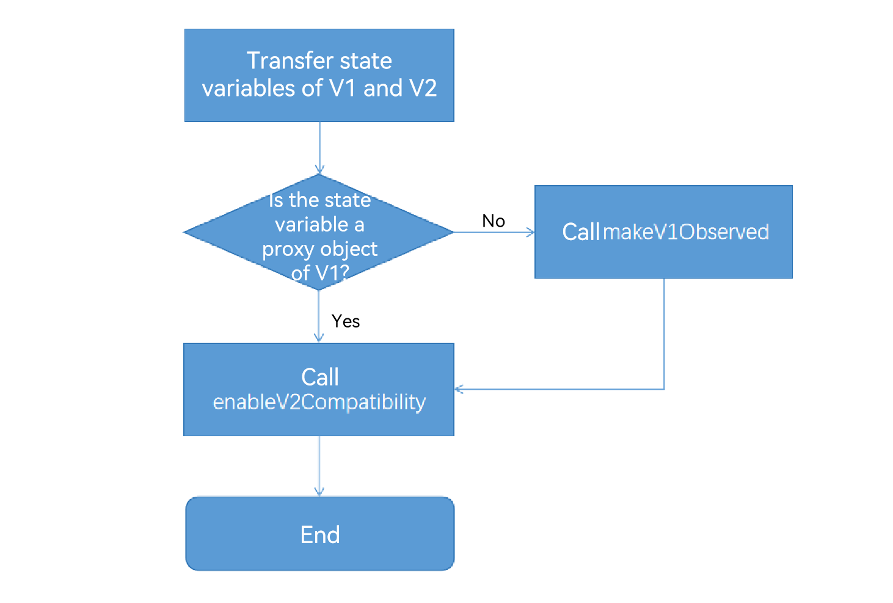
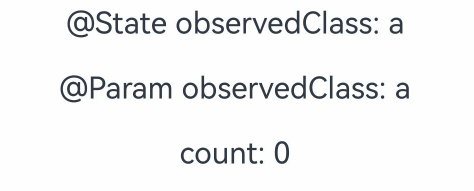
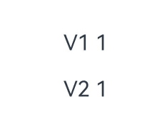
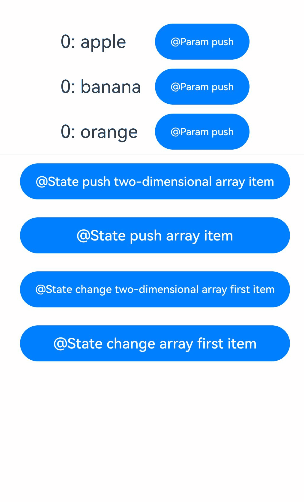
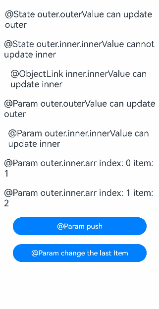
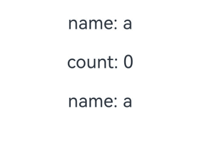
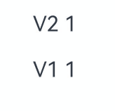
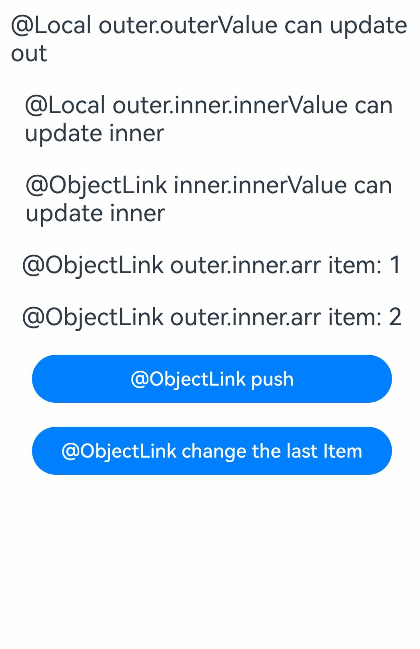

# Mixed Use of State Management V1 and V2 (API Version 19 and Later)

<!--Kit: ArkUI--> 
<!--Subsystem: ArkUI--> 
<!--Owner: @liwenzhen3--> 
<!--Designer: @zhangboren--> 
<!--Tester: @TerryTsao--> 
<!--Adviser: @zhang_yixin13-->
<!-- md-trans-meta sourceCommit=5cbda8a742fe4c75db3800c28ccfc8ffcd9cebc0 translatedAt=2026-06-30T03:38:35.894Z pushedAt=2026-07-01T02:16:53.073Z -->

## Overview

To facilitate smooth migration to state management V2, constraints on the mixed use of state management V1 and V2 are reduced since API version 19. For details about the changes, see [Constraints](#constraints). In addition, new methods [enableV2Compatibility](../../reference/apis-arkui/js-apis-stateManagement.md#enablev2compatibility19) and [makeV1Observed](../../reference/apis-arkui/js-apis-stateManagement.md#makev1observed19) are provided to address mixed usage issues during migration.

> **NOTE**
> 
> In this topic, the symbol "->" is used to indicate the passing of variables. For example, "V1 -> V2" indicates that a state variable of V1 is passed to the V2.

## Constraints

1. V1 decorators cannot be used with [@ObservedV2](./arkts-new-observedV2-and-trace.md). \@ObservedV2/\@Trace has its own independent observation capability, which can be used in [@ComponentV2](./arkts-create-custom-components.md#componentv2) and [@Component](./arkts-create-custom-components.md#component) independently. The state management framework does not allow the observation capability of \@ObservedV2/\@Trace to be used with the observation capability of V1. Therefore, the prohibition persists.

2. V2->V1: V1 does not support the use of decorators to receive the class decorated by \@ObservedV2. Otherwise, a compilation error is reported.

3. [\@Link](./arkts-link.md) in V1 complies with the original initialization rules and can be initialized only by V1 state variables. For details, see [\@Link Initialization Rules](./arkts-link.md#variable-transferaccess-rules). Because [@Link](./arkts-link.md) in V1 can only establish a two-way synchronization relationship with the V1 state variable, you can use \@Param and \@Event to implement two-way synchronization in V2. For details, see [@Link -> @Param/@Event](./arkts-v1-v2-migration-inner-component.md#link---paramevent).

## APIs are added.

### makeV1Observed

The [makeV1Observed](../../reference/apis-arkui/js-apis-stateManagement.md#makev1observed19) API encapsulates non-observable objects into observable objects of state management V1. **makeV1Observed** has the same capability as \@Observed, and its return value can be used to initialize \@ObjectLink.

> **NOTE**
> 
> Starting from API version 19, you can use the **makeV1Observed** API in UIUtils to wrap non-observable objects into observable objects of state management V1.

**API Description**

- **makeV1Observed** is used together with **enableV2Compatibility** for V2 -> V1 transfer.

- **makeV1Observed** converts a common class, Array, Map, Set, or Date type to a state variable of V1. Its capability is equivalent to \@Observed. Therefore, the return value can be used to initialize \@ObjectLink.

- If the data received by **makeV1Observed** is already the state variable of V1, **makeV1Observed** returns itself without any change.

- **makeV1Observed** does not execute recursively. It only wraps the first layer into the state variable of V1.

**Constraints**

<!--PR1-->

- [collections](../../reference/apis-arkts/arkts-apis-arkts-collections.md) types and classes decorated with [@Sendable](../../arkts-utils/arkts-sendable.md) are not supported.

<!--PR1End-->

- Non-object types are not supported.

- **undefined** and **null** are not supported.

- The return values of \@ObservedV2 and [makeObserved](../../reference/apis-arkui/js-apis-stateManagement.md#makeobserved), and variables of built-in types (such as Array, Map, Set, and Date) decorated with V2 decorators are not supported.

### enableV2Compatibility

[enableV2Compatibility](../../reference/apis-arkui/js-apis-stateManagement.md#enablev2compatibility19) enables the observation capability of V2 for the state variable of V1, that is, the state variable of V1 can be observed in \@ComponentV2.

> **NOTE**
> 
> Starting from API version 19, you can use the **enableV2Compatibility** API in UIUtils to make V1 state variables compatible with V2.

**API Description**

- This API is mainly used in the V1 -> V2 transfer. After the state variable of V1 calls this API and is transferred to \@ComponentV2, the change can be observed in V2 to implement associated data update.

- **enableV2Compatibility** applies only to V1 state variables. The state variable of V1 is a variable decorated by the decorator of V1, such as \@Observed, [@State](./arkts-state.md), [@Prop](./arkts-prop.md), [@Link](./arkts-link.md), [@Provide](./arkts-provide-and-consume.md), [@Consume](./arkts-provide-and-consume.md), and [@ObjectLink](./arkts-observed-and-objectlink.md) (\@ObjectLink must be an instance decorated by \@Observed or the return value of **makeV1Observed**). Otherwise, the input parameter itself is returned.

- **enableV2Compatibility** recursively traverses all properties of the class and all subitems of the Array, Set, and Map until data of non-V1 state variables is found. Then, the traversal of the current branch is stopped.

**Constraints**

- Non-object types are not supported.

- **undefined** and **null** are not supported.

- Non-V1 state variable data is not supported.

- The return values of \@ObservedV2 and [makeObserved](../../reference/apis-arkui/js-apis-stateManagement.md#makeobserved), and variables of built-in types (such as Array, Map, Set, and Date) decorated with V2 decorators are not supported.

## Mixed Use Rules

- When complex data is transferred from V1 to V2, call **enableV2Compatibility**; otherwise, data association between V1 and V2 cannot be implemented. It is recommended that **enableV2Compatibility** be called at the construction position of the V2 component. Otherwise, **enableV2Compatibility** needs to be manually called again when a value is assigned to the entire variable. 

  ```ts
  // Recommended usage. UIUtils.enableV2Compatibility does not need to be called when this.state = new ObservedClass(), reducing the code amount.
  SubComponentV2({param: UIUtils.enableV2Compatibility(this.state)})
  
  // Not recommended. When a value is assigned to the state as a whole, UIUtils.enableV2Compatibility needs to be called again.
  // Otherwise, the variable of V1 transferred to SubComponentV2 cannot be observed in V2.
  // @State state: ObservedClass = UIUtils.enableV2Compatibility(new ObservedClass());
  // this.state = UIUtils.enableV2Compatibility(new ObservedClass());
  SubComponentV2({param: this.state})
  ```

- When complex data is transferred from V2 to V1, declare the data as V1 state variable data in V2 and call **UIUtils.enableV2Compatibility**. This is because in state management V1, state variables have the capability of observing the top-level properties by default, while in state management V2, they only have the capability of observing themselves. If data association is required, **UIUtils.enableV2Compatibility(UIUtils.makeV1Observed())** needs to be called to align the observation capabilities of both parties. 

  ```ts
  // Recommended usage
  @Local unObservedClass: UnObservedClass = UIUtils.enableV2Compatibility(UIUtils.makeV1Observed(new UnObservedClass()));
  
  // Recommended usage. ObservedClass is a class decorated by @Observed.
  @Local observedClass: ObservedClass = UIUtils.enableV2Compatibility(new ObservedClass());
  ```

- **UIUtils.enableV2Compatibility(UIUtils.makeV1Observed())** does not change the observation capabilities of V1 and V2.

  - In V1, **UIUtils.enableV2Compatibility(UIUtils.makeV1Observed())** is equal to the observation capability of V1, which can observe the value assignment of the data and the top-level property. In-depth observation cannot be performed. If in-depth observation is required, \@ObjectLink must be used together.

  - In V2, **UIUtils.enableV2Compatibility(UIUtils.makeV1Observed())** can be used for in-depth observation, but each layer must be a class decorated by \@Observed or a return value of **makeV1Observed**.

  - If **enableV2Compatibility** and **makeV1Observed** are not used, a dual proxy problem occurs. As a result, the same state object is generated by the V1 and V2 state management systems at the same time, causing an observation logic conflict.

- When V2 observation capabilities is enabled for the data (that is, after calling **UIUtils.enableV2Compatibility**), V2 observation capabilities is enabled for newly added data by default. However, you need to ensure that the newly added data is a class decorated with \@Observed or the return value of **makeV1Observed**. For details, see [Transferring the Nested Type (V1->V2)](#transferring-the-nested-type-v1-v2) and [Transferring the Nested Type (V2->V1)](#transferring-the-nested-type-v2-v1). 

  ```ts
  let arr: Array<ArrayItem> = UIUtils.enableV2Compatibility(UIUtils.makeV1Observed(new Array<ArrayItem>()));
  
  arr.push(new ArrayItem()); // The new data is not a state variable of V1. Therefore, the observation capability of V2 is unavailable.
  arr.push(UIUtils.makeV1Observed(new ArrayItem())); // The new data is the state variable of V1, which can be observed in V2 by default.
  ```

- For built-in types, such as Array, Map, Set, and Date, both V1 and V2 can observe the changes caused by their own value assignment and API calls. Although you can refresh data in some simple scenarios without calling UIUtils.enableV2Compatibility, a dual proxy problem may occur, resulting in poor performance. Therefore, you are advised to use UIUtils.enableV2Compatibility(UIUtils.makeV1Observed()). For details, see [Transferring the Built-in Type (V1->V2)](#transferring-the-built-in-type-v1-v2), [Transferring the Built-in Type (V2->V1)](#transferring-the-built-in-type-v2-v1).

- For a class with properties decorated with [@Track](./arkts-track.md), using the properties not decorated with \@Track will not crash in \@ComponentV2 but will crash in \@Component. For details, see [Transferring the Class Type (V1->V2)](#transferring-the-class-type-v1-v2), [Transferring the Class Type (V2->V1)](#transferring-the-class-type-v2-v1).

When calling the two APIs to use V1 and V2 together, you can comply with the logic shown in the following figure.



## Using V2 Custom Components in V1

### Transferring the Class Type (V1->V2)

**Common Class**

In the following code, when the state variable of V1 is transferred to V2, the **enableV2Compatibility** API is called, which enables the V1 variable **observedClass** to have the observation capability in V2 components.

<!-- @[state_mixed_scene_js_v1_v2_recommend](https://gitcode.com/openharmony/applications_app_samples/blob/master/code/DocsSample/ArkUISample/ParadigmStateRestock/entry/src/main/ets/pages/mixedStateManageV1V2/StateMixedSceneJsV1V2Recommend.ets) --> 

``` TypeScript
import { UIUtils } from '@kit.ArkUI';

class ObservedClass {
  public name: string = 'Tom';
}

@Entry
@Component
struct CompV1 {
  @State observedClass: ObservedClass = new ObservedClass();

  build() {
    Column() {
      Text(`@State observedClass: ${this.observedClass.name}`)
        .fontSize(20)
        .margin(10)
        .onClick(() => {
          this.observedClass.name += '!'; // Refresh
        })
      // Call UIUtils.enableV2Compatibility to enable V1 state variables to have the observation capability in @ComponentV2.
      CompV2({ observedClass: UIUtils.enableV2Compatibility(this.observedClass) })
    }
    .width('100%')
  }
}

@ComponentV2
struct CompV2 {
  @Param observedClass: ObservedClass = new ObservedClass();

  build() {
    // After V2 observation capabilities are enabled for V1 state variables, their top-level property changes can be observed in V2.
    Text(`@Param observedClass: ${this.observedClass.name}`)
      .fontSize(20)
      .margin(10)
      .onClick(() => {
        this.observedClass.name += '!'; // Refresh
      })
  }
}
```


**\@Observed and \@Track Decorated Class**

For a class decorated with \@Observed, variables decorated with the **enableV2Compatibility** API are transferred from V1 to V2. The \@Track-decorated properties of the variable can be observed in both V1 and V2. However, non-\@Track-decorated properties used in the UI of V1 will result in runtime errors, while those used in V2 will not report errors, but the UI will not respond to updates.

In the following example:

- **name** is a \@Track decorated property, which is observable in both V1 and V2.

- **count** is a non-\@Track decorated property and is invalid in both V1 and V2 UIs.

  - In V1, if a non-\@Track decorated property is used in the UI, an error is reported during runtime.

  - In V2, if a non-\@Track decorated property is used in the UI, no error is reported, but the UI does not respond to updates.

<!-- @[state_mixed_scene_observed_class_v1_v2](https://gitcode.com/openharmony/applications_app_samples/blob/master/code/DocsSample/ArkUISample/ParadigmStateRestock/entry/src/main/ets/pages/mixedStateManageV1V2/StateMixedSceneObservedClassV1V2.ets) --> 

``` TypeScript
import { UIUtils } from '@kit.ArkUI';

@Observed
class ObservedClass {
  @Track public name: string = 'a';
  public count: number = 0;
}

@Entry
@Component
struct CompV1 {
  @State observedClass: ObservedClass = new ObservedClass();

  build() {
    Column() {
      Text(`@State observedClass: ${this.observedClass.name}`)
        .fontSize(20)
        .margin(10)
        .onClick(() => {
          this.observedClass.name += 'a'; // Trigger refresh.
        })
      // Call UIUtils.enableV2Compatibility to enable V1 state variables to have the observation capability in @ComponentV2.
      CompV2({ observedClass: UIUtils.enableV2Compatibility(this.observedClass) })
    }
    .width('100%')
  }
}

@ComponentV2
struct CompV2 {
  @Param observedClass: ObservedClass = new ObservedClass();

  build() {
    Column() {
      // After V2 observation capabilities are enabled for V1 state variables, their top-level property changes can be observed in V2.
      Text(`@Param observedClass: ${this.observedClass.name}`)
        .fontSize(20)
        .margin(10)
        .onClick(() => {
          this.observedClass.name += '!'; // Refresh
        })

      // If a non-@Track variable is used, the system does not crash in V2, but does not respond to updates.
      Text(`count: ${this.observedClass.count}`)
        .fontSize(20)
        .margin(10)
        .onClick(() => {
          this.observedClass.count++; // Refresh is not triggered.
        })
    }
    .width('100%')
  }
}
```



### Transferring the Built-in Type (V1->V2)

The following uses Array as an example. You are advised to call **enableV2Compatibility** and **makeV1Observed** to avoid the dual proxy problem of V1 and V2.

<!-- @[state_mixed_scene_built_type_v1_v2_recommend](https://gitcode.com/openharmony/applications_app_samples/blob/master/code/DocsSample/ArkUISample/ParadigmStateRestock/entry/src/main/ets/pages/mixedStateManageV1V2/StateMixedSceneBuiltTypeV1V2Recommend.ets) --> 

``` TypeScript
import { UIUtils } from '@kit.ArkUI';

@Entry
@Component
struct ArrayCompV1 {
  @State arr: Array<number> = UIUtils.makeV1Observed([1, 2, 3]);

  build() {
    Column() {
      Text(`V1 ${this.arr[0]}`)
        .fontSize(20)
        .margin(10)
        .onClick(() => {
          // Tap to trigger changes in ArrayCompV1 and ArrayCompV2.
          this.arr[0]++;
        })
      // When the variable is transferred to V2, it is found that the current proxy is encapsulated by makeV1Observed and the V2 observation capability is enabled.
      // In ArrayCompV2, Param does not encapsulate the proxy again to avoid the dual proxy problem.
      ArrayCompV2({ arr: UIUtils.enableV2Compatibility(this.arr) })
    }
    .height('100%')
    .width('100%')
  }
}

@ComponentV2
struct ArrayCompV2 {
  @Param arr: Array<number> = [1, 2, 3];

  build() {
    Column() {
      Text(`V2 ${this.arr[0]}`)
        .fontSize(20)
        .margin(10)
        .onClick(() => {
          // Tap to trigger changes in ArrayCompV1 and ArrayCompV2.
          this.arr[0]++;
        })
    }
    .width('100%')
  }
}
```



### Transferring a Two-Dimensional Array (V1->V2)

In the following example:

- **makeV1Observed** is used to change the inner array of the two-dimensional array to the state variables of V1.

- When the state variables of V1 are transferred to V2 child components, enableV2Compatibility is called to enable the V2 observation capability and avoid the dual proxy problem.

<!-- @[state_mixed_scene_two_bit_array_v1_v2](https://gitcode.com/openharmony/applications_app_samples/blob/master/code/DocsSample/ArkUISample/ParadigmStateRestock/entry/src/main/ets/pages/mixedStateManageV1V2/StateMixedSceneTwoBitArrayV1V2.ets) -->  

``` TypeScript
import { UIUtils } from '@kit.ArkUI';

@ComponentV2
struct Item {
  @Require @Param itemArr: Array<string>;

  build() {
    Row() {
      ForEach(this.itemArr, (item: string, index: number) => {
        Text(`${index}: ${item}`)
          .width('30%')
          .fontSize(20)
      }, (item: string) => item + Math.random())
      // Add an array element.
      Button('@Param push')
        .width('30%')
        .onClick(() => {
          this.itemArr.push('Param');
        })
    }
    .margin(5)
  }
}

@Entry
@Component
struct IndexPage {
  @State arr: Array<Array<string>> =
    [UIUtils.makeV1Observed(['apple']), UIUtils.makeV1Observed(['banana']), UIUtils.makeV1Observed(['orange'])];

  build() {
    Column() {
      ForEach(this.arr, (itemArr: Array<string>) => {
        Item({ itemArr: UIUtils.enableV2Compatibility(itemArr) })
      }, (itemArr: Array<string>) => JSON.stringify(itemArr) + Math.random())
      Divider()
      // Add an element to arr[0].
      Button('@State push two-dimensional array item')
        .width(300)
        .margin(10)
        .onClick(() => {
          this.arr[0].push('strawberry');
        })
      // Add an element to arr.
      Button('@State push array item')
        .width(300)
        .margin(10)
        .onClick(() => {
          this.arr.push(UIUtils.makeV1Observed(['pear']));
        })
      // Change the value of arr[0][0].
      Button('@State change two-dimensional array first item')
        .width(300)
        .margin(10)
        .onClick(() => {
          this.arr[0][0] = 'APPLE';
        })
      // Modify the first element of arr.
      Button('@State change array first item')
        .width(300)
        .margin(10)
        .onClick(() => {
          this.arr[0] = UIUtils.makeV1Observed(['watermelon']);
        })
    }
    .width('100%')
  }
}
```



### Transferring the Nested Type (V1->V2)

You can implement deep observation based on \@Observed and \@ObjectLink in state management V1. The following code example shows the nested scenario:

When the **outer** class is transferred to the V2 child component **NestedClassV2**, **enableV2Compatibility** is called to enable the V2 observation capability. If **enableV2Compatibility** is not called when transferring the object to V2, \@Param cannot observe the object properties.

<!-- @[state_mixed_scene_nested_type_v1_v2](https://gitcode.com/openharmony/applications_app_samples/blob/master/code/DocsSample/ArkUISample/ParadigmStateRestock/entry/src/main/ets/pages/mixedStateManageV1V2/StateMixedSceneNestedTypeV1V2.ets) --> 

``` TypeScript
import { UIUtils } from '@kit.ArkUI';

class ArrayItem {
  public value: number = 0;

  constructor(value: number) {
    this.value = value;
  }
}

class Inner {
  public innerValue: string = 'inner';
  public arr: Array<ArrayItem>;

  constructor(arr: Array<ArrayItem>) {
    this.arr = arr;
  }
}

class Outer {
  @Track public outerValue: string = 'outer';
  @Track public inner: Inner;

  constructor(inner: Inner) {
    this.inner = inner;
  }
}

@Entry
@Component
struct NestedClassV1 {
  // Ensure that each layer uses the state variable of V1.
  @State outer: Outer =
    UIUtils.makeV1Observed(new Outer(
      UIUtils.makeV1Observed(new Inner(UIUtils.makeV1Observed([
        UIUtils.makeV1Observed(new ArrayItem(1)),
        UIUtils.makeV1Observed(new ArrayItem(2))
      ])))
    ));

  build() {
    Column() {
      Text(`@State outer.outerValue can update ${this.outer.outerValue}`)
        .fontSize(20)
        .margin(10)
        .onClick(() => {
          // @State can observe the top-level changes.
          // Notify @ObjectLink and @Param of the change.
          this.outer.outerValue += '!';
        })

      Text(`@State outer.inner.innerValue cannot update ${this.outer.inner.innerValue}`)
        .fontSize(20)
        .margin(10)
        .onClick(() => {
          // @State cannot observe the changes at the second layer.
          // However, the change will be observed by @ObjectLink and @Param.
          this.outer.inner.innerValue += '!';
        })
      // Transfer inner to @ObjectLink to observe the change of the inner property.
      NestedClassV1ObjectLink({ inner: this.outer.inner })
      // Transfer the data processed by enableV2Compatibility to V2.
      NestedClassV2({ outer: UIUtils.enableV2Compatibility(this.outer) })
    }
    .height('100%')
    .width('100%')
  }
}

@Component
struct NestedClassV1ObjectLink {
  @ObjectLink inner: Inner;

  build() {
    Text(`@ObjectLink inner.innerValue can update ${this.inner.innerValue}`)
      .fontSize(20)
      .margin(10)
      .onClick(() => {
        // Trigger refresh. @ObjectLink and @Param are referenced by the same object and @Param is also refreshed.
        this.inner.innerValue += '!';
      })
  }
}

@ComponentV2
struct NestedClassV2 {
  @Require @Param outer: Outer;

  build() {
    Column() {
      Text(`@Param outer.outerValue can update ${this.outer.outerValue}`)
        .fontSize(20)
        .margin(10)
        .onClick(() => {
          // The top-level changes can be observed.
          this.outer.outerValue += '!';
        })
      Text(`@Param outer.inner.innerValue can update ${this.outer.inner.innerValue}`)
        .fontSize(20)
        .margin(10)
        .onClick(() => {
          // The changes at the second layer can be observed. @Param and @ObjectLink are referenced by the same object and also trigger the refresh.
          this.outer.inner.innerValue += '!';
        })

      Repeat(this.outer.inner.arr)
        .each((item: RepeatItem<ArrayItem>) => {
          Text(`@Param outer.inner.arr index: ${item.index} item: ${item.item.value}`)
            .fontSize(20)
            .margin(10)
        })

      Button('@Param push')
        .width(300)
        .margin(10)
        .onClick(() => {
          // outer has enabled V2 observation capabilities. For newly added data, V2 observation capabilities are enabled by default.
          this.outer.inner.arr.push(UIUtils.makeV1Observed(new ArrayItem(20)));
        })

      Button('@Param change the last Item')
        .width(300)
        .margin(10)
        .onClick(() => {
          // The property changes of the last array item can be observed.
          this.outer.inner.arr[this.outer.inner.arr.length - 1].value++;
        })
    }
    .width('100%')
  }
}
```



The refresh behavior of the preceding example can be summarized as follows:

- \@State can observe only the top-level changes. To perform in-depth observation, variables should be transferred to \@ObjectLink.

- The change of the second layer of \@State cannot cause the refresh of the current layer. However, the change can be observed by \@ObjectLink and \@Param and triggers the re-render of the associated components.

- \@ObjectLink and \@Param are referenced by the same object. If their properties are changed, other references are refreshed.

## Using V1 Custom Components in V2

### Transferring the Class Type (V2->V1)

**Common Class**

The observation capabilities of V1 and V2 are different. If **UIUtils.enableV2Compatibility(UIUtils.makeV1Observed())** is not called to directly transfer data, the data is not updated or the update behavior is inconsistent.

<!-- @[state_mixed_scene_js_v2_v1_recommend](https://gitcode.com/openharmony/applications_app_samples/blob/master/code/DocsSample/ArkUISample/ParadigmStateRestock/entry/src/main/ets/pages/mixedStateManageV1V2/StateMixedSceneJsV2V1Recommend.ets) --> 

``` TypeScript
import { UIUtils } from '@kit.ArkUI';

class ObservedClass {
  public name: string = 'Tom';
}

@Entry
@ComponentV2
struct CompV2 {
  @Local observedClass: ObservedClass = UIUtils.enableV2Compatibility(UIUtils.makeV1Observed(new ObservedClass()));

  build() {
    Column() {
      // @Local can only observe itself.
      // However, UIUtils.makeV1Observed is called to change @Local to the state variable of V1, whose top-level changes are observable.
      // Call UIUtils.enableV2Compatibility to make it observable in V2.
      // Currently, the top-level property changes can be observed.
      Text(`@Local observedClass: ${this.observedClass.name}`)
        .fontSize(20)
        .margin(10)
        .onClick(() => {
          this.observedClass.name += '!'; // Refresh
        })
      // @ObjectLink can accept instances of classes decorated with @Observed or the return values of makeV1Observed.
      CompV1({ observedClass: this.observedClass })
    }
    .width('100%')
  }
}

@Component
struct CompV1 {
  @ObjectLink observedClass: ObservedClass;

  build() {
    // The top-level changes can be observed in CompV1.
    Text(`@ObjectLink observedClass: ${this.observedClass.name}`)
      .fontSize(20)
      .margin(10)
      .onClick(() => {
        this.observedClass.name += '!'; // Refresh
      })
  }
}
```


**\@Observed and \@Track Decorated Class**

In the following example:

- ObservedClass is a class decorated with \@Observed, so there is no need to call **UIUtils.makeV1Observed** again when transferring it to V1 and calling **UIUtils.enableV2Compatibility**.

- Only the \@Track decorated variables can be observed in V1 and V2. Properties not decorated with \@Track causes runtime errors when they are used on the V1 UI. In V2, no error is reported but the UI does not respond to updates.

<!-- @[state_mixed_scene_observed_class_v2_v1](https://gitcode.com/openharmony/applications_app_samples/blob/master/code/DocsSample/ArkUISample/ParadigmStateRestock/entry/src/main/ets/pages/mixedStateManageV1V2/StateMixedSceneObservedClassV2V1.ets) --> 

``` TypeScript
import { UIUtils } from '@kit.ArkUI';

@Observed
class ObservedClass {
  @Track public name: string = 'a';
  public count: number = 0;
}

@Entry
@ComponentV2
struct CompV2 {
  @Local observedClass: ObservedClass = UIUtils.enableV2Compatibility(new ObservedClass());

  build() {
    Column() {
      Text(`name: ${this.observedClass.name}`)
        .fontSize(20)
        .margin(10)
        .onClick(() => {
          // Trigger a refresh.
          this.observedClass.name += 'a';
        })
      // The system does not crash when a non-@Track variable is used in V2, but the refresh is not responded as well.
      Text(`count: ${this.observedClass.count}`)
        .fontSize(20)
        .margin(10)
        .onClick(() => {
          this.observedClass.count++;
        })

      CompV1({ observedClass: this.observedClass })
    }
    .width('100%')
  }
}

@Component
struct CompV1 {
  @ObjectLink observedClass: ObservedClass;

  build() {
    Column() {
      Text(`name: ${this.observedClass.name}`)
        .fontSize(20)
        .margin(10)
        .onClick(() => {
          // Trigger a refresh.
          this.observedClass.name += 'a';
        })
    }
    .width('100%')
  }
}
```



### Transferring the Built-in Type (V2->V1)

If you declare **\@Local arr: Array\<number> = UIUtils.enableV2Compatibility(UIUtils.makeV1Observed([1, 2, 3]))** in V2, V2 can observe changes to the properties because the variable is decorated with the \@Local decorator. However, if **enableV2Compatibility** and **makeV1Observed** are not called, V1 cannot observe the property changes. Therefore, you need to call **UIUtils.enableV2Compatibility(UIUtils.makeV1Observed())** to allow V1 to observe property changes.

<!-- @[state_mixed_scene_built_type_v2_v1_recommend](https://gitcode.com/openharmony/applications_app_samples/blob/master/code/DocsSample/ArkUISample/ParadigmStateRestock/entry/src/main/ets/pages/mixedStateManageV1V2/StateMixedSceneBuiltTypeV2V1Recommend.ets) --> 

``` TypeScript
import { UIUtils } from '@kit.ArkUI';

@Entry
@ComponentV2
struct ArrayCompV2 {
  @Local arr: Array<number> = UIUtils.enableV2Compatibility(UIUtils.makeV1Observed([1, 2, 3]));

  build() {
    Column() {
      Text(`V2 ${this.arr[0]}`)
        .fontSize(20)
        .margin(10)
        .onClick(() => {
          // Tap to trigger V2 changes, and sync to @ObjectLink of V1.
          this.arr[0]++;
        })
      ArrayCompV1({ arr: this.arr })
    }
    .height('100%')
    .width('100%')
  }
}

@Component
struct ArrayCompV1 {
  @ObjectLink arr: Array<number>;

  build() {
    Column() {
      Text(`V1 ${this.arr[0]}`)
        .fontSize(20)
        .margin(10)
        .onClick(() => {
          // Tap to trigger V1 changes, and bidirectionally sync back to V2.
          this.arr[0]++;
        })
    }
    .width('100%')
  }
}
```



### Transferring a Two-Dimensional Array (V2->V1)

In the following example:

- **makeV1Observed** is used to change the inner array of the two-dimensional array to the state variables of V1. **enableV2Compatibility** is called to enable the V2 observation capability and avoid the dual proxy problem.

- In V1, when using \@ObjectLink to receive the inner arrays (the return value of makeV1Observed) of a 2D array, clicking the **Button('@ObjectLink push')** will trigger normal UI refreshes.

<!-- @[state_mixed_scene_two_bit_array_v2_v1](https://gitcode.com/openharmony/applications_app_samples/blob/master/code/DocsSample/ArkUISample/ParadigmStateRestock/entry/src/main/ets/pages/mixedStateManageV1V2/StateMixedSceneTwoBitArrayV2V1.ets) -->  

``` TypeScript
import { UIUtils } from '@kit.ArkUI';

@Component
struct Item {
  @ObjectLink itemArr: Array<string>;

  build() {
    Row() {
      ForEach(this.itemArr, (item: string, index: number) => {
        Text(`${index}: ${item}`)
          .fontSize(20)
          .margin(5)
      }, (item: string) => item + Math.random())
      // Add an array element.
      Button('@ObjectLink push')
        .width('40%')
        .onClick(() => {
          this.itemArr.push('ObjectLink');
        })
    }
    .height('100%')
  }
}

@Entry
@ComponentV2
struct IndexPage {
  @Local arr: Array<Array<string>> =
    UIUtils.enableV2Compatibility(UIUtils.makeV1Observed([UIUtils.makeV1Observed(['apple']),
      UIUtils.makeV1Observed(['banana']), UIUtils.makeV1Observed(['orange'])]));

  build() {
    Column() {
      ForEach(this.arr, (itemArr: Array<string>) => {
        Item({ itemArr: itemArr })
      }, (itemArr: Array<string>) => JSON.stringify(itemArr) + Math.random())
      Divider()
      // Add an element to arr[0].
      Button('@Local push two-dimensional array item')
        .width(300)
        .margin(10)
        .onClick(() => {
          this.arr[0].push('strawberry');
        })
      // Add an element to arr.
      Button('@Local push array item')
        .width(300)
        .margin(10)
        .onClick(() => {
          this.arr.push(UIUtils.makeV1Observed(['pear']));
        })
      // Change the value of arr[0][0].
      Button('@Local change two-dimensional array first item')
        .width(300)
        .margin(10)
        .onClick(() => {
          this.arr[0][0] = 'APPLE';
        })
      // Modify the first element of arr.
      Button('@Local change array first item')
        .width(300)
        .margin(10)
        .onClick(() => {
          this.arr[0] = UIUtils.makeV1Observed(['watermelon']);
        })
    }
    .width('100%')
  }
}
```


### Transferring the Nested Type (V2->V1)

In the following example:

- In NestedClassV2, **outer** calls **UIUtils.enableV2Compatibility**, and each layer is the return value of **UIUtils.makeV1Observed**. Therefore, outer has the in-depth observation capability in V2.

- In V1, only the top-level changes can be observed. Therefore, multiple layers of custom components are required, and \@ObjectLink needs to be used together at each layer to receive the corresponding state data, thereby achieving the capability of deep observation.

<!-- @[state_mixed_scene_nested_type_v2_v1](https://gitcode.com/openharmony/applications_app_samples/blob/master/code/DocsSample/ArkUISample/ParadigmStateRestock/entry/src/main/ets/pages/mixedStateManageV1V2/StateMixedSceneNestedTypeV2V1.ets) --> 

``` TypeScript
import { UIUtils } from '@kit.ArkUI';

class ArrayItem {
  public value: number = 0;

  constructor(value: number) {
    this.value = value;
  }
}

class Inner {
  public innerValue: string = 'inner';
  public arr: Array<ArrayItem>;

  constructor(arr: Array<ArrayItem>) {
    this.arr = arr;
  }
}

class Outer {
  @Track public outerValue: string = 'out';
  @Track public inner: Inner;

  constructor(inner: Inner) {
    this.inner = inner;
  }
}

@Entry
@ComponentV2
struct NestedClassV2 {
  // Ensure that each layer uses the state variable of V1.
  @Local outer: Outer = UIUtils.enableV2Compatibility(
    UIUtils.makeV1Observed(new Outer(
      UIUtils.makeV1Observed(new Inner(UIUtils.makeV1Observed([
        UIUtils.makeV1Observed(new ArrayItem(1)),
        UIUtils.makeV1Observed(new ArrayItem(2))
      ])))
    )));

  build() {
    Column() {
      Text(`@Local outer.outerValue can update ${this.outer.outerValue}`)
        .fontSize(20)
        .margin(10)
        .onClick(() => {
          // The top-level changes can be observed.
          this.outer.outerValue += '!';
        })

      Text(`@Local outer.inner.innerValue can update ${this.outer.inner.innerValue}`)
        .fontSize(20)
        .margin(10)
        .onClick(() => {
          // The changes at the second layer can be observed.
          this.outer.inner.innerValue += '!';
        })
      // Transfer inner to @ObjectLink to observe the change of the inner property.
      NestedClassV1ObjectLink({ inner: this.outer.inner })
    }
    .height('100%')
    .width('100%')
  }
}

@Component
struct NestedClassV1ObjectLink {
  @ObjectLink inner: Inner;

  build() {
    Column() {
      Text(`@ObjectLink inner.innerValue can update ${this.inner.innerValue}`)
        .fontSize(20)
        .margin(10)
        .onClick(() => {
          // Trigger the refresh.
          this.inner.innerValue += '!';
        })
      NestedClassV1ObjectLinkArray({ arr: this.inner.arr })
    }
    .width('100%')
  }
}

@Component
struct NestedClassV1ObjectLinkArray {
  @ObjectLink arr: Array<ArrayItem>;

  build() {
    Column() {
      ForEach(this.arr, (item: ArrayItem) => {
        NestedClassV1ObjectLinkArrayItem({ item: item })
      }, (item: ArrayItem, index: number) => {
        return item.value.toString() + index.toString();
      })

      Button('@ObjectLink push')
        .width(300)
        .margin(10)
        .onClick(() => {
          this.arr.push(UIUtils.makeV1Observed(new ArrayItem(20)));
        })

      Button('@ObjectLink change the last Item')
        .width(300)
        .margin(10)
        .onClick(() => {
          // In NestedClassV1ObjectLinkArrayItem, property changes of the last array item can be observed.
          this.arr[this.arr.length - 1].value++;
        })
    }
    .width('100%')
  }
}

@Component
struct NestedClassV1ObjectLinkArrayItem {
  @ObjectLink item: ArrayItem;

  build() {
    Text(`@ObjectLink outer.inner.arr item: ${this.item.value}`)
      .fontSize(20)
      .margin(10)
  }
}
```

