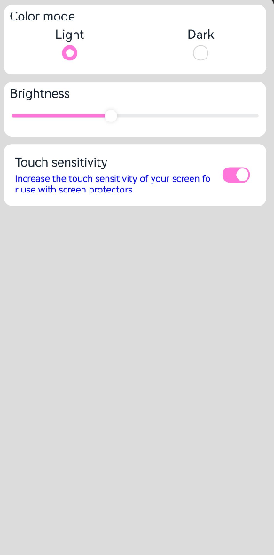
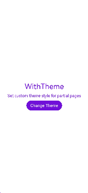
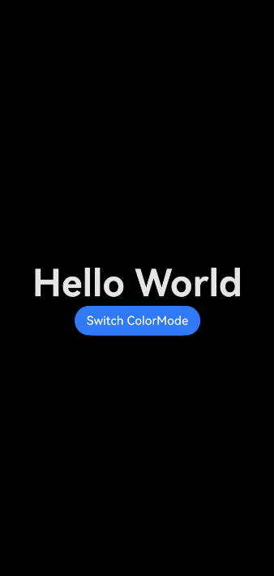
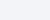

# Setting Theme Skinning

## Overview

Applications developed using the ArkTS-based declarative development paradigm can implement component theming, including local light/dark modes and dynamic skin changes. This feature does not support the C-API and Node-API, and it does not support theme settings for abilities and windows.
This document covers the following topics:
- [Customizing Brand Colors](#customizing-brand-colors)
- [Setting Custom Brand Colors for Application Components](#setting-custom-brand-colors-for-application-components)
- [Setting a Custom Theme Style for Specific Application Pages](#setting-a-custom-theme-style-for-specific-application-pages)
- [Setting Local Light and Dark Modes for Application Pages](#setting-local-light-and-dark-modes-for-application-pages)


## Customizing Brand Colors
Use [CustomTheme](../reference/apis-arkui/js-apis-arkui-theme.md#customtheme) to tailor themes, by selectively overriding the properties you wish to modify; the unmodified properties will inherit from the system default settings, as described in [System Default Token Color Values](#system-default-token-color-values). The following is an example.

  ```ts
    import { CustomColors, CustomTheme } from '@kit.ArkUI'

    export class AppColors implements CustomColors {
      // Custom brand color
      brand: ResourceColor = '#FF75D9';
    }

    export class AppTheme implements CustomTheme {
      public colors: AppColors = new AppColors()
    }
    
    export let gAppTheme: CustomTheme = new AppTheme()
  ```

## Setting Custom Brand Colors for Application Components
- Set the custom brand colors at the page entry point by executing [ThemeControl](../reference/apis-arkui/js-apis-arkui-theme.md#themecontrol) before the page builds.
Use the [onWillApplyTheme](../reference/apis-arkui/arkui-ts/ts-custom-component-lifecycle.md#onwillapplytheme12) callback function to allow custom components to access the currently active **Theme** object.

  ```ts
    import { Theme, ThemeControl } from '@kit.ArkUI'
    import { gAppTheme } from './AppTheme'
    
    // Execute ThemeControl before the page builds.
    ThemeControl.setDefaultTheme(gAppTheme)

    @Entry
    @Component
    struct DisplayPage {
      @State menuItemColor: ResourceColor = $r('sys.color.background_primary')
      
      onWillApplyTheme(theme: Theme) {
        this.menuItemColor = theme.colors.backgroundPrimary;
      }
    
      build() {
        Column() {
          List({ space: 10 }) {
            ListItem() {
              Column({ space: '5vp' }) {
                Text('Color mode')
                  .margin({ top: '5vp', left: '14fp' })
                  .width('100%')
                Row() {
                  Column() {
                    Text('Light')
                      .fontSize('16fp')
                      .textAlign(TextAlign.Start)
                      .alignSelf(ItemAlign.Center)
                    Radio({ group: 'light or dark', value: 'light' })
                      .checked(true)
                  }
                  .width('50%')

                  Column() {
                    Text('Dark')
                      .fontSize('16fp')
                      .textAlign(TextAlign.Start)
                      .alignSelf(ItemAlign.Center)
                    Radio({ group: 'light or dark', value: 'dark' })
                  }
                  .width('50%')
                }
              }
              .width('100%')
              .height('90vp')
              .borderRadius('10vp')
              .backgroundColor(this.menuItemColor)
            }

            ListItem() {
              Column() {
                Text('Brightness')
                  .width('100%')
                  .margin({ top: '5vp', left: '14fp' })
                Slider({ value: 40, max: 100 })
              }
              .width('100%')
              .height('70vp')
              .borderRadius('10vp')
              .backgroundColor(this.menuItemColor)
            }

            ListItem() {
              Column() {
                Row() {
                  Column({ space: '5vp' }) {
                    Text('Touch sensitivity')
                      .fontSize('16fp')
                      .textAlign(TextAlign.Start)
                      .width('100%')
                    Text('Increase the touch sensitivity of your screen' +
                      ' for use with screen protectors')
                      .fontSize('12fp')
                      .fontColor(Color.Blue)
                      .textAlign(TextAlign.Start)
                      .width('100%')
                  }
                  .alignSelf(ItemAlign.Center)
                  .margin({ left: '14fp' })
                  .width('75%')
    
                  Toggle({ type: ToggleType.Switch, isOn: true })
                    .margin({ right: '14fp' })
                    .alignSelf(ItemAlign.Center)
                }
                .width('100%')
                .height('80vp')
              }
              .width('100%')
              .borderRadius('10vp')
              .backgroundColor(this.menuItemColor)
            }
          }
        }
        .padding('10vp')
        .backgroundColor('#dcdcdc')
        .width('100%')
        .height('100%')
      }
    }
  ```

- Within an ability, set [ThemeControl](../reference/apis-arkui/js-apis-arkui-theme.md#themecontrol) by calling [setDefaultTheme](../reference/apis-arkui/js-apis-arkui-theme.md#setdefaulttheme) in the **onWindowStageCreate()** API.

  ```ts
    import {AbilityConstant, UIAbility, Want } from '@kit.AbilityKit';
    import { hilog } from '@kit.PerformanceAnalysisKit';
    import { window, CustomColors, ThemeControl } from '@kit.ArkUI';

    class AppColors implements CustomColors {
      fontPrimary = 0xFFD53032
      iconOnPrimary = 0xFFD53032
      iconFourth = 0xFFD53032
    }
    
    const abilityThemeColors = new AppColors();
    
    export default class EntryAbility extends UIAbility {
      onCreate(want: Want, launchParam: AbilityConstant.LaunchParam) {
        hilog.info(0x0000, 'testTag', '%{public}s', 'Ability onCreate');
      }
    
      onDestroy() {
        hilog.info(0x0000, 'testTag', '%{public}s', 'Ability onDestroy');
      }
    
      onWindowStageCreate(windowStage: window.WindowStage) {
        // Main window is created, set main page for this ability
        hilog.info(0x0000, 'testTag', '%{public}s', 'Ability onWindowStageCreate');
      
        windowStage.loadContent('pages/Index', (err, data) => {
          if (err.code) {
            hilog.error(0x0000, 'testTag', 'Failed to load the content. Cause: %{public}s', JSON.stringify(err) ?? '');
            return;
          }
          hilog.info(0x0000, 'testTag', 'Succeeded in loading the content. Data: %{public}s', JSON.stringify(data) ?? '');
          // Call setDefaultTheme in the onWindowStageCreate() API.
          ThemeControl.setDefaultTheme({ colors: abilityThemeColors })
          hilog.info(0x0000, 'testTag', '%{public}s', 'ThemeControl.setDefaultTheme done');
        });
      }
    
    }
  ```



Note: If the parameter for **setDefaultTheme** is undefined, refer to [System Default Token Color Values](#system-default-token-color-values) for the default color values associated with the tokens.

## Setting a Custom Theme Style for Specific Application Pages
Use [WithTheme](../reference/apis-arkui/arkui-ts/ts-container-with-theme.md) to apply the color scheme of a custom theme to the default styles of components within the scope. This way, the colors of components within the **WithTheme** scope align with the theme's color scheme.
In the example below, components within the scope are styled with a custom theme by using **WithTheme({ theme: this.myTheme })**. You can switch to a different theme style by updating **this.myTheme**.
The [onWillApplyTheme](../reference/apis-arkui/arkui-ts/ts-custom-component-lifecycle.md#onwillapplytheme12) callback function allows custom components to access the currently active **Theme** object.

  ```ts
    import { CustomColors, CustomTheme, Theme } from '@kit.ArkUI'

    class AppColors implements CustomColors {
      fontPrimary: ResourceColor = $r('app.color.brand_purple')
      backgroundEmphasize: ResourceColor = $r('app.color.brand_purple')
    }
    
    class AppColorsSec implements CustomColors {
      fontPrimary: ResourceColor = $r('app.color.brand')
      backgroundEmphasize: ResourceColor = $r('app.color.brand')
    }
    
    class AppTheme implements CustomTheme {
      public colors: AppColors = new AppColors()
    }
    
    class AppThemeSec implements CustomTheme {
      public colors: AppColors = new AppColorsSec()
    }
    
    @Entry
    @Component
    struct DisplayPage {
      @State customTheme: CustomTheme = new AppTheme()
      @State message: string = 'Set a custom theme style for specific pages'
      count = 0;
    
      build() {
        WithTheme({ theme: this.customTheme }) {
          Row(){
            Column() {
              Text('WithTheme')
                .fontSize(30)
                .margin({bottom: 10})
              Text(this.message)
                .margin({bottom: 10})
              Button('Change Theme').onClick(() => {
                this.count++;
                if (this.count > 1) {
                  this.count = 0;
                }
                switch (this.count) {
                  case 0:
                    this.customTheme = new AppTheme();
                    break;
                  case 1:
                    this.customTheme = new AppThemeSec();
                    break;
                }
              })
            }
            .width('100%')
          }
          .height('100%')
          .width('100%')
        }
      }
    }
  ```



## Setting Local Light and Dark Modes for Application Pages
Use [WithTheme](../reference/apis-arkui/arkui-ts/ts-container-with-theme.md) to set light and dark modes. [ThemeColorMode](../reference/apis-arkui/arkui-ts/ts-appendix-enums.md#themecolormode10) offers three options: **ThemeColorMode.SYSTEM** for following the system setting, **ThemeColorMode.LIGHT** for light mode, and **ThemeColorMode.DARK** for dark mode.<br>
Within the **WithTheme** scope, component styles adapt to the specified light or dark color mode by accessing the corresponding system and application resource values, and the color schemes of components are activated according to the chosen color mode.<br>
In the example below, components within the scope are set to dark mode using **WithTheme({ colorMode: ThemeColorMode.DARK })**.

To enable light and dark modes, add a **dark.json** resource file for the modes to take effect.


Example of the **dark.json** file content:
  ```ts
    {
      "color": [
        {
          "name": "start_window_background",
          "value": "#FFFFFF"
        }
      ]
    }
  ```

  ```ts
    @Entry
    @Component
    struct DisplayPage {
      @State message: string = 'Hello World';
      @State colorMode: ThemeColorMode = ThemeColorMode.DARK;

      build() {
        WithTheme({ colorMode: this.colorMode }) {
          Row() {
            Column() {
              Text(this.message)
                .fontSize(50)
                .fontWeight(FontWeight.Bold)
              Button('Switch ColorMode').onClick(() => {
                if (this.colorMode === ThemeColorMode.LIGHT) {
                  this.colorMode = ThemeColorMode.DARK;
                } else if (this.colorMode === ThemeColorMode.DARK) {
                  this.colorMode = ThemeColorMode.LIGHT;
                }
              })
            }
            .width('100%')
          }
          .backgroundColor($r('sys.color.background_primary'))
          .height('100%')
          .expandSafeArea([SafeAreaType.SYSTEM], [SafeAreaEdge.TOP, SafeAreaEdge.END, SafeAreaEdge.BOTTOM, SafeAreaEdge.START])
        }
      }
    }
  ```



## System Default Token Color Values

| Token                                      | Category| Light |           | Dark    |                                              |
|--------------------------------------------|-----| --- |-----------| ------- | -------------------------------------------- |
| theme.colors.brand                         | Brand color.|#ff0a59f7|  |#ff317af7||
| theme.colors.warning                       | Alert color.|#ffe84026|  |#ffd94838||
| theme.colors.alert                         | Warning color.|#ffed6f21|  |#ffdb6b42||
| theme.colors.confirm                       | Confirmation color.|#ff64bb5c|  |#ff5ba854||
| theme.colors.fontPrimary                   | Primary text color.| #e5000000 |  |#e5ffffff||
| theme.colors.fontSecondary                 | Secondary text color.| #99000000 |  |#99ffffff||
| theme.colors.fontTertiary                  | Tertiary text color.| #66000000 |  |#66ffffff||
| theme.colors.fontFourth                    | Quaternary text color.| #33000000 |  |#33ffffff||
| theme.colors.fontEmphasize                 | Highlight text color.| #ff0a59f7 |  |#ff317af7||
| theme.colors.fontOnPrimary                 | Primary text invert color.| #ffffffff |  |#ff000000||
| theme.colors.fontOnSecondary               | Secondary text invert color.| #99ffffff |  |#99000000||
| theme.colors.fontOnTertiary                | Tertiary text invert color.| #66ffffff |  |#66000000||
| theme.colors.fontOnFourth                  | Quaternary text invert color.| #33ffffff |  |#33000000||
| theme.colors.iconPrimary                   | Primary icon color.| #e5000000 |  |#e5ffffff||
| theme.colors.iconSecondary                 | Secondary icon color.| #99000000 |  |#99ffffff||
| theme.colors.iconTertiary                  | Tertiary icon color.| #66000000 |  |#66ffffff||
| theme.colors.iconFourth                    | Quaternary icon color.| #33000000 |  |#33ffffff||
| theme.colors.iconEmphasize                 | Emphasis icon color.| #ff0a59f7 |  |#ff317af7||
| theme.colors.iconSubEmphasize              | Emphasis auxiliary icon color.| #660a59f7 |  |#66317af7||
| theme.colors.iconOnPrimary                 | Primary icon invert color.| #ffffffff |  |#ff000000||
| theme.colors.iconOnSecondary               | Secondary icon invert color.| #99ffffff |  |#99000000||
| theme.colors.iconOnTertiary                | Tertiary icon invert color.| #66ffffff |  |#66000000||
| theme.colors.iconOnFourth                  | Quaternary icon invert color.| #33ffffff |  |#33000000||
| theme.colors.backgroundPrimary             | Primary background color (solid, opaque).| #ffffffff |  |#ffe5e5e5||
| theme.colors.backgroundSecondary           | Secondary background color (solid, opaque).| #fff1f3f5 |  |#ff191a1c||
| theme.colors.backgroundTertiary            | Tertiary background color (solid, opaque).| #ffe5e5ea |  |#ff202224||
| theme.colors.backgroundFourth              | Quaternary background color (solid, opaque).| #ffd1d1d6 |  |#ff2e3033||
| theme.colors.backgroundEmphasize           | Emphasis background color (solid, opaque).| #ff0a59f7 |  |#ff317af7||
| theme.colors.compForegroundPrimary         | Foreground.| #ff000000 |  | #ffe5e5e5 ||
| theme.colors.compBackgroundPrimary         | White background.| #ffffffff || #ffffffff ||
| theme.colors.compBackgroundPrimaryTran     | White transparent background.| #ffffffff || #33ffffff ||
| theme.colors.compBackgroundPrimaryContrary | Always-on background.| #ffffffff || #ffe5e5e5 ||
| theme.colors.compBackgroundGray            | Gray background.| #fff1f3f5 || #ffe5e5ea ||
| theme.colors.compBackgroundSecondary       | Secondary background.| #19000000 || #19ffffff ||
| theme.colors.compBackgroundTertiary        | Tertiary background.| #0c000000 || #0cffffff ||
| theme.colors.compBackgroundEmphasize       | Emphasis background.| #ff0a59f7 || #ff317af7 ||
| theme.colors.compBackgroundNeutral         | Black, neutral, emphasis background.| #ff000000 || #ffffffff ||
| theme.colors.compEmphasizeSecondary        | 20% emphasis background.| #330a59f7 || #33317af7 ||
| theme.colors.compEmphasizeTertiary         | 10% emphasis background.| #190a59f7 || #19317af7 ||
| theme.colors.compDivider                   | Divider color.| #33000000 || #33ffffff ||
| theme.colors.compCommonContrary            | Common invert color.| #ffffffff || #ff000000 ||
| theme.colors.compBackgroundFocus           | Background color in the focused state.| #fff1f3f5 || #ff000000 ||
| theme.colors.compFocusedPrimary            | Primary inverted color in the focused state.| #e5000000 || #e5ffffff ||
| theme.colors.compFocusedSecondary          | Secondary inverted color in the focused state.| #99000000 || #99ffffff ||
| theme.colors.compFocusedTertiary           | Tertiary inverted color in the focused state.| #66000000 || #66ffffff ||
| theme.colors.interactiveHover              | Common interactive color for the hover state.| #0c000000 || #0cffffff ||
| theme.colors.interactivePressed            | Common interactive color for the pressed state.| #19000000 || #19ffffff ||
| theme.colors.interactiveFocus              | Common interactive color for the focused state.| #ff0a59f7 || #ff317af7 ||
| theme.colors.interactiveActive             | Common interactive color for the active state.| #ff0a59f7 || #ff317af7 ||
| theme.colors.interactiveSelect             | Common interactive color for the selected state.| #33000000 || #33ffffff ||
| theme.colors.interactiveClick              | Common interactive color for the clicked state.| #19000000 || #19ffffff ||
