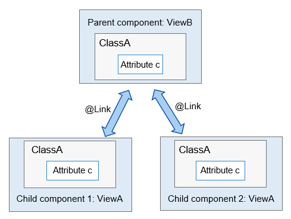
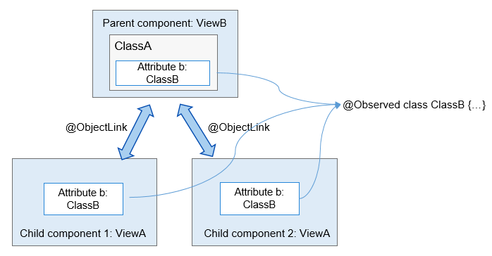

# @Observed and @ObjectLink


This section introduces to you two new decorators: @Observed and @ObjectLink.


- @Observed applies to a class, indicating that the data changes in the class are managed by the UI page, for example, @Observed class ClassA {}.

- @ObjectLink applies to an object decorated by @Observed, for example, @ObjectLink a: ClassA.


## Background

When you need to set bidirectional synchronization in a child component for a variable (parent_a) of its parent component, you can use @State to decorate the variable (parent_a) in the parent component and use @Link to decorate the corresponding variable (child_a) in the child component. In this way, data can be synchronized between the parent component and the specific child component, and between the parent component and its other child components. As shown below, bidirectional synchronization is configured for variables of ClassA in the parent and child components. If attribute c of the variable in child component 1 has its value changed, the parent component will be notified to synchronize the change. If attribute c in the parent component has its value changed, all child components will be notified to synchronize the change.



In the preceding example, full synchronization is performed for a data object. If you want to synchronize partial information of a data object in a parent component, and if the information is a class object, use @ObjectLink and @Observed instead, as shown below.




## Configuration Requirement

- @Observed applies to classes, and @ObjectLink applies to variables.

- The variables decorated by @ObjectLink must be of the class type.
  - The classes must be decorated by @Observed.
  - Parameters of the primitive types are not supported. You can use @Prop to perform unidirectional synchronization.

- @ObjectLink decorated variables are immutable.
  - Attribute changes are allowed. If an object is referenced by multiple @ObjectLink decorated variables, all custom components that have these variables will be notified for re-rendering.

- Default values cannot be set for @ObjectLink decorated variables.
  - The parent component must be initialized with a TypeScript expression that involves variables decorated by @State, @Link, @StorageLink, @Provide, or @Consume.

- @ObjectLink decorated variables are private variables and can be accessed only within the component.


## Examples


### Example 1

  
```
@Observed
class ClassA {
  public name : string;
  public c: number;
  constructor(c: number, name: string = 'OK') {
    this.name = name;
    this.c = c;
  }
}

class ClassB {
  public a: ClassA;
  constructor(a: ClassA) {
    this.a = a;
  }
}

@Component
struct ViewA {
  label : string = "ep1";
  @ObjectLink a : ClassA;
  build() {
    Column() {
      Text(`ViewA [${this.label}]: a.c=${this.a.c}`)
        .fontSize(20)
      Button(`+1`)
        .width(100)
        .margin(2)
        .onClick(() => {
          this.a.c += 1;
        })
      Button(`reset`)
        .width(100)
        .margin(2)
        .onClick(() => {
          this.a = new ClassA(0); // ERROR, this.a is immutable
        })
    }
  }
}

@Entry
@Component
struct ViewB {
  @State b : ClassB = new ClassB(new ClassA(10));
  build() {
    Flex({direction: FlexDirection.Column, alignItems: ItemAlign.Center}) {
      ViewA({label: "ViewA #1", a: this.b.a})
      ViewA({label: "ViewA #2", a: this.b.a})

      Button(`ViewB: this.b.a.c += 1` )
        .width(320)
        .margin(4)
        .onClick(() => {
          this.b.a.c += 1;
        })
      Button(`ViewB: this.b.a = new ClassA(0)`)
        .width(240)
        .margin(4)
        .onClick(() => {
          this.b.a = new ClassA(0);
        })
      Button(`ViewB: this.b = new ClassB(ClassA(0))`)
        .width(240)
        .margin(4)
        .onClick(() => {
          this.b = new ClassB(new ClassA(0));
        })
    }
  }
}
```


### Example 2

  
```
var nextID: number = 0;
@Observed
class ClassA {
  public name : string;
  public c: number;
  public id : number;
  constructor(c: number, name: string = 'OK') {
    this.name = name;
    this.c = c;
    this.id = nextID++;
  }
}

@Component
struct ViewA {
  label : string = "ViewA1";
  @ObjectLink a: ClassA;
  build() {
    Row() {
      Button(`ViewA [${this.label}] this.a.c= ${this.a.c} +1`)
        .onClick(() => {
          this.a.c += 1;
        })
    }
  }
}

@Entry
@Component
struct ViewB {
  @State arrA : ClassA[] = [ new ClassA(0), new ClassA(0) ];
  build() {
    Column() {
      ForEach (this.arrA, (item) => {
          ViewA({label: `#${item.id}`, a: item})
        },
        (item) => item.id.toString()
      )
      ViewA({label: `ViewA this.arrA[first]`, a: this.arrA[0]})
      ViewA({label: `ViewA this.arrA[last]`, a: this.arrA[this.arrA.length-1]})

      Button(`ViewB: reset array`)
        .onClick(() => {
            this.arrA = [ new ClassA(0), new ClassA(0) ];
        })
      Button(`ViewB: push`)
        .onClick(() => {
            this.arrA.push(new ClassA(0))
        })
      Button(`ViewB: shift`)
        .onClick(() => {
            this.arrA.shift()
        })
    }
  }
}
```
