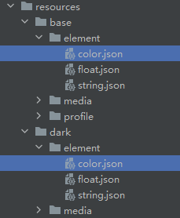
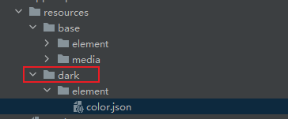

# Dark and Light Mode Adaptation

## Overview

To enhance user experience, applications should adapt to the system's dark and light modes. There are two primary scenarios for implementing this adaptation:

[Following the System's Color Mode](#following-the-systems-color-mode)

[Setting the Application's Color Mode Independently](#setting-the-applications-color-mode-independently)

## Following the System's Color Mode

1. Color Adaptation

   - Custom Resource Implementation

     Create a **dark** folder under the **resources** directory and add a **color.json** file to define dark mode color resources. For details, see [Resource Categories and Access](../quick-start/resource-categories-and-access.md).

     Figure 1 Structure of the resources directory

     
   
     The following is the example configuration:
   
     **base/element/color.json** file:
   
     ```json
     {
       "color": [
         {
           "name": "app_title_color",
           "value": "#000000"
         }
       ]
     }
     ```
   
     **dark/element/color.json** file:
   
     ```json
     {
       "color": [
         {
           "name": "app_title_color",
           "value": "#FFFFFF"
         }
       ]
     }
     ```

   - System Resource Implementation

     You can use [system-provided resources](../quick-start/resource-categories-and-access.md#system-resources), which automatically adapt to different configurations including the device type and dark or light mode. The same resource ID can have different values under these configurations. This means you don't need to create separate color resources for dark and light modes. Instead, you can reference system resources to maintain a consistent look. For example, to set your application's text color, simply use:

     ```ts
     Text('Use system-defined colors')
       .fontColor($r('sys.color.ohos_id_color_text_primary'))
     ```

2. Image Resource Adaptation

    To adapt images to dark and light modes, use resource qualifier directories. Specifically, place images with the same name in the **dark/media** directory. Reference these images using the **$r** syntax based on their **key** values. The system will automatically load the appropriate image based on the current mode.

    For SVG icons, use the [fillColor](arkts-graphics-display.md#displaying-vector-images) attribute with system resources to dynamically adjust their appearance for dark and light modes, eliminating the need for separate image sets.

    ```ts
    Image($r('app.media.pic_svg'))
      .width(50)
      .fillColor($r('sys.color.ohos_id_color_text_primary'))
    ```

3. Web Component Adaptation

    The **Web** component supports dark color mode configuration. For details, see [Setting the Dark Mode](../web/web-set-dark-mode.md).

4. Listening for Color Mode Switching Events

    Applications can listen for system color mode changes and perform custom logic, such as initializing resources of other types. This approach works regardless of whether the application is set to follow the system's dark or light mode.

    a. Save the current color mode to the AppStorage in the **onCreate()** lifecycle of the AbilityStage.

    ```ts
    onCreate(): void {
      hilog.info(0x0000, 'testTag', '%{public}s', 'Ability onCreate');
      AppStorage.setOrCreate('currentColorMode', this.context.config.colorMode);
    }
    ```

    b. Update the color mode to the AppStorage in the **onConfigurationUpdate()** lifecycle callback of the AbilityStage..

    ```ts
    onConfigurationUpdate(newConfig: Configuration): void {
      AppStorage.setOrCreate('currentColorMode', newConfig.colorMode);
      hilog.info(0x0000, 'testTag', 'the newConfig.colorMode is %{public}s', JSON.stringify(AppStorage.get('currentColorMode')) ?? '');
    }
    ```

    c. Use @StorageProp and @Watch to listen for color mode changes and refresh the state variable.

    ```ts
    @StorageProp('currentColorMode') @Watch('onColorModeChange') currentMode: number = ConfigurationConstant.ColorMode.COLOR_MODE_LIGHT;
    ```

    d. Refresh the state variable based on the latest color mode in the **aboutToAppear()** API.

    ```ts
    aboutToAppear(): void {
      if (this.currentMode == ConfigurationConstant.ColorMode.COLOR_MODE_LIGHT) {
        // Light mode initialization logic
      }else {
        // Dark mode initialization logic
      }
    }
    ```

    e. Implement the same logic in the @Watch callback function.

    ```ts
    onColorModeChange(): void {
      if (this.currentMode == ConfigurationConstant.ColorMode.COLOR_MODE_LIGHT) {
        // Light mode initialization logic
      } else {
        // Dark mode initialization logic
      }
    }
    ```

## Setting the Application's Color Mode Independently

By default, applications follow the system's color mode. Yet, you can set a fixed mode for your application regardless of the system settings.

```ts
onCreate(): void {
  hilog.info(0x0000, 'testTag', '%{public}s', 'Ability onCreate');
  this.context.getApplicationContext().setColorMode(ConfigurationConstant.ColorMode.COLOR_MODE_DARK);
}
```

## Default Judgment Rule

1. If the application calls the **setColorMode** API, its effect takes precedence.

2. If the application does not call the **setColorMode** API:

   - When the application has dark resources in the **dark** directory, built-in components automatically switch to dark mode.

   - When no dark resources are available, built-in components remain in light mode.

     

If your application uses built-in components or colors and you want it to switch between dark and light modes along with the system, modify the code as follows to ensure a consistent user experience:

```ts
onCreate(): void {
  this.context.getApplicationContext().setColorMode(ConfigurationConstant.ColorMode.COLOR_MODE_NOT_SET);
}
```
