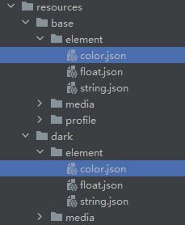

# Implementing Dark and Light Mode Adaptation
<!--Kit: ArkUI-->
<!--Subsystem: ArkUI-->
<!--Owner: @fangzhiyuan1-->
<!--Designer: @fangzhiyuan1-->
<!--Tester: @gouyuanyuan-->
<!--Adviser: @Brilliantry_Rui-->

## Overview

To enhance user experience, applications should adapt to the system's dark and light modes. There are two primary scenarios for implementing this adaptation:

[Following the system's color mode](#following-the-systems-color-mode)

[Setting the color mode independently](#setting-the-color-mode-independently)

## Following the System's Color Mode

1. Color Adaptation

   - Custom Resource Implementation

     Create a **dark** folder under the **resources** directory and add a **color.json** file to define dark mode color resources. For details, see [Resource Categories and Access](../quick-start/resource-categories-and-access.md).

     Figure 1 Structure of the resources directory

     
    
     The following is the example configuration:
    
     **base/element/color.json** file:
    
     ```json
     {
       "color": [
         {
           "name": "app_title_color",
           "value": "#000000"
         }
       ]
     }
     ```
    
     **dark/element/color.json** file:
    
     ```json
     {
       "color": [
         {
           "name": "app_title_color",
           "value": "#FFFFFF"
         }
       ]
     }
     ```

   - System Resource Implementation

     You can use [system-provided resources](../quick-start/resource-categories-and-access.md#system-resources), which automatically adapt to different configurations including the device type and dark or light mode. The same resource ID can have different values under these configurations. This means you don't need to create separate color resources for dark and light modes. Instead, you can reference system resources to maintain a consistent look. For example, to set your application's text color, simply use:

     ```ts
     Text('Use system-defined colors')
       .fontColor($r('sys.color.ohos_id_color_text_primary'))
     ```

2. Image Resource Adaptation

    To adapt images to dark and light modes, use resource qualifier directories. Specifically, place images with the same name in the **dark/media** directory. Reference these images using the [$r](../reference/apis-arkui/js-apis-arkui-resource.md#r) syntax based on their **key** values. The system will automatically load the appropriate image based on the current mode.

    For SVG icons, use the [fillColor](arkts-graphics-display.md#displaying-vector-images) attribute with system resources to dynamically adjust their appearance for dark and light modes, eliminating the need for separate image sets.

    ```ts
    Image($r('app.media.pic_svg'))
      .width(50)
      .fillColor($r('sys.color.ohos_id_color_text_primary'))
    ```

3. Web Component Adaptation

    The **Web** component supports dark color mode configuration. For details, see [Setting the Dark Mode](../web/web-set-dark-mode.md).

4. Custom node adaptation

    Custom nodes **BuilderNode** and **ComponentContent** require manual propagation of system environment change events to trigger complete node updates. For implementation details, see [updateConfiguration](../reference/apis-arkui/js-apis-arkui-builderNode.md#updateconfiguration12).

    <!-- @[custom_node](https://gitcode.com/openharmony/applications_app_samples/blob/master/code/DocsSample/ArkUISample/ColorAdaptionSys/entry/src/main/ets/pages/BuilderNodeAdaptation.ets) -->
    
    ``` TypeScript
    // Record the created custom node object.
    const builderNodeMap: BuilderNode<[Params]>[] = [];
    
    class MyFrameCallback extends FrameCallback {
      onFrame() {
        updateColorMode();
      }
    }
    
    function updateColorMode() {
      builderNodeMap.forEach((value, index) => {
        // Notify the BuilderNode of the environment changes to trigger switching between light and dark modes.
        value.updateConfiguration();
      })
    }
    // ...
      aboutToAppear(): void {
        // ...
            this.getUIContext()?.postFrameCallback(new MyFrameCallback());
        // ...
      }
    ```

5. Listening for Color Mode Switching Events

    Applications can listen for system color mode changes and perform custom logic, such as initializing resources of other types. When an application uses [setColorMode](../reference/apis-ability-kit/js-apis-inner-application-uiAbilityContext.md#setcolormode18) to manually set the color mode, it will not receive the **onConfigurationUpdate** callback. Except for this case, this listener remains effective regardless of whether the application follows the system's color mode changes.

    a. Obtain the current color mode of the application during the [onCreate()](../reference/apis-ability-kit/js-apis-app-ability-abilityStage.md#oncreate) lifecycle of AbilityStage and save it to [AppStorage](../reference/apis-arkui/arkui-ts/ts-state-management.md#appstorage).

    <!-- @[create_set_sys](https://gitcode.com/openharmony/applications_app_samples/blob/master/code/DocsSample/ArkUISample/ColorAdaptionSys/entry/src/main/ets/entryability/EntryAbility.ets) -->
    
    ``` TypeScript
    onCreate(): void {
      // ...
      AppStorage.setOrCreate('currentColorMode', this.context.config.colorMode);
    }
    ```

    b. Obtain the latest color mode in the [onConfigurationUpdate()](../reference/apis-ability-kit/js-apis-app-ability-abilityStage.md#onconfigurationupdate) lifecycle of AbilityStage and update it to AppStorage.

    <!-- @[update_sys](https://gitcode.com/openharmony/applications_app_samples/blob/master/code/DocsSample/ArkUISample/ColorAdaptionSys/entry/src/main/ets/entryability/EntryAbility.ets) -->
    
    ``` TypeScript
    onConfigurationUpdate(newConfig: Configuration): void {
      AppStorage.setOrCreate('currentColorMode', newConfig.colorMode);
      hilog.info(0x0000, 'testTag', 'the newConfig.colorMode is %{public}s', JSON.stringify(AppStorage.get('currentColorMode')) ?? '');
    }
    ```

    c. In the page, use [@StorageProp](state-management/arkts-appstorage.md#storageprop) + [@Watch](state-management/arkts-watch.md) to obtain the current latest color and listen for changes in the device's dark mode.

    <!-- @[prop_sys](https://gitcode.com/openharmony/applications_app_samples/blob/master/code/DocsSample/ArkUISample/ColorAdaptionSys/entry/src/main/ets/pages/BuilderNodeAdaptation.ets) -->
    
    ``` TypeScript
    @StorageProp('currentColorMode') @Watch('onColorModeChange') currentMode: number =
      ConfigurationConstant.ColorMode.COLOR_MODE_LIGHT;
    ```

    d. Update the state variable in the [aboutToAppear](../reference/apis-arkui/arkui-ts/ts-custom-component-lifecycle.md#abouttoappear) initialization function based on the current color mode.

    <!-- @[color_mode_change_appear](https://gitcode.com/openharmony/applications_app_samples/blob/master/code/DocsSample/ArkUISample/ColorAdaptionSys/entry/src/main/ets/pages/BuilderNodeAdaptation.ets) -->
    
    ``` TypeScript
    aboutToAppear(): void {
      // ...
      if (this.currentMode == ConfigurationConstant.ColorMode.COLOR_MODE_LIGHT) {
        // Resource initialization logic for light mode
        // ...
      } else {
        // Resource initialization logic for dark mode
        // ...
      }
    }
    ```

    e. Implement the same logic in the @Watch callback function.

    <!-- @[color_mode_change](https://gitcode.com/openharmony/applications_app_samples/blob/master/code/DocsSample/ArkUISample/ColorAdaptionSys/entry/src/main/ets/pages/BuilderNodeAdaptation.ets) -->
    
    ``` TypeScript
    onColorModeChange(): void {
      if (this.currentMode == ConfigurationConstant.ColorMode.COLOR_MODE_LIGHT) {
        // Resource initialization logic for light mode
      // ···
      } else {
        // Resource initialization logic for dark mode
      // ···
      }
    }
    ```

6. Partial Adaptation

    Using [WithTheme](../reference/apis-arkui/arkui-ts/ts-container-with-theme.md), you can set three [color modes](../reference/apis-arkui/arkui-ts/ts-universal-attributes-foreground-blur-style.md#themecolormode): follow the system, light mode, and dark mode.

    Within the scope of **WithTheme**, component styles adapt to the specified color mode by accessing the corresponding system and application resource values, ensuring components adjust their appearance based on the configured mode. For details, see [Setting a Custom Theme Style for Specific Application Pages](./theme_skinning.md#setting-a-custom-theme-style-for-specific-application-pages).

## Setting the Color Mode Independently

By default, applications follow the system's color mode. When configured this way, the application's color mode becomes fixed and no longer follows system changes.

> **NOTE**
> 
> If an application is not specifically adapted for dark mode, directly following the system settings may cause display issues in dark mode. As a workaround, this method can be used to lock the application in light mode.

<!-- @[create_app](https://gitcode.com/openharmony/applications_app_samples/blob/master/code/DocsSample/ArkUISample/ColorAdaptionApp/entry/src/main/ets/entryability/EntryAbility.ets) -->

``` TypeScript
onCreate(want: Want, launchParam: AbilityConstant.LaunchParam): void {
  try {
    hilog.info(DOMAIN, 'testTag', '%{public}s', 'Ability onCreate');
    this.context.getApplicationContext().setColorMode(ConfigurationConstant.ColorMode.COLOR_MODE_LIGHT);
  } catch (err) {
    hilog.error(DOMAIN, 'testTag', 'Failed to set colorMode. Cause: %{public}s', JSON.stringify(err));
  }
  hilog.info(DOMAIN, 'testTag', '%{public}s', 'Ability onCreate');
}
```

## System Rules for Determining the Application Color Mode

1. If the application calls the **setColorMode** API, its effect takes precedence.

2. If the application does not call the **setColorMode** API:

   - If there are dark resources in the **dark** directory of the application project, system components automatically switch to dark mode.

   - If no dark resources are available, system components maintain light color appearances in dark mode.

     

If your application is built using system components or colors and needs to synchronize with the system's color mode, refer to the following example to modify your code and ensure proper application behavior.

<!-- @[create_sys](https://gitcode.com/openharmony/applications_app_samples/blob/master/code/DocsSample/ArkUISample/ColorAdaptionSys/entry/src/main/ets/entryability/EntryAbility.ets) -->  

``` TypeScript
onCreate(): void {
  try {
    this.context.getApplicationContext().setColorMode(ConfigurationConstant.ColorMode.COLOR_MODE_NOT_SET);
  } catch (e) {
    hilog.error(DOMAIN, 'EntryAbility', `setColorMode failed, error: ${JSON.stringify(e)}`);
  }
  // ...
}
```

## Recommendations and Precautions

- Recommended Approach

  Use the AbilityStage listener callback [onConfigurationUpdate](../reference/apis-ability-kit/js-apis-app-ability-abilityStage.md#onconfigurationupdate) or Ability listener callback [onConfigurationUpdate](../reference/apis-ability-kit/js-apis-app-ability-ability.md#abilityonconfigurationupdate) to proactively listen for system code mode changes. Execute specific service logic by binding state variables when color mode changes.

- Not Recommended Approach

  Avoid adapting to color mode changes through function return values in attribute settings that rely on re-executing attribute setting code during the color mode switching process. Incorrect usage:

  ```ts
  getResource() : string {
    // Obtain the system color mode.
    if (colorMode == "dark") {
      return "#FF000000"
    } else {
      return "#FFFFFFFF"
    }
  }
  // ... other code ...
  build() {
    // ... other code ...
    Button.backgroundColor(this.getResource())
    // ... other code ...
  }
  ```
  The approach described in the preceding example relies on re-executing attribute setting code during the mode switching process. As the system evolves and performance optimizations are implemented, there is no guarantee that all attribute code will be re-executed. In most hot update scenarios, re-executing all page construction and attribute setting code is clearly redundant and inefficient.

## Optimizing Color Mode Switching Overhead
  
By default, color mode switching requires a full redraw, including resetting attributes for all components. The performance overhead increases linearly with application UI complexity.

Starting from API version 20, the system provides an optimized color mode switching mechanism. You can enable this capability by adding the [metadata](../quick-start/module-configuration-file.md#metadata) configuration item to reduce overhead during mode transitions.

> **NOTE**
>
> When configuring **metadata**, ensure that color mode switching is not implemented through function return values in attribute settings.
> <!--RP1--><!--RP1End-->

1. Enable color mode switching optimization through **metadata**.

   To reduce color mode switching overhead, add the **metadata** field to the **module.json5** file and ensure proper adaptation of component attributes:

    ```ts
    "metadata": [
      {
        "name": "configColorModeChangePerformanceInArkUI",
        "value": "true"
      }
    ]
    ```

2. Ensure proper adaptation of your application's custom behavior.

   After enabling color mode switching optimization, frontend code and attribute settings are not re-executed during mode switching. Only essential attributes are updated and redrawn. If your application relies on function-based attribute settings to handle mode changes, this adaptation approach will no longer work. You must implement proper adaptation before enabling the optimization. For detailed guidance, see [Recommendations and Precautions](#recommendations-and-precautions). Below are three typical adaptation scenarios:

  - Returning different resource values based on the current color mode

    After enabling the optimization, you can actively listen for system color mode changes using either the AbilityStage's callback [onConfigurationUpdate](../reference/apis-ability-kit/js-apis-app-ability-abilityStage.md#onconfigurationupdate) or the Ability's callback [onConfigurationUpdate](../reference/apis-ability-kit/js-apis-app-ability-ability.md#abilityonconfigurationupdate), and update the text color accordingly. Example:

      ```ts
      // EntryAbility.ets
      import { Configuration, UIAbility } from '@kit.AbilityKit';

      export default class EntryAbility extends UIAbility {

        onConfigurationUpdate(newConfig: Configuration): void {
          AppStorage.setOrCreate('colorMode', newConfig.colorMode);
        }
      }
      ```
      ```ts
      // Index.ets
      import { ConfigurationConstant } from '@kit.AbilityKit';

      @Entry
      @Component
      struct MainPage {
        @StorageLink('colorMode') @Watch('colorModeChange') colorMode: ConfigurationConstant.ColorMode = ConfigurationConstant.ColorMode.COLOR_MODE_NOT_SET;
        @State textColor: Resource = $r("app.color.color_light");

        colorModeChange() {
          if (this.colorMode === ConfigurationConstant.ColorMode.COLOR_MODE_LIGHT) {
            this.textColor = $r("app.color.color_light")
          } else {
            this.textColor = $r("app.color.color_night")
          }
        }

        build() {
          Column() {
            Text('fontColor')
              .fontColor(this.textColor)
          }
        }
      }
      ```

  - Returning different resource values based on a custom theme mode

    fter enabling the optimization, you need to bind both the text content and the text color of the **Text** component to state variables. When a color mode switch event occurs, update the component attributes through those state variables. Example:

      ```ts
      // ResourceTheme.ets
      export enum ThemeMode {
        mode1 = 0,
        mode2
      }

      export class ResourceTheme {
        fontColor: ResourceColor = this.getColor();
        themeMode: ThemeMode = ThemeMode.mode1;

        setThemeMode(mode: ThemeMode) {
          this.themeMode = mode
        }
        getThemeMode(): ThemeMode {
          return this.themeMode
        }
        getColor(): ResourceColor {
          if (this.themeMode === ThemeMode.mode1) {
            return $r("app.color.color_light")
          } else {
            return $r("app.color.color_night")
          }
        }
      }
      ```
      ```ts
      // Index.ets
      import { ConfigurationConstant } from '@kit.AbilityKit';
      import { ResourceTheme, ThemeMode } from './ResourceTheme';

      @Entry
      @Component
      struct MainPage {
        @StorageLink('colorMode') @Watch('colorModeChange') colorMode: ConfigurationConstant.ColorMode = ConfigurationConstant.ColorMode.COLOR_MODE_NOT_SET;
        resourceTheme = new ResourceTheme();
        @State textColor: ResourceColor = this.resourceTheme.getColor();
        @State textContent: string = this.resourceTheme.getThemeMode().toString();

        colorModeChange() {
          if (this.colorMode === ConfigurationConstant.ColorMode.COLOR_MODE_LIGHT) {
            this.resourceTheme.setThemeMode(ThemeMode.mode1)
          } else {
            this.resourceTheme.setThemeMode(ThemeMode.mode2)
          }
          this.textContent = this.resourceTheme.getThemeMode().toString()
          this.textColor = this.resourceTheme.getColor()
        }

        build() {
          Column() {
            Text('ThemeMode is ' + this.textContent)
              .fontColor(this.textColor)
          }
        }
      }
      ```

  - Returning different resource values based on a member variable's value

    After enabling the optimization, you need to bind the text color attribute to a state variable. During a color mode switch, update the state variable via a callback so that attribute changes are applied on the next mode switch. Example:

      ```ts
      // Index.ets
      import { ConfigurationConstant } from '@kit.AbilityKit';

      @Entry
      @Component
      struct MainPage {
        mode: number = 0;
        @StorageLink('colorMode') @Watch('colorModeChange') colorMode: ConfigurationConstant.ColorMode = ConfigurationConstant.ColorMode.COLOR_MODE_NOT_SET;
        @State textColor: Resource = $r("app.color.color_light");

        colorModeChange() {
          if (this.mode % 2 === 0) {
            this.textColor = $r("app.color.color_light")
          } else {
            this.textColor = $r("app.color.color_night")
          }
        }

        build() {
          Column() {
            Button('change mode')
              .onClick((event: ClickEvent) => {
                this.mode++
              })
            Text('fontColor')
              .fontColor(this.textColor)
          }
        }
      }
      ```

## Using Color Inversion for Quick Dark Mode Adaptation

Starting from API version 20, for applications with a large existing codebase that have already partially adapted to dark mode via [resource configuration](#following-the-systems-color-mode) or [WithTheme](../reference/apis-arkui/arkui-ts/ts-container-with-theme.md) approaches, you can use the system's built‑in color inversion capability to quickly achieve full dark‑mode adaptation.

While offering less granular control compared to resource configuration and theme modes, color inversion significantly reduces adaptation effort and prevents application package size growth from extensive resource definitions. This method provides visually acceptable results in most scenarios.

> **NOTE**
>
> - The color inversion capability requires [enabled color mode switching overhead optimization](#optimizing-color-mode-switching-overhead).
> - In cross-process scenarios, if you want to use the color inversion capability, both the [UIExtensionAbility](../reference/apis-ability-kit/js-apis-app-ability-uiExtensionAbility.md) and the host of the corresponding **UIExtensionAbility** need to be adapted simultaneously. For details about the APIs related to the **UIExtensionAbility** host, see [@ohos.arkui.uiExtension (uiExtension)](../reference/apis-arkui/js-apis-arkui-uiExtension.md).

1. Implement color inversion.

   The ArkUI framework introduces the [OH_ArkUI_SetForceDarkConfig](../reference/apis-arkui/capi-native-node-h.md#oh_arkui_setforcedarkconfig) API in API version 20. This feature automatically applies color inversion based on your custom algorithms during color mode switching. The inversion only affects color attributes set with non-resource values; when colors are defined via $r references, resource file configurations take precedence.

   This capability proves particularly useful when applications require multiple color attribute configurations but lack comprehensive dark mode resource definitions.

    > **NOTE**
    >
    > - Before calling **OH_ArkUI_SetForceDarkConfig**, ensure that [OH_ArkUI_QueryModuleInterfaceByName(ARKUI_NATIVE_NODE, "ArkUI_NativeNodeAPI_1")](../reference/apis-arkui/capi-native-interface-h.md#oh_arkui_querymoduleinterfacebyname) is loaded.
    >
    > - The **OH_ArkUI_SetForceDarkConfig** API must be called in the UI thread before node creation. **After a page is created, dynamically modifying the application's color inversion capability status via this API is not supported.**
    >
    > - The **OH_ArkUI_SetForceDarkConfig** API takes effect only at the process level. Different instances cannot use different color inversion algorithms.
    >
    > - The **OH_ArkUI_SetForceDarkConfig** API supports only C API implementation. This design avoids significant cross-language call overhead during frequent color mode transitions.
    >
    > - If a component has an invalid color value or **undefined** configured, the color inversion capability will not take effect.

    This example demonstrates the fundamental usage of the **OH_ArkUI_SetForceDarkConfig** API. Configure a custom color inversion algorithm based on actual scenarios to display appropriate color values during color mode transitions.

      ```c++
      OH_ArkUI_SetForceDarkConfig(nullptr, true, ArkUI_NodeType::ARKUI_NODE_UNDEFINED, nullptr); // Apply the default system color inversion algorithm to all components.
      ```

      ```ts
      // Use the color inversion capability when creating components on the ArkTS side.
      // By default, the default color inversion algorithm is applied to all components. Text colors invert during theme switching.
      build() {
        // ... other code ...
        Text("Test color inversion algorithm")
          .fontColor(Color.Black)
        // ... other code ...
      }
      ```

    The **OH_ArkUI_SetForceDarkConfig** API supports various configuration modes.
      ```c++
      // Custom color inversion algorithm function.
      uint32_t colorInvertFunc(uint32_t color) {
        return ~color;
      }
      OH_ArkUI_SetForceDarkConfig(nullptr, true, ArkUI_NodeType::ARKUI_NODE_UNDEFINED, colorInvertFunc); // Apply the custom inversion algorithm to all components.
      ```
      ```c++
      OH_ArkUI_SetForceDarkConfig(nullptr, false, ArkUI_NodeType::ARKUI_NODE_UNDEFINED, nullptr); // Disable color inversion for all components. The original system logic is used.
      ```
      ```c++
      OH_ArkUI_SetForceDarkConfig(nullptr, true, ArkUI_NodeType::ARKUI_NODE_TEXT, nullptr); // Apply the default inversion algorithm only to text components.
      ```
      ```c++
      // Custom color inversion algorithm function.
      uint32_t colorInvertFunc(uint32_t color) {
        return ~color;
      }
      OH_ArkUI_SetForceDarkConfig(nullptr, true, ArkUI_NodeType::ARKUI_NODE_TEXT, colorInvertFunc); // Apply the custom inversion algorithm only to text components.
      ```

    > **NOTE**
    >
    > - Global disabling of inversion cannot coexist with component‑specific inversion.
    >
    > - Global enabling of inversion cannot coexist with component‑specific disabling.

2. Understand the following color inversion priority order that the system follows when applying color treatments:

   a. Dark mode color resources
   
   b. Component-specific inversion algorithms
   
   c. Global inversion algorithms

3. Implement the inversion escape mechanism.

   Starting from API version 21, you can use the [allowForceDark](../reference/apis-arkui/arkui-ts/ts-allow-force-dark.md#allowforcedark) attribute as an escape mechanism to disable automatic color inversion for specific components, preserving their original appearance during theme transitions.
