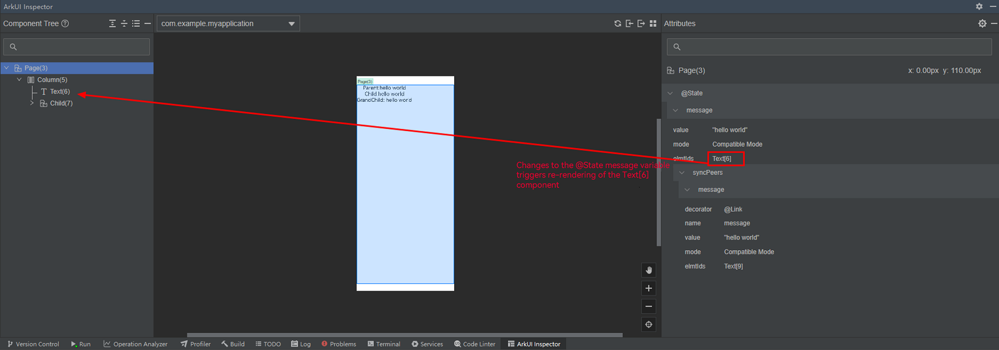

# UI Profiling
<!--Kit: ArkUI-->
<!--Subsystem: ArkUI-->
<!--Owner: @lushi871202-->
<!--Designer: @lushi871202-->
<!--Tester: @sally__-->
<!--Adviser: @HelloCrease-->

This topic describes tools for inspecting the UI hierarchy and profiling performance, designed to enhance development efficiency and optimize the developer experience.

## State Management: hidumper, Profiler, and Inspector
To improve the efficiency of diagnosing state management issues, the framework provides hidumper, Profiler, and Inspector capabilities for state variables. These tools offer insights into the internal state of variables, enabling you to better understand the relationship between state variables and UI components, which facilitates the development of high-performance applications.
### State Management: hidumper
The state management framework integrates with [hidumper](../dfx/hidumper.md). You can use the **-jsdump** command to inspect information such as components associated with state variables and custom component trees.

The following parameters are available.

- **jsdump**: displays state management information.
- **viewHierarchy**: displays custom component tree information. By default, only the root custom component is shown.
- **r**: recursively displays element IDs of custom components and their child components from the root node. By default, only root node information is shown.
- **viewId**: displays information for a specific custom component using its view ID.
- **stateVariable**: displays state variable information, including associated components and synchronization objects. This command currently does not support recursive output (**r**).
- **registerdElementIds**: displays element IDs of the current custom component.

Example:
The following example demonstrates a typical two-layer nested component structure using [\@State](./state-management/arkts-state.md) and [\@Link](./state-management/arkts-link.md) decorators. The commands above can be combined to display information such as the frontend component tree, state variables, and components affected by state variables.

```ts
@Entry
@Component
struct Page {
  @State message: string = 'hello world';

  build() {
    Column() {
      Text('Parent:' + this.message).fontSize(20).onClick(() => {
        this.message += '1';
      })
      Child({ message: this.message })
    }
  }
}

@Component
struct Child {
  @Link message: string;

  build() {
    Column() {
      Text('Child:' + this.message).fontSize(20)
      GrandChild({ message: this.message })
    }
  }
}

@Component
struct GrandChild {
  @Link message: string;

  build() {
    Column() {
      Text('GrandChild: ' + this.message).fontSize(20)
    }
  }
}
```

Step 1: Obtain the ID of the currently active window.
```
hdc shell hidumper -s WindowManagerService -a '-a'
```

Step 2: Execute commands to inspect state variable information.
Assuming that the active window ID is 90, use the following commands:
- Command 1: Recursively inspect all custom components from the root node:

  ```
  hdc shell hidumper -s WindowManagerService -a '-w 90 -jsdump -dumpAll -r'
  ```
  
  The output includes:
   - **Page[4]**: root node of the custom component.
   - **View Hierarchy**: structure of the UI component tree.
   - **State variables**: state variables of the root node. For example, **@State 'message'[0]** under **Page** shows:
     - **[0]**: state variable ID.
     - **Owned by @Component 'Page'[4]**: The state variable belongs to component **'Page'[4]** (where **[4]** is the component ID).
     - **Sync peers**: synchronization objects. Changes to **@State message** will notify **@Link 'message'[-1] <@Component 'Child'[7]>** to refresh.
     - **dependencies**:
       - **variable assignment affects elmtIds**: components refreshed when the state variable changes, for example, **Text[6]**.
       - **Dependent elements**: components associated with the state variable and its synchronization objects.
   - **Registered Element IDs**: custom components and their child components declared in **build()**.
   - **Dirty Registered Element IDs**: list of dirty nodes marked for re-rendering within the custom component. When a state variable changes, its associated components are marked as "dirty" and scheduled for re-rendering in the next rendering frame. These dirty components are re-rendered and the list is cleared during frame processing. During manual dump operations, the **Dirty Registered Element IDs** list typically appears empty because, given the frame intervals of most current devices, it is difficult to capture the dirty node list between frames.
  ```ts
  --------------------ViewPUInfo--------------------
  [-dumpAll, viewId=4, isRecursive=true]
  
  @Component
  Page[4]
  
  View Hierarchy:
  
  |--Page[4]ViewPU {isViewActive: true, isDeleting_: false}
    |--Child[7]ViewPU {isViewActive: true, isDeleting_: false}
      |--GrandChild[10]ViewPU {isViewActive: true, isDeleting_: false}
  
  State variables:
  |--Page[4]
    @State 'message'[0]
    |--Owned by @Component 'Page'[4]
    |--Sync peers: {
      @Link 'message'[-1] <@Component 'Child'[7]>
    }
    dependencies: variable assignment affects elmtIds: Text[6]
    |--Dependent elements: Text[6]; @Component 'Child'[7], Text[9]; @Component 'GrandChild'[10], Text[12]
  
  Registered Element IDs:
  
  |--Page[4]: {
      Column[5]
      Text[6]
      Child[7]
    }[3]
    |--Child[7]: {
        Column[8]
        Text[9]
        GrandChild[10]
      }[3]
      |--GrandChild[10]: {
          Column[11]
          Text[12]
        }[2]
  Total: 8
  
  Dirty Registered Element IDs:
  
  |--Page[4]: {
    }[0]
    |--Child[7]: {
      }[0]
      |--GrandChild[10]: {
        }[0]
  Total: 0
  ```
- Command 2: Print state variable information for a specific custom component, for example, component ID 7:
  ```
  hdc shell hidumper -s WindowManagerService -a '-w 90 -jsdump -dumpAll -viewId=7'
  ```
  The output is as follows.
  ```ts
  --------------------ViewPUInfo--------------------
  [-dumpAll, viewId=7, isRecursive=false]
  
  @Component
  Child[7]
  
  View Hierarchy:
  
  |--Child[7]ViewPU {isViewActive: true, isDeleting_: false}
    |--GrandChild[10]ViewPU {isViewActive: true, isDeleting_: false}
  
  State variables:
  |--Child[7]
    @Link 'message'[-1]
    |--Owned by @Component 'Child'[7]
    |--Sync peers: {
      @Link 'message'[-2] <@Component 'GrandChild'[10]>
    }
    dependencies: variable assignment affects elmtIds: Text[9]
    |--Dependent elements: Text[9]; @Component 'GrandChild'[10], Text[12]
  
  Registered Element IDs:
  
  |--Child[7]: {
      Column[8]
      Text[9]
      GrandChild[10]
    }[3]
  
  Dirty Registered Element IDs:
  
  |--Child[7]: {
    }[0]
  ```

### State Management: Profiler

DevEco Studio's Profiler captures trace points for state variable changes. Select the ArkUI State lane in Profiler to track which state variables change during recording and which components they trigger to re-render. This helps analyze update loads based on the number of components associated with state variables.

The Profiler displays the following state management information.
| Name                | Description  |
| -------------------- | ------|
|Start Time|Time when the state variable is modified.|
|Attributes |Attribute name of the state variable.|
|Owned by Component|Custom component owning the state variable.|
|Owned by Class|Class name owning the state variable.|
|Property Type|Decorator name of the state variable.|
|Current Values|Current value of the state variable.|

Recording steps:

Step 1: Click the ArkUI template to create a session and start recording. During recording, modify the **@State message** variable to **hello world1** to trigger re-rendering.

Step 2: After recording, the ArkUI State lane shows trace points for state variable changes.

**Figure 1** ArkUI State lane recording process


Step 3: Select a trace point to view triggering of component re-rendering and the time consumed for creation, measurement, and layout.

**Figure 2** ArkUI State lane details


<!--RP3-->

<!--RP3End-->

### Status Management: ArkUI Inspector
DevEco Studio's ArkUI Inspector displays detailed state variable information within custom components, including the following.
| Name                | Description  |
| -------------------- | ------|
|decorator|Decorator of the state variable, for example, \@State and \@Link.|
|name|Attribute name of the state variable, for example, **message** in **@State message: string = 'hello world'**.|
|value|Current value of the state variable. Truncation is applied for overly long or deeply nested complex types.|
|mode|Observation mode of the state variable, including:<br>**Compatible Mode**: state management V1 state variables, where the decorated variable types have no properties decorated with [\@Track](./state-management/arkts-track.md).<br>**Track Mode**: state management V1 variables, where the decorated types have properties decorated with \@Track.<br>**V2**: state management V2 state variables.|
|elmtIds|Components associated with the state variable. In declarative UI syntax, UI re-rendering is triggered by state changes.<br>Currently, state management supports component-level updates, which means only components that use the state variable will be triggered to re-render when the variable changes.|
|syncPeers|Synchronization objects of the state variable (limited to state management V1 variables). For example, the synchronization object of @State is @Link.|

When you open ArkUI Inspector, it displays information related to state variables in the **@Component Page** custom component, as shown below.

**Figure 3** ArkUI Inspector displaying state variable–related information



<!--RP4-->

<!--RP4End-->


The above content mainly introduces the hidumper tool, Profiler, and ArkUI Inspector features for state management. These tools facilitate debugging and testing, helping improve the efficiency of developing high-performance applications.

## Trace Debugging Capability

ArkUI internally embeds trace information for key UI processing flows. This allows you to observe the UI time consumption of applications using the trace tool and assist in issue localization. For details about the trace descriptions and use cases, see <!--RP1-->Common Trace Usage Instructions<!--RP1End-->.

## Inspector Debugging Capability

ArkUI Inspector is a built-in page layout inspection tool in DevEco Studio for viewing UI hierarchies, component attributes, and layout effects. For details about how to use ArkUI Inspector, see <!--RP2-->ArkUI Inspector<!--RP2End-->.
