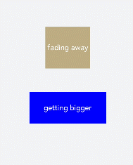

# Attribute Style Animation


**Keyframes** is used to scale a component by dynamically setting the width and height of its parent component. Set the scale attribute for child components to scale the child and parent components at the same time. Then, set the opacity attribute to display or hide the child and parent components.


```html
<!-- xxx.hml -->
<div class="container">
  <div class="fade">
    <text>fading away</text>
  </div>
  <div class="bigger">
    <text>getting bigger</text>
  </div>
</div>
```


```css
/* xxx.css */
.container {
  background-color:#F1F3F5;
  display: flex;
  justify-content: center;
  align-items: center;
  flex-direction: column;
  width: 100%;
  height: 100%;
}
.fade {
  width: 30%;
  height: 200px;
  left: 35%;
  top: 25%;
  position: absolute;
  animation: 2s change infinite friction;
}
.bigger {
  width: 20%;
  height: 100px;
  background-color: blue;
  animation: 2s change1 infinite linear-out-slow-in;
}
text {
  width: 100%;
  height: 100%;
  text-align: center;
  color: white;
  font-size: 35px;
  animation: 2s change2 infinite linear-out-slow-in;
}
/* Color change */
@keyframes change{
  from {
    background-color: #f76160;
    opacity: 1;
  }
  to {
    background-color: #09ba07;
    opacity: 0;
  }
}
/* Scaling of the parent component */
@keyframes change1 {
  0% {
    width: 20%;
    height: 100px;
  }
  100% {
    width: 80%;
    height: 200px;
  }
}
/* Text scaling of the child component */
@keyframes change2 {
  0% {
    transform: scale(0);
  }
  100% {
    transform: scale(1.5);
  }
}
```





> **NOTE**
> - The values of animation attributes are not sequenced. However, the values of duration and delay are parsed based on the sequence in which they are displayed.
> 
> - The **animation-duration** attribute must be set. Otherwise, the duration is 0, which means there is no animation effect. When **animation-fill-mode** is set to **forwards**, the component directly displays the style of the last frame.
