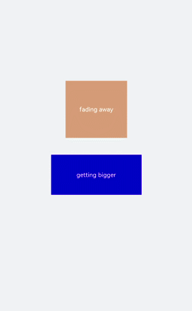

# Attribute Style Animation<a name="EN-US_TOPIC_0000001172005058"></a>

In  [Keyframes](../reference/arkui-js/js-components-common-methods.md#table1491078445), dynamically set the width and height of the parent component to scale the component. Set the  **scale**  attribute for child components to scale the parent and child components at the same time. Then, set the  **opacity**  attribute to display or hide parent and child components.

```
<!-- xxx.hml -->
<div class="container">
  <div class="fade">
    <text>fading away</text>
  </div>
  <div class="bigger">
    <text>getting bigger</text>
  </div>
</div>
```

```
/* xxx.css */
.container {
  background-color:#F1F3F5;
  display: flex;
  justify-content: center;
  align-items: center;
  flex-direction: column;
}
.fade{
  width: 30%;
  height: 200px;
  left: 35%;
  top: 25%;
  position: absolute;
  animation: 2s change infinite friction;
}
.bigger{
  width: 20%;
  height: 100px;
  background-color: blue;
  animation: 2s change1 infinite linear-out-slow-in;
}
text{
  width: 100%;
  height: 100%;
  text-align: center;
  color: white;
  font-size: 35px;
  animation: 2s change2 infinite linear-out-slow-in;
}
/* Color change */
@keyframes change{
  from {
    background-color: #f76160;
    opacity: 1;
  }
  to {
    background-color: #09ba07;
    opacity: 0;
  }
}
/* Parent component scaling */
@keyframes change1{
  0% {
    width: 20%;
    height: 100px;
  }
  100% {
    width: 80%;
    height: 200px;
  }
}  
/* Text scaling of child components */
@keyframes change2{
  0%{
   transform: scale(0);
  }
  100% {
    transform: scale(1.5);
  }
}
```



> **NOTE:** 
>1.  The values of animation attributes are not sequenced. The values of  **duration**  and  **delay**  are parsed based on the sequence in which they are displayed.
>2.  The  **animation-duration**  attribute must be set. Otherwise, the duration is 0, which means there is no animation effect. When  **animation-fill-mode**  is set to  **forwards**, the component directly displays the style of the last frame.

