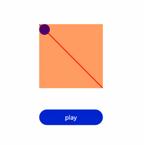

# Animation Frame


## Requesting an Animation Frame

Use the **requestAnimationFrame** method to request frames on a one-by-one basis. This method accepts a callback as an argument.

When **runframe** calls **requestAnimationFrame**, the **step** callback with the **timestamp** parameter is passed, and this timestamp iss assigned to **startTime**. When the difference between the **timestamp** and **startTime** is less than the specified value, **requestAnimationFrame** is called again, and the animation stops.

```html
<!-- xxx.hml -->
<div class="container">
  <tabs onchange="changecontent">
    <tab-content>
      <div class="container">
        <stack style="width: 300px;height: 300px;margin-top: 100px;margin-bottom: 100px;">
          <canvas id="mycanvas" style="width: 100%;height: 100%;background-color: coral;">
          </canvas>
          <div style="width: 50px;height: 50px;border-radius: 25px;background-color: indigo;position: absolute;left: {{left}};top: {{top}};">
          </div>
        </stack>
        <button type="capsule" value="play" onclick="runframe"></button>
      </div>
    </tab-content>
  </tabs>
</div>
```

```css
/* xxx.css */
.container {
  flex-direction: column;
  justify-content: center;
  align-items: center;
  width: 100%;
  height: 100%;
}
button{
  width: 300px;
}
```

```js
// xxx.js
export default {
  data: {
    timer: null,
    left: 0,
    top: 0,
    flag: true,
    animation: null,
    startTime: 0,
  },
  onShow() {
    var test = this.$element("mycanvas");
    var ctx = test.getContext("2d");
    ctx.beginPath();
    ctx.moveTo(0, 0);
    ctx.lineTo(300, 300);
    ctx.lineWidth = 5;
    ctx.strokeStyle = "red";
    ctx.stroke();
  },
  runframe() {
    this.left = 0;
    this.top = 0;
    this.flag = true;
    this.animation = requestAnimationFrame(this.step);
  },
  step(timestamp) {
    if (this.flag) {
      this.left += 5;
      this.top += 5;
      if (this.startTime == 0) {
        this.startTime = timestamp;
      }
      var elapsed = timestamp - this.startTime;
        if (elapsed < 500) {
          console.log('callback step timestamp: ' + timestamp);
          this.animation = requestAnimationFrame(this.step);
        }
      } else {
        this.left -= 5;
        this.top -= 5;
        this.animation = requestAnimationFrame(this.step);
      }
      if (this.left == 250 || this.left == 0) {
        this.flag = !this.flag
     }
    },
    onDestroy() {
      cancelAnimationFrame(this.animation);
    }
}
```



> **NOTE**
>
> When invoking the callback, the **requestAnimationFrame** method passes the **timestamp** as the first parameter, which indicates the time when **requestAnimationFrame** starts to execute the callback.


## Canceling an Animation Frame

Use the **cancelAnimationFrame** method to cancel frames on a one-by-one basis. When this method is called, the animation frame request sent through **requestAnimationFrame** will be canceled.

```html
<!-- xxx.hml -->
<div class="container">
  <tabs onchange="changecontent">
    <tab-content>
      <div class="container">
        <stack style="width: 300px;height: 300px;margin-top: 100px;margin-bottom: 100px;">
          <canvas id="mycanvas" style="width: 100%;height: 100%;background-color: coral;">
          </canvas>
          <div style="width: 50px;height: 50px;border-radius: 25px;background-color: indigo;position: absolute;left: {{left}};top: {{top}};">
          </div>
        </stack>
        <button type="capsule" value="play" onclick="runframe"></button>
      </div>
    </tab-content>
  </tabs>
</div>
```

```css
/* xxx.css */
.container {
  flex-direction: column;
  justify-content: center;
  align-items: center;
  width: 100%;
  height: 100%;
}
button{
  width: 300px;
}
```

```js
// xxx.js
export default {
  data: {
    timer: null,
    left: 0,
    top: 0,
    flag: true,
    animation: null
  },
  onShow() {
    var test = this.$element("mycanvas");
    var ctx = test.getContext("2d");
    ctx.beginPath();
    ctx.moveTo(0, 0);
    ctx.lineTo(300, 300);
    ctx.lineWidth = 5;
    ctx.strokeStyle = "red";
    ctx.stroke();
  },
  runframe() {
    this.left = 0;
    this.top = 0;
    this.flag = true;
    this.animation = requestAnimationFrame(this.step);
  },
  step(timestamp) {
    if (this.flag) {
      this.left += 5;
      this.top += 5;
      this.animation = requestAnimationFrame(this.step);
    } else {
      this.left -= 5;
      this.top -= 5;
      this.animation = requestAnimationFrame(this.step);
    }
    if (this.left == 250 || this.left == 0) {
      this.flag = !this.flag
    }
  },
  onDestroy() {
    cancelAnimationFrame(this.animation);
  }
}
```


> **NOTE**
>
> When **cancelAnimationFrame** is called, a parameter that indicates an ID must be passed.
