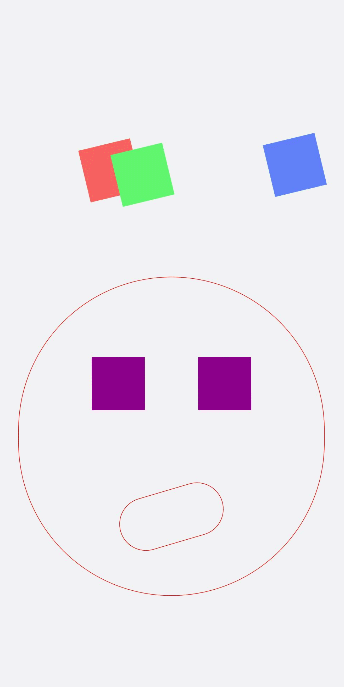
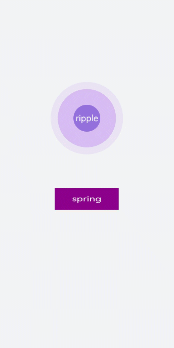
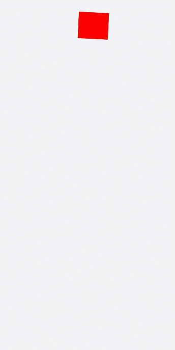
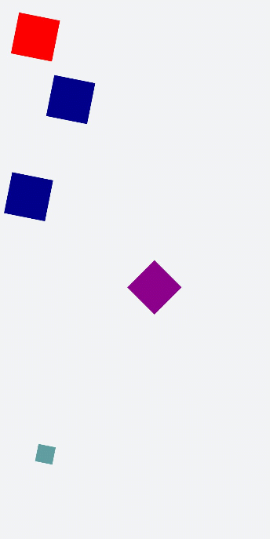

# Defining Animations with the transform Attribute


Set the transform attribute for component rotation, scaling, translation, and skewing.


## Designing Static Animation

Create a square and rotate it by 90 degrees to form a rhombus. Cover the lower part of the rhombus with a rectangle to form a roof. Set the **translate** attribute of the rectangle to the coordinate (150px, -150px) to form a door, use the **position** attribute to translate the horizontal and vertical axes to the specified coordinates of the parent component (square), set the **scale** attribute to scale up the parent and child components together to determine the window size, and use the **skewX** attribute to skew the component and set the coordinate translate(200px,-830px) to form a chimney.

```html
<!-- xxx.hml -->
<div class="container">
  <div class="top"></div>
  <div class="content"></div>
  <div class="door"></div>
  <!-- Window -->
  <div class="window">
    <div class="horizontal"></div>
    <div class="vertical"></div>
  </div>
  <div class="chimney"></div>
</div>
```

```css
/* xxx.css */
.container {
  width:100%;
  height:100%;
  background-color:#F1F3F5;
  align-items: center;
  flex-direction: column;
}
.top{
  z-index: -1;
  position: absolute;
  width: 428px;
  height: 428px;
  background-color: #860303;
  transform: rotate(45deg);
  margin-top: 284px;
  margin-left: 148px;
}
.content{
  margin-top: 500px;
  width: 600px;
  height: 400px;
  background-color: white;
  border:  1px solid black;
}
.door{
  width: 100px;
  height: 135px;
  background-color: #1033d9;
  transform: translate(150px,-137px);
}
.window{
  z-index: 1;
  position: relative;   
  width: 100px;
  height: 100px;
  background-color: white;
  border: 1px solid black;
  transform: translate(-150px,-400px) scale(1.5);
}
/* Horizontal axis of the window */
.horizontal{
  position: absolute;
  top: 50%;
  width: 100px;
  height: 5px;
  background-color: black;
}
/* Vertical axis of the window */
.vertical{
  position: absolute;
  left: 50%;
  width: 5px;
  height: 100px;
  background-color: black;
}
.chimney{
  z-index: -2;
  width: 40px;
  height: 100px;
  border-radius: 15px;
  background-color: #9a7404;
  transform: translate(200px,-710px) skewX(-5deg);
}
```


## Designing Translation Animation

Decrease the y-coordinate over a time frame to make the ball bounce back. Gradually decrease the bounce height until it drops to 0. An animation where the ball falls is hereby created.

```html
<!-- xxx.hml -->
<div class="container">
  <div class="circle"></div>
  <div class="flower"></div>
</div>
```

```css
/* xxx.css */
.container {
  width:100%;
  height:100%;
  background-color:#F1F3F5;
  display: flex;
  justify-content: center;
}
.circle{
  width: 100px;
  height: 100px;
  border-radius: 50px;
  background-color: red;
  /* Use forwards to enable the animation stop at the last frame. */
  animation: down 3s fast-out-linear-in forwards;
}
.flower{
  position: fixed;
  width: 80%;
  margin-left: 10%;
  height: 5px;
  background-color: black;
  top: 1000px;
}
@keyframes down {
  0%{
    transform: translate(0px,0px);
  }
  /* Start ball falling. */
  15%{
    transform: translate(10px,900px);
  }
  /* Start bouncing back. */
  25%{
    transform: translate(20px,500px);
  }
  /* Let the ball fall. */
  35%{
    transform: translate(30px,900px);
  }
  /* Let the ball bounce back. */
  45%{
    transform: translate(40px,700px);
  }
  55%{
    transform: translate(50px,900px);
  }
  65%{
    transform: translate(60px,800px);
  }
  80%{
    transform: translate(70px,900px);
  }
  90%{
    transform: translate(80px,850px);
  }
  /* Stop falling. */
  100%{
    transform: translate(90px,900px);
  }
}
```


## Designing Rotation Animation

Set the rotation center around an element in different transform-origin positions. Of the **rotate3d** values, the first three values are the rotation vectors of the x-axis, y-axis, and z-axis, respectively; the fourth value is the rotation angle, which can be a negative value to indicate that the rotation is performed counterclockwise.

```html
<!-- xxx.hml -->
<div class="container">
  <div class="rotate">
    <div class="rect rect1"></div>
    <div class="rect rect2"></div>
    <div class="rect rect3"></div>
  </div>
  <!-- 3D attributes -->
  <div class="rotate3d">
    <div class="content">
        <div class="rect4"></div>
        <div class="rect5"> </div>
    </div>
    <div class="mouse"></div>
  </div>
</div>
```

```css
/* xxx.css */
.container {
    flex-direction: column;
    background-color:#F1F3F5;
    display: flex;
    align-items: center;
    justify-content: center;
    width: 100%;
    height: 100%;
}
.rect {
    width: 100px;
    height: 100px;
    animation: rotate 3s infinite;
    margin-left: 30px;
}
.rect1 {
    background-color: #f76160;
}
.rect2 {
    background-color: #60f76f;
/* Change the origin position.*/
    transform-origin: 10% 10px;
}
.rect3 {
    background-color: #6081f7;
/* Change the origin position.*/
    transform-origin: right bottom;
}
@keyframes rotate {
    from {
        transform: rotate(0deg)
    }
    to {
        transform: rotate(360deg);
    }
}
/* 3D sample style */
.rotate3d {
    margin-top: 150px;
    flex-direction: column;
    background-color:#F1F3F5;
    display: flex;
    align-items: center;
    width: 80%;
    height: 600px;
    border-radius: 300px;
    border: 1px solid #ec0808;
}
.content {
    padding-top: 150px;
    display: flex;
    align-items: center;
    justify-content: center;
}
/* Use react4 and react5 to shape eyes. */
.rect4 {
    width: 100px;
    height: 100px;
    animation: rotate3d1 1000ms infinite;
    background-color: darkmagenta;
}
.rect5 {
    width: 100px;
    height: 100px;
    animation: rotate3d1 1000ms infinite;
    margin-left: 100px;
    background-color: darkmagenta;
}
.mouse {
    margin-top: 150px;
    width: 200px;
    height: 100px;
    border-radius: 50px;
    border: 1px solid #e70303;
    animation: rotate3d2 1000ms infinite;
}
/* Eye animation */
@keyframes rotate3d1 {
    0% {
        transform:rotate3d(0,0,0,0deg)
    }
    50% {
        transform:rotate3d(20,20,20,360deg);
    }
    100% {
        transform:rotate3d(0,0,0,0deg);
    }
}
/* Mouth animation */
@keyframes rotate3d2 {
    0% {
        transform:rotate3d(0,0,0,0deg)
    }
    33% {
        transform:rotate3d(0,0,10,30deg);
    }
    66% {
        transform:rotate3d(0,0,10,-30deg);
    }
    100% {
        transform:rotate3d(0,0,0,0deg);
    }
}
```



> **NOTE**
>
> **transform-origin** specifies the origin of an element's transformation. If only one value is set, the other value is 50%. If both values are set, the first value indicates the position on the x-axis, and the second value indicates the position on the y-axis.


## Designing Scaling Animation

This example implements a ripple animation with the scale attribute. Here is the overall procedure: First, use the positioning function to determine the coordinates of the element's position. Then, create multiple components to achieve the overlapping effect. After that, set the opacity attribute to hide or display the components. To scale and hide/display a component at the same time, set both the scale and opacity attributes. Finally, set different animation durations for different components to achieve the diffusion effect.

Set the scaling values for the x-axis, y-axis, and z-axis in **scale3d** to implement the animation.

```html
<!-- xxx.hml -->
<div class="container">
  <div class="circle">
    <text>ripple</text>
  </div>
  <div class="ripple"></div>
  <div class="ripple ripple2"></div>
  <!-- 3d -->
  <div class="content">
    <text>spring</text>
  </div>
</div>
```

```css
/* xxx.css */
.container {
    flex-direction: column;
    background-color:#F1F3F5;
    width: 100%;
    position: relative;
}
.circle{
    margin-top: 400px;
    margin-left: 40%;
    width: 100px;
    height: 100px;
    border-radius: 50px;
    background-color: mediumpurple;
    z-index: 1;  position: absolute;
}
.ripple{
    margin-top: 400px;
    margin-left: 40%;
    position: absolute;  z-index: 0;
    width: 100px;
    height: 100px;
    border-radius: 50px;
    background-color: blueviolet;
    animation: ripple 5s infinite;
}
/* Set different animation durations for different components. */
.ripple2{
    animation-duration: 2.5s;
}
@keyframes ripple{
    0%{
        transform: scale(1);
        opacity: 0.5;
    }
    50%{
        transform: scale(3);
        opacity: 0;
    }
    100%{
        transform: scale(1);
        opacity: 0.5;
    }
}
text{
    color: white;
    text-align: center;
    height: 100%;
    width: 100%;
}
.content {
    margin-top: 700px;
    margin-left: 33%;
    width: 200px;
    height: 100px;
    animation:rubberBand 1s infinite;
    background-color: darkmagenta;
    position: absolute;
}
@keyframes rubberBand {
    0% {
        transform: scale3d(1, 1, 1);
    }
    30% {
        transform: scale3d(1.25, 0.75, 1.1);
    }
    40% {
        transform: scale3d(0.75, 1.25, 1.2);
    }
    50% {
        transform: scale3d(1.15, 0.85, 1.3);
    }
    65% {
        transform: scale3d(.95, 1.05, 1.2);
    }
    75% {
        transform: scale3d(1.05, .95, 1.1);
    }
    100%{
        transform: scale3d(1, 1, 1);
    }
}
```



> **NOTE**
>
> After the **transform** attributes are set, the child element changes with the parent element. Value changing of other attributes (such as height and width) of the parent element will not affect the child element.


## Setting matrix

The matrix attribute defines a transformation matrix with six input parameters: scaleX, skewY, skewX, scaleY, translateX, and translateY. In the following example, matrix is set to matrix(1,0,0,1,0,200) to skew and translate the component.

```html
<!-- xxx.hml -->
<div class="container">
  <div class="rect"> </div>
</div>
```

```css
/* xxx.css */
.container{
  background-color:#F1F3F5;
  display: flex;
  justify-content: center;
  width: 100%;
  height: 100%;
}
.rect{
  width: 100px;
  height: 100px;
  background-color: red;
  animation: down 3s infinite forwards;
}
@keyframes down{
  0%{
    transform: matrix(1,0,0,1,0,0);
  }
  10%{
    transform: matrix(1,0,0,1,0,200);
  }
  60%{
    transform: matrix(2,1.5,1.5,2,0,700);
  }
  100%{
    transform: matrix(1,0,0,1,0,0);
  }
}
```




## Integrating transform Attributes

You can set multiple **transform** attributes at the same time to apply different transformations to a component. The following example applies the **scale**, **translate**, and **rotate** attributes simultaneously.

```html
<!-- xxx.hml -->
<div class="container">
  <div class="rect1"></div>
  <div class="rect2"></div>
  <div class="rect3"></div>
  <div class="rect4"></div>
  <div class="rect5"></div>
</div>
```

```css
/* xxx.css */
.container{
    width: 100%;
    height: 100%;
    flex-direction:column;
    background-color:#F1F3F5;
    padding:50px;
}
.rect1{
    width: 100px;
    height: 100px;
    background-color: red;
    animation: change1 3s infinite forwards;
}
.rect2{
    margin-top: 50px;
    width: 100px;
    height: 100px;
    background-color: darkblue;
    animation: change2 3s infinite forwards;
}
.rect3{
    margin-top: 50px;
    width: 100px;
    height: 100px;
    background-color: darkblue;
    animation: change3 3s infinite;
}
.rect4{
    align-self: center;
    margin-left: 50px;
    margin-top: 200px;
    width: 100px;
    height: 100px;
    background-color: darkmagenta;
    animation: change4 3s infinite;
}
.rect5{
    margin-top: 300px;
    width: 100px;
    height: 100px;
   background-color: cadetblue;
    animation: change5 3s infinite;
}
/* Use change1 and change2 for comparison. */
@keyframes change1{
    0%{
        transform: translate(0,0);    transform: rotate(0deg)
    }
    100%{
        transform: translate(0,500px);
        transform: rotate(360deg)
    }
}
/*change2 and change3 compare the animation effects with different attribute sequences.*/
@keyframes change2{
    0%{
        transform:translate(0,0) rotate(0deg) ;
    }
    100%{
        transform: translate(300px,0) rotate(360deg);
    }
}
@keyframes change3{
    0%{
        transform:rotate(0deg) translate(0,0);
    }
    100%{
        transform:rotate(360deg)  translate(300px,0);
    }
}
/* Where the attribute values do not match. */
@keyframes change4{
    0%{
        transform: scale(0.5);
    }
    100%{
        transform:scale(2) rotate(45deg);
    }
}
/* Multi-attribute format */
@keyframes change5{
    0%{
        transform:scale(0) translate(0,0) rotate(0);
    }
    100%{
        transform: scale(1.5) rotate(360deg) translate(200px,0);
    }
}
```



> **NOTE**
>
> - When multiple **transform** attributes are set, the later one overwrites the previous one. To apply multiple transform styles at the same time, use the shorthand notation; that is, write multiple style values in one transform, for example, transform: scale(1) rotate(0) translate(0,0).
>
> - When using the shorthand notation, note that the animation effect varies according to the sequence of the style values.
>
> - The style values in the **transform** attribute used when the animation starts and ends must be in one-to-one mapping. Only the styles that have value mappings are played.