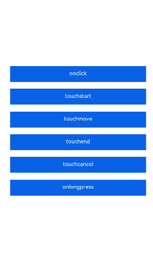

# Defining Gesture Events
<!--Kit: ArkUI-->
<!--Subsystem: ArkUI-->
<!--Owner: @jiangtao92-->
<!--Designer: @piggyguy-->
<!--Tester: @songyanhong-->
<!--Adviser: @HelloCrease-->

A gesture represents a semantic action (for example, touch, click, or longpress) that can trigger one or more events. A gesture lifecycle may consist of multiple events from the start to the end of the gesture. Supported events are as follows:

**Touch**

- **touchstart**: Triggered when the touch starts.

- **touchmove**: Triggered when the touch moves.

- **touchcancel**: Triggered when the touch is interrupted, for example, by an incoming call notification or pop-up message.

- **touchend**: Triggered when the touch ends.

**Click**

**click**: Triggered when a user taps the screen quickly.

**Longpress**

**longpress**: Triggered when a user keeps tapping the screen at the same position for a while.

The following is an example:

```html
<!-- xxx.hml -->
<div class="container">
  <div class="text-container" onclick="click">
    <text class="text-style">{{onClick}}</text>
  </div>
  <div class="text-container" ontouchstart="touchStart">
    <text class="text-style">{{touchstart}}</text>
  </div>
  <div class="text-container" ontouchmove="touchMove">
    <text class="text-style">{{touchmove}}</text>
  </div>
  <div class="text-container" ontouchend="touchEnd">
    <text class="text-style">{{touchend}}</text>
  </div>
  <div class="text-container" ontouchcancel="touchCancel">
    <text class="text-style">{{touchcancel}}</text>
  </div>
  <div class="text-container" onlongpress="longPress">
    <text class="text-style">{{onLongPress}}</text>
  </div>
</div>
```

```css
/* xxx.css */
.container {
  width: 100%;
  height: 100%;
  flex-direction: column;
  justify-content: center;
  align-items: center;
}
.text-container {
  margin-top: 30px;
  flex-direction: column;
  width: 600px;
  height: 70px;
  background-color: #0000FF;
}
.text-style {
  width: 100%;
  line-height: 50px;
  text-align: center;
  font-size: 24px;
  color: #ffffff;
}
```

```js
// xxx.js
export default {
    data: {
        touchstart: 'touchstart',
        touchmove: 'touchmove',
        touchend: 'touchend',
        touchcancel: 'touchcancel',
        onClick: 'onclick',
        onLongPress: 'onLongPress',
    },
    touchCancel: function (event) {
        console.info('event is', JSON.stringify(event));
        this.touchcancel = 'canceled';
    },
    touchEnd: function(event) {
        console.info('event is', JSON.stringify(event));
        this.touchend = 'ended';
    },
    touchMove: function(event) {
        console.info('event is', JSON.stringify(event));
        this.touchmove = 'moved';
    },
    touchStart: function(event) {
        console.info('event is', JSON.stringify(event));
        this.touchstart = 'touched';
    },
    longPress: function() {
        this.onLongPress = 'longPressed';
    },
    click: function() {
        this.onClick = 'clicked';
    },
}
```

