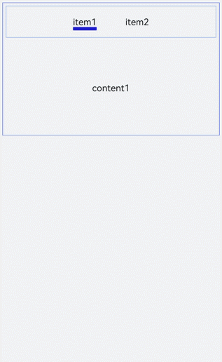
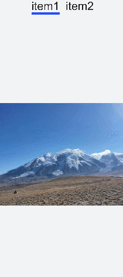
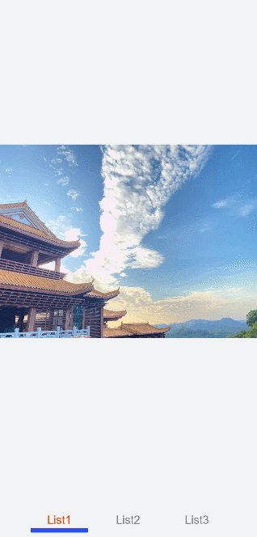

# &lt;tabs&gt; Development


The **&lt;tabs&gt;** component is a common UI component for navigation. It allows quick access to different functions of an app. For details, see [tabs](../reference/apis-arkui/arkui-js/js-components-container-tabs.md).


## Creating Tabs

Create a **&lt;tabs&gt;** component in the .hml file under **pages/index**.

```html
<!-- xxx.hml -->
<div class="container">
    <tabs>
        <tab-bar>
            <text>item1</text>
            <text>item2</text>
        </tab-bar>
        <tab-content class="tabContent">
            <div class="text">
                <text>content1</text>
            </div>
            <div class="text">
                <text>content2</text>
            </div>
        </tab-content>
    </tabs>
</div>
```

```css
/* xxx.css */
.container {
  flex-direction: column;
  justify-content: center;
  align-items: center;
  background-color: #F1F3F5;
}
.tabContent{
  width: 100%;
  height: 100%;
}
.text{
  width: 100%;
  height: 100%;
  justify-content: center;
  align-items: center;
}
```


## Setting Styles

Set the background color, border, and tab-content layout of the **&lt;tabs&gt;** component.
```html
<!-- xxx.hml -->
<div class="container">
  <tabs class="tabs">
    <tab-bar class="tabBar">
      <text class="tabBarItem">item1</text>
      <text class="tabBarItem">item2</text>
    </tab-bar>
    <tab-content class="tabContent">
      <div class="tabContent">
        <text>content1</text>
      </div>
      <div class="tabContent" >
        <text>content2</text>
      </div>
    </tab-content>
  </tabs>
</div>
```

```css
/* xxx.css */
.container {
  flex-direction: column;
  justify-content: flex-start;
  align-items: center;
 background-color:#F1F3F5;
}
.tabs{
  margin-top: 20px;
 border: 1px solid #2262ef;
  width: 99%;
  padding: 10px;
}
.tabBar{
  width: 100%;
  border: 1px solid #78abec;
}
.tabContent{
  width: 100%;
  margin-top: 10px;
  height: 300px;
  color: blue;   
  justify-content: center;  
  align-items: center;
}
```




## Displaying the Tab Index

Add the **change** event for the **&lt;tabs&gt;** component to display the index of the current tab after tab switching.

```html
<!-- xxx.hml -->
<div class="container" style="background-color:#F1F3F5;">
  <tabs class="tabs" onchange="tabChange">
    <tab-bar class="tabBar">
      <text class="tabBarItem">item1</text>
      <text class="tabBarItem">item2</text>
    </tab-bar>
    <tab-content class="tabContent">
      <div>
        <image src="common/images/bg-tv.jpg" style="object-fit: contain;"> </image>
      </div>
      <div>
        <image src="common/images/img1.jpg" style="object-fit: contain;"> </image>
      </div>
    </tab-content>
  </tabs>
</div>
```

```js
// xxx.js
import promptAction from '@ohos.promptAction';
export default {
  tabChange(e){
    promptAction.showToast({
      message: "Tab index: " + e.index
    })
  }
}
```




> **NOTE**
>
> A **&lt;tabs&gt;** can wrap at most one [**&lt;tab-bar&gt;**](../reference/apis-arkui/arkui-js/js-components-container-tab-bar.md)  and at most one [**&lt;tab-content&gt;**](../reference/apis-arkui/arkui-js/js-components-container-tab-content.md).


## Example Scenario

In this example, you can switch between tabs and the active tab has the title text in red with an underline below.

Use the **&lt;tabs&gt;**, **&lt;tab-bar&gt;**, and **&lt;tab-content&gt;** components to implement tab switching. Then define the arrays and attributes. Add the **change** event to change the attribute values in the arrays so that the active tab has a different font color and an underline.

```html
<!-- xxx.hml -->
<div class="container">
  <tabs onchange="changeTabactive">
    <tab-content>
      <div class="item-container" for="datas.list">
        <div if="{{$item.title=='List1'?true:false}}">
          <image src="common/images/bg-tv.jpg" style="object-fit: contain;"> </image>
        </div>
        <div if="{{$item.title=='List2'?true:false}}">
          <image src="common/images/img1.jpg" style="object-fit: none;"> </image>
        </div>
        <div if="{{$item.title=='List3'?true:false}}">
          <image src="common/images/img2.jpg" style="object-fit: contain;"> </image>
        </div>
      </div>
    </tab-content>
    <tab-bar class="tab_bar mytabs" mode="scrollable">
      <div class="tab_item" for="datas.list">
        <text style="color: {{$item.color}};">{{$item.title}}</text>
        <div class="underline-show" if="{{$item.show}}"></div>
        <div class="underline-hide" if="{{!$item.show}}"></div>
      </div>
    </tab-bar>
  </tabs>
</div>
```

```css
/* xxx.css */
.container{
width: 100%;
height: 100%;
background-color:#F1F3F5;
}
.tab_bar {
  width: 100%;
  height: 150px;
}
.tab_item {
  height: 30%;
  flex-direction: column;
  align-items: center;
}
.tab_item text {
  font-size: 32px;
}
.item-container {
  justify-content: center;
  flex-direction: column;
}
.underline-show {
  height: 2px;
  width: 160px;
  background-color: #FF4500;
  margin-top: 7.5px;
}
.underline-hide {
  height: 2px;
  margin-top: 7.5px;
  width: 160px;
}
```

```js
// xxx.js
import promptAction from '@ohos.promptAction';
export default {
  data() {
    return {
      datas: {
        color_normal: '#878787',
        color_active: '#ff4500',
        show: true,
        list: [{
          i: 0,
          color: '#ff4500',
          show: true,
          title: 'List1'
        }, {
          i: 1,
          color: '#878787',
          show: false,
          title: 'List2'
        }, {
           i: 2,
           color: '#878787',
           show: false,
           title: 'List3'
        }]
      }
    }
  },
  changeTabactive (e) {
    for (let i = 0; i < this.datas.list.length; i++) {
      let element = this.datas.list[i];
      element.show = false;
      element.color = this.datas.color_normal;
      if (i === e.index) {
        element.show = true;
        element.color = this.datas.color_active;
      }
    }
  }
}
```

