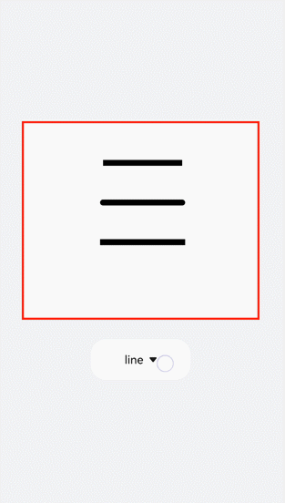
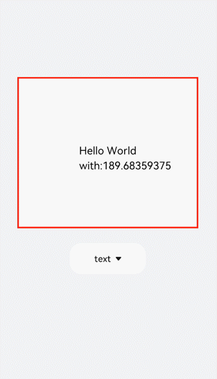
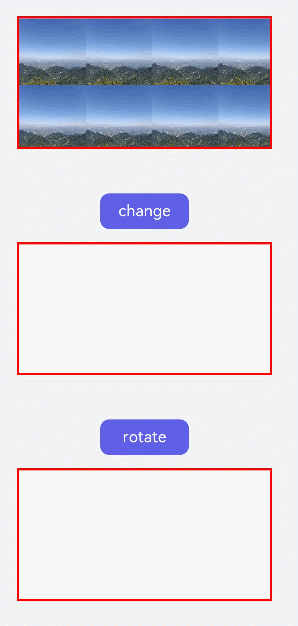
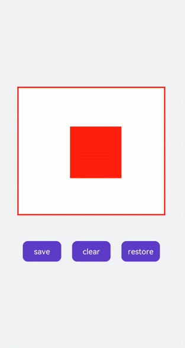

# CanvasRenderingContext2D


Use **CanvasRenderingContext2D** to draw objects such as graphics, texts, line segments, and images on the **&lt;canvas&gt;** component. For details, see [CanvasRenderingContext2D](../reference/apis-arkui/arkui-js/js-components-canvas-canvasrenderingcontext2d.md).


## Drawing Line Segments

Use **moveTo** and **lineTo** to draw a line segment. Use the **closePath** method to end current path, obtaining a closed path. Set **quadraticCurveTo** (quadratic bezier curve) or **bezierCurveTo** (cubic bezier curve) to draw a graphic.


```html
<!-- xxx.hml -->
<div class="container">
  <canvas ref="canvas1"></canvas>
  <select @change="change">
    <option value="value1"> line </option>
    <option value="value2"> quadratic </option>
    <option value="value3"> bezier </option>
    <option value="value4"> arc/ellipse </option>
    <option value="value5"> lineJoin/miterLimit </option>
  </select>
</div>
```


```css
/* xxx.css */
.container{
  width: 100%;
  height: 100%;
  flex-direction: column;
  justify-content: center;
  align-items: center;
  background-color: #F1F3F5;
}
canvas{
  width: 600px;
  height: 500px;
  background-color: #fdfdfd;
  border: 5px solid red;
}
select{
  margin-top: 50px;
  width: 250px;
  height: 100px;
  background-color: white;
}
```


```js
// xxx.js
export default {
  data:{
    el: null,
    ctx: null,
  },
  onShow(){
    this.el = this.$refs.canvas1;
    this.ctx = this.el.getContext("2d",{antialias: true});
    // Clear the contents on the canvas.
    this.ctx.clearRect(0, 0, 600, 500);
    // Create a drawing path.
    this.ctx.beginPath();
    // Square off the endpoints of the line.
    this.ctx.lineCap = 'butt';
    // Border width
    this.ctx.lineWidth = 15;
    // Create a drawing path.
    this.ctx.beginPath();
    // Move a drawing path from the current point to a target position.
    this.ctx.moveTo(200, 100);
    // Connect the current point to a target position.
    this.ctx.lineTo(400, 100);
    // Stroke a path.
    this.ctx.stroke();
    this.ctx.beginPath();
    // Round the endpoints of the line.
    this.ctx.lineCap = 'round';
    this.ctx.moveTo(200, 200);
    this.ctx.lineTo(400, 200);
    this.ctx.stroke();
    // Square off the endpoints of the line.
    this.ctx.beginPath();
    this.ctx.lineCap = 'square';
    this.ctx.moveTo(200, 300);
    this.ctx.lineTo(400, 300);
    this.ctx.stroke();
  },
  change(e){
    if(e.newValue == 'value1'){
      this.el = this.$refs.canvas1;
      this.ctx = this.el.getContext("2d",{antialias: true});
      this.ctx.clearRect(0, 0, 600, 500);
      // Top
      this.ctx.beginPath();
      this.ctx.lineCap = 'butt';
      this.ctx.moveTo(200, 100);
      this.ctx.lineTo(400, 100);
      this.ctx.stroke();
      // Center
      this.ctx.beginPath();
      this.ctx.lineCap = 'round';
      this.ctx.moveTo(200, 200);
      this.ctx.lineTo(400, 200);
      this.ctx.stroke();
      // Bottom
      this.ctx.beginPath();
      this.ctx.lineCap = 'square';
      this.ctx.moveTo(200, 300);
      this.ctx.lineTo(400, 300);
      this.ctx.stroke();
    }else if(e.newValue == 'value2'){
      this.ctx.clearRect(0, 0, 600, 500);
      // Top
      this.ctx.beginPath();
      this.ctx.moveTo(100, 150);
      // Path of the quadratic bezier curve
      this.ctx.quadraticCurveTo(300, 50, 500, 150);
      this.ctx.stroke();
      // Left
      this.ctx.beginPath();
      this.ctx.moveTo(200, 150);
      this.ctx.quadraticCurveTo(250, 250, 250, 400);
      this.ctx.stroke();
      // Right
      this.ctx.beginPath();
      this.ctx.moveTo(400, 150);
      this.ctx.quadraticCurveTo(350, 250, 350, 400);
      this.ctx.stroke();
    }else if(e.newValue == 'value3'){
      this.ctx.clearRect(0, 0, 600, 500);
      // Bottom
      this.ctx.beginPath();
      this.ctx.moveTo(100, 200);
      // Path of the cubic bezier curve
      this.ctx.bezierCurveTo(150, 100, 200, 100,250, 200);
      this.ctx.stroke();
      // Left
      this.ctx.beginPath();
      this.ctx.moveTo(350, 200);
      this.ctx.bezierCurveTo(400, 100, 450, 100,500, 200);
      this.ctx.stroke();
      // Right
      this.ctx.beginPath();
      this.ctx.moveTo(200, 350);
      this.ctx.bezierCurveTo(250, 500, 350, 500, 400, 350);
      this.ctx.stroke();
    }else if(e.newValue == 'value4'){
      this.ctx.clearRect(0, 0, 600, 500);
      this.ctx.beginPath();
      this.ctx.moveTo(100, 200);
      // Arc
      this.ctx.arcTo(150, 300, 350, 300, 150);
      this.ctx.stroke();
      this.ctx.beginPath();
      // Ellipse
      this.ctx.ellipse(400, 250, 50, 100, Math.PI * 0.25, Math.PI * 0.5 , Math.PI , 1);
      this.ctx.stroke();
    }else if(e.newValue == 'value5'){
      this.ctx.clearRect(0, 0, 600, 500);
      // Upper left
      this.ctx.beginPath();
      // Draw a sector centered at the common endpoint of connected line segments.
      this.ctx.lineJoin = 'round';
      this.ctx.moveTo(100, 100);
      this.ctx.lineTo(200, 200);
      this.ctx.lineTo(100, 250);
      this.ctx.stroke();
      // lower left
      this.ctx.beginPath();
      // Fill a triangular between the common endpoint of connected segments.
      this.ctx.lineJoin = 'bevel';
      this.ctx.moveTo(100, 300);
      this.ctx.lineTo(200, 400);
      this.ctx.lineTo(100, 450);
      this.ctx.stroke();
      // Top right
      this.ctx.beginPath();
      // Distance between the internal angle and exterior angle at the intersection of lines
      this.ctx.lineJoin = 'miter';
      this.ctx.miterLimit = 3;
      this.ctx.moveTo(400, 100);
      this.ctx.lineTo(450, 200);
      this.ctx.lineTo(400, 250);
      // Draw a closed path.
      this.ctx.closePath();
      this.ctx.stroke();
      // Lower right
      this.ctx.beginPath();
      this.ctx.lineJoin = 'miter';
      this.ctx.miterLimit = 10;
      this.ctx.moveTo(400, 300);
      this.ctx.lineTo(450, 400);
      this.ctx.lineTo(400, 450);
      this.ctx.closePath();
      this.ctx.stroke();
    }
  },
}
```




## Drawing Border

Globally define the canvas (**el**) and brush (**ctx**), and create a rectangle with the border width of 5 upon initialization. Change the border width (**lineWidth**), color (**strokeStyle**), and line dash level (**setLineDash**). Add the **change** event to the **&lt;select&gt;** component. The **change** event will be triggered upon selection and the changed image will be displayed.


```html
<!-- xxx.hml -->
<div class="container">
  <canvas ref="canvas1"></canvas>
  <select @change="change">
    <option value="value1">strokeRect</option>
    <option value="value2">arc</option>
    <option value="value3">lineDashRect</option>
    <option value="value4">fillRect</option>
  </select>
</div>
```


```css
/* xxx.css */
.container{
  width: 100%;
  height: 100%;
  flex-direction: column;
  justify-content: center;
  align-items: center;
  background-color: #F1F3F5;
}
canvas{
  width: 600px;
  height: 500px;
  background-color: #fdfdfd;
  border: 5px solid red;
}
select{
  margin-top: 50px;
  width: 250px;
  height: 100px;
  background-color: white;
}
```


```js
// xxx.js
export default {
  data:{
    el: null,
    ctx: null,
  },
  onShow(){
    this.el = this.$refs.canvas1;
    this.ctx = this.el.getContext("2d",{antialias: true});
    this.ctx.lineWidth = 5;
    this.ctx.strokeRect(200, 150, 200, 200);
  },
  change(e){
    if(e.newValue == 'value1'){
      // Clear the contents on the canvas.
      this.ctx.clearRect(0,0,600,500);
      // Border width
      this.ctx.lineWidth = 5;
      // Border color
      this.ctx.strokeStyle = '#110000';
      // Line dash level of the border
      this.ctx.setLineDash([0,0]);
      // Draw a stroked rectangle.
      this.ctx.strokeRect(200, 150, 200, 200);
    }else if (e.newValue == 'value2'){
      this.ctx.clearRect(0,0,600,500);
      this.ctx.lineWidth = 30;
      this.ctx.strokeStyle = '#0000ff';
      this.ctx.setLineDash([0,0]);
      // Draw a circle.
      this.ctx.arc(300, 250, 150,0,6.28);
      // Draw borders.
      this.ctx.stroke();
    }else if (e.newValue == 'value3'){
      this.ctx.clearRect(0,0,600,500);
      this.ctx.lineWidth = 5;
      this.ctx.setLineDash([5,5]);
      this.ctx.strokeRect(200, 150, 200, 200);
    }else if (e.newValue == 'value4'){
      this.ctx.clearRect(0,0,600,500);
      // Draw and fill a rectangle.
      this.ctx.fillStyle = '#0000ff';
      this.ctx.fillRect(200, 150, 200, 200);
    }
  },
}
```


## Setting Gradient Fill Colors

Add the **createLinearGradient** and **createRadialGradient** attributes to create a gradient container, use the **addColorStop** method to add multiple color blocks to form a gradient color, and set **fillStyle** as **gradient** to apply the gradient color to a rectangle. Then set the shadow blur level by using **shadowBlur**, the shadow color by using **shadowColor**, and the shadow offset by using **shadowOffset**.


```html
<!-- xxx.hml -->
<div class="container">
  <canvas ref="canvas1"></canvas>
  <select @change="change">
    <option value="value1">LinearGradient</option>
    <option value="value2">RadialGradient</option>
    <option value="value3">shadowBlur</option>
    <option value="value4">shadowOffset</option>
  </select>
</div>
```


```css
/* xxx.css */
.container{
  width: 100%;
  height: 100%;
  flex-direction: column;
  justify-content: center;
  align-items: center;
  background-color: #F1F3F5;
}
canvas{
  width: 600px;
  height: 500px;
  background-color: #fdfdfd;
  border: 5px solid red;
}
select{
  margin-top: 50px;
  width: 250px;
  height: 100px;
  background-color: white;
}
```


```js
// xxx.js
export default {
  data:{
    el: null,
    ctx: null,
  },
  onShow(){
    this.el = this.$refs.canvas1;
    this.ctx = this.el.getContext("2d",{antialias: true});
    // Create a linear gradient.
    let gradient = this.ctx.createLinearGradient(100,100, 400,300);
    // Add gradient colors.
    gradient.addColorStop(0.0, 'red');
    gradient.addColorStop(0.7, 'white');
    gradient.addColorStop(1.0, 'green');
    // Apply the gradient.
    this.ctx.fillStyle = gradient;
    this.ctx.fillRect(100, 100, 400, 300);
  },
  change(e){
    if(e.newValue == 'value1'){
      // Clear the contents on the canvas.
      this.ctx.clearRect(0,0,600,500);
      let gradient = this.ctx.createLinearGradient(100,100, 400,300);
      gradient.addColorStop(0.0, 'red');
      gradient.addColorStop(0.7, 'white');
      gradient.addColorStop(1.0, 'green');
      this.ctx.fillStyle = gradient;
      // Set the level of shadow blur.
      this.ctx.shadowBlur = 0;
      // Set the distance that shadows will be offset vertically.
      this.ctx.shadowOffsetY = 0;
      // Set the distance that shadows will be offset horizontally.
      this.ctx.shadowOffsetX = 0;
      this.ctx.fillRect(100, 100, 400, 300);
    }else if(e.newValue == 'value2'){
      this.ctx.clearRect(0,0,600,500);
      // Create a radial gradient.
      let gradient = this.ctx.createRadialGradient(300,250,20,300,250,100);
      gradient.addColorStop(0.0, 'red');
      gradient.addColorStop(0.7, 'white');
      gradient.addColorStop(1.0, 'green');
      this.ctx.shadowBlur = 0;
      this.ctx.shadowOffsetY = 0;
      this.ctx.shadowOffsetX = 0;
      this.ctx.fillStyle = gradient;
      this.ctx.fillRect(100, 100, 400, 300);
    }else if(e.newValue == 'value3'){
      this.ctx.clearRect(0,0,600,500);
      let gradient = this.ctx.createLinearGradient(100,100, 400,400);             
      gradient.addColorStop(0.0, 'red');    
      gradient.addColorStop(0.5, 'white');    
      gradient.addColorStop(1, '#17ea35');
      // Set the level of shadow blur.
      this.ctx.shadowBlur = 30;
      // Set the shadow color.
      this.ctx.shadowColor = 'rgb(229, 16, 16)';
      this.ctx.fillStyle = gradient;
      this.ctx.fillRect(100, 100, 400, 300);
    }else if(e.newValue == 'value4'){
      this.ctx.clearRect(0,0,600,500);
      this.ctx.clearRect(0,0,600,500);
      let gradient = this.ctx.createRadialGradient(300,250,20,300,250,200);      
      gradient.addColorStop(0.0, 'red');     
      gradient.addColorStop(0.5, 'white');     
      gradient.addColorStop(1, '#17ea35');
      // Set the level of shadow blur.
      this.ctx.shadowBlur = 30;     
      this.ctx.shadowOffsetY = 30;
      // Set the shadow color.
      this.ctx.shadowColor = 'rgb(23, 1, 1)';
      this.ctx.fillStyle = gradient;
      this.ctx.fillRect(100, 100, 400, 300);
    }
  },
}
```


## Filling Texts

Create a text and use the **fillText** method to write the text on the canvas. Use the **globalAlpha** attribute to change the baseline transparency to avoid the text being hidden by the baseline. Then set the **textAlign** and **textBaseline** attributes to determine the text position based on the baseline.


```html
<!-- xxx.hml -->
<div class="container">
  <canvas ref="canvas1"></canvas>
  <select @change="change">
    <option value="value1">text</option>
    <option value="value2">textBaseline</option>
    <option value="value3">textAlign</option>
  </select>
</div>
```


```css
/* xxx.css */
.container{
  width: 100%;
  height: 100%;
  flex-direction: column;
  justify-content: center;
  align-items: center;
  background-color: #F1F3F5;
}
canvas{
  width: 600px;
  height: 500px;
  background-color: #fdfdfd;
  border: 5px solid red;
}
select{
  margin-top: 50px;
  width: 250px;
  height: 100px;
  background-color: white;
}
```


```js
// xxx.js
export default {
  data:{
    el: null,
    ctx: null,
  },
  onShow(){
    this.el = this.$refs.canvas1;
    this.ctx = this.el.getContext("2d",{antialias: true});
    // Create a text.
    let text = "Hello World";
    // Set the font.
    this.ctx.font = '30px';
    this.ctx.fillText("with:"+this.ctx.measureText(text).width, 200, 300);
    // Set the fill text.
    this.ctx.fillText(text, 200, 250);
  },
  change(e){
    if(e.newValue == 'value1'){
      // Clear the contents on the canvas.
      this.ctx.clearRect(0,0,600,500);
      // Start a new path.
      this.ctx.beginPath();
      // Initialize the textAlign value.
      this.ctx.textAlign = 'left';
      // Initialize textBaseline.
      this.ctx.textBaseline = 'alphabetic';
      // Set the font.
      this.ctx.font = '30px';
      let text = "Hello World";
      // Obtain the font width.
      this.ctx.fillText("with:"+this.ctx.measureText(text).width, 200, 300);
    // Set the fill text.
      this.ctx.fillText(text, 200, 250);
    }else if(e.newValue == 'value2'){
      this.ctx.clearRect(0,0,600,500);
      this.ctx.beginPath();
      // Set the Alpha value.
      this.ctx.globalAlpha = 0.1;
      // Set the line width.
      this.ctx.lineWidth = 10;
      // Set the line segment color.
      this.ctx.strokeStyle = '#0000ff';
      // Move from the current point to a target position.
      this.ctx.moveTo(0, 240);
      // Connect the current point to a target position.
      this.ctx.lineTo(600, 240);
      this.ctx.stroke();
      this.ctx.font = '35px';
      this.ctx.globalAlpha = 1;
      // Initialize the textAlign value.
      this.ctx.textAlign = 'left';
      // Set textBaseline.
      this.ctx.textBaseline = 'top';
      this.ctx.fillText('Top', 50, 240);
      this.ctx.textBaseline = 'bottom';
      this.ctx.fillText('Bottom', 200, 240);
      this.ctx.textBaseline = 'middle';
      this.ctx.fillText('Middle', 400, 240);
    }else if(e.newValue == 'value3'){
      // Clear the contents on the canvas.
      this.ctx.clearRect(0,0,600,500);
      this.ctx.beginPath();
      this.ctx.globalAlpha = 0.1;
      this.ctx.lineWidth = 10;
      this.ctx.strokeStyle = '#0000ff';
      this.ctx.moveTo(300, 0);
      this.ctx.lineTo(300, 500);
      this.ctx.stroke();
      this.ctx.font = '35px';
      this.ctx.globalAlpha = 1;
      // Initialize textBaseline.
      this.ctx.textBaseline = 'alphabetic';
      // Set textAlign.
      this.ctx.textAlign = 'left';
      this.ctx.fillText('textAlign=left',300, 100);
      this.ctx.textAlign = 'center';
      this.ctx.fillText('textAlign=center',300, 250);
      this.ctx.textAlign = 'right';
      this.ctx.fillText('textAlign=right',300, 400);
    }
  }
}
```



> **NOTE**
>
> In the **ltr** layout mode, the value **start** equals **left**. In the **rtl** layout mode, the value **start** equals **right**.


## Adding Images

After creating an image object, use the **drawImage** attribute to draw the image and set animation styles such as scaling, translating, and rotating.


```html
<!-- xxx.hml -->
<div class="container">
  <div class="content">
    <canvas ref="canvas0"></canvas>
    <text onclick="change">change</text>
    <canvas ref="canvas1"></canvas>
    <text onclick="rotate">rotate</text>
    <canvas ref="canvas2"></canvas>
    <text onclick="scale">scale</text>
    <canvas ref="canvas3"></canvas>
    <text onclick="translate" style="width: 300px;">translate</text>
    <canvas ref="canvas4"></canvas>
    <text onclick="transform" style="width: 300px;">transform</text>
    <canvas ref="canvas5"></canvas>
    <text onclick="setTransform" style="width: 300px;">setTransform</text>
    <canvas ref="canvas6"></canvas>
  </div>
</div>
```


```css
/* xxx.css */
.container{
  width: 100%;
  flex-direction: column;
  background-color: #F1F3F5;
  align-items: center;
}
canvas{
  width: 600px;
  height: 300px;
  margin-bottom: 100px;
  background-color: #fdfdfd;
  border: 5px solid red;
}
.content{
  width: 80%;
  margin-top: 50px;
  margin-bottom: 50px;
  display: flex;
  flex-wrap: wrap;
  justify-content: space-around;
}
text{
  font-size: 35px;
  width: 200px;
  height: 80px;
  color: white;
  border-radius: 20px;
  text-align: center;
  background-color: #6060e7;
  margin-bottom: 30px;
}
```


```js
// xxx.js
import promptAction from '@ohos.promptAction';
export default {
  data:{
    compositeOperation: 'source-over'
  },
  onShow(){
    let ctx = this.$refs.canvas0.getContext("2d");
    // Create an image object.
    let img = new Image();
    // Set the image path.
    img.src = 'common/images/2.png';
    // Set the image width.
    img.width= 150;
    // Set the image height.
    img.height=150;
    // Create an image tiling container.
    var pat = ctx.createPattern(img, 'repeat');ctx.fillStyle = pat;
    ctx.fillRect(0, 0, 600, 300);
  },
  change(){
    // Obtain the brush after the canvas is created.
    let ctx = this.$refs.canvas1.getContext("2d");
    ctx.clearRect(0,0,600,1000);
    if(this.compositeOperation == "source-over"){
      this.compositeOperation = "destination-over";
    }else{
      this.compositeOperation = "source-over";
    }
    ctx.globalCompositeOperation = this.compositeOperation;
    let img = new Image();
    img.src = 'common/images/2.png';
    // Invoked when the image is successfully obtained.
    img.onload = function() {
      ctx.drawImage(img, 150, 20, 200, 200);
    };
    let img1 = new Image();
    img1.src = 'common/images/3.png';
    img1.onload = function() {
      // Draw an image.
      ctx.drawImage(img1, 250, 80, 200, 200);
    };
    // A method is triggered when the image fails to be obtained.
    img1.onerror = function() {
      promptAction.showToast({message:"error",duration:2000})
    };
  },
  rotate(){
    let ctx = this.$refs.canvas2.getContext("2d");
    ctx.clearRect(0,0,600,300);
    // Rotate the image.
    ctx.rotate(10 * Math.PI / 180);
    let img = new Image();
    img.src = 'common/images/2.png';
    img.onload = function() {
      ctx.drawImage(img, 300, 0, 100, 100);
    };
  },
  scale(){
    let ctx = this.$refs.canvas3.getContext("2d");
    ctx.clearRect(0,0,600,200);
    // Scale the image.
    ctx.scale(1.3,1.2);
    let img = new Image();
    img.src = 'common/images/2.png';
    img.onload = function() {
      ctx.drawImage(img, 0, 0, 50, 50);
    };
  },
  translate(){
    let ctx = this.$refs.canvas4.getContext("2d");
    ctx.clearRect(0,0,600,300);
    ctx.translate(10,0);
    let img = new Image();
    img.src = 'common/images/2.png';
    img.onload = function() {
      ctx.drawImage(img, 0, 50, 300, 200);
    };
  },
  transform(){
    let ctx = this.$refs.canvas5.getContext("2d");
    ctx.clearRect(0,0,600,300);
    ctx.transform(1.1, 0.1, 0.1, 1, 10, 0);
    let img = new Image();
    img.src = 'common/images/2.png';
    img.onload = function() {
      ctx.drawImage(img, 0, 50, 100, 100);
     };
  },
  setTransform(){
    let ctx = this.$refs.canvas6.getContext("2d");
    ctx.clearRect(0,0,600,300);
    ctx.setTransform(1.1, 0.1, 0.1, 1, 10, 0);
    let img = new Image();
    img.src = 'common/images/2.png';
    img.onload = function() {
      ctx.drawImage(img, 0, 50, 100, 100);
    };
  },
}
```



> **NOTE**
> - Unlike the **transform()** function, the **setTransform()** function resets the existing transformation matrix and creates a transformation matrix even if it uses the same parameters.
> 
> - The following formulas calculate coordinates of the transformed graph. **x** and **y** represent coordinates before transformation, and **x'** and **y'** represent coordinates after transformation.
>   x' = scaleX \* x + skewY \* y + translateX
> 
>   y' = skewX \* x + scaleY \* y + translateY


## Adding Methods

Use the **save** method to save the brush style, and use the **restore** method to restore the saved settings. In the following example, set the brush to red. After the brush setting is saved, clear the canvas and change the brush to blue. In this moment, directly using the brush will get a blue rectangle; using the brush after the restore operation will get a red rectangle.


```html
<!-- xxx.hml -->
<div class="container">
  <div class="content">
    <canvas ref="canvas"></canvas>
  </div>
  <div class="content">
    <text onclick="save">save</text>
    <text onclick="clear">clear</text>
    <text onclick="restore">restore</text>
  </div>
</div>
```


```css
/* xxx.css */
.container{
  width: 100%;
  height: 100%;
  flex-direction: column;
  background-color: #F1F3F5;
  align-items: center;
}
canvas{
  margin-top: 300px;
  width: 600px;
  height: 500px;
  background-color: #fdfdfd;
  border: 5px solid red;
}
.content{
  width: 80%;
  margin-top: 50px;
  margin-bottom: 50px;
  display: flex;
  flex-wrap: wrap;
  justify-content: space-around;
}
text{
  width: 150px;
  height: 80px;
  color: white;
  border-radius: 20px;
  text-align: center;
  background-color: #6060e7;
  margin-bottom: 30px;
}
```


```js
// xxx.js
import promptAction from '@ohos.promptAction';
export default {
  data:{
    ctx: '',
  },
  onShow(){
    this.ctx = this.$refs.canvas.getContext("2d");
    this.ctx.fillStyle = "red"
    this.ctx.fillRect(200, 150, 200, 200);
  },
  save(){
    // Save the brush setting.
    this.ctx.save();
    promptAction.showToast({message:"save succeed"});
  },
  clear(){ 
    this.ctx.clearRect(0,0,600,500);
    // Change the brush color.
    this.ctx.fillStyle = "#2133d2";
  },
  restore(){
    this.ctx.beginPath();
    // Restore the brush setting.
    this.ctx.restore();    
    this.ctx.fillRect(200, 150, 200, 200);
  },
}
```


