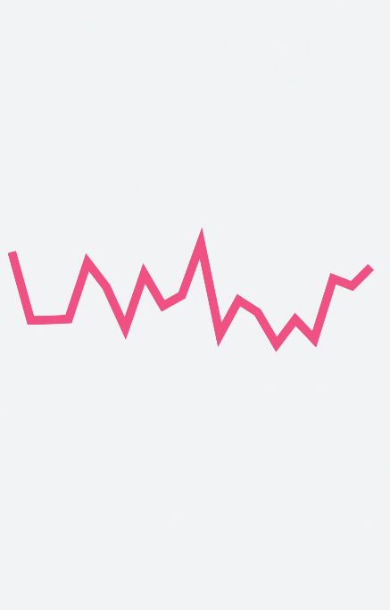
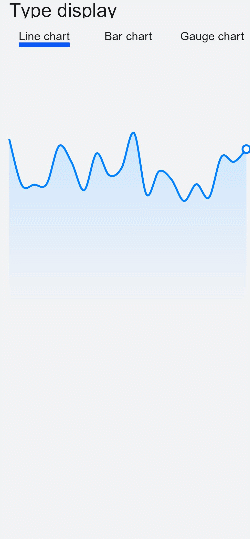
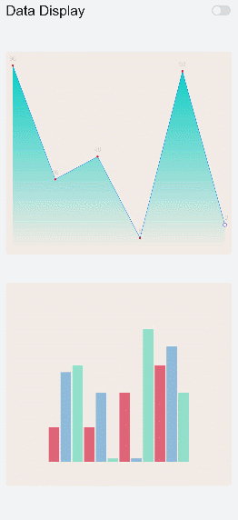

# &lt;chart&gt; Development


The **&lt;chart&gt;** component displays line charts, gauge charts, and bar charts. For details, see [chart](../reference/apis-arkui/arkui-js/js-components-basic-chart.md).


## Creating a &lt;chart&gt; Component

Create a **&lt;chart&gt;** component in the .hml file under **pages/index**.

```html
<!-- xxx.hml -->
<div class="container">
  <chart class="chart-data" type="line" options="{{lineOps}}" datasets="{{lineData}}"></chart>
</div>
```

```css
/* xxx.css */
.container {
  width: 100%;
  height: 100%;
  flex-direction: column;
  justify-content: center;
  align-items: center;
  background-color: #F1F3F5;
}
.chart-data {
  width: 700px;
  height: 600px;
}
```

```js
// xxx.js
export default {
  data: {
    lineData: [
      {
        data: [763, 550, 551, 554, 731, 654, 525, 696, 595, 628, 791, 505, 613, 575, 475, 553, 491, 680, 657, 716]
      }
    ],
    lineOps: {
      xAxis: {
        min: 0,
        max: 20,
        display: false,
      },
      yAxis: {
        min: 0,
        max: 1000,
        display: false,
      },
      series: {
        lineStyle: {
          width: 15,
        },
      }
    },
  }
}
```





## Setting the Chart Type

Define the chart type using the **type** attribute, for example, setting a chart to a bar chart.


```html
<!-- xxx.hml -->
<div class="container">
  <div class="container">
    <div class="switch-block">
      <text class="title">
        {{ title }}
      </text>
    </div>
    <tabs class="tabs" index="0" vertical="false" onchange="changes">
      <tab-content class="tabcontent" scrollable="true">
        <tabs >
          <tab-bar class="tab-bar" mode="fixed"style="margin-bottom: 50px;">
            <text class="tab-text">Line chart</text>
            <text class="tab-text">Bar chart</text>
            <text class="tab-text">Gauge chart</text>
          </tab-bar>
          <tab-content>
            <div class="bar-block" style="margin-left: 30px;">
              <chart class="chart-data" type="line" ref="linechart" options="{{ lineOps }}" datasets="{{ lineData }}">
              </chart>
            </div>
            <div class="bar-block">
              <chart class="data-bar" type="bar" id="bar-chart" options="{{ barOps }}" datasets="{{ barData }}">
              </chart>
            </div>
            <div class="chart-block">
              <chart type="gauge" ></chart>
            </div>
          </tab-content>
        </tabs>
      </tab-content>
    </tabs>
  </div>
</div>
```


```css
/* xxx.css */
.container {
  width: 100%;
  height: 100%;
  flex-direction: column;
  justify-content: center;
  background-color: #F1F3F5;
}
.tab-bar{
  background-color: #F1F3F5;
}
.chart-data {
  width: 700px;
  height: 600px;
}
.title{
  margin-left: 50px;
  margin-top: 50px;
  font-size: 50px;
}
.line-block{
  align-items: center;
  justify-content: center;
}
.bar-block{
  align-items: center;
  justify-content: center;
}
.chart-block{
  width: 90%;
  margin-left: 30px;
}
```


```js
// xxx.js
export default {
  data: {
    title:"Type display",
    barData: [
      {
        fillColor: '#3848e8',
        data: [763, 550, 551, 554, 731, 654, 525, 696, 595],
      }
    ],
    lineData: [
      {
        strokeColor: '#0081ff',
        fillColor: '#cce5ff',
        data: [763, 550, 551, 554, 731, 654, 525, 696, 595, 628, 791, 505, 613, 575, 475, 553, 491, 680, 657, 716],
        gradient: true,
      }
    ],
    lineOps: {
      xAxis: {
        min: 0,
        max: 20,
        display: false,
      },
      yAxis: {
        min: 0,
        max: 1000,
        display: false,
      },
      series:{
        lineStyle: {
          width: "5px",
          smooth: true,
        },
        headPoint: {
          shape:"circle",
          size: 20,
          strokeWidth: 5,
          fillColor: '#ffffff',
          strokeColor: '#007aff',
          display: true,
        },
        loop:{
          margin: 2,
          gradient: true
        }
      },
    },
    barOps: {
      xAxis: {
        min: 0,
        max: 20,
        display: false,
        axisTick: 10,
      },
      yAxis: {
        min: 0,
        max: 1000,
      },
    },
  },
}
```



> **NOTE**
>
> The **&lt;chart&gt;** component does not display the value of each point.


## Setting the Chart Attributes

In the **options** attribute of the **&lt;chart&gt;** component, you can set the x-axis, y-axis, and data series parameters. In the **datasets** attribute, you can set the line color, fill color, gradient fill color, and drawing point set.


```html
<!-- xxx.hml -->
<div class="container">
  <chart class="chart-data" type="line" options="{{lineOps}}" datasets="{{lineData}}"></chart>
</div>
```


```css
/* xxx.css */
.container {
  width: 100%;
  height: 100%;
  flex-direction: column;
  justify-content: center;
  align-items: center;
  background-color: #F1F3F5;
}
.chart-data {
  width: 700px;
  height: 600px;
}
```


```js
// xxx.js
export default {
  data: {
    // Line chart data
    lineData: [
      {
        strokeColor: '#0081ff',
        fillColor: '#cce5ff',  // Fill color
        data: [463, 250, 251, 254, 431, 354, 225, 396, 295, 328, 491, 205, 313, 275, 475, 553, 491, 380, 357, 416],
        gradient: true,
      }
    ],
   lineOps: {
     // X-axis parameters
      xAxis: {
        min: 0,
        max: 20,
        display: false,
      },
     // Y-axis parameters
      yAxis: {
        min: 0,
        max: 1000,
        display: false,
      },
     // Data series parameters
      series: {
        // Line style
        lineStyle: {
          width: "5px",
          smooth: true,
        },
        // Style and size of the white point at the start of the line
        headPoint: {
          shape: "circle",
          size: 20,
          strokeWidth: 5,
          fillColor: '#ffffff',
          strokeColor: '#007aff',
          display: true,
        },
        // Whether to start drawing again when the screen is looped.
        loop: {
          margin: 2,
          gradient: true
        }
      }
    },
  },
}
```

> **NOTE**
> - The **options** attribute supports the settings of bar charts and line charts but does not support those of gauge charts.
> 
> - The **datasets** attribute supports the datasets for bar charts and line charts but does not support those of gauge charts.
> 
> - Only line charts support **series**.


## Adding Data

Use the **append** method of the **&lt;chart&gt;** component to dynamically add data.


```html
<!-- xxx.hml -->
<div class="container">
  <stack class="chart-region">
    <chart class="chart-data" type="line" ref="linechart" options="{{lineOps}}" datasets="{{lineData}}"></chart>
  </stack>
  <button value="Add data" onclick="addData"></button>
</div>
```


```css
/* xxx.css */
.container {
  flex-direction: column;
  justify-content: center;
  align-items: center;
  background-color: #F1F3F5;
}
.chart-region {
  height: 400px;
  width: 700px;
}
.chart-data {
  width: 700px;
  height: 600px;
}
button {
  width: 100%;
  height: 50px;
  background-color: #F4F2F1;
  text-color: #0C81F3;
  margin-top: 30px;
}
```


```js
// xxx.js
export default {
  data: {
    lineData: [
      {
        strokeColor: '#de0b6e',
        fillColor: '#bb09a3',
        data: [763, 550, 551, 554, 731, 654, 525, 696, 595, 628, 791, 505, 613, 575, 475, 553, 491, 680, 657, 716],
        gradient: true,
      }
    ],
    lineOps: {
      xAxis: {
      min: 0,
      max: 20,
      display: false,
      },
      yAxis: {
        min: 0,
        max: 1000,
        display: false,
      },
      series: {
        lineStyle: {
          width: "5px",
          smooth: true,
        },
        headPoint: {
          shape: "circle",
          size: 20,
          strokeWidth: 5,
          fillColor: '#ffffff',
          strokeColor: '#f8145c',
          display: true,
        },
        loop: {
          margin: 2,
          gradient: true,
        }
      }
    },
  },
  addData() {    
    this.$refs.linechart.append({      
    serial: 0,        
      data: [Math.floor(Math.random() * 400) + 200]    
    })  
  }
}
```


## Example Scenario

Select the data display status using **&lt;switch&gt;**. When **&lt;switch&gt;** is set to **true**, the timer is used to dynamically display data.


```html
<!-- xxx.hml -->
<div class="container">
  <div class="container">
    <div class="switch-block">
      <text class="title">{{ title }} </text>
      <switch class="switch" showtext="{{ showText }}" allow-scale="{{ allowScale }}"onchange="change">
      </switch>
    </div>
    <tabs class="tabs" index="0" vertical="false" onchange="changes">
      <tab-content class="tabcontent" scrollable="true">
        <div>
          <tabs class="tabs" index="0" vertical="false" onchange="changes">
            <tab-content class="tabcontent" scrollable="true">
              <div class="line-class">
                <div class="bar-block">
                  <chart class="chart-data" type="line" ref="linechart" options="{{ lineOps }}"   
                  datasets="{{ lineData }}">
                  </chart>
                </div>
                <div class="bar-block">
                  <chart class="data-bar" type="bar" id="bar-chart" options="{{ barOps }}"datasets="{{ barData }}">
                  </chart>
                </div>
             </div>
           </tab-content>
         </tabs>
       </div>
       <div>
         <div class="container">
           <list class="todo-wrapper">
             <list-item for="{{ barData }}" class="todo-item">
               <text class="todo-title">{{ $item.data }}</text>
             </list-item>
           </list>
           <list class="todo-wrapper">
             <list-item for="{{ lineData.data }}" class="todo-item">
               <text class="todo-title">{{ $item.value }}</text>
             </list-item>
           </list>
         </div>
       </div>
      </tab-content>
    </tabs>
  </div>
</div>
```


```css
/* xxx.css */
.container{
  display:flex;
  flex-direction:column;
  background-color: #F1F3F5;
}
.line-class{
  display: flex;
  flex-direction: column;
}
.title{
  font-size: 40px;
  margin-left: 40px;
}
.switch-block {
  margin-top: 30px;
  width: 98%;
  height: 80px;
  display: flex;
  justify-content: space-between;
}
.switch{
  font-size: 40px;
}
.bar-block {
  margin-top: 80px;
  margin-left: 40px;
  position: relative;
  width: 90%;
  border-radius: 10px;
  background-color: #25FAB27B;
  height: 40%;
  justify-content: center;
}
```


```js
// xxx.js
export default {
  data: {
    interval: null,
    title: "Data Display",
    allowScale: true,
    dataLength: 30,
    barGroup: 3,
    lineData: null,
    lineOps: {
      xAxis: {
        min: 0,
        max: 5
      },
      yAxis: {
        min: 0,
        max: 100
      },
      series: {
        lineStyle: {
        width: '1px',
      },
        headPoint: {
          shape: 'circle',
          size: 10,
          strokeWidth: 2,
          fillColor: '#ffffff',
          strokeColor: '#8477DF'
        },
        loop: {
          margin: 2
        }
      }
    },
    barData: [
      {
        fillColor: '#97CF0A2C',
        data: [20, 20,40, 56]
      },
      {
        fillColor: '#6D0A7ACF',
        data: [52, 40, 2, 67]
      },
      {
        fillColor: '#6A0ACFA1',
        data: [56, 2, 77, 40]
      }
    ],
    barOps: {
      xAxis: {
        min: 0,
        max: 20,
        axisTick: 5
      },
      yAxis: {
        min: 0,
        max: 100
      }
    }
  },
  onInit() {
    this.changeLine();
  },
  change(e) {
    if (e.checked) {
      this.interval = setInterval(() => {
        this.changeLine();
        this.changeBar();
      }, 1000)
    } else {
      clearInterval(this.interval);
    }
  },
  changeLine() {
    var dataArray = [];
    for (var i = 0; i < this.dataLength; i++) {
      var nowValue = Math.floor(Math.random() * 99 + 1);
      var obj = {
        "value": nowValue,
        "description": nowValue + "",
        "textLocation": "top",
        "textColor": "#CDCACA",
        "pointStyle": {
          "shape": "circle",
          "size": 5,
          "fillColor": "#CF0A2C",
          "strokeColor": "#CF0A2C"
        }
      };
      dataArray.push(obj);
    }
    this.lineData = [
      {
        strokeColor: '#0081ff',
        fillColor: '#FF07CDC4',
        data: dataArray,
        gradient: true,
      }
    ]
  },
  changeBar() {
    for (var i = 0;i < this.barGroup; i++) {
      var dataArray = this.barData[i].data;
      for (var j = 0;j < 4; j++) {
        dataArray[j] = Math.floor(Math.random() * 99 + 1);
      }
    }
    this.barData = this.barData.splice(0, this.barGroup + 1);
  },
  changes(e) {
    console.log("Tab index: " + e.index);
  },
}

```

