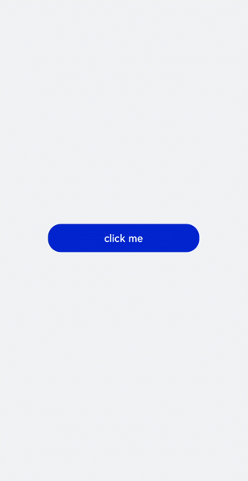
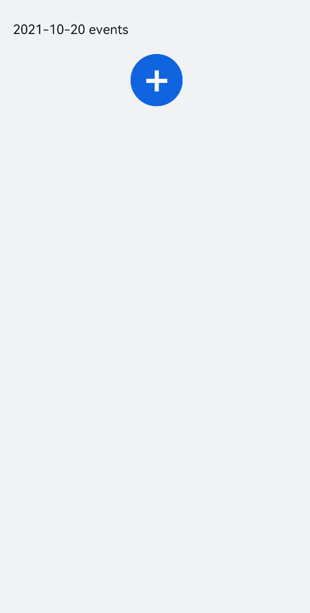

# &lt;dialog&gt; Development
<!--Kit: ArkUI-->
<!--Subsystem: ArkUI-->
<!--Owner: @liyi0309-->
<!--Designer: @liyi0309-->
<!--Tester: @lxl007-->
<!--Adviser: @HelloCrease-->


## Creating a &lt;dialog&gt; Component

Create a **&lt;dialog&gt;** component in the .hml file under **pages/index** and add **&lt;button&gt;** components to trigger the **&lt;dialog&gt;**. The **&lt;dialog&gt;** component supports only the **width**, **height**, **margin**, **margin-[left|top|right|bottom]**, and **margin-[start|end]** styles.

```html
<!-- xxx.hml -->
<div class="doc-page">
  <dialog class="dialogClass" id="dialogId" dragable="true">
    <div class="content">
      <text>this is a dialog</text>
    </div>
  </dialog>
  <button value="click me" onclick="openDialog"></button>
</div>
```

```css
/* xxx.css */
.doc-page {
  width:100%;
  height:100%;
  flex-direction: column;
  align-items: center;
  justify-content: center;
  background-color: #F1F3F5;
}
.dialogClass{
  width: 80%;
  height: 250px;
  margin-start: 1%;
}
.content{
  width: 100%;
  height: 250px;
  justify-content: center;
  background-color: #e8ebec;
  border-radius: 20px;
}
text{
  width: 100%;
  height: 100%;
  text-align: center;
}
button{
  width: 70%;
  height: 60px;
}
```

```js
// xxx.js
export default {
  //Touch to open the dialog box.
  openDialog(){
    this.$element('dialogId').show()
  },
}
```


## Setting Dialog Box Response

Add a **cancel** event that is triggered when a user touches a non-dialog area to cancel the pop-up dialog box. Add the **show** and **close** methods to display and close the dialog box, respectively.


```html
<!-- xxx.hml -->
<div class="doc-page">
  <dialog class="dialogClass" id="dialogId" oncancel="cancelDialog">
    <div class="dialogDiv">
      <text>dialog</text>
      <button value="confirm" onclick="confirmClick"></button>
    </div>
  </dialog>
  <button value="click me" onclick="openDialog"></button>
</div>
```


```css
/* xxx.css */
.doc-page {
  width:100%;
  height:100%;
  flex-direction: column;
  align-items: center;
  justify-content: center;
  background-color: #F1F3F5;
}
.dialogClass{
  width: 80%;
  height: 300px;
  margin-start: 1%;
}
.dialogDiv{
  width: 100%;
  flex-direction: column;
  justify-content: center;
  align-self: center;
}
text{
  height: 100px;
  align-self: center;
}
button{
  align-self: center;
  margin-top: 20px;
  width: 60%;
  height: 80px;
}
```


```js
// xxx.js
import promptAction from '@ohos.promptAction';
export default {
  cancelDialog(e){
    promptAction.showToast({
      message: 'dialogCancel'
    })
  },
  openDialog(){
    this.$element('dialogId').show()
     promptAction.showToast({
      message: 'dialogShow'
    })
  },
  confirmClick(e) {
    this.$element('dialogId').close()
    promptAction.showToast({
      message: 'dialogClose'
    })
  },
}
```





> **NOTE**
>
> - This component supports only one child component.
>
> - Attributes and styles of a **&lt;dialog&gt;** component cannot be dynamically updated.
>
> - The **&lt;dialog&gt;** component does not support the **focusable** and **click-effect** attributes.


## Example Scenario


Use the **&lt;dialog&gt;** component to implement a schedule. When the dialog box is open, use the [&lt;textarea&gt;](../reference/apis-arkui/arkui-js/js-components-basic-textarea.md) component to add an event and touch the OK button to obtain the current time and save the input text. The events in the calendar are displayed in a list.


```html
<!-- xxx.hml -->
<div class="doc-page">
  <text style="margin-top: 60px;margin-left: 30px;">
    <span>{{date}} events</span>
  </text>
  <div class="btnDiv">
    <button type="circle" class="btn" onclick="addSchedule">+</button>
  </div>
<!--  for Render events data  -->
  <list style="width: 100%;">
    <list-item type="item" for="scheduleList" style="width:100%;height: 200px;">
      <div class="scheduleDiv">
        <text class="text1">{{date}}  event</text>
        <text class="text2">{{$item.schedule}}</text>
      </div>
    </list-item>
  </list>
  <dialog id="dateDialog" oncancel="cancelDialog" >
    <div class="dialogDiv">
      <div class="innerTxt">
        <text class="text3">{{date}}</text>
        <text class="text4">New event</text>
      </div>
      <textarea placeholder="Event information" onchange="getSchedule" class="area" extend="true"></textarea>
      <div class="innerBtn">
        <button type="text" value="Cancel" onclick="cancelSchedule" class="innerBtn"></button>
        <button type="text" value="OK" onclick="setSchedule" class="innerBtn"></button>
      </div>
    </div>
  </dialog>
</div>
```


```css
/* xxx.css */
.doc-page {
  flex-direction: column;
  background-color: #F1F3F5;
}
.btnDiv {
  width: 100%;
  height: 200px;
  flex-direction: column;
  align-items: center;
  justify-content: center;
}
.btn {
  radius:60px;
  font-size: 100px;
  background-color: #1E90FF;
}
.scheduleDiv {
  width: 100%;
  height: 200px;
  flex-direction: column;
  justify-content: space-around;
  padding-left: 55px;
}
.text1 {
  color: #000000;
  font-weight: bold;
  font-size: 39px;
}
.text2 {
  color: #a9a9a9;
  font-size: 30px;
}
.dialogDiv {
  flex-direction: column;
  align-items: center;
}
.innerTxt {
  width: 320px;
  height: 160px;
  flex-direction: column;
  align-items: center;
  justify-content: space-around;
}
.text3 {
  font-family: serif;
  color: #1E90FF;
  font-size: 38px;
}
.text4 {
  color: #a9a9a9;
  font-size: 33px;
}
.area {
  width: 320px;
  border-bottom: 1px solid #1E90FF;
}
.innerBtn {
  width: 320px;
  height: 120px;
  justify-content: space-around;
  text-color: #1E90FF;
}
```


```js
// xxx.js
var info = null;
import promptAction from '@ohos.promptAction';
export default {
  data: {
    curYear:'',
    curMonth:'',
    curDay:'',
    date:'',
    schedule:'',
    scheduleList:[]
  },
  onInit() {
    // Obtain the current date. 
    var date = new Date();
    this.curYear = date.getFullYear();
    this.curMonth = date.getMonth() + 1;
    this.curDay = date.getDate();
    this.date = this.curYear + '-' + this.curMonth + '-' + this.curDay;
    this.scheduleList = []
  },
  addSchedule(e) {
    this.$element('dateDialog').show()
  },
  cancelDialog(e) {
    promptAction.showToast({
      message: 'Event setting canceled.'
    })
  },
  getSchedule(e) {
    info = e.value
  },
  cancelSchedule(e) {
    this.$element('dateDialog').close()
    promptAction.showToast({
      message: 'Event setting canceled.'
    })
  },
//    Touch OK to save the data.
  setSchedule(e) {
    if (e.text === '') {
      this.schedule = info
    } else {
      this.schedule = info
      var addItem =  {schedule: this.schedule,}
      this.scheduleList.push(addItem)
    }
    this.$element('dateDialog').close()
  }
}
```


