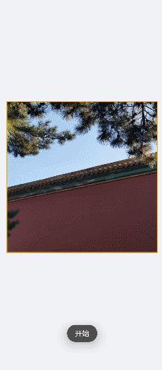
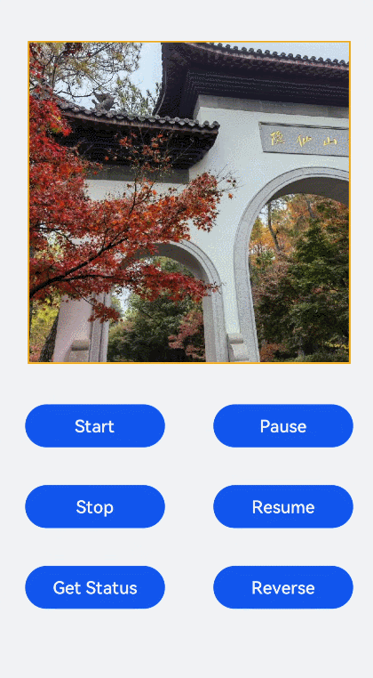

# &lt;image-animator&gt; Development


The **&lt;image-animator&gt;** component applies an animation to images. For details, see [image-animator](../reference/apis-arkui/arkui-js/js-components-basic-image-animator.md).


## Creating an &lt;image-animator&gt; Component

In the **pages/index** directory, create an **&lt;image-animator&gt;** component in the .hml file, define the component style in the .css file, and reference an image in the .js file.


```html
<!-- xxx.hml -->
<div class="container">
  <image-animator class="animator" images="{{frames}}" duration="3s"/>
</div>
```


```css
/* xxx.css */
.container {
  width: 100%;
  height: 100%;
  flex-direction: column;
  justify-content: center;
  align-items: center;
  background-color: #F1F3F5;
}
.animator {
  width: 500px;
  height: 500px;
}
```


```js
// index.js
export default {
  data: {
    frames: [
      {
        src: "/common/landscape1.jpg",
      },
      {
        src: "/common/landscape2.jpg",
      }
    ],
  },
};
```


## Setting the &lt;image-animator&gt; Attributes

Add the **iteration** (number of times the animation is played), **reverse** (whether the animation plays backward), **fixedsize** (whether the image size is fixed to the component size), **duration** (duration of the animation), and **fillmode** (style of the target when the animation is not playing) attributes.


```html
<!-- xxx.hml -->
<div class="container">
  <image-animator class="animator" fixedsize="false" iteration='2' reverse="false" ref="animator" fillmode="none" images="{{frames}}"   duration="5s" />
</div>
```


```css
/* xxx.css */
.container {
  width: 100%;
  height: 100%;
  flex-direction: column;
  background-color: #F1F3F5;
}
.animator {
  width: 500px;
  height: 500px;
}
```


```js
// index.js
export default {
  data: {
    frames: [
      {
        src: 'common/landscape1.jpg',
        width: '250px',
        height: '250px',
        left: '150px',
        top: '50px',
      },
      {
        src: 'common/landscape2.jpg',
        width: '300px',
        height: '300px',
        left: '150px',
        top: '100px',
      },
      {
        src: 'common/landscape1.jpg',
        width: '350px',
        height: '350px',
        left: '150px',
        top: '150px',
      },
      {
        src: 'common/landscape2.jpg',
        width: '400px',
        height: '400px',
        left: '150px',
        top: '200px',
      },
      {
        src: 'common/landscape3.jpg',
        width: '450px',
        height: '450px',
        left: '150px',
        top: '250px',
      },
      {
        src: 'common/landscape4.jpg',
        width: '500px',
        height: '500px',
        left: '150px',
        top: '300px',
      },
    ],
  },
};
```


> **NOTE**
> - If the **duration** attribute is set in the **images** attribute, the **duration** attribute set in the **&lt;image-animator&gt;** component is invalid.
> 
> - If **fixedsize** is set to **true**, the **width**, **height**, **top**, and **left** settings in **images** will not take effect.
> 
> - Setting **reverse** to **false** indicates that images are played from the first one to the last one. Setting **reverse** to **true** indicates that images are played from the last one to the first one.


## Binding Events

Add the start, pause, stop, and resume events to the **&lt;image-animator&gt;** component. Specifically, the start event is triggered when the image animator starts playing; the pause event is triggered when the image animator is clicked; the resume event is triggered when the image animator is pressed and held; the stop event is triggered when the image animator stops playing.


```html
<!-- xxx.hml -->
<div class="doc-page">
  <image-animator class="img" id="img" images="{{imginfo}}" iteration="1" duration="10s" onstart="popstart" onpause="poppause"   onstop="popstop" onresume="popresume" onlongpress="setresume" onclick="setpause">
  </image-animator>
</div>
```


```css
/* xxx.css */
.doc-page {
  width: 100%;
  height: 100%;
  flex-direction: column;
  align-items: center;
  justify-content: center;
   background-color: #F1F3F5;
}
.img {
  width: 600px;
  height: 600px;
  border: 3px solid orange;
}
```


```js
// index.js
import promptAction from '@ohos.promptAction';
export default {
  data: {
    imginfo: [
      {
        src: 'common/landscape1.jpg',
      },{
        src: 'common/landscape2.jpg',
      },{
        src: 'common/landscape3.jpg',
      },{
        src: 'common/landscape4.jpg',
      }
    ],
  },
  onInit() {
  },
  setpause(e) {
    this.$element('img').pause()
  },
  setresume(e) {
    this.$element('img').resume()
  },
  popstart(e) {
    promptAction.showToast({
      message: 'Started.'
    })
  },
  poppause(e) {
    promptAction.showToast({
      message: 'Paused.'
    })
  },
  popstop(e) {
    promptAction.showToast({
      message: 'Stopped.'
    })
  },
  popresume(e) {
    promptAction.showToast({
      message: 'Resumed.'
    })
  }
}
```




## Example Scenario

You can click the start or stop button to change the image animation status.

Call the start, pause, stop, and resume methods to start, pause, stop, and resume the image animation, and call the **getState** method to check the image animation status.


```html
<!-- xxx.hml -->
<div class="doc-page">
  <image-animator class="img" id="img" images="{{imginfo}}" iteration="2" reverse="{{rev}}" duration="10s">
  </image-animator>
  <div style="width: 700px;height:450px;margin-top: 40px;flex-direction:column;justify-content:space-around;">
    <div class="container">
      <button type="capsule" value="Start" onclick="startimg"></button>
      <button type="capsule" value="Pause" onclick="pauseimg"></button>
    </div>
    <div class="container">
      <button type="capsule" value="Stop" onclick="stopimg"></button>
      <button type="capsule" value="Resume" onclick="resumeimg"></button>
    </div>
    <div class="container">
      <button type="capsule" value="Get Status" onclick="getimgstate"></button>
      <button type="capsule" value="{{revVal}}" onclick="revimg"></button>
    </div>
  </div>
</div>
```


```css
/* xxx.css */
.doc-page {
  width: 100%;
  height: 100%;
  flex-direction: column;
  align-items: center;
  justify-content: center;
  background-color: #F1F3F5;
}
.img {
  width: 600px;
  height: 600px;
  border: 3px solid orange;
}
button{
  width: 260px
}
.container {
  width: 100%;
  height: 120px;
  align-items: center;
  justify-content: space-around;
}
```


```js
// index.js
import promptAction from '@ohos.promptAction';
export default {
  data: {
    rev:false,
    imginfo: [
      {
        src: 'common/landscape1.jpg',
      },{
        src: 'common/landscape2.jpg',
      },{
        src: 'common/landscape3.jpg',
      },{
        src: 'common/landscape4.jpg',
      }
    ],
    revVal:'Reverse'
  },
  onInit() {
  },
  startimg(e) {
    this.$element('img').start()
  },
  pauseimg(e) {
    this.$element('img').pause()
  },
  stopimg(e) {
    this.$element('img').stop()
  },
  resumeimg(e) {
    this.$element('img').resume()
  },
  getimgstate(e) {
    promptAction.showToast({
      message: 'Current state:' + this.$element('img').getState()
    })
  },
  revimg(e) {
    this.rev = !this.rev
    if (this.rev) {
      this.revVal ='Play Forward'
    } else {
      this.revVal ='Reverse'
    }
  }
}
```


