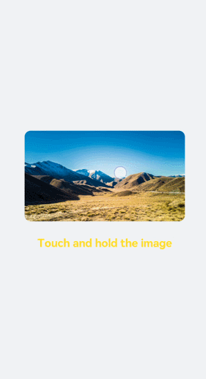

# \<image> Development
<!--Kit: ArkUI-->
<!--Subsystem: ArkUI-->
<!--Owner: @liyujie43-->
<!--Designer: @weixin_52725220-->
<!--Tester: @xiong0104-->
<!--Adviser: @HelloCrease-->

The **\<image>** component is used to render and display images. For details, see [image](../reference/apis-arkui/arkui-js/js-components-basic-image.md).


## Creating an \<image> Component

Create an **\<image>** component in the .hml file under **pages/index**.
```html
<!-- index.hml -->
<div class="container">
  <image style="height: 30%;" src="common/images/bg-tv.jpg"> </image>
</div>
```

```css
/* xxx.css */
.container {
  width: 100%;
  height: 100%; 
  flex-direction: column;
  justify-content: center;
  align-items: center;
  background-color: #F1F3F5;
}
```


## Setting the Image Style

Set the **width**, **height**, and **object-fit** attributes to define the width, height, and scale type of the image.


```html
<!-- index.hml -->
<div class="container">
  <image src="common/images/bg-tv.jpg"> </image>
</div>
```


```css
/* xxx.css */
.container {
  width: 100%;
  height: 100%;
  flex-direction: column;
  align-items: center;
  justify-content: center;
  background-color:#F1F3F5;
}
image{
  width: 80%;  
  height: 500px;
  border: 5px solid saddlebrown;
  border-radius: 20px;
  object-fit: contain;
  match-text-direction:true;
}
```


## Loading the Image

When the image is successfully loaded, the **complete** event is triggered, and the loaded image is returned. If an exception occurs during image loading, the **error** event is triggered, and the image loading failure log is printed.

```html
<!-- index.hml -->
<div class="container" >
  <div>
    <image src="common/images/bg-tv.jpg" oncomplete="imageComplete(1)" onerror="imageError(1)"> </image>
  </div>
  <div>
    <image src="common/images/bg-tv1.jpg" oncomplete="imageComplete(2)" onerror="imageError(2)"> </image>
  </div>
</div>
```

```css
/* xxx.css */
.container{
  width: 100%;
  height: 100%;
  flex-direction: column;
  justify-content: center;
  align-self: center;
  background-color: #F1F3F5;
}
.container div{
  margin-left: 10%;
  width: 80%;
  height: 300px;
  margin-bottom: 40px;
}
```

```js
// index.js
import promptAction from '@ohos.promptAction';
export default {
  imageComplete(i,e){
    promptAction.showToast({
      message: "image "+i+"'s width"+ e.width+"----image "+i+"'s height"+e.height,
      duration: 3000,
    })
  },
  imageError(i,e){
    setTimeout(()=>{
      promptAction.showToast({
        message: "Failed to load image "+i+".",
        duration: 3000,
      })
    },3000)
  }
}
```


## Example Scenario

In this example you touch and hold an image to gradually hide it. After the image is completely hidden, it will show in its original setting. Set a **setInterval** timer to change the image opacity at a specified interval so that it is hidden gradually. When the opacity changes to **0**, the timer is cleared and the opacity is set to **1**.
```html
<!-- index.hml -->
<div class="page-container">
  <div class="content">
    <div class="image-container">
      <image class="testimage" src="{{testuri}}" style="opacity:{{imageopacity}};" onlongpress="changeopacity"> </image>
    </div>
    <div class="text-container">
      <text style="font-size: 37px;font-weight:bold;color:orange;text-align: center;width: 100%;">Touch and hold the image</text>
    </div>
  </div>
</div>
```

```css
/* xxx.css */
.page-container {
  width: 100%;
  height: 100%;
  flex-direction:column;
  align-self: center;
  justify-content: center;
  background-color:#F1F3F5;
  background-color: #F1F3F5;
}
.content{
  flex-direction:column;
}
.image-container {
  width: 100%;
  height: 300px;
  align-items: center;
  justify-content: center;
}
.text-container {
  margin-top:50px;
  width: 100%;
  height: 60px;
  flex-direction: row;
  justify-content: space-between;
}
.testimage {
  width: 100%;  height: 400px;   
  object-fit: scale-down;  
  border-radius: 20px;
}
```

```js
// index.js
import promptAction from '@ohos.promptAction';
export default {
  data: {
    testuri: 'common/images/bg-tv.jpg',
    imageopacity:1,
    timer: null
  },
  changeopacity: function () {
    promptAction.showToast({
      message: 'Touch and hold the image.'
    })
    var opval = this.imageopacity * 20
    clearInterval(this.timer);
    this.timer = setInterval(()=>{
      opval--;
      this.imageopacity = opval / 20
      if (opval===0) {
        clearInterval(this.timer)
        this.imageopacity = 1
      }
    },100);
  }
}
```


