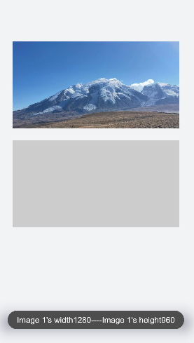

# &lt;image&gt; Development


The &lt;image&gt; component is used to render and display images. For details, see [image](../reference/arkui-js/js-components-basic-image.md).


## Creating an &lt;image&gt; Component

  Create an &lt;image&gt; component in the .hml file under pages/index.

```
<!-- index.hml -->
<div class="container">
  <image src="common/images/bg-tv.jpg"> </image>
</div>
```


```
/* xxx.css */
.container {
  flex-direction: column;
  justify-content: center;
  align-items: center;
  background-color: #F1F3F5;
}
```


## Setting the Image Style

Set the width, height, and object-fit attributes to define the width, height, and scale type of an image.

```
<!-- index.hml -->
<div class="container">
  <image src="common/images/bg-tv.jpg"> </image>
</div>
```

```
/* xxx.css */
.container {
  flex-direction: column;
  align-items: center;
  justify-content: center;
background-color:#F1F3F5;
}
image{
  width: 80%;  height: 500px;
  border: 5px solid saddlebrown;
  border-radius: 20px;
  object-fit: contain;
  match-text-direction:true;

}
```


## Display Multiple Images

  Define a for loop to display multiple images cyclically. Set option to specify the image scale style. For details about the scale styles, see the description of object-fit.

```
<!-- index.hml -->
<div class="page-container">
  <list>
    <list-item class="item-container" for="{{list}}">
      <image class="testimage" src="{{url[$idx]}}" style="object-fit: {{fit}};"></image>
      <div class="text-container">
        <text style="font-size: 32px;color:#7b68ee;">image{{$idx}}</text>
        <text style="font-size: 23px;color: orange;font-style: italic;">content</text>
      </div>
    </list-item>
  </list>
  <div style="width: 100%;height:100px;justify-content: center;margin-top: 100px;flex-shrink: 0;">
    <select id="slt2" style="border: 3px solid orange;color: orange;font-size: 40px;width:300px;height:160px;" onchange="setfit">
      <option for="{{fit_list}}" value="{{$item}}" style="font-size: 36px;">{{$item}}</option>
    </select>
  </div>
</div>
```


```
/* xxx.css */
.page-container {
  flex-direction:column;
  background-color:#F1F3F5;
}
.text-container {
  width: 300px;
  flex-direction: column;
  justify-content: center;
}
.item-container {
  flex-direction: row;
  align-items: center;
  justify-content:center;
  margin-top:200px;
}
.testimage {
  width: 175px;
  height: 220px;
  border: 5px solid #add8e6;
  padding: 5px 5px 5px 5px;
  margin: 5px 5px 5px 5px;
}
.testicon {
  width: 50px;
  height: 50px;
  margin-left: 150px;
  border-radius: 25px;
  background-color: orange;
}
```


```
/* index.js */
export default {
  data: {
    url:['common/images/bg-tv.jpg','common/images/img2.jpg'],
    list:[0,1],
    fit:'cover',
    fit_list:['cover','contain','fill','none','scale-down']
  },
  setfit(e) {
    this.fit = e.newValue
  }
}
```


## Loading Images

When an image is successfully loaded, the complete event is triggered, and the loaded image is returned. If an exception occurs during image loading, the error event is triggered, and the image loading failure is printed.


```
<!-- index.hml -->
<div class="container" >
  <div>
    <image src="common/images/bg-tv.jpg" oncomplete="imageComplete(1)" onerror="imageError(1)"> </image>
  </div>
  <div>
    <image src="common/images/bg-tv1.jpg" oncomplete="imageComplete(2)" onerror="imageError(2)"> </image>
  </div>
</div>
```


```
/* xxx.css */
.container{
  flex-direction: column;
  justify-content: center;
  align-self: center;
  background-color: #F1F3F5;
}
.container div{
  margin-left: 10%;
  width: 80%;
  height: 300px;
  margin-bottom: 40px;
}
```


```
/* index.js */
import prompt from '@system.prompt';
export default {
  imageComplete(i,e){
    prompt.showToast({
      message: "Image "+i+"'s width"+ e.width+"----Image "+i+"'s height"+e.height,
      duration: 3000,
    })
  },
  imageError(i,e){
    setTimeout(()=>{
      prompt.showToast({
        message: "Failed to load image "+i+".",
        duration: 3000,
      })
    },3000)
  }
}
```




## Example Scenario

  In this example you touch and hold an image to gradually hide it. After the image is completely hidden, it will show in its original setting. Set a setInterval timer to change the image opacity at a specified interval so that it is hidden gradually. When the opacity changes to 0, the timer is cleared and the opacity is set to 1.

```
<!-- index.hml -->
<div class="page-container">
  <div class="content">
    <div class="image-container">
      <image class="testimage" src="{{testuri}}" style="display:{{displaytype}};opacity:{{imageopacity}};" onclick="changedisplaytype" onlongpress="changeopacity"> </image>
    </div>
    <div class="text-container">
      <text style="font-size: 37px;font-weight:bold;color:orange;text-align: center;width: 100%;">Touch and hold the image</text>
    </div>
  </div>
</div>
```


```
/* xxx.css */
.page-container {
  flex-direction:column;
  align-self: center;
  justify-content: center;
  background-color:#F1F3F5;
  background-color: #F1F3F5;
}
.content{
  flex-direction:column;
}
.image-container {
  width: 100%;
  height: 300px;
  align-items: center;
  justify-content: center;
}
.text-container {
  margin-top:50px;
  width: 100%;
  height: 60px;
  flex-direction: row;
  justify-content: space-between;
}
.testimage {
  width: 100%;  height: 400px;   object-fit: scale-down;  border-radius: 20px;}
```


```
/* index.js */
import prompt from '@system.prompt';
export default {
  data: {
    testuri: 'common/images/bg-tv.jpg',
    imageopacity:1,
    timer: null
  },
  changeopacity: function () {
    prompt.showToast({
      message: 'Touch and hold the image.'
    })
    var opval = this.imageopacity * 20
    clearInterval(this.timer);
    this.timer = setInterval(()=>{
      opval--;
      this.imageopacity = opval / 20
      if (opval===0) {
        clearInterval(this.timer)
        this.imageopacity = 1
      }
    },100);
  }
}
```


