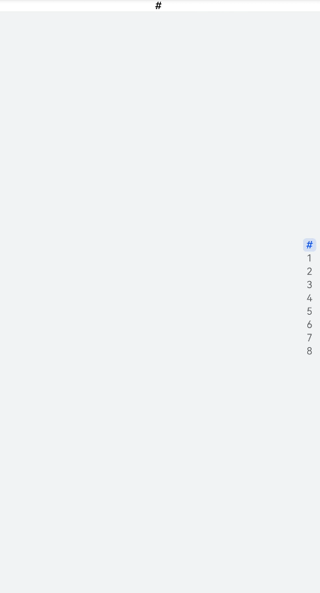
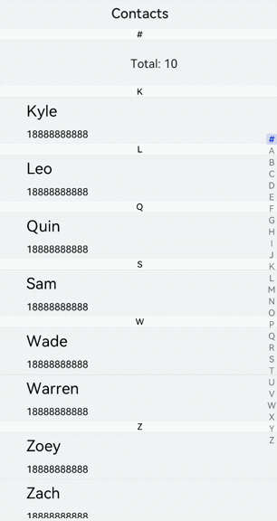

# &lt;list&gt; Development


The **&lt;list&gt;** component provides a list container that presents a series of list items arranged in a column with the same width. Lists can be used for presenting the same type of data in a multiple and coherent row style. For details, see [list](../reference/apis-arkui/arkui-js/js-components-container-list.md).


## Creating a &lt;list&gt; Component

Create a **&lt;list&gt;** component in the .hml file under **pages/index**.

```html
<!-- xxx.hml -->
<div class="container"> 
 <list>    
   <list-item class="listItem"></list-item>
   <list-item class="listItem"></list-item>
   <list-item class="listItem"></list-item>
   <list-item class="listItem"></list-item>
 </list>
</div>
```

```css
/* xxx.css */
.container {
  width:100%;
  height:100%;
  flex-direction: column;
  align-items: center;
  background-color: #F1F3F5;
}
.listItem{
  height: 20%;
  background-color:#d2e0e0;
  margin-top: 20px;
}
```


> **NOTE**
> - **&lt;list-item-group&gt;** is a child component of the **&lt;list&gt;** component and is used to group items in a list. It can have a **&lt;list-item&gt;** nested inside, but not **&lt;list&gt;**.
> 
> - **&lt;list-item&gt;** is a child component of the **&lt;list&gt;** component and is used to display items in a list.


## Adding a Scrollbar

To display a scrollbar on the right side of the screen, set **scrollbar** to **on**. The side scrollbar can be used to scroll a long list or the screen up or down.

```html
<!-- xxx.hml -->
<div class="container">
  <list class="listCss" scrollbar="on" >
    <list-item class="listItem"></list-item>
    <list-item class="listItem"></list-item>
    <list-item class="listItem"></list-item>
    <list-item class="listItem"></list-item>
    <list-item class="listItem"></list-item>
    <list-item class="listItem"></list-item>
 </list>
</div> 
```

```css
/* xxx.css */
.container {
  flex-direction: column;
  background-color: #F1F3F5;
}
.listItem{
  height: 20%;
  background-color:#d2e0e0;
  margin-top: 20px;
}
.listCss{
  height: 100%;
  scrollbar-color: #8e8b8b;
  scrollbar-width: 50px;
}
```


## Adding a Side Index Bar

Set a custom **indexer** component to add an index bar at the right boundary of a list. By default, an alphabetical indexer is used.

```html
<!-- xxx.hml -->
<div class="container">   
  <list class="listCss"  indexer="{{['#','1','2','3','4','5','6','7','8']}}" >  
    <list-item class="listItem"  section="#" ></list-item>   
  </list>
</div>
```

```css
/* xxx.css */
.container{
  flex-direction: column;
  background-color: #F1F3F5;
 } 
.listCss{
  height: 100%;    
  flex-direction: column;
  columns: 1
}
```



> **NOTE**
> - This **indexer** attribute is valid only when **flex-direction** is set to **column** and **columns** is set to **1**.
> 
> - You must include **"\#"** when using a customized indexer.


## Collapsing or Expanding a List

To allow a **&lt;list&gt;** component to collapse and expand, add **groupcollapse** and **groupexpand** events.

```html
<!-- xxx.hml -->
<div class="doc-page">
  <list style="width: 100%;" id="mylist">
    <list-item-group for="listgroup in list" id="{{listgroup.value}}" ongroupcollapse="collapse" ongroupexpand="expand">
      <list-item type="item" style="background-color:#FFF0F5;height:95px;">
        <div class="item-group-child">
          <text>One---{{listgroup.value}}</text>
        </div>
      </list-item>
      <list-item type="item" style="background-color: #87CEFA;height:145px;" primary="true">
        <div class="item-group-child">
          <text>Primary---{{listgroup.value}}</text>
        </div>
      </list-item>
    </list-item-group>
  </list>
</div>
```

```css
/* xxx.css */
.doc-page {
  flex-direction: column;
  background-color: #F1F3F5;
}
list-item{
margin-top:30px;
}
.top-list-item {
  width:100%;
  background-color:#D4F2E7;
}
.item-group-child {
  justify-content: center;
  align-items: center;
  width:100%;
}
```

```js
// xxx.js
import promptAction from '@ohos.promptAction';
export default {
  data: {
    direction: 'column',
    list: []
  },
  onInit() {
    this.list = []
    this.listAdd = []
    for (var i = 1; i <= 2; i++) {
      var dataItem = {
        value: 'GROUP' + i,
      };
        this.list.push(dataItem);
    }
  },
  collapse(e) {
    promptAction.showToast({
      message: 'Close ' + e.groupid
    })
  },
  expand(e) {
    promptAction.showToast({
    message: 'Open ' + e.groupid
    })
  }
}
```


> **NOTE**
>
> The **groupcollapse** and **groupexpand** events can be used only by the **list-item-group** component.


## Example Scenario

Search for contacts by using an alphabetical indexer.


```html
<!-- xxx.hml -->
<div class="doc-page"> 
  <text style="font-size: 35px; font-weight: 500; text-align: center; margin-top: 20px; margin-bottom: 20px;"> 
      <span>Contacts</span> 
  </text> 
  <list class="list" indexer="true"> 
    <list-item class="item" for="{{namelist}}" type="{{$item.section}}" section="{{$item.section}}"> 
      <div class="container"> 
        <div class="in-container"> 
          <text class="name">{{$item.name}}</text> 
          <text class="number">18888888888</text> 
        </div> 
      </div> 
    </list-item> 
    <list-item type="end" class="item"> 
      <div style="align-items:center;justify-content:center;width:750px;"> 
        <text style="text-align: center;">Total: 10</text> 
      </div> 
    </list-item> 
  </list> 
</div>
```


```css
/* xxx.css */
.doc-page {
  width: 100%;
  height: 100%;
  flex-direction: column;
  background-color: #F1F3F5;
}
.list {
  width: 100%;
  height: 90%;
  flex-grow: 1;
}
.item {
  height: 120px;
  padding-left: 10%;
  border-top: 1px solid #dcdcdc;
}
.name {
  color: #000000;
  font-size: 39px;
}
.number {
  color: black;
  font-size: 25px;
}
.container {
  flex-direction: row;
  align-items: center;
}
.in-container {
  flex-direction: column;
  justify-content: space-around;
}
```


```js
// xxx.js
export default { 
   data: { 
     namelist:[{ 
       name: 'Zoey', 
       section:'Z' 
     },{ 
       name: 'Quin', 
       section:'Q' 
     },{ 
       name:'Sam', 
       section:'S' 
     },{ 
       name:'Leo', 
       section:'L' 
     },{ 
       name:'Zach', 
       section:'Z' 
     },{ 
       name:'Wade', 
       section:'W' 
     },{ 
       name:'Zoe', 
       section:'Z' 
     },{ 
        name:'Warren', 
        section:'W' 
     },{ 
        name:'Kyle', 
        section:'K' 
     },{ 
       name:'Zaneta', 
       section:'Z' 
     }] 
   }, 
   onInit() { 
   } 
 }
```


