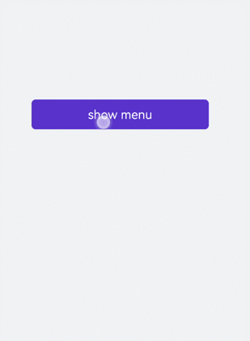

# &lt;menu&gt; Development
<!--Kit: ArkUI-->
<!--Subsystem: ArkUI-->
<!--Owner: @Armstrong15-->
<!--Designer: @zhanghaibo0-->
<!--Tester: @lxl007-->
<!--Adviser: @HelloCrease-->


The &lt;menu&gt; component serves as a temporary pop-up window to display operations that users can perform. For details, see [menu](../reference/apis-arkui/arkui-js/js-components-basic-menu.md).


## Creating a &lt;menu&gt; Component

Create a **&lt;menu&gt;** component in the .hml file under **pages/index** and add the **target**, **type**, and **title** attributes.


```html
<!-- xxx.hml-->
<div class="container">
  <text class="title-text" id="textId">show menu</text>
  <menu target="textId" type="click" title="title">
    <option value="Item 1">Item 1</option>
    <option value="Item 2">Item 2</option>
    <option value="Item 3">Item 3</option>
  </menu>
</div>
```


```css
/* xxx.css */
.container{
  width: 100%;
  height: 100%; 
  flex-direction: column;
  background-color: #F1F3F5;
  align-items: center;
  justify-content: center;
  width: 100%;
}
.title-text{
  font-size: 35px;
}
```


> **NOTE**
> - The **&lt;menu&gt;** component supports only the [option](../reference/apis-arkui/arkui-js/js-components-basic-option.md) child component.
> 
> - The **&lt;menu&gt;** component does not support the **focusable** and **disabled** attributes.


## Setting Styles

Set the style for the **&lt;menu&gt;** component, such as the font color, size, and character spacing.


```html
<!-- xxx.hml-->
<div class="container">
  <text class="title-text" id="textId">show menu</text>
  <menu target="textId" type="click" title="title">
    <option value="Item 1">Item 1</option>
    <option value="Item 2">Item 2</option>
    <option value="Item 3">Item 3</option>
  </menu>
</div>
```


```css
/* xxx.css */
.container{
  width: 100%;
  height: 100%; 
  flex-direction: column;
  background-color: #F1F3F5;
  align-items: center;
  justify-content: center;
  width: 100%;
}
.title-text{
  font-size: 35px;
  background-color: #5a5aee;
  color: white;
  width: 70%;
  text-align: center;
  height: 85px;
  border-radius: 12px;
}
menu{
  text-color: blue;
  font-size: 35px;
  letter-spacing: 2px;
}
option{
  color: #6a6aef;
  font-size: 30px;
}
```




## Binding Events

Bind the **&lt;menu&gt;** component with the **onselected** event (triggered when a value in the menu is selected) and the **oncancel** event (triggered when an operation is canceled). Click the **&lt;text&gt;** component to call the **show** method to set the coordinates of the **&lt;menu&gt;** component.


```html
<!-- xxx.hml-->
<div class="container">
  <text  class="title-text" id="textId" onclick="textClick">show menu</text>
  <menu  title="title" oncancel="cancel" id="menuId">
    <option value="Item 1">Item 1</option>
    <option value="Item 2">Item 2</option>
    <option value="Item 3">Item 3</option>
  </menu>
</div>
```


```css
/* xxx.css */
.container{
  width: 100%;
  height: 100%;
  flex-direction: column;
  background-color: #F1F3F5;
  width: 100%;
}
.title-text{
  font-size: 35px;
  background-color: #5a5aee;
  color: white;
  width: 70%;
  text-align: center;
  height: 85px;
  border-radius: 12px;
  margin-top: 500px;
  margin-left: 15%;
}
menu{
  text-color: blue;
  font-size: 35px;
  letter-spacing: 2px;
}
option{
  color: #6a6aef;
  font-size: 30px;
}
```


```js
// xxx.js
import promptAction from '@ohos.promptAction';
export default {
  cancel() {
    promptAction.showToast({
      message: "cancel"
    })
  },
  textClick() {
    this.$element("menuId").show({ x: 175,y: 590 });
  }
}
```


