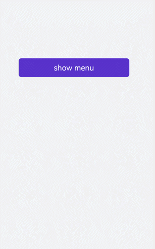

# &lt;menu&gt; Development


The &lt;menu&gt; component serves as a temporary pop-up window to display operations that users can perform. For details, see [menu](../reference/apis-arkui/arkui-js/js-components-basic-menu.md).


## Creating a &lt;menu&gt; Component

Create a **&lt;menu&gt;** component in the .hml file under **pages/index** and add the **target**, **type**, and **title** attributes.


```html
<!-- xxx.hml-->
<div class="container">
  <text class="title-text" id="textId">show menu</text>
  <menu target="textId" type="click" title="title">
    <option value="Item 1">Item 1</option>
    <option value="Item 2">Item 2</option>
    <option value="Item 3">Item 3</option>
  </menu>
</div>
```


```css
/* xxx.css */
.container{
  width: 100%;
  height: 100%; 
  flex-direction: column;
  background-color: #F1F3F5;
  align-items: center;
  justify-content: center;
  width: 100%;
}
.title-text{
  font-size: 35px;
}
```


> **NOTE**
> - The **&lt;menu&gt;** component supports only the [option](../reference/apis-arkui/arkui-js/js-components-basic-option.md) child component.
> 
> - The **&lt;menu&gt;** component does not support the **focusable** and **disabled** attributes.


## Setting Styles

Set the style for the **&lt;menu&gt;** component, such as the font color, size, and character spacing.


```html
<!-- xxx.hml-->
<div class="container">
  <text class="title-text" id="textId">show menu</text>
  <menu target="textId" type="click" title="title">
    <option value="Item 1">Item 1</option>
    <option value="Item 2">Item 2</option>
    <option value="Item 3">Item 3</option>
  </menu>
</div>
```


```css
/* xxx.css */
.container{
  width: 100%;
  height: 100%; 
  flex-direction: column;
  background-color: #F1F3F5;
  align-items: center;
  justify-content: center;
  width: 100%;
}
.title-text{
  font-size: 35px;
  background-color: #5a5aee;
  color: white;
  width: 70%;
  text-align: center;
  height: 85px;
  border-radius: 12px;
}
menu{
  text-color: blue;
  font-size: 35px;
  letter-spacing: 2px;
}
option{
  color: #6a6aef;
  font-size: 30px;
}
```


## Binding Events

Bind the **&lt;menu&gt;** component with the **onselected** event (triggered when a value in the menu is selected) and the **oncancel** event (triggered when an operation is canceled). Click the **&lt;text&gt;** component to call the **show** method to set the coordinates of the **&lt;menu&gt;** component.


```html
<!-- xxx.hml-->
<div class="container">
  <text  class="title-text" id="textId" onclick="textClick">show menu</text>
  <menu  title="title" onselected="select" oncancel="cancel" id="menuId">
    <option value="Item 1">Item 1</option>
    <option value="Item 2">Item 2</option>
    <option value="Item 3">Item 3</option>
  </menu>
</div>
```


```css
/* xxx.css */
.container{
  width: 100%;
  height: 100%;
  flex-direction: column;
  background-color: #F1F3F5;
  width: 100%;
}
.title-text{
  font-size: 35px;
  background-color: #5a5aee;
  color: white;
  width: 70%;
  text-align: center;
  height: 85px;
  border-radius: 12px;
  margin-top: 500px;
  margin-left: 15%;
}
menu{
  text-color: blue;
  font-size: 35px;
  letter-spacing: 2px;
}
option{
  color: #6a6aef;
  font-size: 30px;
}
```


```js
// xxx.js
import promptAction from '@ohos.promptAction';
export default {
  select(e) {
    promptAction.showToast({
      message: e.value
    })
  },
  cancel(){
    promptAction.showToast({
      message: "cancel"
    })
  },
  textClick() {
    this.$element("menuId").show({x:175,y:590});
  },
}
```




## Example Scenario

Click the **&lt;toggle&gt;** component to change the text color and select the **&lt;menu&gt;** component to change the size of the gradient color block.


```html
<!-- xxx.hml-->
<div class="container">
    <div class="contentToggle">
        <toggle class="toggle" for="{{item in togglesList}}" onclick="toggleClick({{$idx}})" checked="{{item.checked}}">{{item.name}}</toggle>
    </div>
    <text class="size" style="color: {{color}};">width:{{width}},height:{{height}}</text>
    <div style="width: {{width}}px;height: {{height}}px; background-color: cornflowerblue;"></div>
    <text id="menuId" class="text">change size</text>
    <menu onselected="select" oncancel="cancel" target="menuId">
        <option value="{{item.value}}" for="item in optionList">{{item.text}}</option>
    </menu>
</div>
```


```css
/* xxx.css */
.container{
  flex-direction: column;
  background-color: #F1F3F5;
  width: 100%;
  justify-content: center;
  align-items: center;
}
.contentToggle{
  width: 100%;
  justify-content: space-around;
}
.toggle{
  padding: 10px;
  height:80px;
  font-size: 35px;
  width: 200px;
  height: 85px;
}
.size{
  width: 100%;
  height: 200px;
  text-align: center;
  font-size: 40px;
  text-align: center;
}
.text{
  width: 300px;
  height: 80px;
  background-color: #615def;
  color: white;
  font-size: 35px;
  text-align: center;
  margin-top: 100px;
}
menu{
  text-color: blue;
  font-size: 35px;
  letter-spacing: 2px;
}
option{
  color: #6a6aef;
  font-size: 30px;
}
```


```js
// xxx.js
export default {
  data:{
    fresh: false,
    width: 200,
    height: 200,
    color: '',
    optionList:[
      {text:'200 x 200',value:2},
      {text:'300 x 300',value:3},
      {text:'500 x 500',value:5},
    ],
    togglesList:[
      {name:"red", checked:false},
      {name:"blue", checked:false},
      {name: "black", checked:false},
    ],
  },
  toggleClick(index) {   
    for(let i=0;i<this.togglesList.length;i++) {     
      if (i == index) {        
      this.color = this.togglesList[index].name;        
      this.togglesList[i].checked = true;      
      }else {        
        this.togglesList[i].checked = false;      
      }    
    }  
  },
  select(e) {
    this.width = e.value * 100;
    this.height = e.value * 100;
  }
}
```


