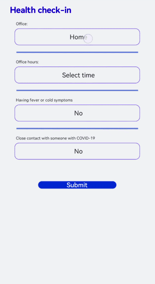

# Picker<a name="EN-US_TOPIC_0000001155695748"></a>

The  **<picker\>**  component supports common, date, time, data and time, and multi-column text selectors. For details, see  [picker](../reference/arkui-js/js-components-basic-picker.md).

## Creating a <picker\> Component<a name="section19696122895318"></a>

Create a  **<picker\>**  component in the  **.hml**  file under  **pages/index**.

```
<!-- index.hml -->
<div class="container">
  <picker>
    picker
  </picker>
<div>
```

```
/* index.css */
.container {
  flex-direction: column;
  justify-content: center;
  align-items: center;
  background-color: #F1F3F5;
}
```

.gif)

## Setting the Picker Type<a name="section78391556183"></a>

Set the  **type**  attribute of the  **<picker\>**  component. For example, set it to  **date**.

```
<!-- index.hml -->
<div class="container">
  <picker id="picker_text" type="text" value="{{textvalue}}"range="{{rangetext}}" class="pickertext" ></picker>
  <picker id="picker_date" type="date" value="{{datevalue}}" lunarswitch="true" start="2002-2-5" end="2030-6-5" class="pickerdate"></picker>
</div>
```

```
/* index.css */
.container {
  flex-direction: column;
  justify-content: center;
  align-items: center;
  background-color: #F1F3F5;
}
.pickertext{
    margin-bottom: 30px;
}
```

```
// xxx.js
export default {
  data: {
    rangetext:['15', "20", "25"],
    textvalue:'Select text',
    datevalue:'Select date',
  }
}
```


> **NOTE:** 
>-   When setting the value range of a common selector, you must use the data binding mode.
>-   The  **lunarswitch**  attribute of the date selector is only supported on phones and tablets.

## Setting the Time Format<a name="section1971415321217"></a>

Set the  **hours**  attribute to specify the time format used by the time selector. Available values include  **12**  and  **24**, indicating the 12-hour format and 24-hour format, respectively.

```
<!-- index.hml -->
<div class="container">
  <picker id="picker_time" type="time" value="12-hour format" hours="12" onchange="timeonchange"  class="pickertime"></picker>
  <picker id="picker_time" type="time" value="24-hour format" hours="24" onchange="timeonchange"  class="pickertime"></picker>
</div>
```

```
/* index.css */
.container {
  flex-direction: column;
  justify-content: center;
  align-items: center;
  background-color: #F1F3F5;
}
.pickertime {
  margin-bottom:50px;
  width: 300px;
  height: 50px;
}
```


> **NOTE:** 
>-   When  **hours**  is set to  **12**, the time is displayed in 12-hour format and distinguished by a.m. and p.m.
>-   When  **hours**  is set to  **24**, the time is displayed in 24-hour format.

## Adding Response Events<a name="section20659132323820"></a>

To confirm and cancel selection, add  **change**  and  **cancel**  events.

```
<!-- index.hml -->
<div class="container">
  <picker id="picker_multi" type="multi-text" value="{{multitextvalue}}" columns="3" range="{{multitext}}" selected="
     {{multitextselect}}" onchange="multitextonchange" oncancel="multitextoncancel" class="pickermuitl"></picker>
</div>
```

```
/* index.css */
.container {
  flex-direction: column;
  justify-content: center;
  align-items: center;
  background-color: #F1F3F5; 
}
.pickermuitl {
  margin-bottom:20px;
  width: 600px;
  height: 50px;
  font-size: 25px;
  letter-spacing:15px;
}
```

```
// xxx.js
import prompt from '@system.prompt';
export default {
  data: {
    multitext:[["a", "b", "c"], ["e", "f", "g"], ["h", "i"]],
    multitextvalue:'Select multi-line text',
    multitextselect:[0,0,0],
  },
  multitextonchange(e) {
    this.multitextvalue=e.newValue;
    prompt.showToast({ message:"Multi-column text changed to:" + e.newValue })
  },
  multitextoncancel() {
    prompt.showToast({ message:"multitextoncancel" })
  },
}
```


## Example Scenario<a name="section36086283455"></a>

Implement a health check-in application by using the  **<picker\>**  component.

```
<!-- index.hml -->
<div class="doc-page">
  <text class="title">Health check-in</text>
  <div class="out-container">
    <text class="txt">Office:</text>
    <picker class="pick" focusable="true" type="text" value="{{pos}}" range="{{posarr}}" onchange="setPos"></picker>
  </div>
  <divider class="dvd"></divider>
  <div class="out-container">
    <text class="txt">Office hours:</text>
    <picker class="pick" type="date" value="{{datevalue}}"  start="2002-2-5" end="2030-6-5" selected="{{dateselect}}"
      lunarswitch="true" onchange="dateonchange"></picker>
  </div>
  <divider class="dvd"></divider>
  <div class="out-container">
    <text class="txt">Having fever or cold symptoms</text>
    <picker class="pick" type="text" value="{{yorn1}}" range="{{yesno}}" selected="1" onchange="isFever"></picker>
  </div>
  <divider class="dvd"></divider>
  <div class="out-container">
    <text class="txt">Close contact with someone with COVID-19</text>
    <picker class="pick" type="text" value="{{yorn2}}" range="{{yesno}}" selected="1" onchange="isTouch"></picker>
  </div>
  <div class="out-container">
    <button value="Submit" style="margin-top:100px;width:50%;font-color:#0000ff;" onclick="showtoast"></button>
  </div>
</div>
```

```
/* index.css */
.doc-page {
  flex-direction: column;
  background-color: #F1F3F5;
}
.title {
  margin-top: 30px;
  margin-bottom: 30px;
  margin-left: 50px;
  font-weight: bold;
  color: #0000ff;
  font-size: 38px;
}
.out-container {
  flex-direction: column;
  align-items: center;
}
.pick {
  width: 80%;
  height: 76px;
  border: 1px solid #0000ff;
  border-radius: 20px;
  padding-left: 12px;
}
.txt {
  width: 80%;
  font-size: 18px;
  text-align: left;
  margin-bottom: 12px;
  margin-left: 12px;
}
.dvd {
  margin-top: 30px;
  margin-bottom: 30px;
  margin-left: 80px;
  margin-right: 80px;
  color: #6495ED;
  stroke-width: 6px;
}
```

```
// xxx.js
import pmt from '@system.prompt'
export default {
  data: {
    yorn1:'No',
    yorn2:'No',
    pos:'Home',
    yesno:['Yes', 'No'],
    posarr:['Home', 'Company'],
    datevalue:'Select time',
    datetimeselect:'2012-5-6-11-25',
    dateselect:'2021-9-17',
    showbuild:true
  },
  onInit() {
  },
  isFever(e) {
    this.yorn1 = e.newValue
  },
  isTouch(e) {
    this.yorn2 = e.newValue
  },
  setPos(e) {
    this.pos = e.newValue
    if (e.newValue === 'Non-research center') {
      this.showbuild = false
    } else {
      this.showbuild = true
    }
  },
  setbuild(e) {
    this.build = e.newValue
  },
  dateonchange(e) {
    this.datevalue = e.year + "-" + e.month + "-" + e.day;
    pmt.showToast({ message:"date:"+e.year+"-"+e.month+"-"+e.day })  },
  datetimeonchange(e) {
    this.datetimevalue=e.year+"-"+e.month+"-"+e.day+" "+e.hour+":"+e.minute;
    pmt.showToast({ message:"Time:"+e.month+"-"+e.day+" "+e.hour+":"+e.minute })
  },
  showtoast() {
    pmt.showToast({
      message: 'Submitted.',
      duration: 2000,
      gravity: 'center'
    })
  }
}
```



