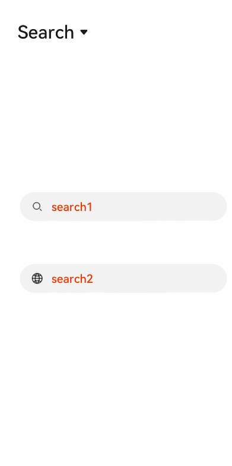

# &lt;search&gt; Development
<!--Kit: ArkUI-->
<!--Subsystem: ArkUI-->
<!--Owner: @kangshihui-->
<!--Designer: @pssea-->
<!--Tester: @jiaoaozihao-->
<!--Adviser: @HelloCrease-->


The **&lt;search&gt;** component provides an input area for users to search. For details, see [search](../reference/apis-arkui/arkui-js/js-components-basic-search.md).


## Creating a &lt;search&gt; Component

Create a **&lt;search&gt;** component in the .hml file under **pages/index**.


```html
<!-- xxx.hml-->
<div class="container">
  <search></search>
</div>
```


```css
/* xxx.css */
.container {
  width: 100%;
  height: 100%;
  flex-direction: column;
  align-items: center;
  justify-content: center;
  background-color: #F1F3F5;
}
```


## Setting Attributes

Set the **hint**, **icon**, and **searchbutton** to define the hint text, icon, and search button at the end of the search box.


```html
<!-- xxx.hml-->
<div class="container">
  <search hint="Please enter the search content"  searchbutton="search" icon="/common/search1.png"></search>
</div>
```


```css
/* xxx.css */
.container {
  width: 100%;
  height: 100%;
  flex-direction: column;
  align-items: center;
  justify-content: center;
  background-color: #F1F3F5;
}
```


## Adding Styles

Set **color**, **placeholder-color**, and **caret-color** to set the text color, hint text color, and cursor color of the search box.


```html
<!-- xxx.hml-->
<div class="container">
  <search hint="Please enter the search content"  searchbutton="search" ></search>
</div>
```


```css
/* xxx.css */
.container {
  width: 100%;
  height: 100%;
  flex-direction: column;
  align-items: center;
  justify-content: center;
  background-color: #F1F3F5;
}
search{
  color: black;
  placeholder-color: black;
  caret-color: red;
}
```


## Binding Events

Add the **change**, **search**, **submit**, **share**, and **translate** events to the **&lt;search&gt;** component to perform operations on the input information.


```html
<!-- xxx.hml-->
<div class="container">
  <text style="margin-left: -7px;">
    <span>Enter text and then touch and hold what you've entered</span>
  </text>
  <search hint="Please enter the search content"  searchbutton="search" onsearch="search" onchange="change" ontranslate="translate" onshare="share" 
  onsubmit="submit">
  </search>
</div>
```


```css
/* xxx.css */
.container {
  width: 100%;
  height: 100%;
  flex-direction: column;
  align-items: center;
  justify-content: center;
  background-color: #F1F3F5;
}
text{
  width: 100%;
  font-size: 25px;
  text-align: center;
  margin-bottom: 100px;
}
```


```js
// index.js
import promptAction from '@ohos.promptAction';
export default {
  search(e){
    promptAction.showToast({
      message:  e.value,
      duration: 3000,
    });
  },
  translate(e){
    promptAction.showToast({
      message:  e.value,
      duration: 3000,
    });
  },
  share(e){
    promptAction.showToast({
      message:  e.value,
      duration: 3000,
    });
  },
  change(e){
    promptAction.showToast({
      message:  e.value,
      duration: 3000,
    });
  },
  submit(e){
    promptAction.showToast({
      message: 'submit',
      duration: 3000,
    });
  }
}
```


## Example Scenario

In this example, you can select the **&lt;search&gt;**, **&lt;textarea&gt;**, or **&lt;input&gt;** component from the drop-down list box to implement the respective function.


```html
<!-- xxx.hml-->
<div style="flex-direction: column;align-items: center;justify-content: center; width: 100%;">
  <select class="slt1" id="slt1" onchange="setfield">
    <option value="search">search</option>
    <option value="textarea">Textarea</option>
    <option value="input">Input</option>
  </select>
  <div if="{{showsearch}}" style="flex-direction: column;align-items: center;margin-top: 50px;height: 400px;justify-content: space-around;">
    <search class="field" id="search1" hint="search1" onsubmit="submit" onchange="change" ></search>
    <search class="field" id="search2" icon="common/search1.png" hint="search2" show="{{showsec}}" onsubmit="submit" onchange="change" ></search>
  </div>
  <div if="{{showtextarea}}" style="flex-direction: column;align-items: center;margin-top: 50px;height: 400px;justify-content: space-around;">
    <textarea class="field" id="textarea1" extend="true" placeholder="textarea1" onchange="change" ></textarea>
    <textarea class="field" id="textarea2" extend="true" placeholder="textarea2" onchange="change" show="{{showsec}}"></textarea>
  </div>
  <div if="{{showinput}}" style="flex-direction: column;align-items: center;margin-top: 50px;height: 400px;justify-content: space-around;">
    <input type="text" class="field" id="input1" placeholder="input1" onchange="change" ></input>
    <input type="text" class="field" id="input2" placeholder="input2" onchange="change" show="{{showsec}}"></input>
  </div>
</div>
```


```css
/* xxx.css */
.field {
  width: 80%;
  color: mediumaquamarine;
  font-weight: 600;
  placeholder-color: orangered;
}
.slt1{
  font-size: 50px;
  position: absolute;
  left: 50px;
  top: 50px;
}
```


```js
// index.js
import promptAction from '@ohos.promptAction';
export default {
  data: {
    showsearch: true,
    showtextarea: false,
    showinput: false,
    showsec: true,
  },
  setfield(e) {
    this.field = e.newValue
    if (e.newValue == 'search') {
      this.showsearch = true
      this.showtextarea = false
      this.showinput = false
    } else if (e.newValue == 'textarea') {
      this.showsearch = false
      this.showtextarea = true
      this.showinput = false
    } else {
      this.showsearch = false
      this.showtextarea = false
      this.showinput = true
    }
  },
  submit(e) {
    promptAction.showToast({
      message: 'Search!',
      duration: 2000
    })
  },
  change(e) {
    promptAction.showToast({
      message: 'Content:'+ e.text,
      duration: 2000
    })
  }
}
```


