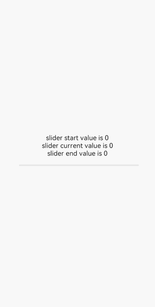
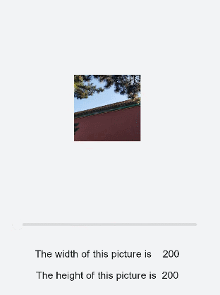

# &lt;slider&gt; Development


The **&lt;slider&gt;** component is used to quickly adjust settings, such as the volume and brightness. For details, see [slider](../reference/apis-arkui/arkui-js/js-components-basic-slider.md).


## Creating a &lt;slider&gt; Component

Create a **&lt;slider&gt;** component in the .hml file under **pages/index**.


```html
<!-- xxx.hml -->
<div class="container">
  <slider></slider>
</div>
```

```css
/* xxx.css */
.container {
  width: 100%;
  height: 100%;
  background-color: #F1F3F5;
  flex-direction: column;
  justify-content: center;
  align-items: center;
}
```


## Setting Styles and Attributes

Use the **&lt;slider&gt;** component to set the background color, selected color, and slider color using the **color**, **selected-color**, and **block-color** attributes, respectively.


```html
<!-- xxx.hml -->
<div class="container">
  <slider class= "sli"></slider>
</div>
```


```css
/* xxx.css */
.container {
  width: 100%;
  height: 100%;
  flex-direction: column;
  justify-content: center;
  align-items: center;
  background-color: #F1F3F5;
}
.sli{
  color: #fcfcfc;
  scrollbar-color: aqua;
  background-color: #b7e3f3;
}
```


Add the **mix**, **max**, **value**, **step**, and **mode** attributes to set the minimum value, maximum value, initial value, step, and style of the slider.


```html
<!-- xxx.hml -->
<div class="container">
  <slider min="0" max="100" value="1" step="2" mode="inset" showtips="true"></slider>
</div>
```


```css
/* xxx.css */
.container {
  width: 100%;
  height: 100%;
  flex-direction: column;
  justify-content: center;
  align-items: center;
  background-color: #F1F3F5;
}
```


> **NOTE**
>
> Set the **mode** attribute to specify the slider style. It can be set to:
>
> - **outset**: The slider is on the sliding bar.
>
> - **inset**: The slider is inside the sliding bar.


## Binding Events

Add the **change** event to the **&lt;rating&gt;** component and pass the ChangeEvent attribute when adding the event.


```html
<!-- xxx.hml -->
<div class="container">
  <text>slider start value is {{startValue}}</text>
  <text>slider current value is {{currentValue}}</text>
  <text>slider end value is {{endValue}}</text>
  <slider min="0" max="100" value="{{value}}" onchange="setvalue"></slider>
</div>
```


```css
/* xxx.css */
.container {
  width: 100%;
  height: 100%; 
  flex-direction: column;
  justify-content: center;
  align-items: center;
  background-color: #F1F3F5;
}
```


```js
// xxx.js
export default {
  data: {
    value: 0,
    startValue: 0,
    currentValue: 0,
    endValue: 0,
  },
  setvalue(e) {
    if (e.mode == "start") {
      this.value = e.value;
      this.startValue = e.value;
    } else if (e.mode == "move") {
      this.value = e.value;
      this.currentValue = e.value;
    } else if (e.mode == "end") {
      this.value = e.value;
      this.endValue = e.value;
    }
  }
}
```




## Example Scenario

Adjust the value of the slider to change the image size and dynamically print the width and height of the current image.


```html
<!-- xxx.hml -->
<div class="container">
  <image src="common/landscape3.jpg" style=" width: {{WidthVal}}px;height:{{HeightVal}}px;margin-top: -150px;"></image>
  <div class="txt">
    <slider min="0" max="100" value="{{value}}" onchange="setvalue"></slider>
    <text>The width of this picture is    {{WidthVal}}</text>
    <text>The height of this picture is  {{HeightVal}}</text>
  </div>
</div>
```


```css
/* xxx.css */
.container {
  width: 100%;
  height: 100%;
  flex-direction: column;
  justify-content: center;
  align-items: center;
  background-color: #F1F3F5;
}
.txt{
  flex-direction: column;
  justify-content: center;
  align-items: center;
  position: fixed;
  top: 65%;
}
text{
  margin-top: 30px;
}
```


```js
// xxx.js
export default{
  data: {
    value: 0,
    WidthVal: 200,
    HeightVal: 200
  },
  setvalue(e) {
    this.WidthVal = 200 + e.value;
    this.HeightVal = 200 + e.value
  }
}
```


