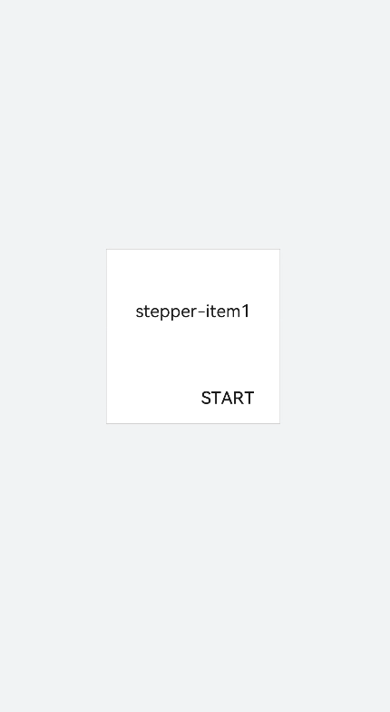
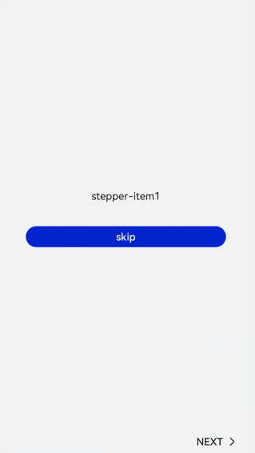

# &lt;stepper&gt; Development


When multiple steps are required to complete a task, you can use the **&lt;stepper&gt;** component to navigate your users through the whole process. For details, see [stepper](../reference/arkui-js/js-components-container-stepper.md).


>  **NOTE:**
> This component is supported since API version 5.


## Creating a &lt;stepper&gt; Component

Create a **&lt;stepper&gt;** component in the .hml file under **pages/index**.


```
<!-- index.hml -->
<div class="container"> 
 <stepper><stepper-item>     
     <text>Step 1</text>
   </stepper-item> 
   <stepper-item>     
     <text>Step 2</text>
   </stepper-item> 
</stepper>
</div>
```


```
/* xxx.css */
.container {
  width: 100%;
  height: 100%;
  flex-direction: column;
  justify-content: center;
  align-items: center;
  background-color: #F1F3F5;
}
text{
  width: 100%;
  height: 100%;
  text-align: center;
}
```


## Setting the Index

Set **index** to the index value of the step that you want to display by default.


```
<!-- index.hml -->
<div class="container"> 
 <stepper index="2">    
   <stepper-item>     
     <text>stepper-item1</text>
   </stepper-item> 
   <stepper-item>     
     <text>stepper-item2</text>
   </stepper-item> 
   <stepper-item>     
     <text>stepper-item3</text>
   </stepper-item> 
  </stepper> 
</div>
```


```
/* index.css */
.container {
  width: 100%;
  height: 100%;
  flex-direction: column;
  background-color:#F1F3F5;
}
text{
  width: 100%;
  height: 100%;
  text-align: center;
}
```


Set the **label** attribute to customize the button text for the **&lt;stepper-item&gt;**.


```
<!-- index.hml -->
<div class="container" style="background-color:#F1F3F5;"> 
 <stepper index="1">    
   <stepper-item label="{{label_1}}">     
     <text>stepper-item1</text>
   </stepper-item> 
   <stepper-item label="{{label_2}}">     
     <text>stepper-item2</text>
   </stepper-item> 
   <stepper-item label="{{label_3}}">     
     <text>stepper-item3</text>
   </stepper-item>
   <stepper-item>     
     <text>stepper-item4</text>
   </stepper-item> 
 </stepper> 
</div>
```


```
/* index.css */
.container {
  width: 100%;
  height: 100%;
  flex-direction: column;
  background-color:#F1F3F5;
}
text{
  width: 100%;
  height: 100%;
  text-align: center;
}
```


```
/* index.js */
export default { 
  data: {
   label_1:{
      nextLabel: 'NEXT',
      status: 'normal'
    },
    label_2:{
      prevLabel: 'BACK',
      nextLabel: 'NEXT',
      status: 'normal'
    },
    label_3:{
      prevLabel: 'BACK',
      nextLabel: 'END',
      status: 'disabled'
    },
  },
}
```


## Setting Styles

  By default, the **&lt;stepper&gt;** component fills entire space of its container. The sample code below shows how to set the border and background color using the **border** and **background-color** attributes.

```
<!-- index.hml -->
<div class="container" > 
  <div class="stepperContent">
    <stepper class="stepperClass">    
      <stepper-item>     
        <text>stepper-item1</text>
      </stepper-item> 
    </stepper> 
  </div>
</div>
```


```
/* index.css */
.container {
  width: 100%;
  height: 100%;
  flex-direction: column;
  align-items: center;
  justify-content: center;
  background-color:#F1F3F5;
}
.stepperContent{
  width: 300px;
  height: 300px;
}
.stepperClass{
 border:1px solid silver;
  background-color: white;
}
text{
  width: 100%;
  height: 100%;
  text-align: center;
}
```




## Adding Events

The **&lt;stepper&gt;** component supports the **finish**, **change**, **next**, **back**, and **skip** events.

- When the **change** and **next** or **back** events exist at the same time, the **next** or **back** event is executed before the **change** event.

- Before resetting the **index** attribute, you must remove the current value. Otherwise, the value change cannot be detected.

  
```
<!-- index.hml -->
<div class="container"  style="background-color:#F1F3F5;">
  <div >
    <stepper onfinish="stepperFinish" onchange="stepperChange" onnext="stepperNext" onback="stepperBack" onskip="stepperSkip" id="stepperId" index="{{index}}">
      <stepper-item>
        <text>stepper-item1</text>
        <button value="skip" onclick="skipClick"></button>
      </stepper-item>
      <stepper-item>
         <text>stepper-item2</text>
         <button value="skip" onclick="skipClick"></button>
      </stepper-item>
      <stepper-item>
        <text>stepper-item3</text>
      </stepper-item>
    </stepper>
  </div>
</div>
```


```
/* xxx.css */
.doc-page {
  width: 100%;
  height: 100%;
  flex-direction: column;
  align-items: center;
  justify-content: center;
}
stepper-item{
  width: 100%;
  flex-direction: column;
  align-self: center;
  justify-content: center;
}
text{
  margin-top: 45%;
  justify-content: center;
  align-self: center;
  margin-bottom: 50px;
}
button{
  width: 80%;
  height: 60px;
  margin-top: 20px;
}
```


```
/* index.js */
import prompt from '@system.prompt';
export default {
  data: {
    index:0,
  },
   stepperSkip(){
    this.index = null;
    this.index=2;
  },
   skipClick(){
    this.$element('stepperId').setNextButtonStatus({status: 'skip', label: 'SKIP'});
  },
  stepperFinish(){
    prompt.showToast({
      message: 'All Finished'
    })
  },
  stepperChange(e){
    console.log("stepperChange"+e.index)
    prompt.showToast({
      message: 'Previous step: '+e.prevIndex+"-------Current step:"+e.index
    })
  },
  stepperNext(e){
    console.log("stepperNext"+e.index)
    prompt.showToast({
      message: 'Current step:'+e.index+"-------Next step:"+e.pendingIndex
    })
    var index = {pendingIndex:e.pendingIndex }
    return index;
  },
  stepperBack(e){
    console.log("stepperBack"+e.index)
    var index = {pendingIndex: e.pendingIndex }
    return index;
  }
}
```




## Example Scenario

Select the options displayed on the page. Your selection will be shown in real time. Click the next button to dynamically change the font color and font size on the page.

Use the &lt;stepper&gt; component to navigate through the steps. Create a [&lt;toggle&gt;](../reference/arkui-js/js-components-basic-toggle.md) component to implement the functions of selection and displaying the selection result. Then use the [&lt;select&gt;](../reference/arkui-js/js-components-basic-select.md) component to dynamically change the font color or size of the selected options.


```
<div class="container">
  <stepper id="mystep" index="0" onfinish="back" style="text-color: indigo;">
    <stepper-item label="{{label1}}">
      <div style="flex-direction: column;padding: 0px 10px;">
        <text class="text" style="margin-top: 10%;text-align: center;width: 100%;">Select error types:</text>
        <text style="margin-top: 20px;padding: 10px">
          <span>{{error}}</span>
        </text>
        <div style="justify-content: space-around;flex-wrap: wrap;">
          <toggle for="{{togglelist1}}" value="{{$item}}" class="tog" onchange="multiTog({{$item}})"></toggle>
        </div>
      </div>
    </stepper-item>
    <stepper-item label="{{label2}}">
      <div style="flex-direction: column;align-items: center;">
        <text class="txt" style="margin-top: 10%;">Toggle</text>
        <div style="justify-content: space-around;flex-wrap: wrap;;margin-top:10%">
          <toggle class="tog" for="{{togglelist1}}" value="{{$item}}" style="text-color: {{tcolor}};font-size: {{tsize}}; font-style: {{tstyle}};font-weight: {{tweight}};font-family: {{tfamily}};">
          </toggle>
        </div>
        <div style="flex-wrap: wrap;width: 700px;margin-top:10%">
          <div style="flex-direction: column;width: 350px;height: 185px;align-items: center;">
            <text class="txt">text-color</text>
            <select onchange="settcolor">
              <option for="{{color_list}}" value="{{$item}}">{{$item}}</option>
            </select>
          </div>
          <div style="flex-direction: column;width: 350px;height: 185px;align-items: center;">
            <text class="txt">font-size</text>
            <select onchange="settsize">
              <option for="{{size_list}}" value="{{$item}}">{{$item}}</option>
            </select>
          </div>
        </div>
      </div>
    </stepper-item>
  </stepper>
</div>
```


```
/* xxx.css */
.container {
  width: 100%;
  height: 100%;
  flex-direction: column;
  align-items: center;
  justify-content: center;
  background-color:#F1F3F5;
}
.dvd {
  stroke-width: 8px;
  color: orangered;
  margin: 65px;
}
.tog{
  margin-right: 20px;
  margin-top: 30px;
}
```


```
/* index.js */
import prompt from '@system.prompt';
import router from '@system.router';
let myset = new Set();
export default {
  data: {
    error: '',
    tcolor:'#FF4500',
    color_list:['#FF4500','#5F9EA0','#0000FF'],
    tsize: '12px',
    size_list: ['12px', '30px', '8px', '50px'],
    label1: {
      prevLabel: 'The text on the left of the starting step is invalid.',
      nextLabel: 'Toggle'
    },
    label2: {
      prevLabel: 'toggle',
      nextLabel: 'END'
    },
    togglelist1:['Program error', 'Software', 'System', 'Application'],
  },
  multiTog(arg, e) {
    this.error = ' '
    if (e.checked) {
      myset.add(arg)
    } else {
      myset.delete(arg)
    }
    for (let item of myset) {
      this.error += item + ' '
    }
  },
  settcolor(e) {
    this.tcolor = e.newValue
  },
  settsize(e) {
    this.tsize = e.newValue
  }
}
```


