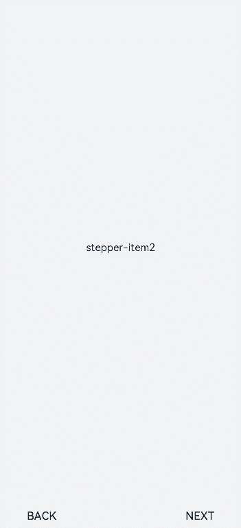
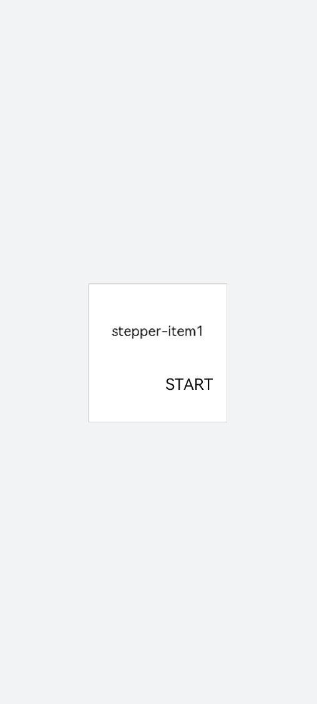
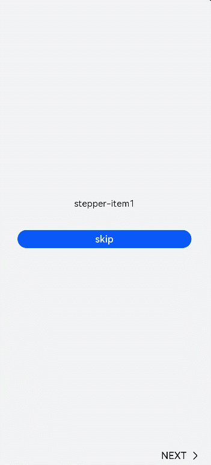

# \<stepper> Development
<!--Kit: ArkUI-->
<!--Subsystem: ArkUI-->
<!--Owner: @mayaolll-->
<!--Designer: @jiangdayuan-->
<!--Tester: @lxl007-->
<!--Adviser: @HelloCrease-->

When multiple steps are required to complete a task, you can use the **\<stepper>** component to navigate your users through the whole process. For details, see [stepper](../reference/apis-arkui/arkui-js/js-components-container-stepper.md).


## Creating a \<stepper> Component

Create a **\<stepper>** component in the .hml file under **pages/index**.

```html
<!-- xxx.hml -->
<div class="container"> 
 <stepper>    
   <stepper-item>     
     <text>Step 1</text>
   </stepper-item> 
   <stepper-item>     
     <text>Step 2</text>
   </stepper-item> 
 </stepper> 
</div>
```

```css
/* xxx.css */
.container {
  width:100%;
  height:100%;
  flex-direction: column;
  justify-content: center;
  align-items: center;
  background-color: #F1F3F5;
}
text{
  width: 100%;
  height: 100%;
  text-align: center;
}
```


## Setting the Index

Set **index** to the index value of the step that you want to display by default.

```html
<!-- xxx.hml -->
<div class="container"> 
 <stepper index="2">    
   <stepper-item>     
     <text>stepper-item1</text>
   </stepper-item> 
   <stepper-item>     
     <text>stepper-item2</text>
   </stepper-item> 
   <stepper-item>     
     <text>stepper-item3</text>
   </stepper-item> 
  </stepper> 
</div>
```

```css
/* xxx.css */
.container {
  width:100%;
  height:100%;
  flex-direction: column;
  background-color: #F1F3F5;
}
text{
  width: 100%;
  height: 100%;
  text-align: center;
}
```


Set the **label** attribute to customize the label for the **\<stepper-item>**.

```html
<!-- xxx.hml -->
<div class="container"> 
 <stepper index="1">    
   <stepper-item label="{{label_1}}">     
     <text>stepper-item1</text>
   </stepper-item> 
   <stepper-item label="{{label_2}}">     
     <text>stepper-item2</text>
   </stepper-item> 
   <stepper-item label="{{label_3}}">     
     <text>stepper-item3</text>
   </stepper-item>
   <stepper-item>     
     <text>stepper-item4</text>
   </stepper-item> 
 </stepper> 
</div>
```

```css
/* xxx.css */
.container {  
  width:100%;
  height:100%;
  flex-direction: column;
  background-color: #F1F3F5;
}
text{
  width: 100%;
  height: 100%;
  text-align: center;
}
```

```js
// xxx.js
export default { 
  data: {
    label_1:{
      nextLabel: 'NEXT',      
      status: 'normal'    
    },
    label_2:{
      prevLabel: 'BACK',
      nextLabel: 'NEXT',
      status: 'normal'
    },
    label_3:{
      prevLabel: 'BACK',
      nextLabel: 'END',
      status: 'disabled'
    },
  },
}
```




## Setting Styles

By default, the **\<stepper>** component fills entire space of its container. The sample code below shows how to set the border and background color using the **border** and **background-color** attributes.
```html
<!-- xxx.hml -->
<div class="container" > 
  <div class="stepperContent">
    <stepper class="stepperClass">    
      <stepper-item>     
        <text>stepper-item1</text>
      </stepper-item> 
    </stepper> 
  </div>
</div>
```

```css
/* xxx.css */
.container {
  width:100%;
  height:100%;
  flex-direction: column;
  align-items: center;
  justify-content: center;
  background-color:#F1F3F5;
}
.stepperContent{
  width: 300px;
  height: 300px;
}
.stepperClass{
  border:1px solid silver ;
  background-color: white;
}
text{
  width: 100%;
  height: 100%;
  text-align: center;
}
```




## Adding Events

The **\<stepper>** component supports the **finish**, **change**, **next**, **back**, and **skip** events.

- When the **change** and **next** or **back** events exist at the same time, the **next** or **back** event is executed before the **change** event.

- Before resetting the **index** attribute, you must remove the current value. Otherwise, the value change cannot be detected.

```html
<!-- xxx.hml -->
<div class="container"  style="background-color:#F1F3F5;">
  <div >
    <stepper onfinish="stepperFinish" onchange="stepperChange" onnext="stepperNext" onback="stepperBack" onskip="stepperSkip" id="stepperId" index="{{index}}">
      <stepper-item>
        <text>stepper-item1</text>
        <button value="skip" onclick="skipClick"></button>
      </stepper-item>
      <stepper-item>
         <text>stepper-item2</text>
         <button value="skip" onclick="skipClick"></button>
      </stepper-item>
      <stepper-item>
        <text>stepper-item3</text>
      </stepper-item>
    </stepper>
  </div>
</div>
```

```css
/* xxx.css */
.doc-page {
  width:100%;
  height:100%;
  flex-direction: column;
  align-items: center;
  justify-content: center;
}
stepper-item{
  width: 100%;
  flex-direction: column;
  align-self: center;
  justify-content: center;
}
text{
  margin-top: 45%;
  justify-content: center;
  align-self: center;
  margin-bottom: 50px;
}
button{
  width: 80%;
  height: 60px;
  margin-top: 20px;
}
```

```js
// xxx.js
import promptAction from '@ohos.promptAction';
export default {
  data: {
    index:0,
  },
   stepperSkip(){
    this.index=2;
  },
   skipClick(){
    this.$element('stepperId').setNextButtonStatus({status: 'skip', label: 'SKIP'});
  },
  stepperFinish(){
    promptAction.showToast({
      message: 'All Finished'
    })
  },
  stepperChange(e){
    console.log("stepperChange"+e.index)
    promptAction.showToast({
      // index indicates the sequence number of the current step.
      message: 'Previous step: '+e.prevIndex+"-------Current step:"+e.index
    })
  },
  stepperNext(e){
    console.log("stepperNext"+e.index)
    promptAction.showToast({
      // pendingIndex indicates the sequence number of the step to be redirected to.
      message: 'Current step:'+e.index+"-------Next step:"+e.pendingIndex
    })
    var index = {pendingIndex:e.pendingIndex }
    return index;
  },
  stepperBack(e){
    console.log("stepperBack"+e.index)
    var index = {pendingIndex: e.pendingIndex }
    return index;
  }
}
```


