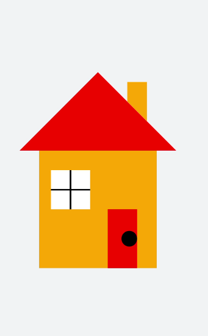

# Graph Drawing


The **&lt;svg&gt;** component can be used to draw simple shapes, such as rectangles, circles, and lines. For details about the supported shapes, see &lt;svg&gt;.


In this example, you can draw different shapes and stitch them to form a house graph.


```html
<!-- xxx.hml -->
<div class="container">
  <svg width="1000" height="1000">
    <polygon points="100,400 300,200 500,400" fill="red"></polygon>     // Rooftop
    <polygon points="375,275 375,225 425,225 425,325" fill="orange"></polygon>   // Chimney
    <rect width="300" height="300" x="150" y="400" fill="orange">      // Main body
    </rect>
    <rect width="100" height="100" x="180" y="450" fill="white">    // Window
    </rect>
    <line x1="180" x2="280" y1="500" y2="500" stroke-width="4" fill="white" stroke="black"></line>     // Window frame
    <line x1="230" x2="230" y1="450" y2="550" stroke-width="4" fill="white" stroke="black"></line>     // Window frame
    <polygon points="325,700 325,550 400,550 400,700" fill="red"></polygon>     // Door
    <circle cx="380" cy="625" r="20" fill="black"></circle>      // Doorknob
  </svg>
</div>
```


```css
/* xxx.css */
.container {
  width: 100%;
  height: 100%;
  flex-direction: column;
  justify-content: center;
  align-items: center;
  background-color: #F1F3F5;
}
```


