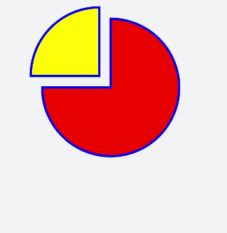

# Path Drawing


The **&lt;svg&gt;** component uses instructions **M** (start point), **H** (horizontal line), and **a** (drawing an arc to a specified position) to control a path and sets the fill colors to create a pie chart.

```html
<!-- xxx.hml -->
<div class="container">
  <svg fill="#00FF00" x="100" y="400">
    <path d="M300,200 h-150 a150 150 0 1 0 150 -150 z" fill="red" stroke="blue" stroke-width="5" >    
    </path> 
    <path d="M275,175 v-150 a150 150 0 0 0 -150 150 z" fill="yellow" stroke="blue" stroke-width="5">    
    </path>
  </svg>
</div>
```

```css
/* xxx.css */
.container {
  flex-direction: row;
  justify-content: flex-start;
  align-items: flex-start;
  height: 1200px;
  width: 600px;
  background-color: #F1F3F5;
}
```





> **NOTE**
> - M/m = moveto   The **x** and **y** parameters indicate the destination X and Y coordinates of a point. The **M** command only moves the brush, but does not draw a line between two points. Therefore, the **M** command is often used at the beginning of a path to indicate the start point.
> 
> - L/l = lineto   The **x** and **y** parameters indicate the X and Y coordinates of a point. The **L** command draws a line between the current position and the destination position (the previous point of the brush).
> 
> - H/h = horizontal lineto    Draws a horizontal line.
> 
> - V/v = vertical lineto   Draws a vertical line.
> 
> - C/c = curveto  Draws a cubic Bezier curve. Three groups of coordinate parameters are required: **x1 y1**, **x2 y2**, **x y**.
> 
> - S/s = smooth curveto  Draws a cubic Bezier curve. Two groups of coordinate parameters are required: **x2 y2**, **x y**.
> 
> - Q/q = quadratic Belzier curve  Draws a quadratic Bezier curve. Two groups of coordinate parameters are required: **x1 y1**, **x y**.
> 
> - T/t = smooth quadratic Belzier curveto  Draws a quadratic Bezier curve. One group of coordinate parameters are required: **x y**.
> 
> - A/a = elliptical Arc  Draw an arc. The following parameters are required: **rx ry x-axis-rotation** (rotation angle), **large-arc-flag** (angle), **sweep-flag** (arc direction), and **x y**. **large-arc-flag** determines whether the arc is less than 180 degrees. **0** indicates yes, and **1** indicates no. **sweep-flag** indicates the direction in which an arc is drawn. **0** indicates that the arc is drawn counterclockwise from the start point to the end point. **1** indicates that the arc is drawn clockwise from the start point to the end point.
> 
> - Z/z = closepath  Draws a straight line from the current point to the start point of the path.
