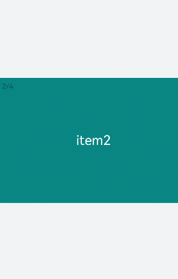

# &lt;swiper&gt; Development


The **&lt;swiper&gt;** component is a sliding container used to switch between child components. For details, see [swiper](../reference/apis-arkui/arkui-js/js-components-container-swiper.md).


## Creating a &lt;swiper&gt; Component

Create a **&lt;swiper&gt;** component in the .hml file under **pages/index**.

```html
<!-- xxx.hml-->
<div class="container">
  <swiper>
    <div class="item" style="background-color: #bf45ea;">
      <text>item1</text>
    </div>
    <div class="item" style="background-color: #088684;">
      <text>item2</text>
    </div>
    <div class="item" style="background-color: #7786ee;">
      <text>item3</text>
    </div>
  </swiper>
</div>
```

```css
/* xxx.css */
.container{
  width: 100%;
  height: 100%;
  flex-direction: column;
  background-color: #F1F3F5;
  align-items: center;
  justify-content: center;
  width: 100%;
}
swiper{
  height: 30%;
}
.item{
  width: 100%;
  height: 500px;
}
text{
  width: 100%;
  height: 100%;
  text-align: center;
  font-size: 50px;
  color: white;
}
```


> **NOTE**
>
> The **&lt;swiper&gt;** component supports child components except **&lt;list&gt;**.


## Adding Attributes

When **loop** is set to **false**, the **autoplay** attribute is added to the **&lt;swiper&gt;** component and the autoplay interval (**interval**) is set. The component automatically switches between child components and stops at the last one. Add the **digital** attribute to enable the digital navigation point and set **scrolleffect** to **fade**.


```html
<!-- xxx.hml-->
<div class="container">
  <swiper index="1"  autoplay="true" interval="2000" indicator="true" digital="true" duration="500"
  scrolleffect="fade" loop="false">
    <div class="item" style="background-color: #bf45ea;">
      <text>item1</text>
    </div>
    <div class="item" style="background-color: #088684;">
      <text>item2</text>
    </div>
    <div class="item" style="background-color: #7786ee;">
      <text>item3</text>
    </div>
    <div class="item" style="background-color: #c88cee;">
      <text>item4</text>
    </div>
  </swiper>
</div>
```


```css
/* xxx.css */
.container{
  width: 100%;
  height: 100%;
  flex-direction: column;
  background-color: #F1F3F5;
  align-items: center;
  justify-content: center;
}
swiper{
  height: 30%;
}
.item{
  width: 100%;
  height: 500px;
}
text{
  width: 100%;
  height: 100%;
  text-align: center;
  font-size: 50px;
  color: white;
}
```



> **NOTE**
> - The **digital** attribute takes effect only when the **indicator** attribute is set to **true**.
> 
> - The **loop** attribute takes effect only when there are two or more than two child components of the **&lt;swiper&gt;** component.
> 
> - The **scrolleffect** attribute takes effect only when the **loop** attribute value is set to **false**.


## Setting Styles

Set the width and height of the **&lt;swiper&gt;** component, the indicator's size (**indicator-size**), color (**indicator-color**), relative position (**indicator-top**), and color when it is selected (**indicator-selected-color**).


```html
<!-- xxx.hml-->
<div class="container">
    <swiper index="1" autoplay="true" interval="2000"  duration="500" >
        <div class="item" style="background-color: bisque;">
            <text>item1</text>
        </div>
        <div class="item" style="background-color: darkkhaki;">
            <text>item2</text>
        </div>
        <div class="item" style="background-color: cadetblue;">
            <text>item3</text>
        </div>
    </swiper>
</div>
```


```css
/* xxx.css */
.container{
  width: 100%;
  height: 100%;
  flex-direction: column;
  background-color: #F1F3F5;
  align-items: center;
  justify-content: center;
}
swiper{
  width:  500px;
  height: 500px;
  border-radius: 250px;
  indicator-color: white;
  indicator-selected-color: blue;
  indicator-size: 40px;
  indicator-top: 100px;
  overflow: hidden ;
}
.item{
  width: 100%;
  height: 500px;
}
text{
  width: 100%;
  text-align: center;
  margin-top: 150px;
  font-size: 50px;
  color: white;
}
```


## Binding Events

Create two **&lt;text&gt;** components and bind click events. Clicking the component will call **showPrevious** to display the previous child component or **showNext** to display the next child component. Add a **&lt;select&gt;** component. A **change** event is triggered when a user selects a value from the drop-down list box and the **swipeTo** method is called to go to the specified page. Bind the **&lt;swiper&gt;** component with the **change** event (triggered when the index of the currently displayed component changes) and the **finish** event (triggered when the switchover animation ends).


```html
<!-- xxx.hml-->
<div class="container">
  <swiper interval="2000" onchange="change" loop="false" onanimationfinish="finish" id="swiper">
    <div class="item" style="background-color: #bf45ea">
      <text>item1</text>
    </div>
    <div class="item" style="background-color: #088684;">
      <text>item2</text>
    </div>
    <div class="item" style="background-color: #7786ee;">
      <text>item3</text>
    </div>
    <div class="item" style="background-color: #c88cee;">
      <text>item4</text>
    </div>
  </swiper>
  <div class="content">
      <button class="pnbtn" onclick="previous">Previous</button>
      <select onchange="selectChange">
          <option value="0">swipeTo 1</option>
          <option value="1">swipeTo 2</option>
          <option value="2">swipeTo 3</option>
          <option value="3">swipeTo 4</option>
      </select>
    <button class="pnbtn" onclick="next">Next</button>
  </div>
</div>
```


```css
/* xxx.css */
.container{
  width: 100%;
  height: 100%;
  flex-direction: column;
  background-color: #F1F3F5;
  align-items: center;
  justify-content: center;
}
swiper{
  height: 30%;
}
.item{
  width: 100%;
  height: 500px;
}
text{
  width: 100%;
  height: 100%;
  text-align: center;
  font-size: 50px;
  color: white;
}
select{
  background-color: white;
  width: 250px;
  height: 80px;
}
.content{
  margin-top: 100px;
  justify-content: space-around;
}
.pnbtn{
  width: 200px;
  height: 80px;
  font-size: 30px; 
}
```


```js
// xxx.js
import promptAction from '@ohos.promptAction';
export default{
  change(e){
    promptAction.showToast({duration:2000,message:"current index:"+e.index});
  },
  finish(){
    promptAction.showToast({duration:2000,message:"The switchover ends"});
  },
  selectChange(e){
    this.$element('swiper').swipeTo({index: Number(e.newValue)});
  },
  previous(){
    this.$element('swiper').showPrevious();
  },
  next(){
    this.$element('swiper').showNext();
  }
}
```


## Example Scenario

Use the **&lt;swiper&gt;** component to create an image carousel and a thumbnail module at the bottom of the carousel. After a thumbnail is clicked, the **swipeTo** method is called to switch to the corresponding image.


```html
<!-- xxx.hml-->
<div class="container">
  <swiper duration="500" indicator="false" id="swiper" onchange="change">
    <div class="item" for="item in list">
      <image src="{{item.src}}"></image>
    </div>
  </swiper>
  <div class="content">
    <div class="content_item {{index == $idx?'actived':''}}" for="item in list" onclick="imageTo({{$idx}})">
      <image src="{{item.src}}"></image>
    </div>
  </div>
</div>
```


```css
/* xxx.css */
.container{
  flex-direction: column;
  background-color: #F1F3F5;
  align-items: center;
  justify-content: center;
  width: 100%;
}
swiper{
  width: 100%;
  height: 500px;
}
.item{
  width: 100%;
  height: 500px;
}
.content{
  margin-top: -120px;
  width: 70%;
  display: flex;
  justify-content: space-around;
  height: 100px;
}
.content_item{
  padding: 5px;
  transform: scale(0.5);
}
.actived{
  transform: scale(1);
  border: 1px solid #b20937ea;
}
```


```js
// xxx.js
import promptAction from '@ohos.promptAction';
export default {
  data:{
    index: 0,
    list:[
      {src: 'common/images/1.png'},
      {src: 'common/images/2.png'},
      {src: 'common/images/3.png'},
      {src: 'common/images/4.png'},]
    },
  imageTo(index){
    this.index = index;
    this.$element('swiper').swipeTo({index: index});
  },
  change(e){
    this.index = e.index;
  }
}
```

