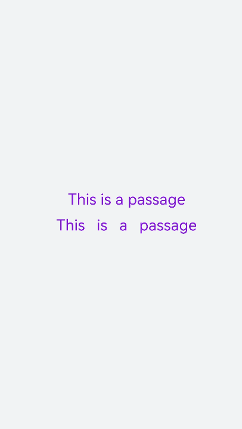
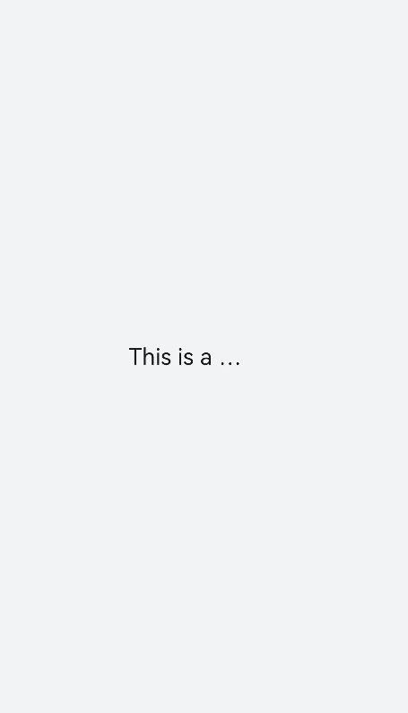
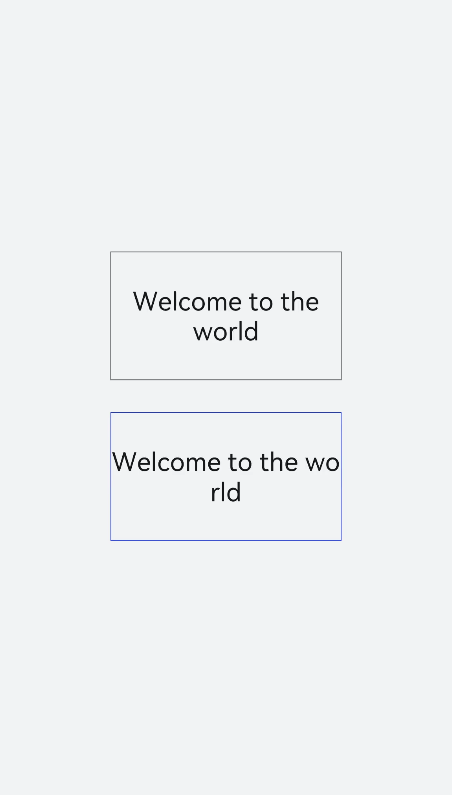
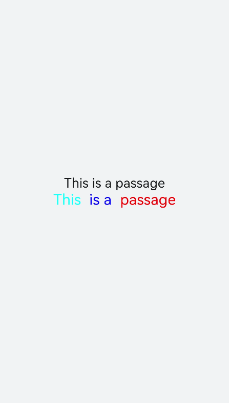

# &lt;text&gt; Development


The **&lt;text&gt;** component is used to display a piece of textual information. For details, see [text](../reference/apis-arkui/arkui-js/js-components-basic-text.md).


## Creating a &lt;text&gt; Component

Create a **&lt;text&gt;** component in the .hml file under **pages/index**.

```html
<!-- xxx.hml -->
<div class="container" style="text-align: center;justify-content: center; align-items: center;">
  <text>Hello World</text>
</div>
```

```css
/* xxx.css */
.container {
  width: 100%;
  height: 100%;
  flex-direction: column;
  align-items: center;
  justify-content: center;
  background-color: #F1F3F5;
}
```


## Setting the Text Style and Attributes

- Adding a text style
  
  Set the **color**, **font-size**, **allow-scale**, **word-spacing**, and **text-align** attributes to add the color, size, zoom, text spacing, and vertical alignment of the text.

  ```html
  <!-- xxx.hml -->
  <div class="container" style="background-color:#F1F3F5;flex-direction: column;justify-content: center; align-items: center;">   
    <text style="color: blueviolet; font-size: 40px; allow-scale:true"> 
      This is a passage
    </text>
    <text style="color: blueviolet; font-size: 40px; margin-top: 20px; allow-scale:true;word-spacing: 20px;" >
      This is a passage
    </text>
  </div> 
  ```

  ```css
  /* xxx.css */
  .container {
    width: 100%;
    height: 100%;
    flex-direction: column;
    align-items: center;
    justify-content: center;
    background-color: #F1F3F5;
  }
  ```

    


- Adding a text modifier
  
  Set the **text-decoration** and **text-decoration-color** attributes to add an underline, overline, line-through, or a combination of lines in the specified color to selected text. For values of **text-decoration**, see [Text Styles](../reference/apis-arkui/arkui-js/js-components-basic-text.md).


  ```html
  <!-- xxx.hml -->
  <div class="container" style="background-color:#F1F3F5;">
    <text style="text-decoration:underline">
      This is a passage
    </text>
    <text style="text-decoration:line-through;text-decoration-color: red">
      This is a passage
     </text>
  </div>
  ```

  ```css
  /* xxx.css */
  .container {
    width: 100%;
    height: 100%;
    flex-direction: column;
    align-items: center;
    justify-content: center;
  }
  text{
    font-size: 50px;
  }
  ```

  


- Hiding text content
  

Set the **text-overflow** attribute to **ellipsis** so that overflowed text is displayed as an ellipsis.


  ```html
  <!-- xxx.hml -->
  <div class="container">
    <text class="text">
      This is a passage
    </text>
  </div>
  ```

  ```css
  /* xxx.css */
  .container {
    width: 100%;
    height: 100%;
    flex-direction: column;
    align-items: center;
    background-color: #F1F3F5;
    justify-content: center; 
  }
  .text{
    width: 200px;
    max-lines: 1;
    text-overflow:ellipsis;
  }
  ```

  > **NOTE**
  > - **text-overflow** must be used together with **max-lines**.
  > - **max-lines** indicates the maximum number of lines in the text.

  


- Setting the text line breaking mode
  

Set the **word-break** attribute to specify how to break lines of text. For values of **word-break**, see [Text Styles](../reference/apis-arkui/arkui-js/js-components-basic-text.md).


  ```html
  <!-- xxx.hml -->
  <div class="container">
    <div class="content">
      <text class="text1">
        Welcome to the world
      </text>
        <text class="text2">
          Welcome to the world
        </text>
    </div>
  </div>
  ```

  ```css
  /* xxx.css */
  .container {
    width: 100%;
    height: 100%;
    background-color: #F1F3F5;
    flex-direction: column;
    align-items: center;
    justify-content: center;
  }
  .content{
    width: 50%;
    flex-direction: column;
    align-items: center;
    justify-content: center;
  }
  .text1{
    width: 100%;
    height: 200px;
    border:1px solid #1a1919;
    margin-bottom: 50px;
    text-align: center;
    word-break: break-word;
    font-size: 40px;
  }
  .text2{
    width: 100%;
    height: 200px;
    border:1px solid #0931e8;
    text-align: center;
    word-break: break-all;
    font-size: 40px;
  }
  ```

    


- Setting the [&lt;span&gt;](../reference/apis-arkui/arkui-js/js-components-basic-span.md) child component
  
  ```html
  <!-- xxx.hml -->
  <div class="container" style="justify-content: center; align-items: center;flex-direction: column;background-color: #F1F3F5;  width: 100%;height: 100%;">
    <text style="font-size: 45px;">
      This is a passage
    </text>
    <text style="font-size: 45px;">
      <span style="color: aqua;">This </span><span style="color: #F1F3F5;">      1       
      </span>   
      <span style="color: blue;"> is a </span>    <span style="color: #F1F3F5;">      1    </span>    
      <span style="color: red;">  passage </span>
    </text>
  </div>
  ```

  

  > **NOTE**
  > - When the **&lt;span&gt;** child component is used to form a text paragraph, incorrect **&lt;span&gt;** attribute settings (for example, setting of **font-weight** to **1000**) will result in abnormal display of the text paragraph.
  > 
  > - When the **&lt;span&gt;** child component is being used, do not include any text you want to show in the **&lt;text&gt;** component, as such text will not be displayed if you do so.


## Example Scenario

Use the **&lt;text&gt;** component to display text content through data binding. Use the **&lt;span&gt;** child component to hide or display text content by setting the **show** attribute.

```html
<!-- xxx.hml -->
<div class="container">
  <div style="align-items: center;justify-content: center;">
    <text class="title">
      {{ content }}
    </text>
    <switch checked="true" onchange="test"></switch>
  </div>
  <text class="span-container" style="color: #ff00ff;">
    <span show="{{isShow}}">  {{ content  }}  </span>
    <span style="color: white;">
        1
    </span>
    <span style="color: #f76160">Hide clip </span>
  </text>
</div>
```

```css
/* xxx.css */
.container {
  width: 100%;
  height: 100%;
  align-items: center;
  flex-direction: column;
  justify-content: center;
  background-color: #F1F3F5;
}
.title {
  font-size: 26px;
  text-align:center;
  width: 200px;
  height: 200px;
}
```

```js
// xxx.js
export default {   
  data: {    
    isShow:true,    
    content: 'Hello World'
  },   
  onInit(){    },  
  test(e) {    
    this.isShow = e.checked  
  }
}
```

