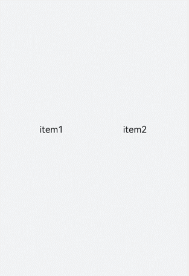
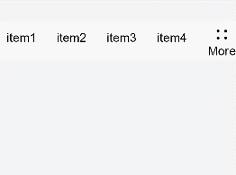
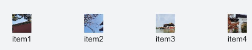
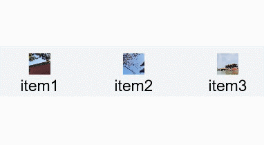

# &lt;toolbar&gt; Development


The **&lt;toolbar&gt;** component shows actions available on the current screen and can be used for level-1 navigation. For details, see [toolbar](../reference/apis-arkui/arkui-js/js-components-basic-toolbar.md).


## Creating a &lt;toolbar&gt; Component

Create a **&lt;toolbar&gt;** component in the .hml file under **pages/index**.


```html
<!-- xxx.hml -->
<div class="container">
  <toolbar style="background-color: #F1F3F5;">
    <toolbar-item value="item1"></toolbar-item>
    <toolbar-item value="item2"></toolbar-item>
  </toolbar>
</div>
```


```css
/* xxx.css */
.container {
  width: 100%;
  height: 100%; 
  flex-direction: column;
  justify-content: center;
  align-items: center;
  background-color: #F1F3F5;
}
toolbar-item{
  font-size: 35px;
}
```




## Adding Child Components

The **&lt;toolbar&gt;** component supports only the **&lt;toolbar-item&gt;** child component and can display a maximum of five **&lt;toolbar-item&gt;** child components on a page. If there are six or more **&lt;toolbar-item&gt;** child components, the first four child components are retained, and the rest are moved to the **More** option on the toolbar and can be displayed on a pop-up window by clicking **More**. Under **More**, the child components are displayed in the default style; the custom style settings do not take effect.

```html
<!-- xxx.hml -->
<div class="container">
  <toolbar>
    <toolbar-item value="item1"></toolbar-item>    
    <toolbar-item value="item2"></toolbar-item>    
    <toolbar-item value="item3"></toolbar-item>    
    <toolbar-item value="item4"></toolbar-item>    
    <toolbar-item value="item5"></toolbar-item>    
    <toolbar-item value="item6"></toolbar-item>
  </toolbar>
</div>
```


```css
/* xxx.css */
.container {
  width: 100%;
  height: 100%; 
  flex-direction: column;
  justify-content: center;
  align-items: center;
  background-color: #F1F3F5;
}
toolbar-item{
  font-size: 35px;
}
```




## Setting Styles

Set the **position** style for the **&lt;toolbar&gt;** component and set the font color, size, and background color of **&lt;toolbar-item&gt;** child components.


```html
<!-- xxx.hml -->
<div class="container">
  <toolbar style="position: fixed;bottom: 5%;width: 100%;background-color: #F1F3F5;">
    <toolbar-item value="item1" icon="common/images/1.png" class="toolbarActive"></toolbar-item>
    <toolbar-item value="item2" icon="common/images/2.png"></toolbar-item>
    <toolbar-item value="item3" icon="common/images/1.png"></toolbar-item>
    <toolbar-item value="item4" icon="common/images/2.png"></toolbar-item>
  </toolbar>
</div>
```


```css
/* xxx.css */
.container {
  background-color: #F1F3F5;
  flex-direction: column;
  width: 100%;
  height: 100%; 
  justify-content: center;
  align-items: center;
}
toolbar-item{
  font-size: 35px;
}
```





## Binding Events

Bind the click event and long press event to the **&lt;toolbar-item&gt;** child components, so that the text of these components turns red upon click and turns blue upon long press.


```html
<!-- xxx.hml -->
<div class="container">
  <toolbar style="position: fixed;top: 50%;width: 100%;background-color: #F1F3F5;">
    <toolbar-item value="item1" icon="common/images/1.png" style="color: {{itemColor}};" onclick="itemClick"></toolbar-item>
    <toolbar-item value="item2" icon="common/images/2.png"  style="color: {{itemColor}}"></toolbar-item>
    <toolbar-item value="item3" icon="common/images/3.png"  style="color: {{itemColor}}" onlongpress="itemLongPress"></toolbar-item>
  </toolbar>
</div>
```


```css
/* xxx.css */
.container {
  background-color: #F1F3F5;   
  flex-direction: column;
  width: 100%;
  height: 100%; 
  justify-content: center;
  align-items: center;
}
toolbar-item{
  font-size: 35px;
}
```


```js
// xxx.js
import promptAction from '@ohos.promptAction';
export default {
  data:{
    itemColor:'black'
  },
  itemClick(){
    this.itemColor= "red";
    promptAction.showToast({duration:2000,message:'item click'});
  },
  itemLongPress(){
    promptAction.showToast({duration:2000,message:'item long press'});
    this.itemColor= "blue";
  },
}
```



> **NOTE**
>
> The **&lt;toolbar&gt;** component does not allow adding of events or methods, but its child components do.


## Example Scenario

In this example, you'll implement a **&lt;toolbar-item&gt;** component, clicking which will trigger a change in the text color and the image corresponding to the component.

Use the **for** loop to create a **&lt;toolbar-item&gt;** component and bind a click event to it, so that clicking the component will obtain and store an index value. When setting the text color, the system checks whether the current index value is the stored value. If yes, the system sets the color to red. If no, the system uses the default color.

```html
<!-- xxx.hml -->
<div class="container">
  <image src="{{imgList[active]}}"></image>
  <toolbar style="position: fixed;bottom: 5%;width: 100%;background-color: #F1F3F5;">
    <toolbar-item value="{{ item.option}}" icon="{{item.icon}}" style="color: {{active == $idx?'red':'black'}};background-color: {{active== $idx?'#dbe7f1':'#F1F3F5'}};" for="{{item in itemList}}" onclick="itemClick({{$idx}})"></toolbar-item>
    </toolbar>
</div>
```


```css
/* xxx.css */
.container {
  background-color: #F1F3F5;   
  flex-direction: column;
  width: 100%;
  justify-content: center;
  align-items: center;
}
toolbar-item{
  font-size: 35px;
}
```


```js
// xxx.js
export default {
  data:{
    active: 0,
    imgList:["common/images/1.png","common/images/2.png","common/images/3.png","common/images/4.png"],
    itemList:[
      {option:'item1',icon:'common/images/1.png'},
      {option:'item2',icon:'common/images/2.png'},
      {option:'item3',icon:'common/images/3.png'},
      {option:'item4',icon:'common/images/4.png'},
    ]
  },
  itemClick(id){
    this.active= id;
  },
}
```


