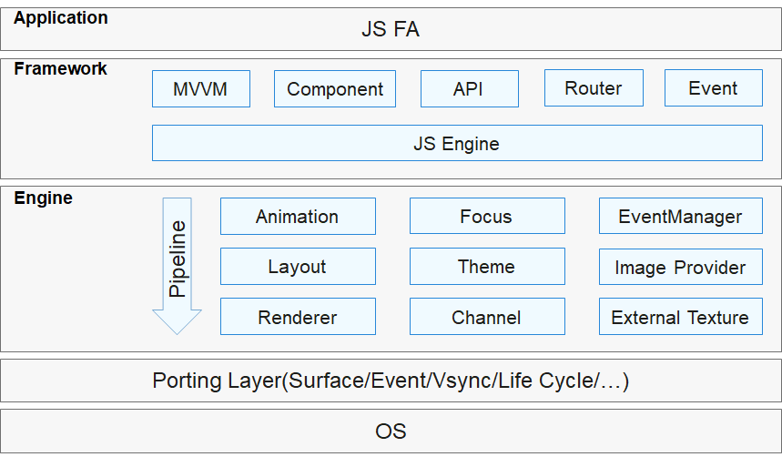

# Overview

The JavaScript-compatible web-like development paradigm uses the classical three-stage programming model, in which HML is used for building layouts, CSS for defining styles, and JavaScript for adding processing logic. UI components are associated with data through one-way data-binding. This means that when data changes, the UI automatically updates with the new data. This development paradigm has a low learning curve for frontend web developers, allowing them to quickly transform existing web applications into ArkUI applications. It could be helpful if you are developing small- and medium-sized applications with simple UIs.

For details about the components, see [Component Reference (JavaScript-compatible Web-like Development Paradigm)](../reference/apis-arkui/arkui-js/js-components-common-attributes.md). 

## Overall Architecture

ArkUI with the JavaScript-compatible web-like development paradigm consists of the following layers: application layer, frontend framework layer, engine layer, and porting layer.

- Application

  Contains applications with FAs you developed. The FA application in this document refers to the application with FAs developed using JavaScript. 

- Framework

  Parses UI pages and provides the Model-View-ViewModel (MVVM), page routing, custom components and more for front end development.

- Engine

  Accomplishes animation parsing, Document Object Model (DOM) building, layout computing, rendering command building and drawing, and event management.

- Porting Layer

  Abstracts the platform layer to provide abstract interfaces to connect to the platform. For example, event interconnection, rendering pipeline interconnection, and lifecycle interconnection.
