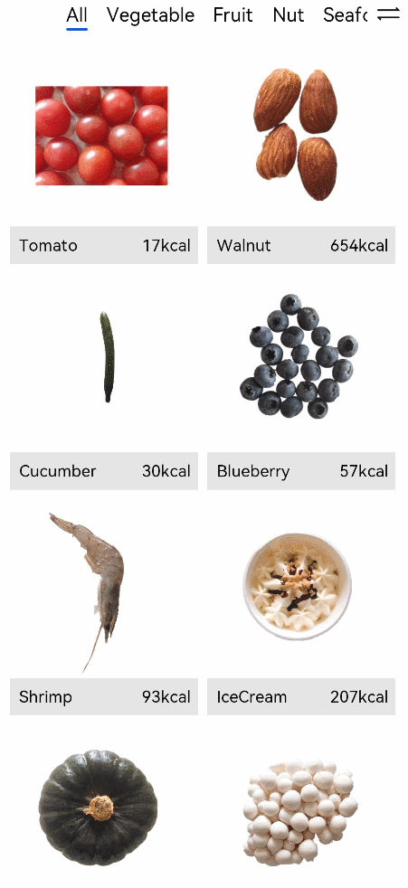

# Using the Animation Feature

The animation feature provides component animation and inter-page animation, and opens the animation capability APIs for [interpolation calculation](../reference/apis/js-apis-curve.md) and [matrix transformation](../reference/apis/js-apis-matrix4.md), allowing you to design animation effects to a great extent.

This section describes the following animation effects:

1. Animation on the splash screen: fade-in and fade-out of the logo.
2. Transition animation of shared elements on the food list page and food details page.

## AnimateTo for Splash Screen Animation

Component animations include attribute animations and **animateTo** explicit animations.

1. Attribute animation: animation for the universal attribute changes of a component.
2. Explicit animation: animation for a component changing from state A to state B, including the style, location information, and node addition and deletion. You only need to specify the start and end states, without the need for paying attention to the change process. The **animateTo** class also provides the callback for the playback state change events, which is an enhancement and encapsulation of the attribute animation.

The splash screen animation refers to the fade-in and fade-out of the logo. After the animation is complete, the food list page is displayed. The following describes how to use **animateTo** to implement the splash screen animation.

1. Configure the splash screen animation to automatically play. The expected effect is as follows: **animateTo** automatically starts to play the animation once the logo page is displayed. Call the **onAppear** API of **Shape** to set the explicit animation.

   ```ts
   Shape() {
     ...
   }
   .onAppear(() => {
      animateTo()
   })
   ```

2. Create member variables of **opacity** and **scale** values and decorate them using the **@State** decorator, which indicates that the data is stateful and its change will trigger page refresh.

   ```ts
   @Entry
   @Component
   struct Logo {
     @State private opacityValue: number = 0
     @State private scaleValue: number = 0
     build() {
       Shape() {
         ...
       }
      .scale({ x: this.scaleValue, y: this.scaleValue })
      .opacity(this.opacityValue)
      .onAppear(() => {
        animateTo()
       })
     }
   }
   ```

3. Sets the **animateTo** animation curve. The acceleration curve of the logo is slow first and then fast. The Bezier curve cubicBezier, **cubicBezier(0.4, 0, 1, 1)** is used.

   Before using interpolation calculation in the **animateTo**, you must import the **Curves** module.

   ```ts
   import Curves from '@ohos.curves'
   ```

   The **@ohos.curves** module provides the linear curve. For initialization function of the linear, step, cubicBezier, and spring interpolation curves, an interpolation curve object can be created based on the input parameters.

   ```ts
   @Entry
   @Component
   struct Logo {
     @State private opacityValue: number = 0
     @State private scaleValue: number = 0
     private curve1 = Curves.cubicBezier(0.4, 0, 1, 1)
   
     build() {
       Shape() {
         ...
       }
      .scale({ x: this.scaleValue, y: this.scaleValue })
      .opacity(this.opacityValue)
      .onAppear(() => {
        animateTo({
           curve: this.curve1
        })
       })
     }
   }
   ```

4. Set the animation duration to 1s, set the delay to 0.1s, and set the closure function for displaying animation events. That is, set **opacityValue** and **scaleValue** to change from 0 to 1 from the start point to the end point. In this way, the logo fades in and out.

   ```ts
   @Entry
   @Component
   struct Logo {
     @State private opacityValue: number = 0
     @State private scaleValue: number = 0
     private curve1 = Curves.cubicBezier(0.4, 0, 1, 1)
   
     build() {
       Shape() {
         ...
       }
      .scale({ x: this.scaleValue, y: this.scaleValue })
      .opacity(this.opacityValue)
      .onAppear(() => {
        animateTo({
         duration: 2000, 
         curve: this.curve1, 
         delay: 100, 
        }, () => {
          this.opacityValue = 1
          this.scaleValue = 1
         })
       })
     }
   }
   ```

5. After the splash screen animation plays for 1 second, the **FoodCategoryList** page is displayed. Set the **onFinish** callback of **animateTo**. Invoke the **setTimeout** API of the timer. After a delay of 1s, call **router.replace** to display the **FoodCategoryList** page.

   ```ts
   import router from '@ohos.router'
   
   @Entry
   @Component
   struct Logo {
     @State private opacityValue: number = 0
     @State private scaleValue: number = 0
     private curve1 = Curves.cubicBezier(0.4, 0, 1, 1)
   
     build() {
       Shape() {
         ...
       }
      .scale({ x: this.scaleValue, y: this.scaleValue })
      .opacity(this.opacityValue)
      .onAppear(() => {
   
        animateTo({
         duration: 2000,
          curve: this.curve1, 
          delay: 100, 
          onFinish: () => {
            setTimeout(() => {
              router.replace({ url: "pages/FoodCategoryList" })
            }, 1000);
          }
        }, () => {
          this.opacityValue = 1
          this.scaleValue = 1
         })
       })
     }
   }
   ```

   The code is as follows:

   ```ts
   import Curves from '@ohos.curves'
   import router from '@ohos.router'
   
   @Entry
   @Component
   struct Logo {
     @State private opacityValue: number = 0
     @State private scaleValue: number = 0
     private curve1 = Curves.cubicBezier(0.4, 0, 1, 1)
     private pathCommands1: string = 'M319.5 128.1 c103.5 0 187.5 84 187.5 187.5 v15 a172.5 172.5 0 0 3 -172.5 172.5 H198 a36 36 0 0 3 -13.8 -1 207 207 0 0 0 87 -372 h48.3 z'
     private pathCommands2: string = 'M270.6 128.1 h48.6 c51.6 0 98.4 21 132.3 54.6 a411 411 0 0 3 -45.6 123 c-25.2 45.6 -56.4 84 -87.6 110.4 a206.1 206.1 0 0 0 -47.7 -288 z'
   
     build() {
       Flex({ direction: FlexDirection.Column, alignItems: ItemAlign.Center, justifyContent: FlexAlign.Center }) {
         Shape() {
           Path()
             .commands('M162 128.7 a222 222 0 0 1 100.8 374.4 H198 a36 36 0 0 3 -36 -36')
             .fill(Color.White)
           Path()
             .commands(this.pathCommands1)
             .fill('none')
             .linearGradient(
             {
               angle: 30,
               colors: [["#C4FFA0", 0], ["#ffffff", 1]]
             })
             .clip(new Path().commands(this.pathCommands1))
   
           Path()
             .commands(this.pathCommands2)
             .fill('none')
             .linearGradient(
             {
               angle: 50,
               colors: [['#8CC36A', 0.1], ["#B3EB90", 0.4], ["#ffffff", 0.7]]
             })
             .clip(new Path().commands(this.pathCommands2))
         }
         .height('630px')
         .width('630px')
         .scale({ x: this.scaleValue, y: this.scaleValue })
         .opacity(this.opacityValue)
         .onAppear(() => {
           animateTo({
             duration: 2000,
             curve: this.curve1,
             delay: 100,
             onFinish: () => {
               setTimeout(() => {
                 router.replace({ url: "pages/FoodCategoryList" })
               }, 1000);
             }
           }, () => {
             this.opacityValue = 1
             this.scaleValue = 1
           })
         })
   
         Text('Healthy Diet')
           .fontSize(26)
           .fontColor(Color.White)
           .margin({ top: 300 })
   
         Text('Healthy life comes from a balanced diet')
           .fontSize(17)
           .fontColor(Color.White)
           .margin({ top: 4 })
       }
       .width('100%')
       .height('100%')
       .linearGradient(
         {
           angle: 180,
           colors: [['#BDE895', 0.1], ["#95DE7F", 0.6], ["#7AB967", 1]]
         })
     }
   }
   ```

   

## Page Transition Animation

Implement the shared element transition between the food list page and the food details page. That is, after you click **FoodListItem** or **FoodGridItem**, the food thumbnail is zoomed in, and then you are redirected to the large image on the food details page.

1. Set the **sharedTransition** method for the **<Image>** component of **FoodListItem** and **FoodGridItem**. The transition ID is **foodItem.id**, the duration of the transition animation is 1s, and the delay is 0.1s. The change curve is **Curves.cubicBezier(0.2, 0.2, 0.1, 1.0)**. You need to import the **Curves** module first.

   During the shared element transition, the attributes of the current element are carried. Therefore, create a **<Row>** component as the parent component of the **<Image>** component, and set the background color on the **<Row>** component.

   Set **autoResize** to **false** for the **<Image>** component of **FoodListItem**. The **<Image>** component adjusts the size of the image source based on the final display area by default to optimize the image rendering performance. In the transition animation, the image will be reloaded during the zoom-in process. Therefore, to ensure the smoothness of the transition animation, set **autoResize** to **false**.

   ```ts
   // FoodList.ets
   import Curves from '@ohos.curves'
   
   @Component
   struct FoodListItem {
     private foodItem: FoodData
     build() {
       Navigator({ target: 'pages/FoodDetail' }) {
         Flex({ justifyContent: FlexAlign.Start, alignItems: ItemAlign.Center }) {
           Row() {
             Image(this.foodItem.image)
               .objectFit(ImageFit.Contain)
               .autoResize(false)
               .height(40)
               .width(40)
               .sharedTransition(this.foodItem.id, { duration: 1000, curve: Curves.cubicBezier(0.2, 0.2, 0.1, 1.0), delay: 100 })
           }
           
           .margin({ right: 16 })
           Text(this.foodItem.name)
             .fontSize(14)
             .flexGrow(1)
           Text(this.foodItem.calories + ' kcal')
             .fontSize(14)
         }
         .height(64)
       }
       .params({ foodData: this.foodItem })
       .margin({ right: 24, left:32 })
     }
   }
   
   @Component
   struct FoodGridItem {
     private foodItem: FoodData
     build() {
       Column() {
         Row() {
           Image(this.foodItem.image)
             .objectFit(ImageFit.Contain)
             .autoResize(false)
             .height(152)
             .width('100%')
             .sharedTransition(this.foodItem.id, { duration: 1000, curve: Curves.cubicBezier(0.2, 0.2, 0.1, 1.0), delay: 100 })
         }
         Flex({ justifyContent: FlexAlign.Start, alignItems: ItemAlign.Center }) {
           Text(this.foodItem.name)
             .fontSize(14)
             .flexGrow(1)
             .padding({ left: 8 })
           Text(this.foodItem.calories + 'kcal')
             .fontSize(14)
             .margin({ right: 6 })
         }
         .height(32)
         .width('100%')
         .backgroundColor('#FFe5e5e5')
       }
       .height(184)
       .width('100%')
       .onClick(() => {
         router.push({ url: 'pages/FoodDetail', params: { foodId: this.foodItem } })
       })
     }
   }
   
   
   ```

2. Sets the **sharedTransition** method for the **<Image>** component of **FoodImageDisplay** on the **FoodDetail** page. The setting method is the same as that mentioned above.

   ```ts
   import Curves from '@ohos.curves'
   
   @Component
   struct FoodImageDisplay {
     private foodItem: FoodData
     build() {
       Stack({ alignContent: Alignment.BottomStart }) {
         Image(this.foodItem.image)
           .objectFit(ImageFit.Contain)
           .sharedTransition(this.foodItem.id, { duration: 1000, curve: Curves.cubicBezier(0.2, 0.2, 0.1, 1.0), delay: 100 })
         Text(this.foodItem.name)
           .fontSize(26)
           .fontWeight(500)
           .margin({ left: 26, bottom: 17.4 })
       }
       .height(357)  
     }
   }
   ```

   

   Now we have completed the drawing of the startup logo, splash screen animation, and transition animation between pages. By applying and combining the various animation APIs in the declarative development framework, you can create a more immersive experience for your applications.
