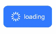
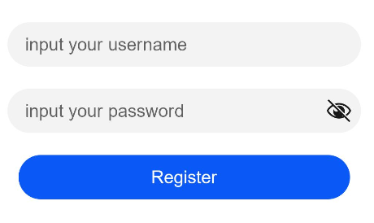

# Button


The **\<Button>** component is usually activated by user clicks to perform a specific action, for example, submitting a form. Buttons are classified as capsule, circle, or normal buttons. For details, see [Button](../reference/arkui-ts/ts-basic-components-button.md).


## Creating a Button

You can create a button that contains or does not contain child components.

- Create a button that contains child components.

  `Button(options?: {type?: ButtonType, stateEffect?: boolean})`, where `type` indicates the button type, and `stateEffect` indicates whether to enable the click effect for the button.


  ```
  Button({ type: ButtonType.Normal, stateEffect: true }) {
    Row() {
      Image($r('app.media.loading')).width(20).height(20).margin({ left: 12 })
      Text('loading').fontSize(12).fontColor(0xffffff).margin({ left: 5, right: 12 })
    }.alignItems(VerticalAlign.Center)
  }.borderRadius(8).backgroundColor(0x317aff).width(90)
  ```

  

- Create a button that does not contain child components.

  `Button(label?: string, options?: { type?: ButtonType, stateEffect?: boolean })`, where `label` indicates whether the button contains child components.


  ```
  Button('Ok', { type: ButtonType.Normal, stateEffect: true })
    .borderRadius(8)
    .backgroundColor(0x317aff)
    .width(90)
  ```

  


## Setting the Button Type

Use the **type** parameter to set the button type to **Capsule**, **Circle**, or **Normal**.

- Capsule button (default type)

  ```
  Button('Disable', { type: ButtonType.Capsule, stateEffect: false })
    .backgroundColor(0x317aff)
    .width(90)
  ```

  

- Circle button

  ```
  Button('Circle', { type: ButtonType.Circle, stateEffect: false })
    .backgroundColor(0x317aff)
    .width(90)
    .height(90)
  ```

  


## Setting Styles

- Set the border radius:
  In general cases, you can use universal attributes to define the button styles. For example, you can use the **borderRadius** attribute to set the border radius.


  ```
  Button('circle border', { type: ButtonType.Normal })
    .borderRadius(20)
  ```

  

- Set the text style:
  
  Add a font style for text displayed on the button.


  ```
  Button('font style', { type: ButtonType.Normal })
    .fontSize(20)
    .fontColor(Color.Red)
    .fontWeight(800)
  ```

  

- Set the background color:
  
  You can do so by adding the **backgroundColor** attribute.


  ```
  Button('background color').backgroundColor(0xF55A42)
  ```

  

- Assign a function to the button:
  
  In this example, we are creating a button with the delete function.


  ```
  Button({ type: ButtonType.Circle, stateEffect: true }) {
    Image($r('app.media.ic_public_delete_filled')).width(30).height(30)
  }.width(55).height(55).margin({ left: 20 }).backgroundColor(0xF55A42)
  ```

  


## Adding Events

The **\<Button>** component is usually used to trigger actions. You can bind the **onClick** event to the button to have it respond with custom behavior after being clicked.


```
Button('Ok', { type: ButtonType.Normal, stateEffect: true })
  .onClick(()=>{
    console.info('Button onClick')
  })
```


## Example Scenarios

- Using the Button for Startup

  You can use the button for any UI element that involves the startup operation. The button triggers the predefined event based on the user's operation. For example, you can use a button in the **\<List>** container to redirect the user to another page.

  ```
  import router from '@ohos.router'

  @Entry
  @Component
  struct ButtonCase1 {
    build() {
      List({ space: 4 }) {
        ListItem() {
          Button("First").onClick(() => {
            router.push({ url: 'xxx' })
          })
        }

        ListItem() {
          Button("Second").onClick(() => {
            router.push({ url: 'yyy' })
          })
        }

        ListItem() {
          Button("Third").onClick(() => {
            router.push({ url: 'zzz' })
          })
        }
      }
      .listDirection(Axis.Vertical)
      .backgroundColor(0xDCDCDC).padding(20)
    }
  }
  ```


  


- Using the Button for Submitting Forms
  
  On the user login/registration page, you can use a button to submit a login or registration request.


  ```
  @Entry
  @Component
  struct ButtonCase2 {
    build() {
      Column() {
        TextInput({ placeholder: 'input your username' }).margin({ top: 20 })
        TextInput({ placeholder: 'input your password' }).type(InputType.Password).margin({ top: 20 })
        Button('Register').width(300).margin({ top: 20 })
      }.padding(20)
    }
  }
  ```

  
