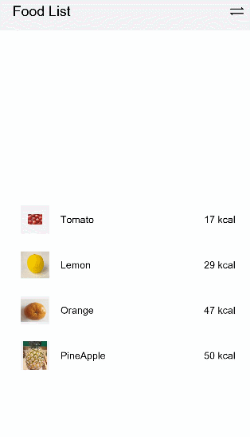

# Building a Food Category Grid Layout


The diet application allows food on the home page to display in list or grid mode. You can implement switching between food categories through tabs in grid mode.


1. Import the **Category** enumeration type to the **FoodCategoryList** page.
   
   ```ts
   import { Category, FoodData } from '../model/FoodData'
   ```

2. Create the **FoodCategoryList** and **FoodCategory** components. The **FoodCategoryList** component is used as the entry component of the new page, and the **initializeOnStartup** method is invoked in the entry component.
   
   ```ts
   @Component
   struct FoodList {
     private foodItems: FoodData[]
     build() {
       ......
     }
   }
   
   @Component
   struct FoodCategory {
     private foodItems: FoodData[]
     build() {
       ......
     }
   }
   
   @Entry
   @Component
   struct FoodCategoryList {
     private foodItems: FoodData[] = initializeOnStartup()
     build() {
       ......
     }
   }
   ```

3. Create the **showList** member variable in the **FoodCategoryList** component to control the rendering switchover between the list layout and grid layout. The conditional rendering statement if...else... is required.
   
   ```ts
   @Entry
   @Component
   struct FoodCategoryList {
     private foodItems: FoodData[] = initializeOnStartup()
     private showList: boolean = false
   
     build() {
       Stack() {
         if (this.showList) {
           FoodList({ foodItems: this.foodItems })
         } else {
           FoodCategory({ foodItems: this.foodItems })
         }
       }
     }
   }
   ```

4. In the upper right corner of the page, create an icon for switching between the list and grid layouts. Set the stack alignment mode to **TopEnd**, top-bottom alignment. Create an image component, and set the click event, that is, negation of showList.
   
   ```ts
   @Entry
   @Component
   struct FoodCategoryList {
     private foodItems: FoodData[] = initializeOnStartup()
     private showList: boolean = false
   
     build() {
       Stack({ alignContent: Alignment.TopEnd }) {
         if (this.showList) {
           FoodList({ foodItems: this.foodItems })
         } else {
           FoodCategory({ foodItems: this.foodItems })
         }
         Image($r('app.media.Switch'))
           .height(24)
           .width(24)
           .margin({ top: 15, right: 10 })
           .onClick(() => {
           this.showList = !this.showList
         })
       }.height('100%')
     }
   }
   ```

5. Add the @State decorator. After you click the switch tab in the upper right corner, the page does not change. This is because the showList does not have state data and its change does not trigger the page refresh. You need to add the @State decorator to make it state data. The change of the @State decorator will cause re-rendering of the component where the decorator is located.
   
   ```ts
   @Entry
   @Component
   struct FoodCategoryList {
     private foodItems: FoodData[] = initializeOnStartup()
     @State private showList: boolean = false
   
     build() {
       Stack({ alignContent: Alignment.TopEnd }) {
         if (this.showList) {
           FoodList({ foodItems: this.foodItems })
         } else {
           FoodCategory({ foodItems: this.foodItems })
         }
         Image($r('app.media.Switch'))
           .height(24)
           .width(24)
           .margin({ top: 15, right: 10 })
           .onClick(() => {
           this.showList = !this.showList
         })
       }.height('100%')
     }
   }
   
   ```

   When you click the switch icon, the FoodList component is displayed. When you click the switch icon again, the FoodList component is hidden.

   

6. Create a tab to display all food categories (**All**). Create the **\<Tabs>** component and its child component **TabContent** in the **FoodCategory** component, and set **tabBar** to **All**. Set the width of the **TabBars** to **280** and the layout mode to **Scrollable**. This means that the TabBars can be scrolled when the total length exceeds 280. The **\<Tabs>** component is a container component that allows users to switch between content views through tabs. Each tab page corresponds to a TabContent.
   
   ```ts
   @Component
   struct FoodCategory {
     private foodItems: FoodData[]
     build() {
       Stack() {
         Tabs() {
           TabContent() {}.tabBar('All')
         }
         .barWidth(280)
         .barMode(BarMode.Scrollable)
       }
     }
   }
   ```

   

7. Create the FoodGrid component to function as a child component of the TabContent component.
   
   ```ts
   @Component
   struct FoodGrid {
     private foodItems: FoodData[]
     build() {}
   }
   
   @Component
   struct FoodCategory {
     private foodItems: FoodData[]
     build() {
       Stack() {
         Tabs() {
           TabContent() {
             FoodGrid({ foodItems: this.foodItems })
           }.tabBar('All')
         }
         .barWidth(280)
         .barMode(BarMode.Scrollable)
       }
     }
   }
   ```

8. Implement a 2 x 6 grid layout (12 food data resources in total). Create a Grid component, and set **columnsTemplate** to **('1fr 1fr')**, **rowsTemplate** to **('1fr 1fr 1fr 1fr 1fr 1fr')**, and both **rowsGap** and **columnsGap** to **8**. Create a Scroll component so that it can be slid.
   
   ```ts
   @Component
   struct FoodGrid {
     private foodItems: FoodData[]
     build() {
       Scroll() {
         Grid() {
           ForEach(this.foodItems, (item: FoodData) => {
             GridItem() {}
           }, (item: FoodData) => item.id.toString())
         }
         .rowsTemplate('1fr 1fr 1fr 1fr 1fr 1fr')
         .columnsTemplate('1fr 1fr')
         .columnsGap(8)
         .rowsGap(8)
       }
       .scrollBar(BarState.Off)
       .padding({left: 16, right: 16})
     }
   }
   ```

9. Create a **FoodGridItem** component to display the food image, name, and calories and implement the UI layout. The **FoodGridItem** component is a child component of the **GridItem** component. The height of each FoodGridItem is 184, and the line spacing is 8. The total height of the **\<Grid>** component is calculated as follows: (184 + 8) x 6 – 8 = 1144.
   
   ```ts
   @Component
   struct FoodGridItem {
     private foodItem: FoodData
     build() {
       Column() {
         Row() {
           Image(this.foodItem.image)
             .objectFit(ImageFit.Contain)
             .height(152)
             .width('100%')
         }
         Flex({ justifyContent: FlexAlign.Start, alignItems: ItemAlign.Center }) {
           Text(this.foodItem.name)
             .fontSize(14)
             .flexGrow(1)
             .padding({ left: 8 })
           Text(this.foodItem.calories + 'kcal')
             .fontSize(14)
             .margin({ right: 6 })
         }
         .height(32)
         .width('100%')
         .backgroundColor('#FFe5e5e5')
       }
       .height(184)
       .width('100%')
     }
   }
   
   @Component
   struct FoodGrid {
     private foodItems: FoodData[]
     build() {
       Scroll() {
         Grid() {
           ForEach(this.foodItems, (item: FoodData) => {
             GridItem() {
               FoodGridItem({foodItem: item})
             }
           }, (item: FoodData) => item.id.toString())
         }
         .rowsTemplate('1fr 1fr 1fr 1fr 1fr 1fr')
         .columnsTemplate('1fr 1fr')
         .columnsGap(8)
         .rowsGap(8)
         .height(1144)
       }
       .scrollBar(BarState.Off)
       .padding({ left: 16, right: 16 })
     }
   }
   ```

   

10. Create the Category.Vegetable, Category.Fruit, Category.Nut, Category.SeaFood, and Category.Dessert tabs.
    
    ```ts
    @Component
    struct FoodCategory {
      private foodItems: FoodData[]
    
      build() {
        Stack() {
          Tabs() {
            TabContent() {
              FoodGrid({ foodItems: this.foodItems })
            }.tabBar('All')
    
            TabContent() {
              FoodGrid({ foodItems: this.foodItems.filter(item => (item.category === Category.Vegetable)) })
            }.tabBar('Vegetable')
    
            TabContent() {
              FoodGrid({ foodItems: this.foodItems.filter(item => (item.category === Category.Fruit)) })
            }.tabBar('Fruit')
    
            TabContent() {
              FoodGrid({ foodItems: this.foodItems.filter(item => (item.category === Category.Nut)) })
            }.tabBar('Nut')
    
            TabContent() {
              FoodGrid({ foodItems: this.foodItems.filter(item => (item.category === Category.Seafood)) })
            }.tabBar('Seafood')
    
            TabContent() {
              FoodGrid({ foodItems: this.foodItems.filter(item => (item.category === Category.Dessert)) })
            }.tabBar('Dessert')
          }
          .barWidth(280)
          .barMode(BarMode.Scrollable)
        }
      }
    }
    ```

11. Set the number of rows and height of grids for different food categories. Because the number of foods varies according to the category, the **'1fr 1fr 1fr 1fr 1fr 1fr'** constant cannot be used to set the number of rows to 6.
      Create member variables **gridRowTemplate** and **HeightValue**, and set the number of grid rows and height by using these member variables.

    ```ts
    @Component
    struct FoodGrid {
      private foodItems: FoodData[]
      private gridRowTemplate: string = ''
      private heightValue: number
    
      build() {
        Scroll() {
          Grid() {
            ForEach(this.foodItems, (item: FoodData) => {
              GridItem() {
                FoodGridItem({ foodItem: item })
              }
            }, (item: FoodData) => item.id.toString())
          }
          .rowsTemplate(this.gridRowTemplate)
          .columnsTemplate('1fr 1fr')
          .columnsGap(8)
          .rowsGap(8)
          .height(this.heightValue)
        }
        .scrollBar(BarState.Off)
        .padding({ left: 16, right: 16 })
      }
    }
    ```
    
    Invoke the **aboutToAppear** API to calculate the number of rows (**gridRowTemplate**) and height (**heightValue**).
    
       ```ts
    aboutToAppear() {
      var rows = Math.round(this.foodItems.length / 2);
      this.gridRowTemplate = '1fr '.repeat(rows);
      this.heightValue = rows * 192 - 8;
    }
       ```
    
    The custom component provides two lifecycle callbacks: **aboutToAppear** and **aboutToDisappear**. **aboutToAppear** is executed after the custom component is created and before the build method of the custom component is executed. **aboutToDisappear** is executed when the custom component is deinitialized.
    
    
    
       ```ts
    @Component
    struct FoodGrid {
      private foodItems: FoodData[]
      private gridRowTemplate: string = ''
      private heightValue: number
    
      aboutToAppear() {
        var rows = Math.round(this.foodItems.length / 2);
        this.gridRowTemplate = '1fr '.repeat(rows);
        this.heightValue = rows * 192 - 8;
      }
    
      build() {
        Scroll() {
          Grid() {
            ForEach(this.foodItems, (item: FoodData) => {
              GridItem() {
                FoodGridItem({ foodItem: item })
              }
            }, (item: FoodData) => item.id.toString())
          }
          .rowsTemplate(this.gridRowTemplate)
          .columnsTemplate('1fr 1fr')
          .columnsGap(8)
          .rowsGap(8)
          .height(this.heightValue)
        }
        .scrollBar(BarState.Off)
        .padding({ left: 16, right: 16 })
      }
    }
       ```
    
    