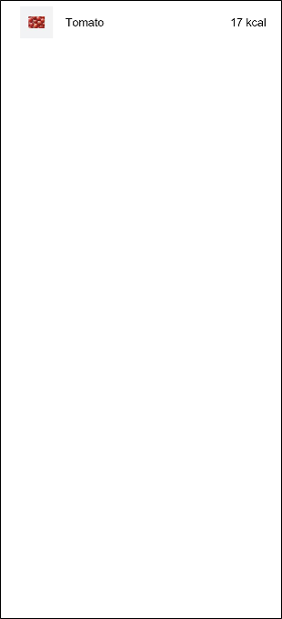
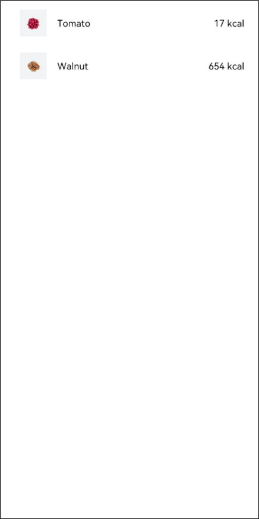
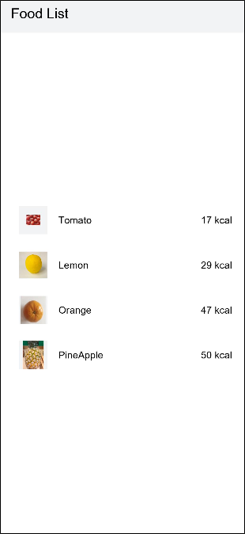

# Building a Food Category List Layout


Use the List component and ForEach loop to build the food category list layout.


1. Create a page file named FoodCategoryList.ets in the pages directory, rename the index.ets file FoodDetail.ets, and add the renamed file to the "pages" tag in the config.json file. The first page under the tag is the home page.
   
   ```
   "js": [
     {
       "pages": [
         "pages/FoodCategoryList",
         "pages/FoodDetail"
       ],
   ]
   ```

2. Create a List component named FoodList as the page entry point. Then, add a ListItem component named FoodListItem as its child component. The List component is used to display data of the same type. Its child component \<ListItem> is used to display specific items in the list.
   
   ```
   @Component
   struct FoodListItem {
     build() {}
   }
   
   @Entry
   @Component
   struct FoodList {
     build() {
       List() {
         ListItem() {
           FoodListItem()
         }
       }
     }
   }
   ```

3. Import the FoodData class and initializeOnStartup method.
   
   ```
   import { FoodData } from '../model/FoodData'
   import { initializeOnStartup } from '../model/FoodDataModels'
   ```

4. Configure the FoodList and FoodListItem components to pass values. Create a member variable named foodItems of the FoodData[] type in the FoodList component and invoke the initializeOnStartup method to assign a value to the variable. Create a member variable foodItem of the FoodData type in the FoodListItem component. Pass the foodItems[0] of the first element in the parent foodItems array as a parameter to FoodListItem.
   
   ```
   import { FoodData } from '../model/FoodData'
   import { initializeOnStartup } from '../model/FoodDataModels'
   
   @Component
   struct FoodListItem {
     private foodItem: FoodData
     build() {}
   }
   
   @Entry
   @Component
   struct FoodList {
     private foodItems: FoodData[] = initializeOnStartup()
     build() {
       List() {
         ListItem() {
           FoodListItem({ foodItem: this.foodItems[0] })
         }
       }
     }
   }
   ```

5. Declare the UI layout of the FoodListItem child component. Create a Flex component, including the food image thumbnail, food name, and calories in the food.
   
   ```
   import { FoodData } from '../model/FoodData'
   import { initializeOnStartup } from '../model/FoodDataModels'
   
   @Component
   struct FoodListItem {
     private foodItem: FoodData
     build() {
       Flex({ justifyContent: FlexAlign.Start, alignItems: ItemAlign.Center }) {
         Image(this.foodItem.image)
           .objectFit(ImageFit.Contain)
           .height(40)
           .width(40)
           .backgroundColor('#FFf1f3f5')
           .margin({ right: 16 })
         Text(this.foodItem.name)
           .fontSize(14)
           .flexGrow(1)
         Text(this.foodItem.calories + ' kcal')
           .fontSize(14)
       }
       .height(64)
       .margin({ right: 24, left:32 })
     }
   }
   
   @Entry
   @Component
   struct FoodList {
     private foodItems: FoodData[] = initializeOnStartup()
     build() {
       List() {
         ListItem() {
           FoodListItem({ foodItem: this.foodItems[0] })
         }
       }
     }
   }
   ```

   

6. Create two FoodListItem objects. Create two FoodListItem objects in the List component and pass the first element this.foodItems[0] and the second element foodItem: this.foodItems[1] to the FoodListItem.
   
   ```
   import { FoodData } from '../model/FoodData'
   import { initializeOnStartup } from '../model/FoodDataModels'
   
   @Component
   struct FoodListItem {
       private foodItem: FoodData
       build() {
           Flex({ justifyContent: FlexAlign.Start, alignItems: ItemAlign.Center }) {
               Image(this.foodItem.image)
                   .objectFit(ImageFit.Contain)
                   .height(40)
                   .width(40)
                   .backgroundColor('#FFf1f3f5')
                   .margin({ right: 16 })
               Text(this.foodItem.name)
                   .fontSize(14)
                   .flexGrow(1)
               Text(this.foodItem.calories + ' kcal')
                   .fontSize(14)
           }
           .height(64)
           .margin({ right: 24, left:32 })
       }
   }
   
   @Entry
   @Component
   struct FoodList {
     private foodItems: FoodData[] = initializeOnStartup()
     build() {
       List() {
         ListItem() {
           FoodListItem({ foodItem: this.foodItems[0] })
         }
         ListItem() {
           FoodListItem({ foodItem: this.foodItems[1] })
         }
       }
     }
   }
   ```

   

7. Import ForEach so that you do not need to create FoodListItem objects one by one.
   
   ```
   ForEach(
       arr: any[], // Array to be iterated
       itemGenerator: (item: any) => void, // child component generator
       keyGenerator?: (item: any) => string // (optional) Unique key generator, which is recommended.
   )
   ```

   The ForEach group has three parameters. The first parameter is the array to be traversed, the second parameter is the lambda function for generating child components, and the third parameter is the key value generator. The third parameter is optional. Yet, for performance reasons, it is strongly recommended that you provide it. keyGenerator enables the development framework to better recognize array changes without having to rebuild all nodes after item changes.

   Traverse the foodItems array to cyclically create the ListItem component. Pass each item in foodItems as a parameter to the FoodListItem component.

   
   ```
   ForEach(this.foodItems, item => {
       ListItem() {
           FoodListItem({ foodItem: item })
       }
   }, item => item.id.toString())
   ```

   The code is as follows:

   
   ```
   import { FoodData } from '../model/FoodData'
   import { initializeOnStartup } from '../model/FoodDataModels'
   
   @Component
   struct FoodListItem {
     private foodItem: FoodData
     build() {
       Flex({ justifyContent: FlexAlign.Start, alignItems: ItemAlign.Center }) {
         Image(this.foodItem.image)
           .objectFit(ImageFit.Contain)
           .height(40)
           .width(40)
           .backgroundColor('#FFf1f3f5')
           .margin({ right: 16 })
         Text(this.foodItem.name)
           .fontSize(14)
           .flexGrow(1)
         Text(this.foodItem.calories + ' kcal')
           .fontSize(14)
       }
       .height(64)
       .margin({ right: 24, left:32 })
     }
   }
   
   @Entry
   @Component
   struct FoodList {
     private foodItems: FoodData[] = initializeOnStartup()
     build() {
       List() {
         ForEach(this.foodItems, item => {
           ListItem() {
             FoodListItem({ foodItem: item })
           }
         }, item => item.id.toString())
       }
     }
   }
   ```

8. Add a title for the FoodList.
   
   ```
   @Entry
   @Component
   struct FoodList {
     private foodItems: FoodData[] = initializeOnStartup()
     build() {
       Column() {
         Flex({justifyContent: FlexAlign.Start, alignItems: ItemAlign.Center}) {
           Text('Food List')
             .fontSize(20)
             .margin({ left:20 })
         }
         .height('7%')
         .backgroundColor('#FFf1f3f5')
         List() {
           ForEach(this.foodItems, item => {
             ListItem() {
               FoodListItem({ foodItem: item })
             }
           }, item => item.id.toString())
         }
         .height('93%')
       }
     }
   }
   ```

   
