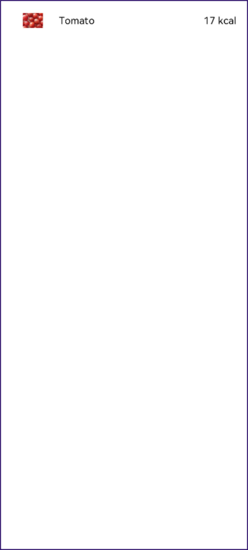
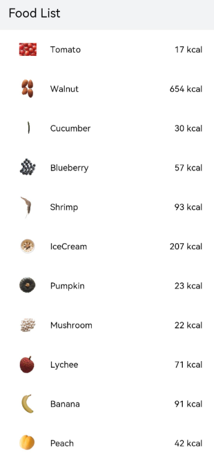

# Building a Food Category List Layout

Use the **\<List>** component and **ForEach** loop to build the food category list layout.


1. Create a page file named **FoodCategoryList.ets** in the **pages** directory and rename the **index.ets** file **FoodDetail.ets**.
  
2. Create a **\<List>** component named **FoodList** as the page entry point. Then, add a **\<ListItem>** component named **FoodListItem** as its child component. The **\<List>** component is used to display data of the same type. Its child component **\<ListItem>** is used to display specific items in the list.
   ```ts
   @Component
   struct FoodListItem {
     build() {}
   }

   @Entry
   @Component
   struct FoodList {
     build() {
       List() {
         ListItem() {
           FoodListItem()
         }
       }
     }
   }
   ```

3. Import the **FoodData** class and **initializeOnStartup** method.

There are two file access methods in application code:
- Use a relative path to reference the code file: Use **"../"** for referencing the upper-level directory and **"./"** (which can also be omitted) for referencing the current directory.
- Use the absolute path, which is the root path of the current module, to reference the code file, for example, **common/utils/utils**.
In this example, a relative path is used for access.

   ```
   import { FoodData } from '../model/FoodData'
   import { initializeOnStartup } from '../model/FoodDataModels'
   ```

4. Configure the **FoodList** and **FoodListItem** components to pass values. Create a member variable named **foodItems** of the **FoodData[]** type in the **FoodList** component and invoke the **initializeOnStartup** method to assign a value to the variable. Create a member variable **foodItem** of the **FoodData** type in the **FoodListItem** component. Pass the **foodItems[0]** of the first element in the parent **foodItems** array as a parameter to **FoodListItem**.
   ```ts
   import { FoodData } from '../model/FoodData'
   import { initializeOnStartup } from '../model/FoodDataModels'

   @Component
   struct FoodListItem {
     private foodItem: FoodData
     build() {}
   }

   @Entry
   @Component
   struct FoodList {
     private foodItems: FoodData[] = initializeOnStartup()
     build() {
       List() {
         ListItem() {
           FoodListItem({ foodItem: this.foodItems[0] })
         }
       }
     }
   }
   ```

5. Declare the UI layout of the **FoodListItem** child component. Create a **\<Flex>** component, including the food image thumbnail, food name, and calories in the food.
   ```ts
   import { FoodData } from '../model/FoodData'
   import { initializeOnStartup } from '../model/FoodDataModels'

      @Component
      struct FoodListItem {
        private foodItem: FoodData
        build() {
          Flex({ justifyContent: FlexAlign.Start, alignItems: ItemAlign.Center }) {
            Image(this.foodItem.image)
              .objectFit(ImageFit.Contain)
              .height(40)
              .width(40)
              .margin({ right: 16 })
            Text(this.foodItem.name)
              .fontSize(14)
              .flexGrow(1)
            Text(this.foodItem.calories + ' kcal')
              .fontSize(14)
          }
          .height(64)
          .margin({ right: 24, left:32 })
        }
      }
   
   @Entry
      @Component
      struct FoodList {
        private foodItems: FoodData[] = initializeOnStartup()
        build() {
          List() {
            ListItem() {
              FoodListItem({ foodItem: this.foodItems[0] })
            }
          }
        }
      }
   ```
   
   
   
   
6. Create two **FoodListItem** objects. Create two **FoodListItem** objects in the **List** component and pass the first element **this.foodItems[0]** and the second element **foodItem: this.foodItems[1]** to the **FoodListItem**.

   ```ts
   import { FoodData } from '../model/FoodData'
   import { initializeOnStartup } from '../model/FoodDataModels'
   
   @Component
   struct FoodListItem {
     private foodItem: FoodData
   
     build() {
       Flex({ justifyContent: FlexAlign.Start, alignItems: ItemAlign.Center }) {
         Image(this.foodItem.image)
           .objectFit(ImageFit.Contain)
           .height(40)
           .width(40)
           .margin({ right: 16 })
         Text(this.foodItem.name)
           .fontSize(14)
           .flexGrow(1)
         Text(this.foodItem.calories + ' kcal')
           .fontSize(14)
       }
       .height(64)
       .margin({ right: 24, left: 32 })
     }
   }
   
   @Entry
   @Component
   struct FoodList {
     private foodItems: FoodData[] = initializeOnStartup()
   
     build() {
       List() {
         ListItem() {
           FoodListItem({ foodItem: this.foodItems[0] })
         }
   
         ListItem() {
           FoodListItem({ foodItem: this.foodItems[1] })
         }
       }
     }
   }
   ```
   
   
      
   
7. Import [ForEach](../quick-start/arkts-rendering-control.md#loop-rendering) so that you do not need to create **FoodListItem** objects one by one.

   ```ts
   import { FoodData } from '../model/FoodData'
   import { initializeOnStartup } from '../model/FoodDataModels'
   
   @Component
   struct FoodListItem {
     private foodItem: FoodData
     build() {
       Flex({ justifyContent: FlexAlign.Start, alignItems: ItemAlign.Center }) {
         Image(this.foodItem.image)
           .objectFit(ImageFit.Contain)
           .height(40)
           .width(40)     
           .margin({ right: 16 })
         Text(this.foodItem.name)
           .fontSize(14)
           .flexGrow(1)
         Text(this.foodItem.calories + ' kcal')
           .fontSize(14)
       }
       .height(64)
       .margin({ right: 24, left:32 })
     }
   }
   
   @Entry
   @Component
   struct FoodList {
     private foodItems: FoodData[] = initializeOnStartup()
     build() {
       List() {
         ForEach(this.foodItems, item => {
           ListItem() {
             FoodListItem({ foodItem: item })
           }
         }, item => item.id.toString())
       }
     }
   }
   ```
   
8. Add a title for the **FoodList**.

   ```
   @Entry
   @Component
   struct FoodList {
     private foodItems: FoodData[] = initializeOnStartup()
   
     build() {
       Column() {
         Flex({ justifyContent: FlexAlign.Start, alignItems: ItemAlign.Center }) {
           Text('Food List')
             .fontSize(20)
             .margin({ left: 20 })
         }
         .height('7%')
         .backgroundColor('#FFf1f3f5')
   
         List() {
           ForEach(this.foodItems, item => {
             ListItem() {
               FoodListItem({ foodItem: item })
             }
           }, item => item.id.toString())
         }
         .height('93%')
       }
     }
   }
   ```

     
