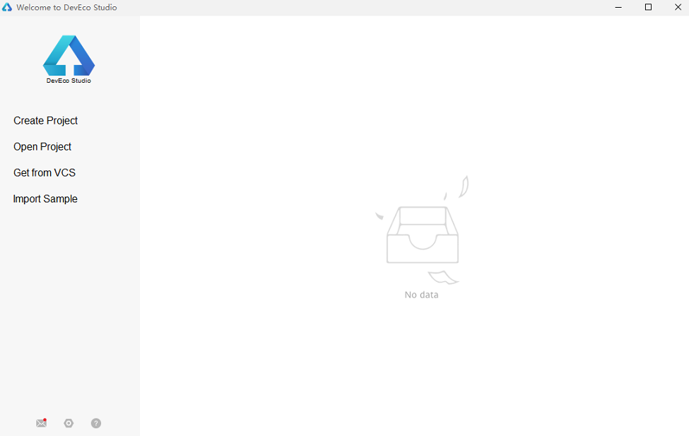
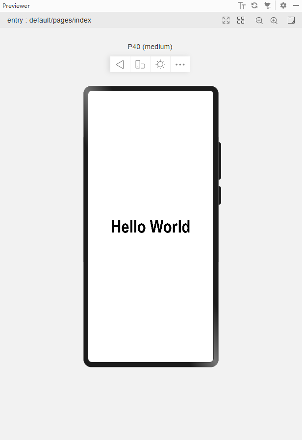
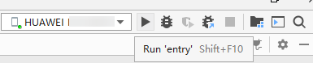

# Creating a Declarative UI Project<a name="EN-US_TOPIC_0000001146785864"></a>

Before creating a project, you need to install DevEco Studio. For details, see  [HUAWEI DevEco Studio User Guide](https://developer.harmonyos.com/en/docs/documentation/doc-guides/tools_overview-0000001053582387).

1.  Open DevEco Studio and click  **Create Project**. If there is already a project, choose  **File**  \>  **New**  \>  **New project**.

    

2.  On the page for selecting an ability template, select  **\[Standard\]Empty Ability**.

    

3.  Install the OpenHarmony SDK.

    

4.  On the project configuration page, set Project Name to  **HealthyDiet**,  **Project Type**  to  **Application**,  **Device Type**  to  **Phone**,  **Language**  to  **eTS**, and  **Compatible API Version**  to  **SDK: API Version 7**. By default, DevEco Studio saves the project to drive C. You can change the save path by setting  **Save Location**. When you are done, click  **Finish**.

    

5.  After the project is created, open the  **app.ets**  file.

    The  **app.ets**  file provides the  **onCreate**  and  **onDestroy**  methods for the application lifecycle.  **onCreate**  is called when an application is created, and  **onDestroy**  is called when an application is destroyed. Global variables can be declared in the  **app.ets**  file, wherein the declared data and methods are shared by the entire application.

    ```
    export default {
        onCreate() {
            console.info('Application onCreate')
        },
        onDestroy() {
            console.info('Application onDestroy')
        },
    }
    ```

6.  In the project navigation tree, open  **index.ets**. This page displays the current UI description. The declarative UI framework automatically generates a component-based  **struct**, which complies with the  **Builder**  API declaration. The current layout and components are declared in the  **build**  method.

    ```
    @Entry
    @Component
    struct MyComponent  {
      build() {
        Flex({ direction: FlexDirection.Column, alignItems: ItemAlign.Center, justifyContent: FlexAlign.Center }) {
          Text('Hello World')
            .fontSize(50)
            .fontWeight(FontWeight.Bold)
        }
        .width('100%')
        .height('100%')
      }
    }
    ```

7.  Click  **Previewer**  on the right to open the  **Previewer**  window. In the  **Previewer**  window of the phone type,  **Hello World**  is displayed in the middle and in bold.

    If the  **Previewer**  button is unavailable, choose  **Settings**  \>  **SDK Manager**  \>OpenHarmony SDK \>  **Tools**  to check whether the  **Previewer**  is installed.

    

8.  Install the application on the phone and run the application. Connect the phone to the computer. After the IDE identifies the phone, click  **Run'entry'**.

    

    Before the installation, you must configure an application signature. For details, see  [Configuring the OpenHarmony App Signature](https://developer.harmonyos.com/en/docs/documentation/doc-guides/ohos-debugging-and-running-0000001263040487#section17660437768). After the installation is complete, click the  **Run**  icon on the screen to open the application.  **Hello World**  is displayed in the center of the screen.

    

