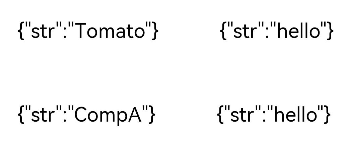
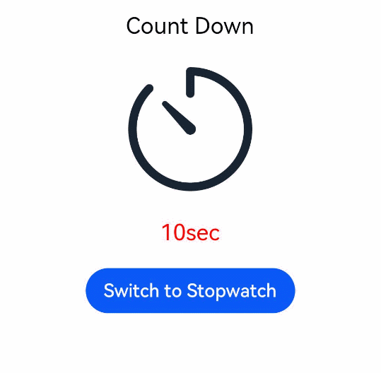

# Declarative UI Development Guidelines

## Overview

For details about the declarative UI project structure, see [Project Directory Structure](https://developer.harmonyos.com/en/docs/documentation/doc-guides/ohos-project-overview-0000001218440650#section133380945818). The ArkTS files that end with the .ets extension describe the UI layouts, styles, event interactions, and page logics. TypeScript and JavaScript files can be imported as page files. The **resources** directory is located in **src/main**. For details about this directory, see [Resource Categories and Access](../quick-start/resource-categories-and-access.md).

Before developing a page, familiarize yourself with [ArkTS](../quick-start/arkts-get-started.md).

When developing a page, select a [layout](ui-ts-layout-linear.md) that meets your service requirements. Then add built-in components and update the component status based on the content to be implemented on the page. For details how to add lifecycle callbacks for custom components, see [Custom Component Lifecycle Callbacks](ui-ts-custom-component-lifecycle-callbacks.md).

You can also [draw shapes](../reference/arkui-ts/ts-drawing-components-circle.md) and [add animations](../reference/arkui-ts/ts-animatorproperty.md) to create a more vibrant viewing experience. You can also use [page routing](../reference/apis/js-apis-router.md) to implement redirection and data transfer between pages.

For a line-up of recommendations that you can take to improve your implementation, thereby avoiding possible performance drop, see [Recommendations for Improving Performance](ui-ts-performance-improvement-recommendation.md).

## Creating a Page

Select a layout to create a page and add basic built-in components to the page. In this example, the [flex layout](ui-ts-layout-flex.md) is used, and the **\<Text>** component is centered horizontally and vertically on the page.

   ```ts
    // xxx.ets
    @Entry
    @Component
    struct MyComponent {
      build() {
        Flex({ direction: FlexDirection.Column, alignItems: ItemAlign.Center, justifyContent: FlexAlign.Center }) {
          Text('Hello')
        }        
        .width('100%')
        .height('100%')
      }
    }
   ```

## Setting the Component Style

If a built-in component does not have attribute methods set, it takes the default style. To change the style of a component and thereby how it looks on the UI, modify the settings of styles, including component-specific styles and [universal styles](../reference/arkui-ts/ts-universal-attributes-size.md).

1. Change the display content of the **\<Text>** component to **Tomato** by modifying its constructor parameters.

2. Set the **fontSize** attribute to **26** and the **fontWeight** attribute to **500**. The **fontWeight** attribute can be set in any of the following modes:

   a. Set the attribute to a value of the number type in the range from 100 to 900, at an interval of 100. The default value is **400**. A larger value indicates a larger font weight.

   b. Set the attribute to any of its enumerated values: **FontWeight.Lighter**, **FontWeight.Normal**, **FontWeight.Regular**, **FontWeight.Medium**, **FontWeight.Bold**, or **FontWeight.Bolder**. **FontWeight.Normal** indicates the font weight of 400.

   c. Set the attribute to a value of the string type that indicates a number, for example, **"400"** or a string that corresponds to one of the enumerated values in **FontWeight**, such as **"bold"**, **"bolder"**, **"lighter"**, **"regular"**, and **"medium"**. If the set value is invalid, the default font weight is used.

   The attribute method must follow the component and be connected by the operator ".". You can also configure multiple attributes of the component in method chaining mode.

   ```ts
    // xxx.ets
    @Entry
    @Component
    struct MyComponent {
      build() {
        Flex({ direction: FlexDirection.Column, alignItems: ItemAlign.Center, justifyContent: FlexAlign.Center }) {
          Text('Tomato')
            .fontSize(26)
            .fontWeight(500)
        }
        .width('100%')
        .height('100%')
      }
    }
   ```

   

## Initialization of Components' Member Variables

The member variables of a custom component can be initialized in either of the following methods: [local initialization](../quick-start/arkts-restrictions-and-extensions.md#initialization-and-restrictions-of-custom-components'-member-variables) or [initialization using constructor parameters](../quick-start/arkts-restrictions-and-extensions.md#initialization-and-restrictions-of-custom-components'-member-variables). Select the appropriate method based on the decorator used by the variable.


**Example**

```ts
// xxx.ets
class ClassA {
  public str: string

  constructor(str: string) {
    this.str = str
  }
}

@Entry
@Component
struct Parent {
  // Initialize the parentState variable in Parent locally.
  @State parentState: ClassA = new ClassA('hello')

  build() {
    Column() {
      Row() {
        CompA({ aState: new ClassA('Tomato'), aLink: $parentState })
      }
      // aState has been initialized in CompA. Therefore, it can use the default value.
      Row() {
        CompA({ aLink: $parentState })
      }
    }.width('100%')
  }
}

@Component
struct CompA {
  // Initialize the aState variable in CompA locally. Initialize the aLink variable in Parent by using constructor parameters.
  @State aState: any = new ClassA('CompA')
  @Link aLink: ClassA

  build() {
    Row() {
      Text(JSON.stringify(this.aState)).fontSize(20).margin(30)
      Text(JSON.stringify(this.aLink)).fontSize(20).margin(30)
    }
  }
}
```



## Updating the Component Status

The status of a component can be updated by dynamically changing the values of its member variables.

**Example**

```ts
// xxx.ets
@Entry
@Component
struct ParentComp {
  @State isCountDown: boolean = true

  build() {
    Column() {
      Text(this.isCountDown ? 'Count Down' : 'Stopwatch').fontSize(20).margin(20)
      if (this.isCountDown) {
        // The image resources are stored in the media directory.
        Image($r("app.media.countdown")).width(120).height(120)
        TimerComponent({ counter: 10, changePerSec: -1, showInColor: Color.Red })
      } else {
        // The image resources are stored in the media directory.
        Image($r("app.media.stopwatch")).width(120).height(120)
        TimerComponent({ counter: 0, changePerSec: +1, showInColor: Color.Black })
      }
      Button(this.isCountDown ? 'Switch to Stopwatch' : 'Switch to Count Down')
        .onClick(() => {
          this.isCountDown = !this.isCountDown
        })
    }.width('100%')
  }
}

// Custom timer/countdown component.
@Component
struct TimerComponent {
  @State counter: number = 0
  private changePerSec: number = -1
  private showInColor: Color = Color.Black
  private timerId: number = -1

  build() {
    Text(`${this.counter}sec`)
      .fontColor(this.showInColor)
      .fontSize(20)
      .margin(20)
  }

  aboutToAppear() {
    this.timerId = setInterval(() => {
      this.counter += this.changePerSec
    }, 1000)
  }

  aboutToDisappear() {
    if (this.timerId > 0) {
      clearTimeout(this.timerId)
      this.timerId = -1
    }
  }
}
```



**Initial creation and rendering:**

1. Create the parent component **ParentComp**.

2. Locally initialize the state variable **isCountDown** of **ParentComp**.

3. Execute the **build** function of **ParentComp**.

4. Create a **\<Column>** component.
   1. Create a preset **\<Text>** component, set the text content, and add the **\<Text>** component instance to the **\<Column>** component.
   2. With the **if** statement, create an element under the **true** condition.
       1. Create a preset **\<Image>** component and set the image source address.
       2. Create a **TimerComponent** using the given constructor.
           1. Create a **TimerComponent** object.
           2. Initialize the values of member variables locally.
           3. Use the parameters provided by the **TimerComponent** constructor to update the values of member variables.
           4. Execute the **aboutToAppear** function of **TimerComponent**.
           5. Execute the **build** function of **TimerComponent** to create the corresponding UI description structure.
   3. Create a preset **\<Button>** component and set the corresponding content.

**Status update:**

When a user clicks a button:

1. The value of the **isCountDown** state variable of **ParentComp** is changed to **false**.

2. Execute the **build** function of **ParentComp**.

3. The **\<Column>** component is reused and reinitialized.

4. The child components of **\<Column>** reuse and reinitialize the objects in the memory.
   1. Reuse the preset **\<Text>** component after re-initializing the component using new text content.
   2. With the **if** statement, create an element under the **false** condition.
       1. Destroy the component instances created under the **true** condition.
           1. Destroy the **\<Image>** component instance.
           2. Destroy the **TimerComponent** component instance. The **aboutToDisappear** function is called.
       2. Create components under the false condition.
           1. Create a preset **\<Image>** component and set the image source address.
           2. Create a **TimerComponent** again using the given constructor.
           3. Initialize the **TimerComponent** and call the **aboutToAppear** and **build** functions.
   3. Reuse the **\<Button>** component and use the new image source address.
